

  <b>AI导航站：<a href="https://ai.0xnav.com" target="_blank">https://ai.0xnav.com</a></b>
    

## AI写作工具

<table>
    <tr>
        <td>1</td>
        <td></td>
        <td><a href="https://wawawriter.cgref.cn/" target="_blank">蛙蛙写作</a></td>
        <td>AI小说和内容创作工具</td>
        <td><a href="https://wawawriter.cgref.cn/" target="_blank">🔗</a></td>
    </tr>
    <tr>
        <td>2</td>
        <td></td>
        <td><a href="https://turbodesk.xfyun.cn/" target="_blank">讯飞绘文</a></td>
        <td>AI批量原创，多平台矩阵号管理</td>
        <td><a href="https://turbodesk.xfyun.cn/" target="_blank">🔗</a></td>
    </tr>
    <tr>
        <td>3</td>
        <td></td>
        <td><a href="https://laper.cgref.cn/" target="_blank">Laper</a></td>
        <td>AI 原生剧本创作工具</td>
        <td><a href="https://laper.cgref.cn/" target="_blank">🔗</a></td>
    </tr>
    <tr>
        <td>4</td>
        <td></td>
        <td><a href="https://ibiling.cn/" target="_blank">笔灵AI写作</a></td>
        <td>600+写作模板、AI一键生成论文/小说，论文降重降AI</td>
        <td><a href="https://ibiling.cn/" target="_blank">🔗</a></td>
    </tr>
    <tr>
        <td>5</td>
        <td></td>
        <td><a href="https://www.xiaohuanxiong.com/login" target="_blank">办公小浣熊</a></td>
        <td>文案生成、AI知识库创作</td>
        <td><a href="https://www.xiaohuanxiong.com/login" target="_blank">🔗</a></td>
    </tr>
    <tr>
        <td>6</td>
        <td></td>
        <td><a href="https://www.gaoding.com/" target="_blank">稿定AI文案</a></td>
        <td>小红书、公众号、短视频AI文案生成工具</td>
        <td><a href="https://www.gaoding.com/" target="_blank">🔗</a></td>
    </tr>
    <tr>
        <td>7</td>
        <td></td>
        <td><a href="https://ibiling.cn/novel-workbench/" target="_blank">笔灵AI小说</a></td>
        <td>AI一键写全篇+爆文拆解，搞定大纲、素材，新手写作过稿神器！</td>
        <td><a href="https://ibiling.cn/novel-workbench/" target="_blank">🔗</a></td>
    </tr>
    <tr>
        <td>8</td>
        <td></td>
        <td><a href="https://qinyanai.cgref.cn/aibot" target="_blank">沁言学术</a></td>
        <td>AI科研写作平台，一站式文献管理</td>
        <td><a href="https://qinyanai.cgref.cn/aibot" target="_blank">🔗</a></td>
    </tr>
    <tr>
        <td>9</td>
        <td></td>
        <td><a href="https://gaoyiai.com/" target="_blank">稿易AI论文</a></td>
        <td>AI论文写作助手，免费生成2000字大纲</td>
        <td><a href="https://gaoyiai.com/" target="_blank">🔗</a></td>
    </tr>
    <tr>
        <td>10</td>
        <td></td>
        <td><a href="https://www.qianbixiezuo.com/?pic=g5DP" target="_blank">千笔AI论文</a></td>
        <td>全网首家论文无限改稿平台</td>
        <td><a href="https://www.qianbixiezuo.com/?pic=g5DP" target="_blank">🔗</a></td>
    </tr>
    <tr>
        <td>11</td>
        <td></td>
        <td><a href="https://mymmc.cn/?fromId=954f8p78" target="_blank">茅茅虫</a></td>
        <td>一站式AI论文写作助手</td>
        <td><a href="https://mymmc.cn/?fromId=954f8p78" target="_blank">🔗</a></td>
    </tr>
    <tr>
        <td>12</td>
        <td></td>
        <td><a href="https://www.66paper.cn/AI_A2E1C09" target="_blank">66AI论文</a></td>
        <td>高质量、低查重、低AIGC率的AI论文写作工具</td>
        <td><a href="https://www.66paper.cn/AI_A2E1C09" target="_blank">🔗</a></td>
    </tr>
    <tr>
        <td>13</td>
        <td></td>
        <td><a href="https://super.cqvip.com/" target="_blank">维普科创助手</a></td>
        <td>维普的一站式AI科研服务平台</td>
        <td><a href="https://super.cqvip.com/" target="_blank">🔗</a></td>
    </tr>
    <tr>
        <td>14</td>
        <td></td>
        <td><a href="https://www.bmysci.com/" target="_blank">笔目鱼</a></td>
        <td>专业英文论文写作器</td>
        <td><a href="https://www.bmysci.com/" target="_blank">🔗</a></td>
    </tr>
    <tr>
        <td>15</td>
        <td></td>
        <td><a href="https://youmind.com/" target="_blank">YouMind</a></td>
        <td>专注提升创作效率和信息整合的AI原生工具</td>
        <td><a href="https://youmind.com/" target="_blank">🔗</a></td>
    </tr>
    <tr>
        <td>16</td>
        <td></td>
        <td><a href="https://getdraft.ai/" target="_blank">GetDraft</a></td>
        <td>得到推出的多AI专家协作AI写作工具</td>
        <td><a href="https://getdraft.ai/" target="_blank">🔗</a></td>
    </tr>
    <tr>
        <td>17</td>
        <td>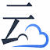</td>
        <td><a href="https://www.jucloud.com/?_f=aibot" target="_blank">剧云</a></td>
        <td>免费 AI 智能中文剧本创作平台</td>
        <td><a href="https://www.jucloud.com/?_f=aibot" target="_blank">🔗</a></td>
    </tr>
    <tr>
        <td>18</td>
        <td></td>
        <td><a href="https://www.guangsuxie.com/static/college-write-web/home" target="_blank">光速写作</a></td>
        <td>AI写作、PPT生成工具，单篇最长15000字</td>
        <td><a href="https://www.guangsuxie.com/static/college-write-web/home" target="_blank">🔗</a></td>
    </tr>
    <tr>
        <td>19</td>
        <td></td>
        <td><a href="https://www.xiaoyuxiezuo.com/AI_A2E1C09" target="_blank">小鱼AI写作</a></td>
        <td>一站式AI写作平台，一键生成高质量原创内容</td>
        <td><a href="https://www.xiaoyuxiezuo.com/AI_A2E1C09" target="_blank">🔗</a></td>
    </tr>
    <tr>
        <td>20</td>
        <td></td>
        <td><a href="https://xiaoin.com.cn/home/index?sharerUserId=1815301629231030274" target="_blank">万能小in</a></td>
        <td>3分钟4万字150+应用，只需标题，快速生成毕业论文</td>
        <td><a href="https://xiaoin.com.cn/home/index?sharerUserId=1815301629231030274" target="_blank">🔗</a></td>
    </tr>
    <tr>
        <td>21</td>
        <td></td>
        <td><a href="https://mowen.cn/" target="_blank">墨问</a></td>
        <td>专为创作者设计的AI笔记工具</td>
        <td><a href="https://mowen.cn/" target="_blank">🔗</a></td>
    </tr>
    <tr>
        <td>22</td>
        <td></td>
        <td><a href="https://miaobi.xinhuaskl.com/" target="_blank">新华妙笔</a></td>
        <td>新华社推出的AI公文写作平台</td>
        <td><a href="https://miaobi.xinhuaskl.com/" target="_blank">🔗</a></td>
    </tr>
    <tr>
        <td>23</td>
        <td></td>
        <td><a href="https://www.danqingmiaobi.com/" target="_blank">丹青妙笔</a></td>
        <td>专为体制内打造的AI公文写作工具</td>
        <td><a href="https://www.danqingmiaobi.com/" target="_blank">🔗</a></td>
    </tr>
    <tr>
        <td>24</td>
        <td>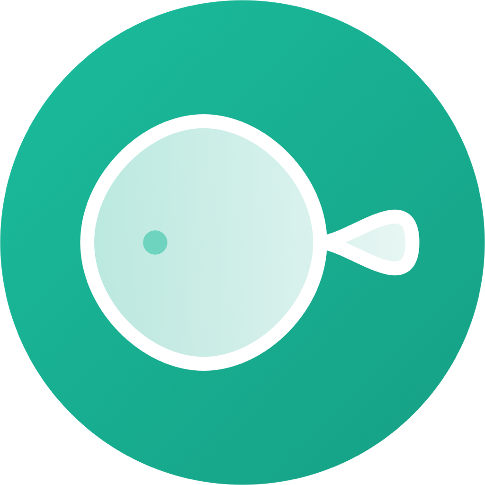</td>
        <td><a href="https://www.feelfish.com/?fr=aibot" target="_blank">FeelFish</a></td>
        <td>专为小说创作者打造的 AI 写作 PC 客户端软件</td>
        <td><a href="https://www.feelfish.com/?fr=aibot" target="_blank">🔗</a></td>
    </tr>
    <tr>
        <td>25</td>
        <td></td>
        <td><a href="https://loomi.live/" target="_blank">Loomi</a></td>
        <td>创作版Claude Code，AI原生写作工具</td>
        <td><a href="https://loomi.live/" target="_blank">🔗</a></td>
    </tr>
    <tr>
        <td>26</td>
        <td></td>
        <td><a href="https://ai-bot.cn/readpo" target="_blank">ReadPo</a></td>
        <td>AI读写助手，支持内容聚合快速阅读并总结</td>
        <td><a href="https://ai-bot.cn/readpo" target="_blank">🔗</a></td>
    </tr>
    <tr>
        <td>27</td>
        <td></td>
        <td><a href="https://01agent.cgref.cn/aibot" target="_blank">01Agent</a></td>
        <td>AI图文创作智能体，支持生成、排版、编辑、发布</td>
        <td><a href="https://01agent.cgref.cn/aibot" target="_blank">🔗</a></td>
    </tr>
    <tr>
        <td>28</td>
        <td></td>
        <td><a href="https://luobi.net/" target="_blank">落笔AI写作</a></td>
        <td>专注于小说网文创作的AI写作工具</td>
        <td><a href="https://luobi.net/" target="_blank">🔗</a></td>
    </tr>
    <tr>
        <td>29</td>
        <td></td>
        <td><a href="https://www.chuangfeiai.com/login?invitationCode=MV6433" target="_blank">创飞写作</a></td>
        <td>新一代智能AIGC写作调度平台</td>
        <td><a href="https://www.chuangfeiai.com/login?invitationCode=MV6433" target="_blank">🔗</a></td>
    </tr>
    <tr>
        <td>30</td>
        <td></td>
        <td><a href="https://www.36ma.com/?fr=aibot" target="_blank">超级小说家</a></td>
        <td>专为网文作家和短剧编剧打造的AI创作助手</td>
        <td><a href="https://www.36ma.com/?fr=aibot" target="_blank">🔗</a></td>
    </tr>
    <tr>
        <td>31</td>
        <td></td>
        <td><a href="https://cailiaoxing.com/" target="_blank">材料星AI</a></td>
        <td>专为秘书工作设计的AI写作工具</td>
        <td><a href="https://cailiaoxing.com/" target="_blank">🔗</a></td>
    </tr>
    <tr>
        <td>32</td>
        <td></td>
        <td><a href="https://www.yfbudong.com/" target="_blank">量子探险</a></td>
        <td>AI小说写作工具，长文本一键生成</td>
        <td><a href="https://www.yfbudong.com/" target="_blank">🔗</a></td>
    </tr>
    <tr>
        <td>33</td>
        <td></td>
        <td><a href="https://www.sheyantong.cn/" target="_blank">社研通</a></td>
        <td>专注于服务文科研究生的多模态AI学术写作工具</td>
        <td><a href="https://www.sheyantong.cn/" target="_blank">🔗</a></td>
    </tr>
    <tr>
        <td>34</td>
        <td></td>
        <td><a href="https://rubriq.cn/" target="_blank">Rubriq</a></td>
        <td>免费试用，AI学术论文润色与翻译工具</td>
        <td><a href="https://rubriq.cn/" target="_blank">🔗</a></td>
    </tr>
    <tr>
        <td>35</td>
        <td></td>
        <td><a href="https://try.quillbot.com/6eqrqpoysmlh" target="_blank">QuillBot</a></td>
        <td>AI英/德语写作润色和改进工具</td>
        <td><a href="https://try.quillbot.com/6eqrqpoysmlh" target="_blank">🔗</a></td>
    </tr>
    <tr>
        <td>36</td>
        <td></td>
        <td><a href="https://paperpal.cn/" target="_blank">Paperpal</a></td>
        <td>英文论文写作助手</td>
        <td><a href="https://paperpal.cn/" target="_blank">🔗</a></td>
    </tr>
    <tr>
        <td>37</td>
        <td></td>
        <td><a href="https://www.creatifyone.com/" target="_blank">创一AI</a></td>
        <td>AI评剧本，轻松创作爆款剧本</td>
        <td><a href="https://www.creatifyone.com/" target="_blank">🔗</a></td>
    </tr>
    <tr>
        <td>38</td>
        <td></td>
        <td><a href="https://gw.iflydocs.com/" target="_blank">讯飞文书</a></td>
        <td>科大讯飞推出的AI公文写作助手</td>
        <td><a href="https://gw.iflydocs.com/" target="_blank">🔗</a></td>
    </tr>
    <tr>
        <td>39</td>
        <td></td>
        <td><a href="https://muset.ai/?s=aibot" target="_blank">Muset</a></td>
        <td>为深度创作者提供的AI原生写作工具</td>
        <td><a href="https://muset.ai/?s=aibot" target="_blank">🔗</a></td>
    </tr>
    <tr>
        <td>40</td>
        <td></td>
        <td><a href="https://docwrite.cn/doc/#/?t=aibot" target="_blank">华文笔杆</a></td>
        <td>一站式AI公文写作工具</td>
        <td><a href="https://docwrite.cn/doc/#/?t=aibot" target="_blank">🔗</a></td>
    </tr>
    <tr>
        <td>41</td>
        <td></td>
        <td><a href="https://www.qianyeai.com/" target="_blank">千页小说AI</a></td>
        <td>一站式AI小说写作平台，从灵感到完稿</td>
        <td><a href="https://www.qianyeai.com/" target="_blank">🔗</a></td>
    </tr>
    <tr>
        <td>42</td>
        <td></td>
        <td><a href="https://xiezuocat.com/?s=aigj" target="_blank">秘塔写作猫</a></td>
        <td>AI写作，文章自成</td>
        <td><a href="https://xiezuocat.com/?s=aigj" target="_blank">🔗</a></td>
    </tr>
    <tr>
        <td>43</td>
        <td></td>
        <td><a href="https://www.gongwenbao666.com/" target="_blank">公文宝</a></td>
        <td>体制工作者的AI公文写作专家</td>
        <td><a href="https://www.gongwenbao666.com/" target="_blank">🔗</a></td>
    </tr>
    <tr>
        <td>44</td>
        <td></td>
        <td><a href="https://huixie.iflyrec.com/list" target="_blank">讯飞写作</a></td>
        <td>科大讯飞推出的AI智能写作助手</td>
        <td><a href="https://huixie.iflyrec.com/list" target="_blank">🔗</a></td>
    </tr>
    <tr>
        <td>45</td>
        <td></td>
        <td><a href="https://www.paperxie.cn/" target="_blank">PaperXie智能写作</a></td>
        <td>AI学术写作辅助工具，覆盖全流程服务</td>
        <td><a href="https://www.paperxie.cn/" target="_blank">🔗</a></td>
    </tr>
    <tr>
        <td>46</td>
        <td></td>
        <td><a href="https://flowus.cn/ai" target="_blank">FlowUs AI</a></td>
        <td>在线文档平台息流推出的AI创作助手，类似于Notion AI</td>
        <td><a href="https://flowus.cn/ai" target="_blank">🔗</a></td>
    </tr>
    <tr>
        <td>47</td>
        <td></td>
        <td><a href="https://rytr.me/" target="_blank">Rytr</a></td>
        <td>AI内容生成和写作助手</td>
        <td><a href="https://rytr.me/" target="_blank">🔗</a></td>
    </tr>
    <tr>
        <td>48</td>
        <td></td>
        <td><a href="https://www.aichat1234.com/app/?mode=aibot" target="_blank">迅捷AI写作</a></td>
        <td>迅捷办公团队推出的AI写作工具</td>
        <td><a href="https://www.aichat1234.com/app/?mode=aibot" target="_blank">🔗</a></td>
    </tr>
    <tr>
        <td>49</td>
        <td></td>
        <td><a href="https://cp.baidu.com/" target="_blank">橙篇</a></td>
        <td>百度推出的AI长文理解和内容创作工具</td>
        <td><a href="https://cp.baidu.com/" target="_blank">🔗</a></td>
    </tr>
    <tr>
        <td>50</td>
        <td></td>
        <td><a href="https://www.shenyandayi.com/" target="_blank">深言达意</a></td>
        <td>免费的词句查询智能写作辅助工具，输入模糊描述即可查找词句</td>
        <td><a href="https://www.shenyandayi.com/" target="_blank">🔗</a></td>
    </tr>
    <tr>
        <td>51</td>
        <td></td>
        <td><a href="https://if.caiyunai.com/" target="_blank">彩云小梦</a></td>
        <td>彩云科技推出的智能AI故事写作工具</td>
        <td><a href="https://if.caiyunai.com/" target="_blank">🔗</a></td>
    </tr>
    <tr>
        <td>52</td>
        <td></td>
        <td><a href="https://midreal.ai/" target="_blank">MidReal</a></td>
        <td>AI互动式小说文本生成工具</td>
        <td><a href="https://midreal.ai/" target="_blank">🔗</a></td>
    </tr>
    <tr>
        <td>53</td>
        <td></td>
        <td><a href="https://inkfox-ai.com/" target="_blank">墨狐AI</a></td>
        <td>短篇小说AI写作助手，专为网文小说作者设计</td>
        <td><a href="https://inkfox-ai.com/" target="_blank">🔗</a></td>
    </tr>
    <tr>
        <td>54</td>
        <td></td>
        <td><a href="https://www.zhangqiaokeyan.com/ai/journalthesis.html" target="_blank">掌桥科研AI论文</a></td>
        <td>依托3亿+真实文献库的AI论文写作工具</td>
        <td><a href="https://www.zhangqiaokeyan.com/ai/journalthesis.html" target="_blank">🔗</a></td>
    </tr>
    <tr>
        <td>55</td>
        <td></td>
        <td><a href="https://www.lingxisuxie.com/" target="_blank">灵犀速写</a></td>
        <td>AI小说创作工具，支持AI写作工作流</td>
        <td><a href="https://www.lingxisuxie.com/" target="_blank">🔗</a></td>
    </tr>
    <tr>
        <td>56</td>
        <td></td>
        <td><a href="https://588tool.com/?hd=1240" target="_blank">库宝AI工作助手</a></td>
        <td>千库网推出的多功能AI创作工具</td>
        <td><a href="https://588tool.com/?hd=1240" target="_blank">🔗</a></td>
    </tr>
    <tr>
        <td>57</td>
        <td></td>
        <td><a href="https://www.grammarly.com/" target="_blank">Grammarly</a></td>
        <td>AI英语语法和拼写检查写作助手</td>
        <td><a href="https://www.grammarly.com/" target="_blank">🔗</a></td>
    </tr>
    <tr>
        <td>58</td>
        <td></td>
        <td><a href="https://www.wenzhuangyuan.cn/workspace/writing-store" target="_blank">文状元</a></td>
        <td>AI公文写作助手，提供大量范文库</td>
        <td><a href="https://www.wenzhuangyuan.cn/workspace/writing-store" target="_blank">🔗</a></td>
    </tr>
    <tr>
        <td>59</td>
        <td></td>
        <td><a href="https://www.xiaoyutai.com/?share_code=XYT90931478" target="_blank">晓语台</a></td>
        <td>智能AI写作工具，内置500+创作模板</td>
        <td><a href="https://www.xiaoyutai.com/?share_code=XYT90931478" target="_blank">🔗</a></td>
    </tr>
    <tr>
        <td>60</td>
        <td></td>
        <td><a href="https://www.deepl.com/write" target="_blank">DeepL Write</a></td>
        <td>DeepL推出的AI驱动的写作助手</td>
        <td><a href="https://www.deepl.com/write" target="_blank">🔗</a></td>
    </tr>
    <tr>
        <td>61</td>
        <td></td>
        <td><a href="https://fanyi.youdao.com/aiwrite" target="_blank">有道翻译·AI写作</a></td>
        <td>网易有道推出的智能写作辅助工具，支持100多种语言</td>
        <td><a href="https://fanyi.youdao.com/aiwrite" target="_blank">🔗</a></td>
    </tr>
    <tr>
        <td>62</td>
        <td></td>
        <td><a href="https://wordvice.ai/cn" target="_blank">Wordvice AI</a></td>
        <td>Wordvice推出的免费AI写作助手</td>
        <td><a href="https://wordvice.ai/cn" target="_blank">🔗</a></td>
    </tr>
    <tr>
        <td>63</td>
        <td></td>
        <td><a href="https://vt.quark.cn/blm/creator-773/index" target="_blank">AI新媒体文章</a></td>
        <td>夸克推出的AI写作工具</td>
        <td><a href="https://vt.quark.cn/blm/creator-773/index" target="_blank">🔗</a></td>
    </tr>
    <tr>
        <td>64</td>
        <td></td>
        <td><a href="https://www.moyin.com/" target="_blank">魔撰写作</a></td>
        <td>出门问问旗下推出的AI智能写作工具</td>
        <td><a href="https://www.moyin.com/" target="_blank">🔗</a></td>
    </tr>
    <tr>
        <td>65</td>
        <td></td>
        <td><a href="https://ailjyk.com/pc/creation/model" target="_blank">宙语Cosmos</a></td>
        <td>专为中文写作设计的AI智能写作助手</td>
        <td><a href="https://ailjyk.com/pc/creation/model" target="_blank">🔗</a></td>
    </tr>
    <tr>
        <td>66</td>
        <td></td>
        <td><a href="https://88lingo.com/ai" target="_blank">灵构AI笔记</a></td>
        <td>在线安全的灵感收集、思路整理AI笔记工具</td>
        <td><a href="https://88lingo.com/ai" target="_blank">🔗</a></td>
    </tr>
    <tr>
        <td>67</td>
        <td></td>
        <td><a href="https://write.youdao.com/" target="_blank">有道写作</a></td>
        <td>网易有道出品的智能英文写作修改和润色工具</td>
        <td><a href="https://write.youdao.com/" target="_blank">🔗</a></td>
    </tr>
    <tr>
        <td>68</td>
        <td></td>
        <td><a href="https://littlefrog.ai/" target="_blank">写作蛙</a></td>
        <td>智谱AI推出的免费智能写作工具</td>
        <td><a href="https://littlefrog.ai/" target="_blank">🔗</a></td>
    </tr>
    <tr>
        <td>69</td>
        <td></td>
        <td><a href="https://wensi.sodabot.cn/" target="_blank">文思助手</a></td>
        <td>强大的AI写作智能体，支持生成专业报告和科研论文</td>
        <td><a href="https://wensi.sodabot.cn/" target="_blank">🔗</a></td>
    </tr>
    <tr>
        <td>70</td>
        <td></td>
        <td><a href="https://www.ximalaya.com/gatekeeper/write-wise-web" target="_blank">WriteWise</a></td>
        <td>喜马拉雅推出的免费网文和小说AI写作工具</td>
        <td><a href="https://www.ximalaya.com/gatekeeper/write-wise-web" target="_blank">🔗</a></td>
    </tr>
    <tr>
        <td>71</td>
        <td></td>
        <td><a href="https://zuojia.baidu.com/" target="_blank">百度作家平台</a></td>
        <td>百度免费AI小说写作工具</td>
        <td><a href="https://zuojia.baidu.com/" target="_blank">🔗</a></td>
    </tr>
    <tr>
        <td>72</td>
        <td></td>
        <td><a href="https://ai.zaker.cn/" target="_blank">爱创作</a></td>
        <td>ZAKER新闻推出的AI写作工具</td>
        <td><a href="https://ai.zaker.cn/" target="_blank">🔗</a></td>
    </tr>
    <tr>
        <td>73</td>
        <td></td>
        <td><a href="https://verse.app.yinxiang.com/product/" target="_blank">Verse</a></td>
        <td>印象笔记旗下团队推出的AI写作和文档工具</td>
        <td><a href="https://verse.app.yinxiang.com/product/" target="_blank">🔗</a></td>
    </tr>
    <tr>
        <td>74</td>
        <td></td>
        <td><a href="https://ai.kezhan365.com/inviteCode/FwJFxy" target="_blank">万彩AI</a></td>
        <td>全能型AI内容和文案创作助手</td>
        <td><a href="https://ai.kezhan365.com/inviteCode/FwJFxy" target="_blank">🔗</a></td>
    </tr>
    <tr>
        <td>75</td>
        <td></td>
        <td><a href="https://writingpal.ai/" target="_blank">WritingPal</a></td>
        <td>面向留学生的AI英文写作工具</td>
        <td><a href="https://writingpal.ai/" target="_blank">🔗</a></td>
    </tr>
    <tr>
        <td>76</td>
        <td></td>
        <td><a href="https://novelai.net/" target="_blank">NovelAI</a></td>
        <td>AI小说故事创作工具</td>
        <td><a href="https://novelai.net/" target="_blank">🔗</a></td>
    </tr>
    <tr>
        <td>77</td>
        <td></td>
        <td><a href="https://wen.mobvoi.com/" target="_blank">奇妙文</a></td>
        <td>出门问问推出的AI写作助理</td>
        <td><a href="https://wen.mobvoi.com/" target="_blank">🔗</a></td>
    </tr>
    <tr>
        <td>78</td>
        <td></td>
        <td><a href="https://chuangyi.taobao.com/pages/aiCopy" target="_blank">悉语</a></td>
        <td>阿里旗下智能文案工具，一键生成电商营销文案</td>
        <td><a href="https://chuangyi.taobao.com/pages/aiCopy" target="_blank">🔗</a></td>
    </tr>
    <tr>
        <td>79</td>
        <td></td>
        <td><a href="https://effidit.qq.com/" target="_blank">文涌Effidit</a></td>
        <td>腾讯AI Lab开发的智能创作助手</td>
        <td><a href="https://effidit.qq.com/" target="_blank">🔗</a></td>
    </tr>
    <tr>
        <td>80</td>
        <td></td>
        <td><a href="https://www.mypitaya.com/" target="_blank">火龙果写作</a></td>
        <td>AI驱动的文字生产力工具</td>
        <td><a href="https://www.mypitaya.com/" target="_blank">🔗</a></td>
    </tr>
    <tr>
        <td>81</td>
        <td></td>
        <td><a href="https://ai.koalaoffice.com/ai/homePage" target="_blank">树熊写作</a></td>
        <td>树熊AI推出的AI智能写作工具</td>
        <td><a href="https://ai.koalaoffice.com/ai/homePage" target="_blank">🔗</a></td>
    </tr>
    <tr>
        <td>82</td>
        <td></td>
        <td><a href="https://www.aigaixie.com/" target="_blank">爱改写</a></td>
        <td>AI改写、纠错、润色辅助工具</td>
        <td><a href="https://www.aigaixie.com/" target="_blank">🔗</a></td>
    </tr>
    <tr>
        <td>83</td>
        <td></td>
        <td><a href="https://www.heyfriday.cn/home" target="_blank">HeyFriday</a></td>
        <td>国内团队推出的智能AI写作工具</td>
        <td><a href="https://www.heyfriday.cn/home" target="_blank">🔗</a></td>
    </tr>
    <tr>
        <td>84</td>
        <td></td>
        <td><a href="https://www.yizhuan5.com/" target="_blank">易撰</a></td>
        <td>新媒体AI内容创作助手</td>
        <td><a href="https://www.yizhuan5.com/" target="_blank">🔗</a></td>
    </tr>
    <tr>
        <td>85</td>
        <td></td>
        <td><a href="https://www.giiso.com/" target="_blank">智搜</a></td>
        <td>Giiso写作机器人，内容创作AI辅助工具</td>
        <td><a href="https://www.giiso.com/" target="_blank">🔗</a></td>
    </tr>
    <tr>
        <td>86</td>
        <td>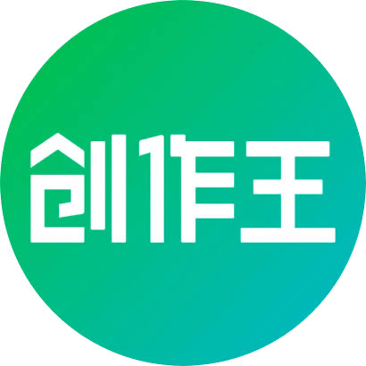</td>
        <td><a href="https://aiapp.cc/" target="_blank">创作王</a></td>
        <td>AI一键帮助你创作营销内容</td>
        <td><a href="https://aiapp.cc/" target="_blank">🔗</a></td>
    </tr>
    <tr>
        <td>87</td>
        <td></td>
        <td><a href="https://vgoapp.com/" target="_blank">字符狂飙</a></td>
        <td>全方位AI文档生成工具，快速生成专业文档</td>
        <td><a href="https://vgoapp.com/" target="_blank">🔗</a></td>
    </tr>
    <tr>
        <td>88</td>
        <td></td>
        <td><a href="https://www.130ai.com/" target="_blank">XPaper AI</a></td>
        <td>晓语台旗下的论文写作辅助指导平台</td>
        <td><a href="https://www.130ai.com/" target="_blank">🔗</a></td>
    </tr>
    <tr>
        <td>89</td>
        <td></td>
        <td><a href="https://www.wuz.com.cn/" target="_blank">悟智写作</a></td>
        <td>人工智能驱动的自动化写作平台</td>
        <td><a href="https://www.wuz.com.cn/" target="_blank">🔗</a></td>
    </tr>
    <tr>
        <td>90</td>
        <td></td>
        <td><a href="https://zj.xfyun.cn/exam/text" target="_blank">讯飞智检</a></td>
        <td>讯飞推出的智能写作SaaS工具，支持智能写作后的校对与合规审核</td>
        <td><a href="https://zj.xfyun.cn/exam/text" target="_blank">🔗</a></td>
    </tr>
</table>

## AI图像工具

<table>
    <tr>
        <td>1</td>
        <td></td>
        <td><a href="https://www.ihuiwa.com/workspace/ai-image/partial-redraw?editType=eraser-pen&huiwaInviteCode=EMRCAL" target="_blank">绘蛙AI消除</a></td>
        <td>免费AI修图工具，一键去除图片中多余元素</td>
        <td><a href="https://www.ihuiwa.com/workspace/ai-image/partial-redraw?editType=eraser-pen&huiwaInviteCode=EMRCAL" target="_blank">🔗</a></td>
    </tr>
    <tr>
        <td>2</td>
        <td></td>
        <td><a href="https://liblib.cgref.cn/" target="_blank">LiblibAI去水印</a></td>
        <td>LiblibAI推出的AI去水印工作流</td>
        <td><a href="https://liblib.cgref.cn/" target="_blank">🔗</a></td>
    </tr>
    <tr>
        <td>3</td>
        <td></td>
        <td><a href="https://www.designkit.cn/aieraser/" target="_blank">美图AI消除</a></td>
        <td>美图设计室推出的AI消除工具</td>
        <td><a href="https://www.designkit.cn/aieraser/" target="_blank">🔗</a></td>
    </tr>
    <tr>
        <td>4</td>
        <td></td>
        <td><a href="https://www.gaoding.com/" target="_blank">稿定AI消除</a></td>
        <td>AI图像杂物消除工具</td>
        <td><a href="https://www.gaoding.com/" target="_blank">🔗</a></td>
    </tr>
    <tr>
        <td>5</td>
        <td></td>
        <td><a href="https://www.hama.app/zh" target="_blank">Hama</a></td>
        <td>在线抹除图片中不想要的物体</td>
        <td><a href="https://www.hama.app/zh" target="_blank">🔗</a></td>
    </tr>
    <tr>
        <td>6</td>
        <td></td>
        <td><a href="https://www.iopaint.com/" target="_blank">IOPaint</a></td>
        <td>免费开源的AI图像擦除、修复和处理工具</td>
        <td><a href="https://www.iopaint.com/" target="_blank">🔗</a></td>
    </tr>
    <tr>
        <td>7</td>
        <td></td>
        <td><a href="https://bgeraser.com/" target="_blank">Bg Eraser</a></td>
        <td>图片物体抹除和清理</td>
        <td><a href="https://bgeraser.com/" target="_blank">🔗</a></td>
    </tr>
    <tr>
        <td>8</td>
        <td></td>
        <td><a href="https://snapedit.app/" target="_blank">SnapEdit</a></td>
        <td>AI移除图片中的任何物体</td>
        <td><a href="https://snapedit.app/" target="_blank">🔗</a></td>
    </tr>
    <tr>
        <td>9</td>
        <td></td>
        <td><a href="https://cleanup.pictures/" target="_blank">Cleanup.pictures</a></td>
        <td>智能移除图片中的物体、文本、污迹、人物或任何不想要的东西</td>
        <td><a href="https://cleanup.pictures/" target="_blank">🔗</a></td>
    </tr>
    <tr>
        <td>10</td>
        <td></td>
        <td><a href="https://www.cutout.pro/zh-CN/image-retouch-remove-unwanted-objects" target="_blank">Cutout.Pro Retouch</a></td>
        <td>Cutout.Pro推出的AI图片物体涂抹去除工具</td>
        <td><a href="https://www.cutout.pro/zh-CN/image-retouch-remove-unwanted-objects" target="_blank">🔗</a></td>
    </tr>
    <tr>
        <td>11</td>
        <td></td>
        <td><a href="https://beecut.cn/online-watermark-remover" target="_blank">蜜蜂剪辑</a></td>
        <td>AI去水印工具，支持图片和30+流行短视频平台</td>
        <td><a href="https://beecut.cn/online-watermark-remover" target="_blank">🔗</a></td>
    </tr>
    <tr>
        <td>12</td>
        <td></td>
        <td><a href=" https://tusiart.com/template/820385276638620489?utm_source=ai_bot&source_id=ai_bot" target="_blank">吐司AI消除</a></td>
        <td>吐司AI推出的AI智能消除、去杂物工具</td>
        <td><a href=" https://tusiart.com/template/820385276638620489?utm_source=ai_bot&source_id=ai_bot" target="_blank">🔗</a></td>
    </tr>
    <tr>
        <td>13</td>
        <td></td>
        <td><a href="https://www.hitpaw.com/remove-watermark.html" target="_blank">HitPaw Watermark Remover</a></td>
        <td>AI图片和视频去水印工具</td>
        <td><a href="https://www.hitpaw.com/remove-watermark.html" target="_blank">🔗</a></td>
    </tr>
    <tr>
        <td>14</td>
        <td></td>
        <td><a href="https://magicstudio.com/zh/magiceraser/" target="_blank">Magic Eraser</a></td>
        <td>AI移除图片中不想要的物体</td>
        <td><a href="https://magicstudio.com/zh/magiceraser/" target="_blank">🔗</a></td>
    </tr>
    <tr>
        <td>15</td>
        <td></td>
        <td><a href="https://www.watermarkremover.io/zh" target="_blank">WatermarkRemover</a></td>
        <td>AI智能删除照片中的水印</td>
        <td><a href="https://www.watermarkremover.io/zh" target="_blank">🔗</a></td>
    </tr>
    <tr>
        <td>16</td>
        <td></td>
        <td><a href="https://liblib.cgref.cn/" target="_blank">LibLibAI高清修复</a></td>
        <td>LiblibAI推出的AI高清放大工作流</td>
        <td><a href="https://liblib.cgref.cn/" target="_blank">🔗</a></td>
    </tr>
    <tr>
        <td>17</td>
        <td></td>
        <td><a href="https://www.gaoding.com/" target="_blank">稿定AI变清晰</a></td>
        <td>稿定设计推出的AI变清晰图像处理工具</td>
        <td><a href="https://www.gaoding.com/" target="_blank">🔗</a></td>
    </tr>
    <tr>
        <td>18</td>
        <td>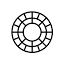</td>
        <td><a href="https://facet.ai/" target="_blank">Facet</a></td>
        <td>AI图片修图和优化工具</td>
        <td><a href="https://facet.ai/" target="_blank">🔗</a></td>
    </tr>
    <tr>
        <td>19</td>
        <td></td>
        <td><a href="https://clipdrop.co/relight" target="_blank">Relight</a></td>
        <td>ClipDrop推出的AI图像打光工具</td>
        <td><a href="https://clipdrop.co/relight" target="_blank">🔗</a></td>
    </tr>
    <tr>
        <td>20</td>
        <td></td>
        <td><a href="https://www.imgak.com/" target="_blank">imgAK</a></td>
        <td>一站式在线 AI 图像处理平台</td>
        <td><a href="https://www.imgak.com/" target="_blank">🔗</a></td>
    </tr>
    <tr>
        <td>21</td>
        <td></td>
        <td><a href="https://yunxiu.meitu.com/" target="_blank">美图云修</a></td>
        <td>美图推出的专业级AI人像精修软件</td>
        <td><a href="https://yunxiu.meitu.com/" target="_blank">🔗</a></td>
    </tr>
    <tr>
        <td>22</td>
        <td></td>
        <td><a href="https://ximixiang.com/home" target="_blank">西米AI</a></td>
        <td>AI图案提取工具，一站式服装印花解决方案</td>
        <td><a href="https://ximixiang.com/home" target="_blank">🔗</a></td>
    </tr>
    <tr>
        <td>23</td>
        <td></td>
        <td><a href="https://remini.ai/" target="_blank">Remini</a></td>
        <td>AI智能将模糊照片变高清的图像修复工具</td>
        <td><a href="https://remini.ai/" target="_blank">🔗</a></td>
    </tr>
    <tr>
        <td>24</td>
        <td></td>
        <td><a href="https://jpghd.com/zh" target="_blank">jpgHD</a></td>
        <td>人工智能老照片上色和修复</td>
        <td><a href="https://jpghd.com/zh" target="_blank">🔗</a></td>
    </tr>
    <tr>
        <td>25</td>
        <td></td>
        <td><a href="https://www.pixcakeai.com/" target="_blank">像素蛋糕PixCake</a></td>
        <td>简单易用的AI图像精修工具</td>
        <td><a href="https://www.pixcakeai.com/" target="_blank">🔗</a></td>
    </tr>
    <tr>
        <td>26</td>
        <td></td>
        <td><a href="https://www.aixtsy.com/" target="_blank">咻图AI</a></td>
        <td>面向影楼的摄影后期AI修图软件</td>
        <td><a href="https://www.aixtsy.com/" target="_blank">🔗</a></td>
    </tr>
    <tr>
        <td>27</td>
        <td></td>
        <td><a href="https://airbrush.com/" target="_blank">AirBrush</a></td>
        <td>专业级AI图像视频编辑工具</td>
        <td><a href="https://airbrush.com/" target="_blank">🔗</a></td>
    </tr>
    <tr>
        <td>28</td>
        <td></td>
        <td><a href="https://www.restorephotos.io/" target="_blank">restorePhotos.io</a></td>
        <td>AI老照片修复</td>
        <td><a href="https://www.restorephotos.io/" target="_blank">🔗</a></td>
    </tr>
    <tr>
        <td>29</td>
        <td></td>
        <td><a href="https://picma.magictiger.ai/zh" target="_blank">PicMa Studio</a></td>
        <td>AI一键批量增强、修复、彩色化你的照片</td>
        <td><a href="https://picma.magictiger.ai/zh" target="_blank">🔗</a></td>
    </tr>
    <tr>
        <td>30</td>
        <td></td>
        <td><a href="https://transpic.cn/" target="_blank">transpic</a></td>
        <td>AI图像转绘插画创作平台</td>
        <td><a href="https://transpic.cn/" target="_blank">🔗</a></td>
    </tr>
    <tr>
        <td>31</td>
        <td></td>
        <td><a href="https://www.cutout.pro/zh-CN/photo-colorizer-black-and-white" target="_blank">Cutout.Pro老照片上色</a></td>
        <td>Cutout.Pro推出的黑白图片上色</td>
        <td><a href="https://www.cutout.pro/zh-CN/photo-colorizer-black-and-white" target="_blank">🔗</a></td>
    </tr>
    <tr>
        <td>32</td>
        <td></td>
        <td><a href="https://palette.fm/" target="_blank">Palette</a></td>
        <td>AI图片调色上色</td>
        <td><a href="https://palette.fm/" target="_blank">🔗</a></td>
    </tr>
    <tr>
        <td>33</td>
        <td></td>
        <td><a href="https://playgroundai.com/" target="_blank">Playground AI</a></td>
        <td>AI图片生成和修图</td>
        <td><a href="https://playgroundai.com/" target="_blank">🔗</a></td>
    </tr>
    <tr>
        <td>34</td>
        <td></td>
        <td><a href="https://tusiart.com/template/820721890405622530" target="_blank">吐司AI高清</a></td>
        <td>吐司AI推出的图片变高清/修复工具</td>
        <td><a href="https://tusiart.com/template/820721890405622530" target="_blank">🔗</a></td>
    </tr>
    <tr>
        <td>35</td>
        <td></td>
        <td><a href="https://ihuiwa.paluai.com/aibot" target="_blank">绘蛙</a></td>
        <td>AI 电商营销工具，免费生成商品图</td>
        <td><a href="https://ihuiwa.paluai.com/aibot" target="_blank">🔗</a></td>
    </tr>
    <tr>
        <td>36</td>
        <td></td>
        <td><a href="https://jimeng.jianying.com/ai-tool/home/" target="_blank">即梦</a></td>
        <td>抖音旗下免费AI图片创作工具</td>
        <td><a href="https://jimeng.jianying.com/ai-tool/home/" target="_blank">🔗</a></td>
    </tr>
    <tr>
        <td>37</td>
        <td></td>
        <td><a href="https://d.design/ai/generate" target="_blank">堆友AI反应堆</a></td>
        <td>全能AI绘画生成器</td>
        <td><a href="https://d.design/ai/generate" target="_blank">🔗</a></td>
    </tr>
    <tr>
        <td>38</td>
        <td></td>
        <td><a href="https://liblib.cgref.cn/" target="_blank">LiblibAI·哩布哩布AI</a></td>
        <td>国内领先的AI图像创作平台和模型分享社区</td>
        <td><a href="https://liblib.cgref.cn/" target="_blank">🔗</a></td>
    </tr>
    <tr>
        <td>39</td>
        <td></td>
        <td><a href="https://www.gaoding.art/" target="_blank">稿定AI</a></td>
        <td>一站式AI设计工具集，免费AI绘图、图片转AI绘画、AI抠图消除</td>
        <td><a href="https://www.gaoding.art/" target="_blank">🔗</a></td>
    </tr>
    <tr>
        <td>40</td>
        <td></td>
        <td><a href="https://abeiai.com/?r=133" target="_blank">阿贝智能</a></td>
        <td>一站式AI绘本创作平台，副业变现必备</td>
        <td><a href="https://abeiai.com/?r=133" target="_blank">🔗</a></td>
    </tr>
    <tr>
        <td>41</td>
        <td></td>
        <td><a href="https://www.designkit.cn/" target="_blank">美图设计室</a></td>
        <td>AI图像创作和设计平台</td>
        <td><a href="https://www.designkit.cn/" target="_blank">🔗</a></td>
    </tr>
    <tr>
        <td>42</td>
        <td></td>
        <td><a href="https://www.midjourney.com/home" target="_blank">Midjourney</a></td>
        <td>AI图像和插画生成工具</td>
        <td><a href="https://www.midjourney.com/home" target="_blank">🔗</a></td>
    </tr>
    <tr>
        <td>43</td>
        <td></td>
        <td><a href="https://civitai.com/" target="_blank">Civitai</a></td>
        <td>免费的AI图像绘画作品和模型分享平台和社区</td>
        <td><a href="https://civitai.com/" target="_blank">🔗</a></td>
    </tr>
    <tr>
        <td>44</td>
        <td></td>
        <td><a href="https://ai-bot.cn/tusiart" target="_blank">吐司AI</a></td>
        <td>AI绘画模型社区和在线生图平台</td>
        <td><a href="https://ai-bot.cn/tusiart" target="_blank">🔗</a></td>
    </tr>
    <tr>
        <td>45</td>
        <td></td>
        <td><a href="https://www.zaodian.com/" target="_blank">造点AI</a></td>
        <td>夸克团队推出的AI图像与视频创作平台</td>
        <td><a href="https://www.zaodian.com/" target="_blank">🔗</a></td>
    </tr>
    <tr>
        <td>46</td>
        <td></td>
        <td><a href="https://www.runninghub.cn/?inviteCode=bemsxzdr" target="_blank">RunningHub</a></td>
        <td>基于云端ComfyUI的AI图像与视频创作平台</td>
        <td><a href="https://www.runninghub.cn/?inviteCode=bemsxzdr" target="_blank">🔗</a></td>
    </tr>
    <tr>
        <td>47</td>
        <td></td>
        <td><a href="https://tongyi.aliyun.com/wan/" target="_blank">通义万相</a></td>
        <td>阿里推出的AI创意内容生成平台</td>
        <td><a href="https://tongyi.aliyun.com/wan/" target="_blank">🔗</a></td>
    </tr>
    <tr>
        <td>48</td>
        <td></td>
        <td><a href="https://app.klingai.com/cn/" target="_blank">可灵AI</a></td>
        <td>快手推出的AI图像和视频创作平台</td>
        <td><a href="https://app.klingai.com/cn/" target="_blank">🔗</a></td>
    </tr>
    <tr>
        <td>49</td>
        <td></td>
        <td><a href="https://miaohua.sensetime.com/inspiration" target="_blank">秒画</a></td>
        <td>商汤科技推出的免费AI作画和图片生成平台</td>
        <td><a href="https://miaohua.sensetime.com/inspiration" target="_blank">🔗</a></td>
    </tr>
    <tr>
        <td>50</td>
        <td></td>
        <td><a href="https://www.whee.com/" target="_blank">WHEE</a></td>
        <td>美图推出的AI图片和绘画创作生成平台</td>
        <td><a href="https://www.whee.com/" target="_blank">🔗</a></td>
    </tr>
    <tr>
        <td>51</td>
        <td></td>
        <td><a href="https://wuli.art/" target="_blank">呜哩</a></td>
        <td>阿里推出的AIGC创意生产力平台</td>
        <td><a href="https://wuli.art/" target="_blank">🔗</a></td>
    </tr>
    <tr>
        <td>52</td>
        <td></td>
        <td><a href="https://www.insmind.com/" target="_blank">insMind</a></td>
        <td>稿定面向全球市场推出的AI图片编辑工具</td>
        <td><a href="https://www.insmind.com/" target="_blank">🔗</a></td>
    </tr>
    <tr>
        <td>53</td>
        <td></td>
        <td><a href="https://www.koukoutu.com/?f=aigjj" target="_blank">抠抠图</a></td>
        <td>免费在线AI抠图工具，一键批量抠图</td>
        <td><a href="https://www.koukoutu.com/?f=aigjj" target="_blank">🔗</a></td>
    </tr>
    <tr>
        <td>54</td>
        <td></td>
        <td><a href="https://www.krene.com/" target="_blank">Krene</a></td>
        <td>深耕游戏/影视美术创作领域的 AIGC 创作平台</td>
        <td><a href="https://www.krene.com/" target="_blank">🔗</a></td>
    </tr>
    <tr>
        <td>55</td>
        <td></td>
        <td><a href="https://img.logosc.cn/" target="_blank">AI改图神器</a></td>
        <td>AI在线图像编辑工具</td>
        <td><a href="https://img.logosc.cn/" target="_blank">🔗</a></td>
    </tr>
    <tr>
        <td>56</td>
        <td></td>
        <td><a href="https://miguo.ai/" target="_blank">米粿AI</a></td>
        <td>懂画师的渐进式分层绘画助手，主攻日系二次元绘画</td>
        <td><a href="https://miguo.ai/" target="_blank">🔗</a></td>
    </tr>
    <tr>
        <td>57</td>
        <td></td>
        <td><a href="https://www.katuai.cn/" target="_blank">咖图AI</a></td>
        <td>AI图像设计平台，搭载NanoBanana Pro模型</td>
        <td><a href="https://www.katuai.cn/" target="_blank">🔗</a></td>
    </tr>
    <tr>
        <td>58</td>
        <td></td>
        <td><a href="https://d.aijuh.com/" target="_blank">视觉工厂</a></td>
        <td>AI创作工具，支持AI生图和视频生成服务</td>
        <td><a href="https://d.aijuh.com/" target="_blank">🔗</a></td>
    </tr>
    <tr>
        <td>59</td>
        <td></td>
        <td><a href="https://miaohui.jixueai.com/" target="_blank">秒绘AI</a></td>
        <td>一键生成爆款图文，免费发布小红书</td>
        <td><a href="https://miaohui.jixueai.com/" target="_blank">🔗</a></td>
    </tr>
    <tr>
        <td>60</td>
        <td></td>
        <td><a href="https://imiaohua.com/?utm=r2254801" target="_blank">妙话AI</a></td>
        <td>专为内容创作者设计的创意图片生成工具</td>
        <td><a href="https://imiaohua.com/?utm=r2254801" target="_blank">🔗</a></td>
    </tr>
    <tr>
        <td>61</td>
        <td></td>
        <td><a href="https://ai-bot.cn/lumi" target="_blank">炉米Lumi</a></td>
        <td>字节跳动推出的AIGC图像创作平台</td>
        <td><a href="https://ai-bot.cn/lumi" target="_blank">🔗</a></td>
    </tr>
    <tr>
        <td>62</td>
        <td></td>
        <td><a href="https://www.krea.ai/" target="_blank">Krea AI</a></td>
        <td>实时AI图像、视频生成和编辑平台</td>
        <td><a href="https://www.krea.ai/" target="_blank">🔗</a></td>
    </tr>
    <tr>
        <td>63</td>
        <td></td>
        <td><a href="https://kira.art/" target="_blank">Kira</a></td>
        <td>AI 图像生成与编辑工具</td>
        <td><a href="https://kira.art/" target="_blank">🔗</a></td>
    </tr>
    <tr>
        <td>64</td>
        <td></td>
        <td><a href="https://ihuiwa.paluai.com/aibot" target="_blank">绘蛙AI</a></td>
        <td>AI 电商营销工具，免费生成商品图</td>
        <td><a href="https://ihuiwa.paluai.com/aibot" target="_blank">🔗</a></td>
    </tr>
    <tr>
        <td>65</td>
        <td></td>
        <td><a href="https://d.design/toolbox/ai-product-background" target="_blank">堆友AI商品图</a></td>
        <td>堆友AI推出AI商品图生成工具</td>
        <td><a href="https://d.design/toolbox/ai-product-background" target="_blank">🔗</a></td>
    </tr>
    <tr>
        <td>66</td>
        <td></td>
        <td><a href="https://liblib.cgref.cn/" target="_blank">LiblibAI电商营销</a></td>
        <td>LiblibAI电商营销场景模型工具，丰富的LoRA模型</td>
        <td><a href="https://liblib.cgref.cn/" target="_blank">🔗</a></td>
    </tr>
    <tr>
        <td>67</td>
        <td></td>
        <td><a href="https://www.designkit.cn/product-shoot/" target="_blank">美图商拍</a></td>
        <td>美图设计室推出的AI商拍工具</td>
        <td><a href="https://www.designkit.cn/product-shoot/" target="_blank">🔗</a></td>
    </tr>
    <tr>
        <td>68</td>
        <td></td>
        <td><a href="https://www.gaoding.com/" target="_blank">稿定AI商品图</a></td>
        <td>稿定设计推出的AI商品图生成工具</td>
        <td><a href="https://www.gaoding.com/" target="_blank">🔗</a></td>
    </tr>
    <tr>
        <td>69</td>
        <td></td>
        <td><a href="https://www.photonaiclub.com/sh/ZgN25IHnBJY" target="_blank">光子AI</a></td>
        <td>专为电商商家推出的AI商拍工具</td>
        <td><a href="https://www.photonaiclub.com/sh/ZgN25IHnBJY" target="_blank">🔗</a></td>
    </tr>
    <tr>
        <td>70</td>
        <td></td>
        <td><a href="https://www.piccopilot.com/" target="_blank">Pic Copilot</a></td>
        <td>阿里国际推出的AI电商营销工具</td>
        <td><a href="https://www.piccopilot.com/" target="_blank">🔗</a></td>
    </tr>
    <tr>
        <td>71</td>
        <td></td>
        <td><a href="https://fengniaoai.com/" target="_blank">蜂鸟AI</a></td>
        <td>赶海科技推出的跨境电商AI营销工具</td>
        <td><a href="https://fengniaoai.com/" target="_blank">🔗</a></td>
    </tr>
    <tr>
        <td>72</td>
        <td></td>
        <td><a href="https://ai.iiit.cn/" target="_blank">莓图AI</a></td>
        <td>电商详情图生成与爆款视觉风格复刻</td>
        <td><a href="https://ai.iiit.cn/" target="_blank">🔗</a></td>
    </tr>
    <tr>
        <td>73</td>
        <td></td>
        <td><a href="https://skildart.cn/" target="_blank">SkildArt</a></td>
        <td>一站式 AI 视觉创作平台，为商业营销而生</td>
        <td><a href="https://skildart.cn/" target="_blank">🔗</a></td>
    </tr>
    <tr>
        <td>74</td>
        <td></td>
        <td><a href="https://jihegeo.com/" target="_blank">几何AI</a></td>
        <td>面向全品类电商的AI视觉生成平台</td>
        <td><a href="https://jihegeo.com/" target="_blank">🔗</a></td>
    </tr>
    <tr>
        <td>75</td>
        <td></td>
        <td><a href="https://www.gemhues.com/" target="_blank">GemHues</a></td>
        <td>AI 商品视觉内容生成平台，覆盖图 + 视频全链路</td>
        <td><a href="https://www.gemhues.com/" target="_blank">🔗</a></td>
    </tr>
    <tr>
        <td>76</td>
        <td></td>
        <td><a href="https://psai.cn/" target="_blank">PhotoStudio AI</a></td>
        <td>虹软旗下推出的AI商拍工具</td>
        <td><a href="https://psai.cn/" target="_blank">🔗</a></td>
    </tr>
    <tr>
        <td>77</td>
        <td></td>
        <td><a href="https://www.jiaodianai.com/" target="_blank">蕉点AI</a></td>
        <td>多品类AI电商商品图生成平台</td>
        <td><a href="https://www.jiaodianai.com/" target="_blank">🔗</a></td>
    </tr>
    <tr>
        <td>78</td>
        <td></td>
        <td><a href="https://marketing.k-fashionshop.com/?relCode=Q065JYOC" target="_blank">潮际好麦</a></td>
        <td>AI赋能电商视觉革命，一站式智能商拍平台</td>
        <td><a href="https://marketing.k-fashionshop.com/?relCode=Q065JYOC" target="_blank">🔗</a></td>
    </tr>
    <tr>
        <td>79</td>
        <td></td>
        <td><a href="https://ai-bot.cn/pippit-ai" target="_blank">Pippit</a></td>
        <td>字节旗下 CapCut 推出的AI营销内容创作平台</td>
        <td><a href="https://ai-bot.cn/pippit-ai" target="_blank">🔗</a></td>
    </tr>
    <tr>
        <td>80</td>
        <td></td>
        <td><a href="https://ai-bot.cn/poify" target="_blank">Poify</a></td>
        <td>快手推出的AI电商营销工具</td>
        <td><a href="https://ai-bot.cn/poify" target="_blank">🔗</a></td>
    </tr>
    <tr>
        <td>81</td>
        <td></td>
        <td><a href="https://qianlu.cc/" target="_blank">千鹿AI</a></td>
        <td>AI商品图设计工具，专为跨境营销设计</td>
        <td><a href="https://qianlu.cc/" target="_blank">🔗</a></td>
    </tr>
    <tr>
        <td>82</td>
        <td></td>
        <td><a href="https://admuse.qq.com/" target="_blank">妙思</a></td>
        <td>腾讯广告推出的一站式AI广告创意平台</td>
        <td><a href="https://admuse.qq.com/" target="_blank">🔗</a></td>
    </tr>
    <tr>
        <td>83</td>
        <td></td>
        <td><a href="https://www.meijian.com/ai" target="_blank">美间AI商拍</a></td>
        <td>AI电商设计工具，一键生成高质量商品图</td>
        <td><a href="https://www.meijian.com/ai" target="_blank">🔗</a></td>
    </tr>
    <tr>
        <td>84</td>
        <td></td>
        <td><a href="https://www.cliclic.ai/" target="_blank">Cliclic AI</a></td>
        <td>创客贴推出的AI商品图生成和编辑工具</td>
        <td><a href="https://www.cliclic.ai/" target="_blank">🔗</a></td>
    </tr>
    <tr>
        <td>85</td>
        <td></td>
        <td><a href="https://ai-bot.cn/linkfox-ai" target="_blank">LinkFox AI</a></td>
        <td>AI电商设计工具，快速生成专业电商图</td>
        <td><a href="https://ai-bot.cn/linkfox-ai" target="_blank">🔗</a></td>
    </tr>
    <tr>
        <td>86</td>
        <td></td>
        <td><a href="https://chuangziyou.com/" target="_blank">创自由</a></td>
        <td>快速设计商品图、广告图的AI作图工具</td>
        <td><a href="https://chuangziyou.com/" target="_blank">🔗</a></td>
    </tr>
    <tr>
        <td>87</td>
        <td></td>
        <td><a href="https://pebblely.com/" target="_blank">Pebblely</a></td>
        <td>AI产品图精美背景添加</td>
        <td><a href="https://pebblely.com/" target="_blank">🔗</a></td>
    </tr>
    <tr>
        <td>88</td>
        <td></td>
        <td><a href="https://mokker.ai/" target="_blank">Mokker AI</a></td>
        <td>AI产品图添加背景</td>
        <td><a href="https://mokker.ai/" target="_blank">🔗</a></td>
    </tr>
    <tr>
        <td>89</td>
        <td></td>
        <td><a href="https://www.hsphoto.cn/" target="_blank">花生图像</a></td>
        <td>AI电商产品图生成和背景抠图工具</td>
        <td><a href="https://www.hsphoto.cn/" target="_blank">🔗</a></td>
    </tr>
    <tr>
        <td>90</td>
        <td></td>
        <td><a href="https://tushengsheng.com/home/" target="_blank">图生生</a></td>
        <td>专为电商设计的AI商拍工具</td>
        <td><a href="https://tushengsheng.com/home/" target="_blank">🔗</a></td>
    </tr>
    <tr>
        <td>91</td>
        <td></td>
        <td><a href="https://www.weshop.com/" target="_blank">WeShop唯象</a></td>
        <td>蘑菇街推出的AI商拍工具</td>
        <td><a href="https://www.weshop.com/" target="_blank">🔗</a></td>
    </tr>
    <tr>
        <td>92</td>
        <td></td>
        <td><a href="https://ling.jd.com/" target="_blank">羚珑</a></td>
        <td>京东推出的商品图智能设计小工具</td>
        <td><a href="https://ling.jd.com/" target="_blank">🔗</a></td>
    </tr>
    <tr>
        <td>93</td>
        <td></td>
        <td><a href="https://www.redoon.cn/" target="_blank">灵动AI</a></td>
        <td>专业的AI商品图生成工具</td>
        <td><a href="https://www.redoon.cn/" target="_blank">🔗</a></td>
    </tr>
    <tr>
        <td>94</td>
        <td></td>
        <td><a href="https://www.ihuiwa.com/workspace/ai-image/func/to-3d?huiwaInviteCode=EMRCAL" target="_blank">绘蛙AI转3D</a></td>
        <td>服装平铺图快速转换为3D立体展示图</td>
        <td><a href="https://www.ihuiwa.com/workspace/ai-image/func/to-3d?huiwaInviteCode=EMRCAL" target="_blank">🔗</a></td>
    </tr>
    <tr>
        <td>95</td>
        <td></td>
        <td><a href="https://www.tripo3d.ai/" target="_blank">Tripo AI</a></td>
        <td>AI 3D模型生成平台，文本、图像一键转3D模型</td>
        <td><a href="https://www.tripo3d.ai/" target="_blank">🔗</a></td>
    </tr>
    <tr>
        <td>96</td>
        <td></td>
        <td><a href="https://3d.hunyuan.tencent.com/" target="_blank">腾讯混元3D</a></td>
        <td>腾讯推出的一站式3D内容生产AI创作平台</td>
        <td><a href="https://3d.hunyuan.tencent.com/" target="_blank">🔗</a></td>
    </tr>
    <tr>
        <td>97</td>
        <td></td>
        <td><a href="https://www.neural4d.com/" target="_blank">Neural4D</a></td>
        <td>AI一站式3D模型生成平台</td>
        <td><a href="https://www.neural4d.com/" target="_blank">🔗</a></td>
    </tr>
    <tr>
        <td>98</td>
        <td></td>
        <td><a href="https://marble.worldlabs.ai/" target="_blank">Marble</a></td>
        <td>李飞飞World Labs推出的3D世界生成平台</td>
        <td><a href="https://marble.worldlabs.ai/" target="_blank">🔗</a></td>
    </tr>
    <tr>
        <td>99</td>
        <td></td>
        <td><a href="https://fast3d.io/" target="_blank">Fast3D</a></td>
        <td>AI 3D模型生成工具，文字或图片生成3D模型</td>
        <td><a href="https://fast3d.io/" target="_blank">🔗</a></td>
    </tr>
    <tr>
        <td>100</td>
        <td></td>
        <td><a href="https://omma.build/" target="_blank">Omma</a></td>
        <td>Spline 推出的 AI 3D 内容智能创作平台</td>
        <td><a href="https://omma.build/" target="_blank">🔗</a></td>
    </tr>
    <tr>
        <td>101</td>
        <td></td>
        <td><a href="https://zaohaowu.com/" target="_blank">造好物</a></td>
        <td>全球首个一站式AI造物平台</td>
        <td><a href="https://zaohaowu.com/" target="_blank">🔗</a></td>
    </tr>
    <tr>
        <td>102</td>
        <td></td>
        <td><a href="https://hitems.ai/" target="_blank">Hitems</a></td>
        <td>数美万物推出的AI创意物品生成社区</td>
        <td><a href="https://hitems.ai/" target="_blank">🔗</a></td>
    </tr>
    <tr>
        <td>103</td>
        <td></td>
        <td><a href="https://www.style3d.ai/" target="_blank">Style3D</a></td>
        <td>AI服装设计工具，将草图转为3D服装模型</td>
        <td><a href="https://www.style3d.ai/" target="_blank">🔗</a></td>
    </tr>
    <tr>
        <td>104</td>
        <td></td>
        <td><a href="https://www.luxreal.ai/" target="_blank">LuxReal</a></td>
        <td>群核科技推出的AI 3D视频创作平台</td>
        <td><a href="https://www.luxreal.ai/" target="_blank">🔗</a></td>
    </tr>
    <tr>
        <td>105</td>
        <td></td>
        <td><a href="https://voxcraft.ai/" target="_blank">VoxCraft</a></td>
        <td>AI生成3D模型的工具</td>
        <td><a href="https://voxcraft.ai/" target="_blank">🔗</a></td>
    </tr>
    <tr>
        <td>106</td>
        <td></td>
        <td><a href="https://www.meshy.ai/" target="_blank">Meshy</a></td>
        <td>AI快速从文本或图像生成3D模型</td>
        <td><a href="https://www.meshy.ai/" target="_blank">🔗</a></td>
    </tr>
    <tr>
        <td>107</td>
        <td></td>
        <td><a href="https://www.ihuiwa.com/workspace/partial-redraw?editType=smart-matting&huiwaInviteCode=EMRCAL" target="_blank">绘蛙AI抠图</a></td>
        <td>绘蛙推出的AI智能抠图工具</td>
        <td><a href="https://www.ihuiwa.com/workspace/partial-redraw?editType=smart-matting&huiwaInviteCode=EMRCAL" target="_blank">🔗</a></td>
    </tr>
    <tr>
        <td>108</td>
        <td></td>
        <td><a href="https://liblib.cgref.cn/" target="_blank">LiblibAI抠图</a></td>
        <td>LiblibAI推出的AI抠图工作流</td>
        <td><a href="https://liblib.cgref.cn/" target="_blank">🔗</a></td>
    </tr>
    <tr>
        <td>109</td>
        <td></td>
        <td><a href="https://cutout.designkit.com/" target="_blank">美图抠图</a></td>
        <td>美图秀秀推出的AI智能抠图工具，一键移除背景</td>
        <td><a href="https://cutout.designkit.com/" target="_blank">🔗</a></td>
    </tr>
    <tr>
        <td>110</td>
        <td></td>
        <td><a href="https://d.design/toolbox/cutout" target="_blank">顽兔抠图</a></td>
        <td>阿里推出的一键去除商品图背景工具</td>
        <td><a href="https://d.design/toolbox/cutout" target="_blank">🔗</a></td>
    </tr>
    <tr>
        <td>111</td>
        <td></td>
        <td><a href="https://www.gaoding.com/" target="_blank">稿定AI抠图</a></td>
        <td>AI自动去水印、消除背景工具</td>
        <td><a href="https://www.gaoding.com/" target="_blank">🔗</a></td>
    </tr>
    <tr>
        <td>112</td>
        <td></td>
        <td><a href="https://kt.94xy.com/" target="_blank">鲜艺AI抠图</a></td>
        <td>免费AI抠图工具，支持离线安装使用</td>
        <td><a href="https://kt.94xy.com/" target="_blank">🔗</a></td>
    </tr>
    <tr>
        <td>113</td>
        <td></td>
        <td><a href="https://www.koukoutu.com/?f=aigjj" target="_blank">抠抠图</a></td>
        <td>免费在线AI抠图工具，一键批量抠图</td>
        <td><a href="https://www.koukoutu.com/?f=aigjj" target="_blank">🔗</a></td>
    </tr>
    <tr>
        <td>114</td>
        <td></td>
        <td><a href="https://www.piccopilot.com/create/" target="_blank">Pic Copilot AI抠图</a></td>
        <td>Pic Copilot推出的AI抠图工具，支持批量抠图</td>
        <td><a href="https://www.piccopilot.com/create/" target="_blank">🔗</a></td>
    </tr>
    <tr>
        <td>115</td>
        <td></td>
        <td><a href="https://www.photonaiclub.com/workspace/cutout?invitationType=register&inviterId=7328241868114231444" target="_blank">光子AI抠图</a></td>
        <td>光子AI推出的AI图片背景抠除工具</td>
        <td><a href="https://www.photonaiclub.com/workspace/cutout?invitationType=register&inviterId=7328241868114231444" target="_blank">🔗</a></td>
    </tr>
    <tr>
        <td>116</td>
        <td></td>
        <td><a href="https://pixian.ai/" target="_blank">Pixian.AI</a></td>
        <td>免费的AI图片背景抠除工具</td>
        <td><a href="https://pixian.ai/" target="_blank">🔗</a></td>
    </tr>
    <tr>
        <td>117</td>
        <td></td>
        <td><a href="https://icons8.com/bgremover" target="_blank">Icons8 Background Remover</a></td>
        <td>Icons8出品的免费图片背景移除工具</td>
        <td><a href="https://icons8.com/bgremover" target="_blank">🔗</a></td>
    </tr>
    <tr>
        <td>118</td>
        <td></td>
        <td><a href="https://bgsub.cn/" target="_blank">BgSub</a></td>
        <td>免费的保护隐私的AI图片背景去除工具</td>
        <td><a href="https://bgsub.cn/" target="_blank">🔗</a></td>
    </tr>
    <tr>
        <td>119</td>
        <td></td>
        <td><a href="https://clipdrop.co/remove-background" target="_blank">ClipDrop Remove Background</a></td>
        <td>ClipDrop出品的AI图片背景移除工具</td>
        <td><a href="https://clipdrop.co/remove-background" target="_blank">🔗</a></td>
    </tr>
    <tr>
        <td>120</td>
        <td></td>
        <td><a href="https://www.erase.bg/zh" target="_blank">Erase.bg</a></td>
        <td>在线抠图和去除图片背景</td>
        <td><a href="https://www.erase.bg/zh" target="_blank">🔗</a></td>
    </tr>
    <tr>
        <td>121</td>
        <td></td>
        <td><a href="https://hisheai.com/" target="_blank">千图设计室AI助手</a></td>
        <td>AI绘画抠图工具集</td>
        <td><a href="https://hisheai.com/" target="_blank">🔗</a></td>
    </tr>
    <tr>
        <td>122</td>
        <td></td>
        <td><a href="https://www.adobe.com/express/feature/image/remove-background" target="_blank">Adobe Image Background Remover</a></td>
        <td>Adobe Express的图片背景移除工具</td>
        <td><a href="https://www.adobe.com/express/feature/image/remove-background" target="_blank">🔗</a></td>
    </tr>
    <tr>
        <td>123</td>
        <td></td>
        <td><a href="https://removal.ai/" target="_blank">Removal.AI</a></td>
        <td>AI图片背景移除工具</td>
        <td><a href="https://removal.ai/" target="_blank">🔗</a></td>
    </tr>
    <tr>
        <td>124</td>
        <td></td>
        <td><a href="https://magicstudio.com/zh/backgrounderaser" target="_blank">Background Eraser</a></td>
        <td>AI自动删除图片背景</td>
        <td><a href="https://magicstudio.com/zh/backgrounderaser" target="_blank">🔗</a></td>
    </tr>
    <tr>
        <td>125</td>
        <td></td>
        <td><a href="https://www.slazzer.com/" target="_blank">Slazzer</a></td>
        <td>免费在线抠除图片背景</td>
        <td><a href="https://www.slazzer.com/" target="_blank">🔗</a></td>
    </tr>
    <tr>
        <td>126</td>
        <td></td>
        <td><a href="https://www.cutout.pro/zh-cn/remove-background" target="_blank">Cutout.Pro抠图</a></td>
        <td>AI批量抠图去背景</td>
        <td><a href="https://www.cutout.pro/zh-cn/remove-background" target="_blank">🔗</a></td>
    </tr>
    <tr>
        <td>127</td>
        <td></td>
        <td><a href="https://tusiart.com/template/807760005523577813" target="_blank">吐司AI抠图</a></td>
        <td>吐司AI推出的智能抠图工具</td>
        <td><a href="https://tusiart.com/template/807760005523577813" target="_blank">🔗</a></td>
    </tr>
    <tr>
        <td>128</td>
        <td></td>
        <td><a href="https://bgremover.vanceai.com/" target="_blank">BGremover</a></td>
        <td>Vance AI推出的图片背景移除工具</td>
        <td><a href="https://bgremover.vanceai.com/" target="_blank">🔗</a></td>
    </tr>
    <tr>
        <td>129</td>
        <td></td>
        <td><a href="https://tools.picsart.com/image/background-remover/" target="_blank">Quicktools Background Remover</a></td>
        <td>Picsart旗下的Quicktools推出的图片背景移除工具</td>
        <td><a href="https://tools.picsart.com/image/background-remover/" target="_blank">🔗</a></td>
    </tr>
    <tr>
        <td>130</td>
        <td></td>
        <td><a href="https://zyro.com/tools/image-background-remover" target="_blank">Zyro AI Background Remover</a></td>
        <td>Zyro推出的AI图片背景移除工具</td>
        <td><a href="https://zyro.com/tools/image-background-remover" target="_blank">🔗</a></td>
    </tr>
    <tr>
        <td>131</td>
        <td></td>
        <td><a href="https://photoscissors.com/" target="_blank">PhotoScissors</a></td>
        <td>免费自动图片背景去除</td>
        <td><a href="https://photoscissors.com/" target="_blank">🔗</a></td>
    </tr>
    <tr>
        <td>132</td>
        <td></td>
        <td><a href="https://clippingmagic.com/" target="_blank">ClippingMagic</a></td>
        <td>魔术般地去除图片背景</td>
        <td><a href="https://clippingmagic.com/" target="_blank">🔗</a></td>
    </tr>
    <tr>
        <td>133</td>
        <td></td>
        <td><a href="https://www.tukeli.net/" target="_blank">图可丽</a></td>
        <td>AI图片和视频抠图，一键抠图神器</td>
        <td><a href="https://www.tukeli.net/" target="_blank">🔗</a></td>
    </tr>
    <tr>
        <td>134</td>
        <td></td>
        <td><a href="https://hotpot.ai/remove-background" target="_blank">Hotpot AI Background Remover</a></td>
        <td>Hotpot.ai推出的图片背景移除工具</td>
        <td><a href="https://hotpot.ai/remove-background" target="_blank">🔗</a></td>
    </tr>
    <tr>
        <td>135</td>
        <td></td>
        <td><a href="https://www.stylized.ai/" target="_blank">Stylized</a></td>
        <td>AI产品图背景替换</td>
        <td><a href="https://www.stylized.ai/" target="_blank">🔗</a></td>
    </tr>
    <tr>
        <td>136</td>
        <td></td>
        <td><a href="https://www.booth.ai/" target="_blank">Booth.ai</a></td>
        <td>高质量AI产品展示效果图生成</td>
        <td><a href="https://www.booth.ai/" target="_blank">🔗</a></td>
    </tr>
    <tr>
        <td>137</td>
        <td></td>
        <td><a href="https://jimeng.jianying.com/ai-tool/home/" target="_blank">即梦</a></td>
        <td>抖音旗下免费AI图片创作工具</td>
        <td><a href="https://jimeng.jianying.com/ai-tool/home/" target="_blank">🔗</a></td>
    </tr>
    <tr>
        <td>138</td>
        <td></td>
        <td><a href="https://d.design/ai/generate" target="_blank">堆友AI反应堆</a></td>
        <td>全能AI绘画生成器</td>
        <td><a href="https://d.design/ai/generate" target="_blank">🔗</a></td>
    </tr>
    <tr>
        <td>139</td>
        <td></td>
        <td><a href="https://liblib.cgref.cn/" target="_blank">LiblibAI·哩布哩布AI</a></td>
        <td>国内领先的AI图像创作平台和模型分享社区</td>
        <td><a href="https://liblib.cgref.cn/" target="_blank">🔗</a></td>
    </tr>
    <tr>
        <td>140</td>
        <td></td>
        <td><a href="https://www.midjourney.com/home" target="_blank">Midjourney</a></td>
        <td>AI图像和插画生成工具</td>
        <td><a href="https://www.midjourney.com/home" target="_blank">🔗</a></td>
    </tr>
    <tr>
        <td>141</td>
        <td></td>
        <td><a href="https://civitai.com/" target="_blank">Civitai</a></td>
        <td>免费的AI图像绘画作品和模型分享平台和社区</td>
        <td><a href="https://civitai.com/" target="_blank">🔗</a></td>
    </tr>
    <tr>
        <td>142</td>
        <td></td>
        <td><a href="https://ai-bot.cn/tusiart" target="_blank">吐司AI</a></td>
        <td>AI绘画模型社区和在线生图平台</td>
        <td><a href="https://ai-bot.cn/tusiart" target="_blank">🔗</a></td>
    </tr>
    <tr>
        <td>143</td>
        <td></td>
        <td><a href="https://tongyi.aliyun.com/wan/" target="_blank">通义万相</a></td>
        <td>阿里推出的AI创意内容生成平台</td>
        <td><a href="https://tongyi.aliyun.com/wan/" target="_blank">🔗</a></td>
    </tr>
    <tr>
        <td>144</td>
        <td></td>
        <td><a href="https://miaohua.sensetime.com/inspiration" target="_blank">秒画</a></td>
        <td>商汤科技推出的免费AI作画和图片生成平台</td>
        <td><a href="https://miaohua.sensetime.com/inspiration" target="_blank">🔗</a></td>
    </tr>
    <tr>
        <td>145</td>
        <td></td>
        <td><a href="https://www.whee.com/" target="_blank">WHEE</a></td>
        <td>美图推出的AI图片和绘画创作生成平台</td>
        <td><a href="https://www.whee.com/" target="_blank">🔗</a></td>
    </tr>
    <tr>
        <td>146</td>
        <td></td>
        <td><a href="https://www.qiyuai.net/" target="_blank">奇域AI</a></td>
        <td>中式审美国风AI绘画创作平台</td>
        <td><a href="https://www.qiyuai.net/" target="_blank">🔗</a></td>
    </tr>
    <tr>
        <td>147</td>
        <td></td>
        <td><a href="https://acgnai.art/" target="_blank">触手AI绘画</a></td>
        <td>免费专业的AI绘画/模型/分享平台</td>
        <td><a href="https://acgnai.art/" target="_blank">🔗</a></td>
    </tr>
    <tr>
        <td>148</td>
        <td></td>
        <td><a href="https://zmrj.art/" target="_blank">造梦日记</a></td>
        <td>AI一下，妙笔生画</td>
        <td><a href="https://zmrj.art/" target="_blank">🔗</a></td>
    </tr>
    <tr>
        <td>149</td>
        <td></td>
        <td><a href="https://photo.baidu.com/photasy/home" target="_blank">超能画布</a></td>
        <td>百度网盘推出的AI创意图像写真创作平台</td>
        <td><a href="https://photo.baidu.com/photasy/home" target="_blank">🔗</a></td>
    </tr>
    <tr>
        <td>150</td>
        <td></td>
        <td><a href="https://www.bing.com/images/create" target="_blank">Bing Image Creator</a></td>
        <td>微软必应推出的基于DALL·E的AI图像生成工具</td>
        <td><a href="https://www.bing.com/images/create" target="_blank">🔗</a></td>
    </tr>
    <tr>
        <td>151</td>
        <td></td>
        <td><a href="https://ai.sohu.com/" target="_blank">简单AI</a></td>
        <td>搜狐推出的AI图片生成平台</td>
        <td><a href="https://ai.sohu.com/" target="_blank">🔗</a></td>
    </tr>
    <tr>
        <td>152</td>
        <td></td>
        <td><a href="https://maliang.mthreads.com/" target="_blank">摩笔马良</a></td>
        <td>摩尔线程推出的AI图像绘画创作平台</td>
        <td><a href="https://maliang.mthreads.com/" target="_blank">🔗</a></td>
    </tr>
    <tr>
        <td>153</td>
        <td></td>
        <td><a href="https://exactly.ai/" target="_blank">Exactly.ai</a></td>
        <td>专业的AI绘画和艺术创作平台</td>
        <td><a href="https://exactly.ai/" target="_blank">🔗</a></td>
    </tr>
    <tr>
        <td>154</td>
        <td></td>
        <td><a href="https://creator.nolibox.com/" target="_blank">画宇宙</a></td>
        <td>人工智能AI作画网站</td>
        <td><a href="https://creator.nolibox.com/" target="_blank">🔗</a></td>
    </tr>
    <tr>
        <td>155</td>
        <td></td>
        <td><a href="https://6pen.art/" target="_blank">6pen Art</a></td>
        <td>面包多团队推出的从文本描述生成绘画艺术作品</td>
        <td><a href="https://6pen.art/" target="_blank">🔗</a></td>
    </tr>
    <tr>
        <td>156</td>
        <td></td>
        <td><a href="https://aiart.chuangkit.com/landingpage" target="_blank">创客贴AI画匠</a></td>
        <td>创客贴推出的AI艺术画生成工具</td>
        <td><a href="https://aiart.chuangkit.com/landingpage" target="_blank">🔗</a></td>
    </tr>
    <tr>
        <td>157</td>
        <td></td>
        <td><a href="https://aigc.360.com/" target="_blank">360智绘</a></td>
        <td>360推出的AI图片和绘画生成工具</td>
        <td><a href="https://aigc.360.com/" target="_blank">🔗</a></td>
    </tr>
    <tr>
        <td>158</td>
        <td></td>
        <td><a href="https://ke.study.163.com/artWorks/painting" target="_blank">网易AI创意工坊</a></td>
        <td>网易云课堂推出的AI作画平台，在线使用Stable Diffusion出图</td>
        <td><a href="https://ke.study.163.com/artWorks/painting" target="_blank">🔗</a></td>
    </tr>
    <tr>
        <td>159</td>
        <td></td>
        <td><a href="https://www.freepik.com/ai/image-generator" target="_blank">Freepik AI Image Generator</a></td>
        <td>Freepik最新推出的AI图片生成工具</td>
        <td><a href="https://www.freepik.com/ai/image-generator" target="_blank">🔗</a></td>
    </tr>
    <tr>
        <td>160</td>
        <td></td>
        <td><a href="https://clipdrop.co/stable-doodle" target="_blank">Stable Doodle</a></td>
        <td>StabilityAI最新推出的将手绘草图转换成精美图像的工具</td>
        <td><a href="https://clipdrop.co/stable-doodle" target="_blank">🔗</a></td>
    </tr>
    <tr>
        <td>161</td>
        <td></td>
        <td><a href="https://www.ihuiwa.com/workspace/partial-redraw?editType=enhance-image&huiwaInviteCode=EMRCAL" target="_blank">绘蛙AI高清</a></td>
        <td>绘蛙推出的AI图像高清修复工具</td>
        <td><a href="https://www.ihuiwa.com/workspace/partial-redraw?editType=enhance-image&huiwaInviteCode=EMRCAL" target="_blank">🔗</a></td>
    </tr>
    <tr>
        <td>162</td>
        <td></td>
        <td><a href="https://liblib.cgref.cn/" target="_blank">LiblibAI高清放大</a></td>
        <td>LiblibAI推出的AI高清放大工作流</td>
        <td><a href="https://liblib.cgref.cn/" target="_blank">🔗</a></td>
    </tr>
    <tr>
        <td>163</td>
        <td></td>
        <td><a href="https://www.designkit.cn/upscale/" target="_blank">美图无损放大</a></td>
        <td>美图设计室推出的AI图片变清晰工具</td>
        <td><a href="https://www.designkit.cn/upscale/" target="_blank">🔗</a></td>
    </tr>
    <tr>
        <td>164</td>
        <td></td>
        <td><a href="https://www.upscayl.org/" target="_blank">Upscayl</a></td>
        <td>免费开源的AI图片无损放大工具</td>
        <td><a href="https://www.upscayl.org/" target="_blank">🔗</a></td>
    </tr>
    <tr>
        <td>165</td>
        <td></td>
        <td><a href="https://icons8.com/goprod" target="_blank">GoProd</a></td>
        <td>Icons8推出的智能图片背景移除和无损放大二合一Mac应用</td>
        <td><a href="https://icons8.com/goprod" target="_blank">🔗</a></td>
    </tr>
    <tr>
        <td>166</td>
        <td></td>
        <td><a href="https://bigjpg.com/" target="_blank">BigJPG</a></td>
        <td>免费的在线AI图片无损放大工具</td>
        <td><a href="https://bigjpg.com/" target="_blank">🔗</a></td>
    </tr>
    <tr>
        <td>167</td>
        <td></td>
        <td><a href="https://mejorarimagen.org/" target="_blank">Mejorar Imagen</a></td>
        <td>AI图像放大增强工具，快速放大至10倍或12K分辨率</td>
        <td><a href="https://mejorarimagen.org/" target="_blank">🔗</a></td>
    </tr>
    <tr>
        <td>168</td>
        <td></td>
        <td><a href="https://magnific.ai/" target="_blank">Magnific AI</a></td>
        <td>强大的AI图像放大工具，最高支持到10K分辨率</td>
        <td><a href="https://magnific.ai/" target="_blank">🔗</a></td>
    </tr>
    <tr>
        <td>169</td>
        <td></td>
        <td><a href="https://letsenhance.io/" target="_blank">Let’s Enhance</a></td>
        <td>AI在线免费放大图片并保持图像质量</td>
        <td><a href="https://letsenhance.io/" target="_blank">🔗</a></td>
    </tr>
    <tr>
        <td>170</td>
        <td></td>
        <td><a href="https://icons8.com/upscaler" target="_blank">Icons8 Smart Upscaler</a></td>
        <td>Icons8出品的AI图片无损放大工具</td>
        <td><a href="https://icons8.com/upscaler" target="_blank">🔗</a></td>
    </tr>
    <tr>
        <td>171</td>
        <td></td>
        <td><a href="https://clipdrop.co/image-upscaler" target="_blank">ClipDrop Image Upscaler</a></td>
        <td>ClipDrop出品的AI图片放大工具</td>
        <td><a href="https://clipdrop.co/image-upscaler" target="_blank">🔗</a></td>
    </tr>
    <tr>
        <td>172</td>
        <td></td>
        <td><a href="https://imgupscaler.com/" target="_blank">Img.Upscaler</a></td>
        <td>免费的AI图片放大工具</td>
        <td><a href="https://imgupscaler.com/" target="_blank">🔗</a></td>
    </tr>
    <tr>
        <td>173</td>
        <td></td>
        <td><a href="https://www.fotor.com/image-upscaler/" target="_blank">Fotor AI Image Upscaler</a></td>
        <td>Fotor推出的AI图片放大工具</td>
        <td><a href="https://www.fotor.com/image-upscaler/" target="_blank">🔗</a></td>
    </tr>
    <tr>
        <td>174</td>
        <td></td>
        <td><a href="https://zyro.com/tools/image-upscaler" target="_blank">Zyro AI Image Upscaler</a></td>
        <td>Zyro出品的人工智能图片放大工具</td>
        <td><a href="https://zyro.com/tools/image-upscaler" target="_blank">🔗</a></td>
    </tr>
    <tr>
        <td>175</td>
        <td></td>
        <td><a href="https://www.media.io/image-upscaler.html" target="_blank">Media.io AI Image Upscaler</a></td>
        <td>Media.io推出的AI图片放大工具</td>
        <td><a href="https://www.media.io/image-upscaler.html" target="_blank">🔗</a></td>
    </tr>
    <tr>
        <td>176</td>
        <td></td>
        <td><a href="https://www.upscale.media/zh" target="_blank">Upscale.media</a></td>
        <td>AI图片放大和分辨率修改</td>
        <td><a href="https://www.upscale.media/zh" target="_blank">🔗</a></td>
    </tr>
    <tr>
        <td>177</td>
        <td></td>
        <td><a href="https://ai.nero.com/image-upscaler" target="_blank">Nero Image Upscaler</a></td>
        <td>AI免费图片无损放大</td>
        <td><a href="https://ai.nero.com/image-upscaler" target="_blank">🔗</a></td>
    </tr>
    <tr>
        <td>178</td>
        <td></td>
        <td><a href="https://vanceai.com/image-resizer/" target="_blank">VanceAI Image Resizer</a></td>
        <td>VanceAI推出的在线图片尺寸调整工具</td>
        <td><a href="https://vanceai.com/image-resizer/" target="_blank">🔗</a></td>
    </tr>
    <tr>
        <td>179</td>
        <td></td>
        <td><a href="https://photoaid.com/en/tools/ai-image-enlarger" target="_blank">PhotoAid Image Upscaler</a></td>
        <td>PhotoAid出品的免费在线人工智能图片放大工具</td>
        <td><a href="https://photoaid.com/en/tools/ai-image-enlarger" target="_blank">🔗</a></td>
    </tr>
    <tr>
        <td>180</td>
        <td></td>
        <td><a href="https://upscalepics.com/" target="_blank">Upscalepics</a></td>
        <td>在线图片放大工具</td>
        <td><a href="https://upscalepics.com/" target="_blank">🔗</a></td>
    </tr>
    <tr>
        <td>181</td>
        <td></td>
        <td><a href="https://magicstudio.com/zh/enlarger" target="_blank">Image Enlarger</a></td>
        <td>AI无损放大图片</td>
        <td><a href="https://magicstudio.com/zh/enlarger" target="_blank">🔗</a></td>
    </tr>
    <tr>
        <td>182</td>
        <td>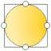</td>
        <td><a href="https://pixelhunter.io/" target="_blank">Pixelhunter</a></td>
        <td>AI智能调整图片尺寸用于社交媒体平台发帖</td>
        <td><a href="https://pixelhunter.io/" target="_blank">🔗</a></td>
    </tr>
</table>

## AI视频工具

<table>
    <tr>
        <td>1</td>
        <td></td>
        <td><a href="https://libtv.cgref.cn/aibot" target="_blank">LibTV</a></td>
        <td>专业AI视频创作平台，支持Seedance 2.0（真人参考）</td>
        <td><a href="https://libtv.cgref.cn/aibot" target="_blank">🔗</a></td>
    </tr>
    <tr>
        <td>2</td>
        <td></td>
        <td><a href="https://jimeng.jianying.com/ai-tool/home/" target="_blank">即梦AI</a></td>
        <td>一站式AI视频、图片、数字人创作工具</td>
        <td><a href="https://jimeng.jianying.com/ai-tool/home/" target="_blank">🔗</a></td>
    </tr>
    <tr>
        <td>3</td>
        <td></td>
        <td><a href="https://seko.cgref.cn/" target="_blank">Seko</a></td>
        <td>首个创编一体的AI视频创作Agent</td>
        <td><a href="https://seko.cgref.cn/" target="_blank">🔗</a></td>
    </tr>
    <tr>
        <td>4</td>
        <td></td>
        <td><a href="https://www.updream.cn/?bsource=xinyan_aa" target="_blank">updream</a></td>
        <td>专业级一站式 AI 视频创作平台</td>
        <td><a href="https://www.updream.cn/?bsource=xinyan_aa" target="_blank">🔗</a></td>
    </tr>
    <tr>
        <td>5</td>
        <td></td>
        <td><a href="https://d.design/agent" target="_blank">堆友AI视频</a></td>
        <td>堆友推出的AI视频生成工具</td>
        <td><a href="https://d.design/agent" target="_blank">🔗</a></td>
    </tr>
    <tr>
        <td>6</td>
        <td></td>
        <td><a href="https://soundviewai.com/invitation?inviteCode=H6tVloZUV" target="_blank">SoundView</a></td>
        <td>讯飞推出的AI短视频智能创作平台</td>
        <td><a href="https://soundviewai.com/invitation?inviteCode=H6tVloZUV" target="_blank">🔗</a></td>
    </tr>
    <tr>
        <td>7</td>
        <td></td>
        <td><a href="https://www.ihuiwa.com/workspace/ai-video/custom-action?huiwaInviteCode=EMRCAL" target="_blank">绘蛙AI视频</a></td>
        <td>绘蛙推出的AI图生视频工具</td>
        <td><a href="https://www.ihuiwa.com/workspace/ai-video/custom-action?huiwaInviteCode=EMRCAL" target="_blank">🔗</a></td>
    </tr>
    <tr>
        <td>8</td>
        <td></td>
        <td><a href="https://wawawriter.cgref.cn/aibot" target="_blank">蛙蛙漫剧</a></td>
        <td>AI小说-剧本-漫剧视频全链路生产</td>
        <td><a href="https://wawawriter.cgref.cn/aibot" target="_blank">🔗</a></td>
    </tr>
    <tr>
        <td>9</td>
        <td></td>
        <td><a href="https://liblib.cgref.cn/" target="_blank">LiblibAI</a></td>
        <td>一站式 AI 内容创作生成平台</td>
        <td><a href="https://liblib.cgref.cn/" target="_blank">🔗</a></td>
    </tr>
    <tr>
        <td>10</td>
        <td></td>
        <td><a href="https://www.youyan3d.com/login/" target="_blank">有言</a></td>
        <td>一站式AI视频创作和3D数字人生成平台</td>
        <td><a href="https://www.youyan3d.com/login/" target="_blank">🔗</a></td>
    </tr>
    <tr>
        <td>11</td>
        <td></td>
        <td><a href="https://aibrm.cgref.cn/aibot" target="_blank">白日梦</a></td>
        <td>领先AI创作平台，可生成最长50分钟的视频</td>
        <td><a href="https://aibrm.cgref.cn/aibot" target="_blank">🔗</a></td>
    </tr>
    <tr>
        <td>12</td>
        <td></td>
        <td><a href="https://volcengine.cgref.cn/aibot" target="_blank">Seedance</a></td>
        <td>字节跳动 Seed 团队推出的多模态 AI 视频生成模型</td>
        <td><a href="https://volcengine.cgref.cn/aibot" target="_blank">🔗</a></td>
    </tr>
    <tr>
        <td>13</td>
        <td></td>
        <td><a href="https://www.chanjing.cc/refc/?type=hzBuy&id=BEB41KJUj-n9rTc5kxR5WGKv6bdmvm_rv5Qpxs0XNFc" target="_blank">蝉镜</a></td>
        <td>AI数字人视频生成平台</td>
        <td><a href="https://www.chanjing.cc/refc/?type=hzBuy&id=BEB41KJUj-n9rTc5kxR5WGKv6bdmvm_rv5Qpxs0XNFc" target="_blank">🔗</a></td>
    </tr>
    <tr>
        <td>14</td>
        <td></td>
        <td><a href="https://www.xingyun3d.com/" target="_blank">魔珐星云</a></td>
        <td>具身智能3D数字人开放平台</td>
        <td><a href="https://www.xingyun3d.com/" target="_blank">🔗</a></td>
    </tr>
    <tr>
        <td>15</td>
        <td>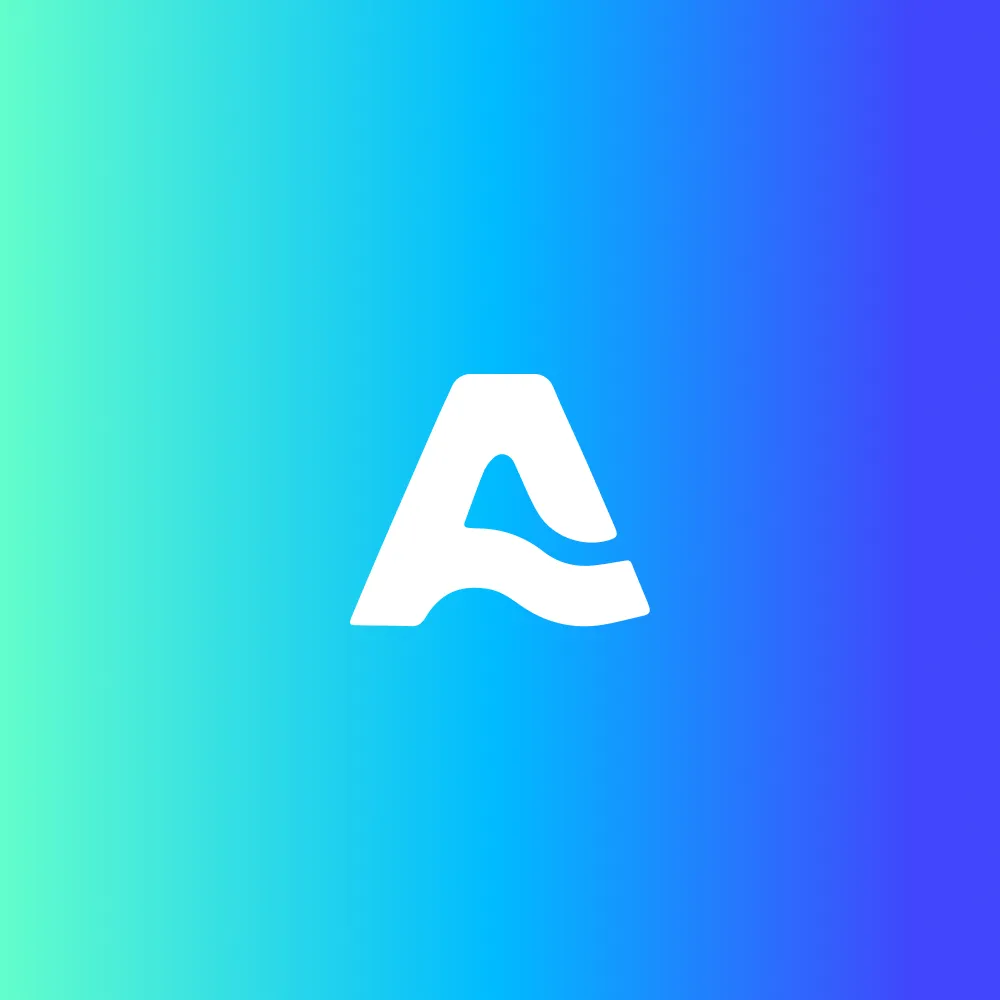</td>
        <td><a href="https://artarchstudio.cgaff.link/" target="_blank">ArtarchStudio</a></td>
        <td>一站式 AI 内容创作画布平台</td>
        <td><a href="https://artarchstudio.cgaff.link/" target="_blank">🔗</a></td>
    </tr>
    <tr>
        <td>16</td>
        <td></td>
        <td><a href="https://lickmv.cgref.cn/" target="_blank">立刻MV</a></td>
        <td>一站式 AI 音乐视频（MV）创作工具</td>
        <td><a href="https://lickmv.cgref.cn/" target="_blank">🔗</a></td>
    </tr>
    <tr>
        <td>17</td>
        <td></td>
        <td><a href="https://app.klingai.com/cn/" target="_blank">可灵AI</a></td>
        <td>快手推出的AI图像和视频创作平台</td>
        <td><a href="https://app.klingai.com/cn/" target="_blank">🔗</a></td>
    </tr>
    <tr>
        <td>18</td>
        <td></td>
        <td><a href="https://video.hunyuan.tencent.com/" target="_blank">腾讯混元AI视频</a></td>
        <td>腾讯推出的AI视频生成工具</td>
        <td><a href="https://video.hunyuan.tencent.com/" target="_blank">🔗</a></td>
    </tr>
    <tr>
        <td>19</td>
        <td></td>
        <td><a href="https://fas.st/t/nFLHVC4T" target="_blank">Pollo AI</a></td>
        <td>一站式AI图像和视频创作平台</td>
        <td><a href="https://fas.st/t/nFLHVC4T" target="_blank">🔗</a></td>
    </tr>
    <tr>
        <td>20</td>
        <td></td>
        <td><a href="https://app.pavo-ai.work/" target="_blank">Pavo</a></td>
        <td>Agnes AI 推出的AI短剧视频创作平台</td>
        <td><a href="https://app.pavo-ai.work/" target="_blank">🔗</a></td>
    </tr>
    <tr>
        <td>21</td>
        <td></td>
        <td><a href="https://lumenflow.net/register" target="_blank">Lumen Flow</a></td>
        <td>端到端 AI 漫剧自动生产线，AI 剧本一键成片</td>
        <td><a href="https://lumenflow.net/register" target="_blank">🔗</a></td>
    </tr>
    <tr>
        <td>22</td>
        <td></td>
        <td><a href="https://rhtv.runninghub.cn/?inviteCode=bemsxzdr" target="_blank">RHTV</a></td>
        <td>RunningHub 推出的原生 AI 无限画布创作工具</td>
        <td><a href="https://rhtv.runninghub.cn/?inviteCode=bemsxzdr" target="_blank">🔗</a></td>
    </tr>
    <tr>
        <td>23</td>
        <td></td>
        <td><a href="https://www.tapnow.ai/" target="_blank">TapNow</a></td>
        <td>AI视觉内容创作平台，提供多种预设工作流</td>
        <td><a href="https://www.tapnow.ai/" target="_blank">🔗</a></td>
    </tr>
    <tr>
        <td>24</td>
        <td></td>
        <td><a href="https://higgsfield.ai/" target="_blank">Higgsfield</a></td>
        <td>AI视频生成工具，支持专业运镜效果</td>
        <td><a href="https://higgsfield.ai/" target="_blank">🔗</a></td>
    </tr>
    <tr>
        <td>25</td>
        <td></td>
        <td><a href="https://www.vidu.cn/" target="_blank">Vidu</a></td>
        <td>生数科技推出的AI视频生成大模型</td>
        <td><a href="https://www.vidu.cn/" target="_blank">🔗</a></td>
    </tr>
    <tr>
        <td>26</td>
        <td></td>
        <td><a href="https://tdream.qq.com/" target="_blank">TDream</a></td>
        <td>腾讯推出的AI互动内容创作平台</td>
        <td><a href="https://tdream.qq.com/" target="_blank">🔗</a></td>
    </tr>
    <tr>
        <td>27</td>
        <td></td>
        <td><a href="https://digen.ai/" target="_blank">Digen AI</a></td>
        <td>一站式 AI 视频创作平台</td>
        <td><a href="https://digen.ai/" target="_blank">🔗</a></td>
    </tr>
    <tr>
        <td>28</td>
        <td></td>
        <td><a href="https://www.flova.ai/" target="_blank">Flova</a></td>
        <td>全球首个一体化 AI 视频创作平台</td>
        <td><a href="https://www.flova.ai/" target="_blank">🔗</a></td>
    </tr>
    <tr>
        <td>29</td>
        <td></td>
        <td><a href="https://highreach.ai/" target="_blank">HighReach</a></td>
        <td>AI 广告创意生成平台，全链路创意覆盖</td>
        <td><a href="https://highreach.ai/" target="_blank">🔗</a></td>
    </tr>
    <tr>
        <td>30</td>
        <td></td>
        <td><a href="https://www.joypix.ai/app/login/?utm=cg&cgv=aibotcn" target="_blank">JoyPix</a></td>
        <td>AI数字人创作工具，支持声音克隆</td>
        <td><a href="https://www.joypix.ai/app/login/?utm=cg&cgv=aibotcn" target="_blank">🔗</a></td>
    </tr>
    <tr>
        <td>31</td>
        <td></td>
        <td><a href="https://lingya.qq.com/" target="_blank">灵芽社区</a></td>
        <td>腾讯推出的 AI 多模态创作者社区</td>
        <td><a href="https://lingya.qq.com/" target="_blank">🔗</a></td>
    </tr>
    <tr>
        <td>32</td>
        <td></td>
        <td><a href="https://www.yoco.me/" target="_blank">YOCO智能制课</a></td>
        <td>AI PPT讲解视频生成创作工具</td>
        <td><a href="https://www.yoco.me/" target="_blank">🔗</a></td>
    </tr>
    <tr>
        <td>33</td>
        <td></td>
        <td><a href="https://ohyesai.com/" target="_blank">OhYesAI</a></td>
        <td>AI 音乐 MV 一体化创作智能体平台</td>
        <td><a href="https://ohyesai.com/" target="_blank">🔗</a></td>
    </tr>
    <tr>
        <td>34</td>
        <td></td>
        <td><a href="https://www.oiiyao.com/" target="_blank">Oiiyao</a></td>
        <td>AI视频本地化平台</td>
        <td><a href="https://www.oiiyao.com/" target="_blank">🔗</a></td>
    </tr>
    <tr>
        <td>35</td>
        <td></td>
        <td><a href="https://weave.32zi.com/" target="_blank">交织 Weave</a></td>
        <td>AI全能创作平台，一站式实现你的创意</td>
        <td><a href="https://weave.32zi.com/" target="_blank">🔗</a></td>
    </tr>
    <tr>
        <td>36</td>
        <td></td>
        <td><a href="https://fogsight.ai/" target="_blank">雾象</a></td>
        <td>免费开源的AI动画生成工具</td>
        <td><a href="https://fogsight.ai/" target="_blank">🔗</a></td>
    </tr>
    <tr>
        <td>37</td>
        <td></td>
        <td><a href="https://haimeta.com/" target="_blank">Haimeta</a></td>
        <td>AI 内容创意平台，全链路 AI 生产体验</td>
        <td><a href="https://haimeta.com/" target="_blank">🔗</a></td>
    </tr>
    <tr>
        <td>38</td>
        <td></td>
        <td><a href="https://juhuo.cn/" target="_blank">剧火AI</a></td>
        <td>AI短剧创作者的一站式创作Agent</td>
        <td><a href="https://juhuo.cn/" target="_blank">🔗</a></td>
    </tr>
    <tr>
        <td>39</td>
        <td></td>
        <td><a href="https://vibepaper-ai.com/" target="_blank">VibePaper</a></td>
        <td>短剧制作团队的AI协作工作台，节点式无限画布</td>
        <td><a href="https://vibepaper-ai.com/" target="_blank">🔗</a></td>
    </tr>
    <tr>
        <td>40</td>
        <td></td>
        <td><a href="https://app.yoroll.ai/" target="_blank">Yoroll</a></td>
        <td>LinearGame 推出的 AI 原生互动视频游戏平台</td>
        <td><a href="https://app.yoroll.ai/" target="_blank">🔗</a></td>
    </tr>
    <tr>
        <td>41</td>
        <td></td>
        <td><a href="https://makefun.ai/" target="_blank">Makefun</a></td>
        <td>无限制一站式 AI 视频生成平台</td>
        <td><a href="https://makefun.ai/" target="_blank">🔗</a></td>
    </tr>
    <tr>
        <td>42</td>
        <td></td>
        <td><a href="https://zorqai.com/" target="_blank">Zorq AI</a></td>
        <td>多模型聚合 AI 创意生成平台</td>
        <td><a href="https://zorqai.com/" target="_blank">🔗</a></td>
    </tr>
    <tr>
        <td>43</td>
        <td></td>
        <td><a href="https://ai-bot.cn/tongyi-wanxvideo" target="_blank">通义万相AI视频</a></td>
        <td>通义万相AI视频是阿里推出的...</td>
        <td><a href="https://ai-bot.cn/tongyi-wanxvideo" target="_blank">🔗</a></td>
    </tr>
    <tr>
        <td>44</td>
        <td></td>
        <td><a href="https://heygen.com/&via=ai-bot" target="_blank">HeyGen</a></td>
        <td>专业的AI数字人视频创作平台</td>
        <td><a href="https://heygen.com/&via=ai-bot" target="_blank">🔗</a></td>
    </tr>
    <tr>
        <td>45</td>
        <td></td>
        <td><a href="https://pexo.ai/" target="_blank">Pexo</a></td>
        <td>AI 视频创作Agent，个人 AI 视频伙伴</td>
        <td><a href="https://pexo.ai/" target="_blank">🔗</a></td>
    </tr>
    <tr>
        <td>46</td>
        <td></td>
        <td><a href="https://www.topview.ai/" target="_blank">Topview</a></td>
        <td>为电商与营销场景推出的 AI 视频生成Agent</td>
        <td><a href="https://www.topview.ai/" target="_blank">🔗</a></td>
    </tr>
    <tr>
        <td>47</td>
        <td></td>
        <td><a href="https://www.yikeai.com/" target="_blank">万镜一刻</a></td>
        <td>阿里云推出的AI视频创作平台</td>
        <td><a href="https://www.yikeai.com/" target="_blank">🔗</a></td>
    </tr>
    <tr>
        <td>48</td>
        <td></td>
        <td><a href="https://tagomovie.bitaihub.com/" target="_blank">TagoMovie</a></td>
        <td>一站式 AI 漫剧与短剧创作平台</td>
        <td><a href="https://tagomovie.bitaihub.com/" target="_blank">🔗</a></td>
    </tr>
    <tr>
        <td>49</td>
        <td></td>
        <td><a href="https://linghuiai.net/go/bXd92z" target="_blank">灵绘AI</a></td>
        <td>专业级 AI 短剧漫剧视频创作平台</td>
        <td><a href="https://linghuiai.net/go/bXd92z" target="_blank">🔗</a></td>
    </tr>
    <tr>
        <td>50</td>
        <td></td>
        <td><a href="https://www.pixmax.cn/" target="_blank">Pixmax</a></td>
        <td>AI真人短剧、漫剧一站式创作引擎</td>
        <td><a href="https://www.pixmax.cn/" target="_blank">🔗</a></td>
    </tr>
    <tr>
        <td>51</td>
        <td></td>
        <td><a href="https://brainrot.mov/" target="_blank">Brainrot.mov</a></td>
        <td>专为创作者打造的AI视频创作平台</td>
        <td><a href="https://brainrot.mov/" target="_blank">🔗</a></td>
    </tr>
    <tr>
        <td>52</td>
        <td></td>
        <td><a href="https://www.zaodian.com/" target="_blank">造点AI</a></td>
        <td>夸克团队推出的AI图像与视频创作平台</td>
        <td><a href="https://www.zaodian.com/" target="_blank">🔗</a></td>
    </tr>
    <tr>
        <td>53</td>
        <td></td>
        <td><a href="https://www.zaoci.tv/" target="_blank">造次</a></td>
        <td>AI原创IP视频社区</td>
        <td><a href="https://www.zaoci.tv/" target="_blank">🔗</a></td>
    </tr>
    <tr>
        <td>54</td>
        <td></td>
        <td><a href="https://www.huasheng.cn/" target="_blank">花生AI</a></td>
        <td>B站推出的AI视频创作工具</td>
        <td><a href="https://www.huasheng.cn/" target="_blank">🔗</a></td>
    </tr>
    <tr>
        <td>55</td>
        <td></td>
        <td><a href="https://vibeknow.com/" target="_blank">VibeKnow</a></td>
        <td>全球首个 AI 知识视频创作平台</td>
        <td><a href="https://vibeknow.com/" target="_blank">🔗</a></td>
    </tr>
    <tr>
        <td>56</td>
        <td></td>
        <td><a href="https://www.museartai.com/" target="_blank">MuseArt AI</a></td>
        <td>一站式 AI 图像和视频创作平台</td>
        <td><a href="https://www.museartai.com/" target="_blank">🔗</a></td>
    </tr>
    <tr>
        <td>57</td>
        <td></td>
        <td><a href="https://anishort.ai/" target="_blank">AniShort</a></td>
        <td>AI短剧协同创作平台，重构短剧生产流程</td>
        <td><a href="https://anishort.ai/" target="_blank">🔗</a></td>
    </tr>
    <tr>
        <td>58</td>
        <td></td>
        <td><a href="https://xianchou.com/" target="_blank">献丑AI</a></td>
        <td>首个 AI 视频开源社区，支持一键Fork与共创</td>
        <td><a href="https://xianchou.com/" target="_blank">🔗</a></td>
    </tr>
    <tr>
        <td>59</td>
        <td></td>
        <td><a href="https://ai-bot.cn/hailuoai-video" target="_blank">海螺视频</a></td>
        <td>MiniMax公司推出的AI视频生成工具</td>
        <td><a href="https://ai-bot.cn/hailuoai-video" target="_blank">🔗</a></td>
    </tr>
    <tr>
        <td>60</td>
        <td></td>
        <td><a href="https://www.mochiani.com/" target="_blank">MochiAni</a></td>
        <td>AI动画视频创作工具</td>
        <td><a href="https://www.mochiani.com/" target="_blank">🔗</a></td>
    </tr>
    <tr>
        <td>61</td>
        <td></td>
        <td><a href="https://adsturbo.ai/" target="_blank">AdsTurbo AI</a></td>
        <td>AI视频广告生成平台，自动生成可直接投放的视频</td>
        <td><a href="https://adsturbo.ai/" target="_blank">🔗</a></td>
    </tr>
    <tr>
        <td>62</td>
        <td></td>
        <td><a href="https://nextcut-ai.com/" target="_blank">NextCut AI</a></td>
        <td>AI视频创作工具，集成无限画布 + workflow + 剪辑轨道 + 多Agent团队</td>
        <td><a href="https://nextcut-ai.com/" target="_blank">🔗</a></td>
    </tr>
    <tr>
        <td>63</td>
        <td></td>
        <td><a href="https://www.yunmuts.com/" target="_blank">云幕同声</a></td>
        <td>专业AI视频翻译，短剧出海、跨境电商，效果超棒！</td>
        <td><a href="https://www.yunmuts.com/" target="_blank">🔗</a></td>
    </tr>
    <tr>
        <td>64</td>
        <td></td>
        <td><a href="https://www.animon.com?vd=qFokWH/" target="_blank">萌动AI</a></td>
        <td>全球首个二次元/动漫专用 AI 创作工具</td>
        <td><a href="https://www.animon.com?vd=qFokWH/" target="_blank">🔗</a></td>
    </tr>
    <tr>
        <td>65</td>
        <td></td>
        <td><a href="https://komiko.app/" target="_blank">KomikoAI</a></td>
        <td>一站式AI动漫内容创作平台</td>
        <td><a href="https://komiko.app/" target="_blank">🔗</a></td>
    </tr>
    <tr>
        <td>66</td>
        <td></td>
        <td><a href="https://www.keevx.com/" target="_blank">Keevx</a></td>
        <td>开箱即用的AI数字人视频创作工具</td>
        <td><a href="https://www.keevx.com/" target="_blank">🔗</a></td>
    </tr>
    <tr>
        <td>67</td>
        <td></td>
        <td><a href="https://aic.oceanengine.com/" target="_blank">即创</a></td>
        <td>抖音推出的一站式AI智能创作平台</td>
        <td><a href="https://aic.oceanengine.com/" target="_blank">🔗</a></td>
    </tr>
    <tr>
        <td>68</td>
        <td></td>
        <td><a href="https://chatglm.cn/video" target="_blank">智谱清影</a></td>
        <td>智谱推出的免费AI视频生成工具</td>
        <td><a href="https://chatglm.cn/video" target="_blank">🔗</a></td>
    </tr>
    <tr>
        <td>69</td>
        <td></td>
        <td><a href="https://www.reelsagent.com/" target="_blank">内容特工队</a></td>
        <td>全球首款移动端AI营销视频生成智能体</td>
        <td><a href="https://www.reelsagent.com/" target="_blank">🔗</a></td>
    </tr>
    <tr>
        <td>70</td>
        <td></td>
        <td><a href="https://kc.kuaishou.com/" target="_blank">磁力开创</a></td>
        <td>快手推出的AI创意生产平台</td>
        <td><a href="https://kc.kuaishou.com/" target="_blank">🔗</a></td>
    </tr>
    <tr>
        <td>71</td>
        <td></td>
        <td><a href="https://a2e.ai/" target="_blank">A2E</a></td>
        <td>一站式AI视频生成平台</td>
        <td><a href="https://a2e.ai/" target="_blank">🔗</a></td>
    </tr>
    <tr>
        <td>72</td>
        <td></td>
        <td><a href="https://www.hitpaw.com/" target="_blank">HitPaw</a></td>
        <td>专注于AI视频、图像和音频处理工具</td>
        <td><a href="https://www.hitpaw.com/" target="_blank">🔗</a></td>
    </tr>
    <tr>
        <td>73</td>
        <td></td>
        <td><a href="https://runwayml.com/" target="_blank">Runway</a></td>
        <td>AI视频工具，绿幕抠除、视频生成、动态捕捉等功能</td>
        <td><a href="https://runwayml.com/" target="_blank">🔗</a></td>
    </tr>
    <tr>
        <td>74</td>
        <td></td>
        <td><a href="https://pika.art/" target="_blank">Pika</a></td>
        <td>Pika Labs推出的AI视频生成和编辑工具</td>
        <td><a href="https://pika.art/" target="_blank">🔗</a></td>
    </tr>
    <tr>
        <td>75</td>
        <td></td>
        <td><a href="https://www.kreadoai.com/zh?via=aibot" target="_blank">KreadoAI</a></td>
        <td>AI数字人视频营销创作平台</td>
        <td><a href="https://www.kreadoai.com/zh?via=aibot" target="_blank">🔗</a></td>
    </tr>
    <tr>
        <td>76</td>
        <td></td>
        <td><a href="https://sekotalk.com/" target="_blank">SekoTalk</a></td>
        <td>商汤科技推出的AI对口型工具</td>
        <td><a href="https://sekotalk.com/" target="_blank">🔗</a></td>
    </tr>
    <tr>
        <td>77</td>
        <td></td>
        <td><a href="https://avatar.console.aliyun.com/lingmou" target="_blank">通义灵眸</a></td>
        <td>阿里通义推出的AI数字人生产平台</td>
        <td><a href="https://avatar.console.aliyun.com/lingmou" target="_blank">🔗</a></td>
    </tr>
    <tr>
        <td>78</td>
        <td></td>
        <td><a href="https://jurilu.paluai.com/" target="_blank">巨日禄</a></td>
        <td>一站式AI动漫视频创作平台</td>
        <td><a href="https://jurilu.paluai.com/" target="_blank">🔗</a></td>
    </tr>
    <tr>
        <td>79</td>
        <td></td>
        <td><a href="https://ai-bot.cn/medeo" target="_blank">Medeo</a></td>
        <td>AI视频创作平台，一句话生成完整视频</td>
        <td><a href="https://ai-bot.cn/medeo" target="_blank">🔗</a></td>
    </tr>
    <tr>
        <td>80</td>
        <td></td>
        <td><a href="https://www.boba.video/" target="_blank">Boba</a></td>
        <td>AI动漫视频创作工具</td>
        <td><a href="https://www.boba.video/" target="_blank">🔗</a></td>
    </tr>
    <tr>
        <td>81</td>
        <td></td>
        <td><a href="https://lumalabs.ai/dream-machine" target="_blank">Dream Machine</a></td>
        <td>Luma AI推出的AI视频生成工具</td>
        <td><a href="https://lumalabs.ai/dream-machine" target="_blank">🔗</a></td>
    </tr>
    <tr>
        <td>82</td>
        <td></td>
        <td><a href="https://typemovie.art/" target="_blank">讯飞绘镜</a></td>
        <td>科大讯飞推出的AI短视频创作平台</td>
        <td><a href="https://typemovie.art/" target="_blank">🔗</a></td>
    </tr>
    <tr>
        <td>83</td>
        <td></td>
        <td><a href="https://ai-bot.cn/huixiang" target="_blank">绘想</a></td>
        <td>百度推出的AI视频创作平台</td>
        <td><a href="https://ai-bot.cn/huixiang" target="_blank">🔗</a></td>
    </tr>
    <tr>
        <td>84</td>
        <td></td>
        <td><a href="https://www.hedra.com/" target="_blank">Hedra</a></td>
        <td>AI对口型视频生成工具</td>
        <td><a href="https://www.hedra.com/" target="_blank">🔗</a></td>
    </tr>
    <tr>
        <td>85</td>
        <td></td>
        <td><a href="https://www.vozo.ai/" target="_blank">Vozo</a></td>
        <td>多功能AI视频编辑工具</td>
        <td><a href="https://www.vozo.ai/" target="_blank">🔗</a></td>
    </tr>
    <tr>
        <td>86</td>
        <td></td>
        <td><a href="https://viggle.ai/" target="_blank">Viggle</a></td>
        <td>AI生成可控的角色动态视频的工具</td>
        <td><a href="https://viggle.ai/" target="_blank">🔗</a></td>
    </tr>
    <tr>
        <td>87</td>
        <td></td>
        <td><a href="https://ai-bot.cn/tavus" target="_blank">Tavus</a></td>
        <td>AI数字人克隆和AI视频实时对话工具</td>
        <td><a href="https://ai-bot.cn/tavus" target="_blank">🔗</a></td>
    </tr>
    <tr>
        <td>88</td>
        <td></td>
        <td><a href="https://ai-bot.cn/tomoviee" target="_blank">万兴天幕</a></td>
        <td>万兴科技推出AIGC视频创作平台</td>
        <td><a href="https://ai-bot.cn/tomoviee" target="_blank">🔗</a></td>
    </tr>
    <tr>
        <td>89</td>
        <td></td>
        <td><a href="https://admuse.qq.com/intelligent/live/page/index.html#/" target="_blank">妙播</a></td>
        <td>腾讯广告推出的AI直播电商解决方案</td>
        <td><a href="https://admuse.qq.com/intelligent/live/page/index.html#/" target="_blank">🔗</a></td>
    </tr>
    <tr>
        <td>90</td>
        <td></td>
        <td><a href="https://ai-bot.cn/yuewen-videos" target="_blank">阶跃视频</a></td>
        <td>阶跃星辰推出的AI视频生成工具</td>
        <td><a href="https://ai-bot.cn/yuewen-videos" target="_blank">🔗</a></td>
    </tr>
    <tr>
        <td>91</td>
        <td></td>
        <td><a href="https://aigc.yizhentv.com/" target="_blank">秒创</a></td>
        <td>AIGC内容创作平台</td>
        <td><a href="https://aigc.yizhentv.com/" target="_blank">🔗</a></td>
    </tr>
    <tr>
        <td>92</td>
        <td></td>
        <td><a href="https://ai-bot.cn/yuanjing" target="_blank">元镜</a></td>
        <td>AI视频生成工具，支持多模态创意分镜创作服务</td>
        <td><a href="https://ai-bot.cn/yuanjing" target="_blank">🔗</a></td>
    </tr>
    <tr>
        <td>93</td>
        <td></td>
        <td><a href="https://skyreels.ai/" target="_blank">SkyReels</a></td>
        <td>昆仑万维推出的AI短剧创作平台</td>
        <td><a href="https://skyreels.ai/" target="_blank">🔗</a></td>
    </tr>
    <tr>
        <td>94</td>
        <td></td>
        <td><a href="https://www.moki.cn/" target="_blank">MOKI</a></td>
        <td>美图推出的AI视频短片创作平台</td>
        <td><a href="https://www.moki.cn/" target="_blank">🔗</a></td>
    </tr>
    <tr>
        <td>95</td>
        <td></td>
        <td><a href="https://ai-bot.cn/shenbi-maoyan" target="_blank">神笔马良</a></td>
        <td>猫眼娱乐推出的AI影视创作生成工具</td>
        <td><a href="https://ai-bot.cn/shenbi-maoyan" target="_blank">🔗</a></td>
    </tr>
    <tr>
        <td>96</td>
        <td></td>
        <td><a href="https://ai-bot.cn/video-ocean" target="_blank">Video Ocean</a></td>
        <td>潞晨科技推出的多功能AI视频生成平台</td>
        <td><a href="https://ai-bot.cn/video-ocean" target="_blank">🔗</a></td>
    </tr>
    <tr>
        <td>97</td>
        <td></td>
        <td><a href="https://flowgpt.com/flow-studio" target="_blank">Flow Studio</a></td>
        <td>FlowGPT推出的AI长视频生成工具</td>
        <td><a href="https://flowgpt.com/flow-studio" target="_blank">🔗</a></td>
    </tr>
    <tr>
        <td>98</td>
        <td></td>
        <td><a href="https://vizard.ai/" target="_blank">Vizard</a></td>
        <td>将长视频转为社交短视频的AI工具</td>
        <td><a href="https://vizard.ai/" target="_blank">🔗</a></td>
    </tr>
    <tr>
        <td>99</td>
        <td></td>
        <td><a href="https://xunguang.com/" target="_blank">寻光</a></td>
        <td>阿里达摩院推出的全流程AI视频创作平台</td>
        <td><a href="https://xunguang.com/" target="_blank">🔗</a></td>
    </tr>
    <tr>
        <td>100</td>
        <td></td>
        <td><a href="https://hotshot.co/" target="_blank">Hotshot</a></td>
        <td>AI视频生成工具，将文本转为3秒逼真视频</td>
        <td><a href="https://hotshot.co/" target="_blank">🔗</a></td>
    </tr>
</table>

## AI办公工具

<table>
    <tr>
        <td>1</td>
        <td></td>
        <td><a href="https://tongchuan.iflyrec.com/" target="_blank">讯飞同传</a></td>
        <td>科大讯飞推出的专业AI同声传译平台</td>
        <td><a href="https://tongchuan.iflyrec.com/" target="_blank">🔗</a></td>
    </tr>
    <tr>
        <td>2</td>
        <td></td>
        <td><a href="https://immersivetranslate.com/?via=2c3604" target="_blank">沉浸式翻译</a></td>
        <td>双语对照的网页翻译插件，完全免费 口碑炸裂！</td>
        <td><a href="https://immersivetranslate.com/?via=2c3604" target="_blank">🔗</a></td>
    </tr>
    <tr>
        <td>3</td>
        <td></td>
        <td><a href="https://www.deepl.com/" target="_blank">DeepL翻译</a></td>
        <td>准确的人工智能翻译工具</td>
        <td><a href="https://www.deepl.com/" target="_blank">🔗</a></td>
    </tr>
    <tr>
        <td>4</td>
        <td></td>
        <td><a href="https://translate.google.com/" target="_blank">Google翻译</a></td>
        <td>Google免费提供的上百种语言智能翻译工具</td>
        <td><a href="https://translate.google.com/" target="_blank">🔗</a></td>
    </tr>
    <tr>
        <td>5</td>
        <td></td>
        <td><a href="https://d.design/toolbox/translate" target="_blank">堆友AI图片翻译</a></td>
        <td>AI图片翻译工具，自动翻译图片文字内容</td>
        <td><a href="https://d.design/toolbox/translate" target="_blank">🔗</a></td>
    </tr>
    <tr>
        <td>6</td>
        <td></td>
        <td><a href="https://doclingo.cn/" target="_blank">Doclingo</a></td>
        <td>专业的AI文档翻译工具，保留原始排版</td>
        <td><a href="https://doclingo.cn/" target="_blank">🔗</a></td>
    </tr>
    <tr>
        <td>7</td>
        <td></td>
        <td><a href="https://belindoc.com/" target="_blank">Belin Doc</a></td>
        <td>免费无限制的 AI 文档翻译工具</td>
        <td><a href="https://belindoc.com/" target="_blank">🔗</a></td>
    </tr>
    <tr>
        <td>8</td>
        <td></td>
        <td><a href="https://transor.ai/" target="_blank">Transor沉浸式翻译</a></td>
        <td>AI翻译工具，提供多场景实时翻译服务</td>
        <td><a href="https://transor.ai/" target="_blank">🔗</a></td>
    </tr>
    <tr>
        <td>9</td>
        <td></td>
        <td><a href="https://lingxifanyi.com/" target="_blank">灵夕翻译</a></td>
        <td>AI智能文档翻译工具，保持原始排版</td>
        <td><a href="https://lingxifanyi.com/" target="_blank">🔗</a></td>
    </tr>
    <tr>
        <td>10</td>
        <td></td>
        <td><a href="https://huiyiai.net/hy_api/activity/invite" target="_blank">会译</a></td>
        <td>沉浸对照式AI翻译，支持100+语言</td>
        <td><a href="https://huiyiai.net/hy_api/activity/invite" target="_blank">🔗</a></td>
    </tr>
    <tr>
        <td>11</td>
        <td></td>
        <td><a href="https://transmart.qq.com/" target="_blank">腾讯交互翻译</a></td>
        <td>腾讯推出的多语言AI翻译工具</td>
        <td><a href="https://transmart.qq.com/" target="_blank">🔗</a></td>
    </tr>
    <tr>
        <td>12</td>
        <td></td>
        <td><a href="https://deeptranslate.ai/zh-CN" target="_blank">DeepTranslate</a></td>
        <td>免费的AI双语翻译器，支持142+种语言</td>
        <td><a href="https://deeptranslate.ai/zh-CN" target="_blank">🔗</a></td>
    </tr>
    <tr>
        <td>13</td>
        <td></td>
        <td><a href="https://www.bing.com/translator" target="_blank">必应翻译</a></td>
        <td>微软必应推出的翻译工具</td>
        <td><a href="https://www.bing.com/translator" target="_blank">🔗</a></td>
    </tr>
    <tr>
        <td>14</td>
        <td></td>
        <td><a href="https://www.trytoby.com/" target="_blank">Toby</a></td>
        <td>AI实时语音翻译工具，专为视频通话设计</td>
        <td><a href="https://www.trytoby.com/" target="_blank">🔗</a></td>
    </tr>
    <tr>
        <td>15</td>
        <td></td>
        <td><a href="https://fanyi.baidu.com/" target="_blank">百度翻译</a></td>
        <td>200种语言互译、沟通全世界！</td>
        <td><a href="https://fanyi.baidu.com/" target="_blank">🔗</a></td>
    </tr>
    <tr>
        <td>16</td>
        <td></td>
        <td><a href="https://translate.alibaba.com/" target="_blank">阿里翻译</a></td>
        <td>阿里巴巴达摩院推出的多领域多语种的在线机器翻译</td>
        <td><a href="https://translate.alibaba.com/" target="_blank">🔗</a></td>
    </tr>
    <tr>
        <td>17</td>
        <td></td>
        <td><a href="https://fanyi.sogou.com/text" target="_blank">搜狗翻译</a></td>
        <td>你的贴身智能翻译专家</td>
        <td><a href="https://fanyi.sogou.com/text" target="_blank">🔗</a></td>
    </tr>
    <tr>
        <td>18</td>
        <td></td>
        <td><a href="https://fanyi.qq.com/" target="_blank">腾讯翻译君</a></td>
        <td>你免费的随身翻译</td>
        <td><a href="https://fanyi.qq.com/" target="_blank">🔗</a></td>
    </tr>
    <tr>
        <td>19</td>
        <td></td>
        <td><a href="https://www.xiangjifanyi.com/console/register-invite/741be04feb30bf16" target="_blank">象寄翻译</a></td>
        <td>AI图片和视频翻译神器，支持多种语言的翻译</td>
        <td><a href="https://www.xiangjifanyi.com/console/register-invite/741be04feb30bf16" target="_blank">🔗</a></td>
    </tr>
    <tr>
        <td>20</td>
        <td></td>
        <td><a href="https://sight.youdao.com/" target="_blank">网易见外</a></td>
        <td>网易推出的AI智能翻译平台，支持音视频、文档、图片、字幕等翻译</td>
        <td><a href="https://sight.youdao.com/" target="_blank">🔗</a></td>
    </tr>
    <tr>
        <td>21</td>
        <td></td>
        <td><a href="https://fanyi.xfyun.cn/console/trans/text" target="_blank">讯飞智能翻译</a></td>
        <td>科大讯飞推出的人工智能翻译平台</td>
        <td><a href="https://fanyi.xfyun.cn/console/trans/text" target="_blank">🔗</a></td>
    </tr>
    <tr>
        <td>22</td>
        <td></td>
        <td><a href="https://fanyi.caiyunapp.com/#" target="_blank">彩云小译</a></td>
        <td>兼具中日英同声传译、文档翻译和网页翻译的智能翻译工具</td>
        <td><a href="https://fanyi.caiyunapp.com/#" target="_blank">🔗</a></td>
    </tr>
    <tr>
        <td>23</td>
        <td></td>
        <td><a href="https://fanyi.baidu.com/appdownload/download.html?tab=helper&fr=pcproduct" target="_blank">百度AI同传助手</a></td>
        <td>中英文音视频同传字幕工具</td>
        <td><a href="https://fanyi.baidu.com/appdownload/download.html?tab=helper&fr=pcproduct" target="_blank">🔗</a></td>
    </tr>
    <tr>
        <td>24</td>
        <td></td>
        <td><a href="https://kuaiyi.wps.cn/txt-translate" target="_blank">金山快译</a></td>
        <td>金山WPS推出的在线翻译平台</td>
        <td><a href="https://kuaiyi.wps.cn/txt-translate" target="_blank">🔗</a></td>
    </tr>
    <tr>
        <td>25</td>
        <td></td>
        <td><a href="https://www.feishu.cn/product/ai_companion" target="_blank">飞书智能伙伴</a></td>
        <td>字节旗下飞书平台推出的AI办公助手</td>
        <td><a href="https://www.feishu.cn/product/ai_companion" target="_blank">🔗</a></td>
    </tr>
    <tr>
        <td>26</td>
        <td></td>
        <td><a href="https://page.dingtalk.com/wow/dingtalk/default/dingtalk/I0HfYX4QStBIpLgxnZQe" target="_blank">钉钉斜杠“/”</a></td>
        <td>钉钉最新集成了通义千问大模型的AI办公助手</td>
        <td><a href="https://page.dingtalk.com/wow/dingtalk/default/dingtalk/I0HfYX4QStBIpLgxnZQe" target="_blank">🔗</a></td>
    </tr>
    <tr>
        <td>27</td>
        <td></td>
        <td><a href="https://workspace.dingtalk.com/welcome" target="_blank">钉钉·个人版</a></td>
        <td>钉钉推出的个人版办公应用程序，内置AI智能助手，可进行AI创作、AI对话、AI绘画</td>
        <td><a href="https://workspace.dingtalk.com/welcome" target="_blank">🔗</a></td>
    </tr>
    <tr>
        <td>28</td>
        <td></td>
        <td><a href="https://ai.wps.cn/" target="_blank">WPS AI</a></td>
        <td>WPS推出的AI办公助手，已免费开放</td>
        <td><a href="https://ai.wps.cn/" target="_blank">🔗</a></td>
    </tr>
    <tr>
        <td>29</td>
        <td></td>
        <td><a href="https://www.aippt.cn/&utm_page=aippt&utm_unit=AIPPT&utm_keyword=50608" target="_blank">AiPPT</a></td>
        <td>AI快速生成高质量PPT</td>
        <td><a href="https://www.aippt.cn/&utm_page=aippt&utm_unit=AIPPT&utm_keyword=50608" target="_blank">🔗</a></td>
    </tr>
    <tr>
        <td>30</td>
        <td></td>
        <td><a href="https://cappt.cgref.cn/" target="_blank">咔片PPT</a></td>
        <td>AI PPT制作工具，设计美化全流程自动化</td>
        <td><a href="https://cappt.cgref.cn/" target="_blank">🔗</a></td>
    </tr>
    <tr>
        <td>31</td>
        <td></td>
        <td><a href="https://pptgo.cn/&_channel_track_key=LkU8aJjk" target="_blank">博思AIPPT</a></td>
        <td>PPT效率神器，AI一键生成PPT</td>
        <td><a href="https://pptgo.cn/&_channel_track_key=LkU8aJjk" target="_blank">🔗</a></td>
    </tr>
    <tr>
        <td>32</td>
        <td></td>
        <td><a href="https://docmee.cn/" target="_blank">文多多AiPPT</a></td>
        <td>AI一键生成PPT，支持AI配图和智能资料整合</td>
        <td><a href="https://docmee.cn/" target="_blank">🔗</a></td>
    </tr>
    <tr>
        <td>33</td>
        <td></td>
        <td><a href="https://islide.cgref.cn/aibot" target="_blank">iSlide AIPPT</a></td>
        <td>AI一键设计精美PPT，只需一句标题</td>
        <td><a href="https://islide.cgref.cn/aibot" target="_blank">🔗</a></td>
    </tr>
    <tr>
        <td>34</td>
        <td></td>
        <td><a href="https://zhiwen.xfyun.cn/home" target="_blank">讯飞智文</a></td>
        <td>一键生成PPT和Word</td>
        <td><a href="https://zhiwen.xfyun.cn/home" target="_blank">🔗</a></td>
    </tr>
    <tr>
        <td>35</td>
        <td></td>
        <td><a href="https://pi.deepvinci.tech/idea?share_token=CUFCN44CB6WIA" target="_blank">Pi智能PPT</a></td>
        <td>一键生成PPT，复制精美模板</td>
        <td><a href="https://pi.deepvinci.tech/idea?share_token=CUFCN44CB6WIA" target="_blank">🔗</a></td>
    </tr>
    <tr>
        <td>36</td>
        <td></td>
        <td><a href="https://www.gaoding.com/" target="_blank">稿定PPT</a></td>
        <td>稿定推出的PPT模板资源库</td>
        <td><a href="https://www.gaoding.com/" target="_blank">🔗</a></td>
    </tr>
    <tr>
        <td>37</td>
        <td></td>
        <td><a href="https://www.bigppt.cn/?hmmd=aibot" target="_blank">笔格AIPPT</a></td>
        <td>高效的AI PPT生成工具</td>
        <td><a href="https://www.bigppt.cn/?hmmd=aibot" target="_blank">🔗</a></td>
    </tr>
    <tr>
        <td>38</td>
        <td></td>
        <td><a href="https://ibiling.cn/ppt-zone" target="_blank">笔灵AIPPT</a></td>
        <td>一键生成PPT和千字演讲稿</td>
        <td><a href="https://ibiling.cn/ppt-zone" target="_blank">🔗</a></td>
    </tr>
    <tr>
        <td>39</td>
        <td></td>
        <td><a href="https://wenku.baidu.com/ndlaunch/browse/chat?fr=dist_wk_aiasis&dist_source=kfpt-WD&utm_account=dist&keyword=PPT&searchFr=1&third_id=wkds_98a21f011a37f111f0855b83_400000159" target="_blank">百度文库AI助手</a></td>
        <td>基于文心一言的一站式智能文档助手</td>
        <td><a href="https://wenku.baidu.com/ndlaunch/browse/chat?fr=dist_wk_aiasis&dist_source=kfpt-WD&utm_account=dist&keyword=PPT&searchFr=1&third_id=wkds_98a21f011a37f111f0855b83_400000159" target="_blank">🔗</a></td>
    </tr>
    <tr>
        <td>40</td>
        <td></td>
        <td><a href="https://aippt-plugin.cgref.cn/aibot" target="_blank">AiPPT插件</a></td>
        <td>AiPPT推出的AI PPT制作工具（插件版）</td>
        <td><a href="https://aippt-plugin.cgref.cn/aibot" target="_blank">🔗</a></td>
    </tr>
    <tr>
        <td>41</td>
        <td></td>
        <td><a href="https://try.gamma.app/dlp8wf0pq5r8" target="_blank">Gamma</a></td>
        <td>AI幻灯片演示生成工具</td>
        <td><a href="https://try.gamma.app/dlp8wf0pq5r8" target="_blank">🔗</a></td>
    </tr>
    <tr>
        <td>42</td>
        <td></td>
        <td><a href="https://www.2dogppt.com/login" target="_blank">二狗PPT</a></td>
        <td>去 AI 味中式职场 PPT 生成工具</td>
        <td><a href="https://www.2dogppt.com/login" target="_blank">🔗</a></td>
    </tr>
    <tr>
        <td>43</td>
        <td></td>
        <td><a href="https://www.napkin.ai/" target="_blank">Napkin</a></td>
        <td>将文本内容快速转换成演示图像的AI办公工具</td>
        <td><a href="https://www.napkin.ai/" target="_blank">🔗</a></td>
    </tr>
    <tr>
        <td>44</td>
        <td></td>
        <td><a href="https://www.swishy.ai/" target="_blank">Swishy</a></td>
        <td>AI 动态设计与动画生成平台</td>
        <td><a href="https://www.swishy.ai/" target="_blank">🔗</a></td>
    </tr>
    <tr>
        <td>45</td>
        <td></td>
        <td><a href="https://chartgen.ai/zh-CN" target="_blank">ChartGen</a></td>
        <td>AI图表生成工具，快速生成专业图表</td>
        <td><a href="https://chartgen.ai/zh-CN" target="_blank">🔗</a></td>
    </tr>
    <tr>
        <td>46</td>
        <td></td>
        <td><a href="https://www.tenorshare.ai/zh-tw/diagrimo.html" target="_blank">Diagrimo</a></td>
        <td>Tenorshare AI推出的AI图表生成工具</td>
        <td><a href="https://www.tenorshare.ai/zh-tw/diagrimo.html" target="_blank">🔗</a></td>
    </tr>
    <tr>
        <td>47</td>
        <td></td>
        <td><a href="https://www.picdoc.cn/" target="_blank">PicDoc</a></td>
        <td>AI文本转图表工具，一键生成多种视觉图表</td>
        <td><a href="https://www.picdoc.cn/" target="_blank">🔗</a></td>
    </tr>
    <tr>
        <td>48</td>
        <td></td>
        <td><a href="https://www.kimi.com/kimiplus/cvvm7bkheutnihqi2100" target="_blank">Kimi PPT助手</a></td>
        <td>Kimi全新自研的PPT助手，一键生成PPT</td>
        <td><a href="https://www.kimi.com/kimiplus/cvvm7bkheutnihqi2100" target="_blank">🔗</a></td>
    </tr>
    <tr>
        <td>49</td>
        <td></td>
        <td><a href="https://ppt.quark.cn/" target="_blank">夸克PPT</a></td>
        <td>夸克团队推出的AI PPT生成工具</td>
        <td><a href="https://ppt.quark.cn/" target="_blank">🔗</a></td>
    </tr>
    <tr>
        <td>50</td>
        <td></td>
        <td><a href="https://www.designkit.com/ppt/" target="_blank">美图AI PPT</a></td>
        <td>美图秀秀推出的免费在线AI生成PPT设计工具</td>
        <td><a href="https://www.designkit.com/ppt/" target="_blank">🔗</a></td>
    </tr>
    <tr>
        <td>51</td>
        <td></td>
        <td><a href="https://www.feixianglaoshi.com/" target="_blank">飞象老师</a></td>
        <td>猿辅导推出的国内首个AI教学和备课工具</td>
        <td><a href="https://www.feixianglaoshi.com/" target="_blank">🔗</a></td>
    </tr>
    <tr>
        <td>52</td>
        <td></td>
        <td><a href="https://www.1dppt.com/" target="_blank">一点PPT</a></td>
        <td>一句话生成专业PPT，AI自动排版配图</td>
        <td><a href="https://www.1dppt.com/" target="_blank">🔗</a></td>
    </tr>
    <tr>
        <td>53</td>
        <td></td>
        <td><a href="https://www.narraland.com/" target="_blank">NarraLand</a></td>
        <td>AI智能演示内容创作平台</td>
        <td><a href="https://www.narraland.com/" target="_blank">🔗</a></td>
    </tr>
    <tr>
        <td>54</td>
        <td></td>
        <td><a href="https://www.classppt.cn/" target="_blank">课灵 PPT</a></td>
        <td>AI免费生成PPT课件</td>
        <td><a href="https://www.classppt.cn/" target="_blank">🔗</a></td>
    </tr>
    <tr>
        <td>55</td>
        <td></td>
        <td><a href="https://ai-bot.cn/qingyan-ppt" target="_blank">清言PPT</a></td>
        <td>智谱清言联合AiPPT推出的PPT生成智能体</td>
        <td><a href="https://ai-bot.cn/qingyan-ppt" target="_blank">🔗</a></td>
    </tr>
    <tr>
        <td>56</td>
        <td></td>
        <td><a href="https://zhiyan.wondershare.cn/" target="_blank">万兴智演</a></td>
        <td>万兴科技推出的AI PPT和演示制作软件</td>
        <td><a href="https://zhiyan.wondershare.cn/" target="_blank">🔗</a></td>
    </tr>
    <tr>
        <td>57</td>
        <td></td>
        <td><a href="https://www.mindshow.vip/workstation/" target="_blank">麦当秀MindShow</a></td>
        <td>AI在线PPT生成工具</td>
        <td><a href="https://www.mindshow.vip/workstation/" target="_blank">🔗</a></td>
    </tr>
    <tr>
        <td>58</td>
        <td></td>
        <td><a href="https://www.voxdeck.ai/" target="_blank">VoxDeck</a></td>
        <td>创新的AI演示文稿生成工具</td>
        <td><a href="https://www.voxdeck.ai/" target="_blank">🔗</a></td>
    </tr>
    <tr>
        <td>59</td>
        <td></td>
        <td><a href="https://wulv.milvzn.com/" target="_blank">吾律AI律师</a></td>
        <td>首款能交付真实法律任务的AI律师智能体</td>
        <td><a href="https://wulv.milvzn.com/" target="_blank">🔗</a></td>
    </tr>
    <tr>
        <td>60</td>
        <td></td>
        <td><a href="https://www.chineselaw.com/tyjs/index" target="_blank">元典智库</a></td>
        <td>智能法律知识服务平台和搜索引擎</td>
        <td><a href="https://www.chineselaw.com/tyjs/index" target="_blank">🔗</a></td>
    </tr>
    <tr>
        <td>61</td>
        <td></td>
        <td><a href="https://tongyi.aliyun.com/farui" target="_blank">通义法睿</a></td>
        <td>阿里推出的免费AI法律顾问助手</td>
        <td><a href="https://tongyi.aliyun.com/farui" target="_blank">🔗</a></td>
    </tr>
    <tr>
        <td>62</td>
        <td></td>
        <td><a href="https://ailegal.baidu.com/" target="_blank">法行宝</a></td>
        <td>百度推出的免费AI法律助手</td>
        <td><a href="https://ailegal.baidu.com/" target="_blank">🔗</a></td>
    </tr>
    <tr>
        <td>63</td>
        <td></td>
        <td><a href="https://ai.iterms.com/" target="_blank">iTerms</a></td>
        <td>法大大推出的的AI法律工具</td>
        <td><a href="https://ai.iterms.com/" target="_blank">🔗</a></td>
    </tr>
    <tr>
        <td>64</td>
        <td></td>
        <td><a href="https://meta.law/" target="_blank">MetaLaw</a></td>
        <td>AI法律类案检索与分析助手</td>
        <td><a href="https://meta.law/" target="_blank">🔗</a></td>
    </tr>
    <tr>
        <td>65</td>
        <td></td>
        <td><a href="https://github.com/PKU-YuanGroup/ChatLaw" target="_blank">ChatLaw</a></td>
        <td>北大开源的法律大模型和助手</td>
        <td><a href="https://github.com/PKU-YuanGroup/ChatLaw" target="_blank">🔗</a></td>
    </tr>
    <tr>
        <td>66</td>
        <td></td>
        <td><a href="https://www.delilegal.com/search" target="_blank">得理法搜</a></td>
        <td>AI法律智能检索系统</td>
        <td><a href="https://www.delilegal.com/search" target="_blank">🔗</a></td>
    </tr>
    <tr>
        <td>67</td>
        <td></td>
        <td><a href="https://www.fazhi.law/" target="_blank">法智</a></td>
        <td>同花顺推出的AI法律助手</td>
        <td><a href="https://www.fazhi.law/" target="_blank">🔗</a></td>
    </tr>
    <tr>
        <td>68</td>
        <td></td>
        <td><a href="https://www.hairuilegal.com/" target="_blank">海瑞智法</a></td>
        <td>一站式AI法律咨询助手</td>
        <td><a href="https://www.hairuilegal.com/" target="_blank">🔗</a></td>
    </tr>
    <tr>
        <td>69</td>
        <td></td>
        <td><a href="https://contract.yoo-ai.com/" target="_blank">合同嗖嗖</a></td>
        <td>专业的AI法律合同生成工具</td>
        <td><a href="https://contract.yoo-ai.com/" target="_blank">🔗</a></td>
    </tr>
    <tr>
        <td>70</td>
        <td></td>
        <td><a href="https://www.xiaohuanxiong.com/login" target="_blank">办公小浣熊</a></td>
        <td>最强AI数据分析助手</td>
        <td><a href="https://www.xiaohuanxiong.com/login" target="_blank">🔗</a></td>
    </tr>
    <tr>
        <td>71</td>
        <td></td>
        <td><a href="https://www.chatexcel.com/home?partner_uuid=FDB2E7F66AAB36C88AE9ECEC03EBB43A" target="_blank">ChatExcel</a></td>
        <td>AI Excel表格处理与数据分析工具</td>
        <td><a href="https://www.chatexcel.com/home?partner_uuid=FDB2E7F66AAB36C88AE9ECEC03EBB43A" target="_blank">🔗</a></td>
    </tr>
    <tr>
        <td>72</td>
        <td></td>
        <td><a href="https://www.dify-ai.cn/excelagent/excelagent.html" target="_blank">数以轻舟Agent</a></td>
        <td>专注Excel数据处理的本地化AI智能体</td>
        <td><a href="https://www.dify-ai.cn/excelagent/excelagent.html" target="_blank">🔗</a></td>
    </tr>
    <tr>
        <td>73</td>
        <td></td>
        <td><a href="https://www.asktable.com/" target="_blank">察言观数AskTable</a></td>
        <td>企业级AI数据智能体平台</td>
        <td><a href="https://www.asktable.com/" target="_blank">🔗</a></td>
    </tr>
    <tr>
        <td>74</td>
        <td></td>
        <td><a href="https://beacon.qq.com/tomoro/" target="_blank">Tomoro</a></td>
        <td>腾讯灯塔推出的AI原生大数据分析工具</td>
        <td><a href="https://beacon.qq.com/tomoro/" target="_blank">🔗</a></td>
    </tr>
    <tr>
        <td>75</td>
        <td></td>
        <td><a href="https://www.tryshortcut.ai/" target="_blank">Shortcut</a></td>
        <td>AI Excel 超级智能体，处理复杂 Excel 任务</td>
        <td><a href="https://www.tryshortcut.ai/" target="_blank">🔗</a></td>
    </tr>
    <tr>
        <td>76</td>
        <td></td>
        <td><a href="https://aitubiao.com/" target="_blank">爱图表</a></td>
        <td>镝数科技推出的AI数据可视化和分析工具</td>
        <td><a href="https://aitubiao.com/" target="_blank">🔗</a></td>
    </tr>
    <tr>
        <td>77</td>
        <td></td>
        <td><a href="https://chartinai.com/" target="_blank">ChartinAI</a></td>
        <td>一句话生成专业图表，AI自动搜集数据并可视化</td>
        <td><a href="https://chartinai.com/" target="_blank">🔗</a></td>
    </tr>
    <tr>
        <td>78</td>
        <td></td>
        <td><a href="https://vika.cn/?home=1" target="_blank">vika维格云</a></td>
        <td>智能多维表格和数据生产力平台</td>
        <td><a href="https://vika.cn/?home=1" target="_blank">🔗</a></td>
    </tr>
    <tr>
        <td>79</td>
        <td></td>
        <td><a href="https://gbi.cloud.baidu.com/" target="_blank">百度GBI</a></td>
        <td>百度推出的全球商业智能平台</td>
        <td><a href="https://gbi.cloud.baidu.com/" target="_blank">🔗</a></td>
    </tr>
    <tr>
        <td>80</td>
        <td></td>
        <td><a href="https://ajelix.com/" target="_blank">Ajelix</a></td>
        <td>处理Excel和Google Sheets表格的AI工具</td>
        <td><a href="https://ajelix.com/" target="_blank">🔗</a></td>
    </tr>
    <tr>
        <td>81</td>
        <td></td>
        <td><a href="https://sheetplus.ai/" target="_blank">Sheet+</a></td>
        <td>Excel和Google Sheets表格AI处理工具</td>
        <td><a href="https://sheetplus.ai/" target="_blank">🔗</a></td>
    </tr>
    <tr>
        <td>82</td>
        <td></td>
        <td><a href="https://cloud.yoo-ai.com/" target="_blank">轻云图</a></td>
        <td>必优科技推出的AI一键生成可视化云图工具</td>
        <td><a href="https://cloud.yoo-ai.com/" target="_blank">🔗</a></td>
    </tr>
    <tr>
        <td>83</td>
        <td></td>
        <td><a href="https://datarc.cn/" target="_blank">北极九章</a></td>
        <td>北极数据推出的AI数据分析平台</td>
        <td><a href="https://datarc.cn/" target="_blank">🔗</a></td>
    </tr>
    <tr>
        <td>84</td>
        <td></td>
        <td><a href="https://excelformulabot.com/" target="_blank">Formula bot</a></td>
        <td>AI将指令转换成Excel的函数公式</td>
        <td><a href="https://excelformulabot.com/" target="_blank">🔗</a></td>
    </tr>
    <tr>
        <td>85</td>
        <td></td>
        <td><a href="https://www.formx.ai/" target="_blank">FormX.ai</a></td>
        <td>AI自动从表格和文档中提取数据</td>
        <td><a href="https://www.formx.ai/" target="_blank">🔗</a></td>
    </tr>
    <tr>
        <td>86</td>
        <td></td>
        <td><a href="https://rows.com/" target="_blank">Rows</a></td>
        <td>集成了AI功能的在线表格处理工具</td>
        <td><a href="https://rows.com/" target="_blank">🔗</a></td>
    </tr>
    <tr>
        <td>87</td>
        <td></td>
        <td><a href="https://excelly-ai.io/index.html" target="_blank">Excelly-AI</a></td>
        <td>将文本转换成Excel或Google Sheets公式</td>
        <td><a href="https://excelly-ai.io/index.html" target="_blank">🔗</a></td>
    </tr>
    <tr>
        <td>88</td>
        <td></td>
        <td><a href="https://www.boloforms.com/sheetgod/" target="_blank">SheetGod</a></td>
        <td>BoloForms推出的AI Excel公式生成工具</td>
        <td><a href="https://www.boloforms.com/sheetgod/" target="_blank">🔗</a></td>
    </tr>
    <tr>
        <td>89</td>
        <td></td>
        <td><a href="https://excelformularizer.com/" target="_blank">Excel Formularizer</a></td>
        <td>AI将文本输入转换为Excel公式处理</td>
        <td><a href="https://excelformularizer.com/" target="_blank">🔗</a></td>
    </tr>
    <tr>
        <td>90</td>
        <td></td>
        <td><a href="https://www.txyz.ai/" target="_blank">txyz</a></td>
        <td>AI文献阅读和学术研究辅助平台</td>
        <td><a href="https://www.txyz.ai/" target="_blank">🔗</a></td>
    </tr>
    <tr>
        <td>91</td>
        <td></td>
        <td><a href="https://www.xljsci.com/" target="_blank">小绿鲸</a></td>
        <td>AI英文文献阅读工具</td>
        <td><a href="https://www.xljsci.com/" target="_blank">🔗</a></td>
    </tr>
    <tr>
        <td>92</td>
        <td></td>
        <td><a href="https://wenku.baidu.com/ndlaunch/browse/chat?fr=dist_wk_aiasis&dist_source=kfpt-WD&utm_account=dist&keyword=PPT&searchFr=1&third_id=wkds_98a21f011a37f111f0855b83_400000159" target="_blank">百度文库AI助手</a></td>
        <td>基于文心一言的一站式智能文档助手</td>
        <td><a href="https://wenku.baidu.com/ndlaunch/browse/chat?fr=dist_wk_aiasis&dist_source=kfpt-WD&utm_account=dist&keyword=PPT&searchFr=1&third_id=wkds_98a21f011a37f111f0855b83_400000159" target="_blank">🔗</a></td>
    </tr>
    <tr>
        <td>93</td>
        <td></td>
        <td><a href="https://lantay.modelbest.cn/" target="_blank">Lantay</a></td>
        <td>面壁智能推出的文档处理智能工作台</td>
        <td><a href="https://lantay.modelbest.cn/" target="_blank">🔗</a></td>
    </tr>
    <tr>
        <td>94</td>
        <td></td>
        <td><a href="https://baoyueai.com/" target="_blank">包阅AI</a></td>
        <td>高效的AI智能阅读助手</td>
        <td><a href="https://baoyueai.com/" target="_blank">🔗</a></td>
    </tr>
    <tr>
        <td>95</td>
        <td></td>
        <td><a href="https://www.wisfile.ai/" target="_blank">Wisfile</a></td>
        <td>AI文件整理工具，支持批量归纳文件</td>
        <td><a href="https://www.wisfile.ai/" target="_blank">🔗</a></td>
    </tr>
    <tr>
        <td>96</td>
        <td></td>
        <td><a href="https://ai-bot.cn/autohanding" target="_blank">凹凸工坊</a></td>
        <td>一键生成手写文稿</td>
        <td><a href="https://ai-bot.cn/autohanding" target="_blank">🔗</a></td>
    </tr>
    <tr>
        <td>97</td>
        <td></td>
        <td><a href="https://www.omnibox.pro/" target="_blank">OmniBox小黑</a></td>
        <td>解析全网内容 秒变文本生产力</td>
        <td><a href="https://www.omnibox.pro/" target="_blank">🔗</a></td>
    </tr>
    <tr>
        <td>98</td>
        <td></td>
        <td><a href="https://www.igenflow.com/" target="_blank">智写流程</a></td>
        <td>AI文档工具，捕捉网页操作自动生成图文教程</td>
        <td><a href="https://www.igenflow.com/" target="_blank">🔗</a></td>
    </tr>
    <tr>
        <td>99</td>
        <td></td>
        <td><a href="https://noedgeai.com/" target="_blank">Doc2X</a></td>
        <td>AI文档识别、转换与翻译工具</td>
        <td><a href="https://noedgeai.com/" target="_blank">🔗</a></td>
    </tr>
    <tr>
        <td>100</td>
        <td></td>
        <td><a href="https://www.adobe.com/acrobat/generative-ai-pdf.html" target="_blank">Acrobat AI Assistant</a></td>
        <td>Adobe推出的Acrobat PDF文档AI助手</td>
        <td><a href="https://www.adobe.com/acrobat/generative-ai-pdf.html" target="_blank">🔗</a></td>
    </tr>
    <tr>
        <td>101</td>
        <td></td>
        <td><a href="https://ai.wps.cn/" target="_blank">WPS AI</a></td>
        <td>WPS推出的AI办公助手，已免费开放</td>
        <td><a href="https://ai.wps.cn/" target="_blank">🔗</a></td>
    </tr>
    <tr>
        <td>102</td>
        <td></td>
        <td><a href="https://docs.qq.com/" target="_blank">腾讯文档智能助手</a></td>
        <td>腾讯推出的AI文档生成和辅助工具</td>
        <td><a href="https://docs.qq.com/" target="_blank">🔗</a></td>
    </tr>
    <tr>
        <td>103</td>
        <td></td>
        <td><a href="https://www.cubox.cc/" target="_blank">Cubox</a></td>
        <td>高效的AI阅读学习助手和信息收集管理工具</td>
        <td><a href="https://www.cubox.cc/" target="_blank">🔗</a></td>
    </tr>
    <tr>
        <td>104</td>
        <td></td>
        <td><a href="https://www.quivr.app/" target="_blank">Quivr</a></td>
        <td>开源的知识库搭建工具，构建你的第二大脑</td>
        <td><a href="https://www.quivr.app/" target="_blank">🔗</a></td>
    </tr>
    <tr>
        <td>105</td>
        <td></td>
        <td><a href="https://coda.io/product/ai" target="_blank">Coda</a></td>
        <td>在线协作平台Coda推出的AI写作和文档助手，类似于Notion AI</td>
        <td><a href="https://coda.io/product/ai" target="_blank">🔗</a></td>
    </tr>
    <tr>
        <td>106</td>
        <td></td>
        <td><a href="https://read.youdao.com/" target="_blank">有道速读</a></td>
        <td>网易有道推出的AI论文和文档阅读助手</td>
        <td><a href="https://read.youdao.com/" target="_blank">🔗</a></td>
    </tr>
    <tr>
        <td>107</td>
        <td></td>
        <td><a href="https://wj.qq.com/ai/generate.html" target="_blank">腾讯问卷</a></td>
        <td>腾讯推出的AI生成调查问卷的免费工具</td>
        <td><a href="https://wj.qq.com/ai/generate.html" target="_blank">🔗</a></td>
    </tr>
    <tr>
        <td>108</td>
        <td></td>
        <td><a href="https://ai.kyou.ltd/pc" target="_blank">匡优AI</a></td>
        <td>AI出题工具，快速生成各类考试题目</td>
        <td><a href="https://ai.kyou.ltd/pc" target="_blank">🔗</a></td>
    </tr>
    <tr>
        <td>109</td>
        <td></td>
        <td><a href="https://tongyi.aliyun.com/zhiwen#/" target="_blank">通义智文</a></td>
        <td>基于通义大模型的AI阅读助手，可智能阅读网页、论文、图书和文档</td>
        <td><a href="https://tongyi.aliyun.com/zhiwen#/" target="_blank">🔗</a></td>
    </tr>
    <tr>
        <td>110</td>
        <td></td>
        <td><a href="https://getgetai.com/" target="_blank">字语智能</a></td>
        <td>一站式智能Office内容创作平台</td>
        <td><a href="https://getgetai.com/" target="_blank">🔗</a></td>
    </tr>
    <tr>
        <td>111</td>
        <td></td>
        <td><a href="https://chatdoc.xfyun.cn/" target="_blank">星火文档问答</a></td>
        <td>基于讯飞星火大模型的AI文档和知识库问答助手</td>
        <td><a href="https://chatdoc.xfyun.cn/" target="_blank">🔗</a></td>
    </tr>
    <tr>
        <td>112</td>
        <td></td>
        <td><a href=" https://www.pm-ai.cn/?utm_source=NoKVb4O" target="_blank">PMAI</a></td>
        <td>面向产品经理的AI助手</td>
        <td><a href=" https://www.pm-ai.cn/?utm_source=NoKVb4O" target="_blank">🔗</a></td>
    </tr>
    <tr>
        <td>113</td>
        <td></td>
        <td><a href="https://pdf.ai/?via=ai-bot" target="_blank">PDF.ai</a></td>
        <td>AI PDF文档阅读工具，智能文档总结摘要</td>
        <td><a href="https://pdf.ai/?via=ai-bot" target="_blank">🔗</a></td>
    </tr>
    <tr>
        <td>114</td>
        <td></td>
        <td><a href="https://smartread.cc/" target="_blank">司马阅</a></td>
        <td>AI文档阅读分析工具</td>
        <td><a href="https://smartread.cc/" target="_blank">🔗</a></td>
    </tr>
    <tr>
        <td>115</td>
        <td></td>
        <td><a href="https://knowme.xiaoduoai.com/" target="_blank">知我AI</a></td>
        <td>智能阅读机器人，AI总结文档、网页、视频、播客等</td>
        <td><a href="https://knowme.xiaoduoai.com/" target="_blank">🔗</a></td>
    </tr>
    <tr>
        <td>116</td>
        <td></td>
        <td><a href="https://paper.iflytek.com/" target="_blank">星火科研助手</a></td>
        <td>科大讯飞联合中科院推出的AI科研文献助手</td>
        <td><a href="https://paper.iflytek.com/" target="_blank">🔗</a></td>
    </tr>
    <tr>
        <td>117</td>
        <td></td>
        <td><a href="https://www.wanzhi01.com/" target="_blank">万知</a></td>
        <td>零一万物推出的一站式AI文档阅读和PPT创作工作台</td>
        <td><a href="https://www.wanzhi01.com/" target="_blank">🔗</a></td>
    </tr>
    <tr>
        <td>118</td>
        <td></td>
        <td><a href="https://www.yinxiang.com/about/yxai-yxbj" target="_blank">印象AI</a></td>
        <td>印象笔记推出的AI知识和信息管理功能</td>
        <td><a href="https://www.yinxiang.com/about/yxai-yxbj" target="_blank">🔗</a></td>
    </tr>
    <tr>
        <td>119</td>
        <td></td>
        <td><a href="https://www.craft.do/" target="_blank">Craft AI Assistant</a></td>
        <td>在线文档工具Craft推出的AI文档和创作助手</td>
        <td><a href="https://www.craft.do/" target="_blank">🔗</a></td>
    </tr>
    <tr>
        <td>120</td>
        <td></td>
        <td><a href="https://shutu.cn/" target="_blank">TreeMind树图</a></td>
        <td>新一代AI智能思维导图，一句话生成思维导图</td>
        <td><a href="https://shutu.cn/" target="_blank">🔗</a></td>
    </tr>
    <tr>
        <td>121</td>
        <td></td>
        <td><a href="https://boardmix.cn/ai-whiteboard/?code=lQWShGuAfPiX" target="_blank">博思白板</a></td>
        <td>博思云创推出的AI多功能白板工具</td>
        <td><a href="https://boardmix.cn/ai-whiteboard/?code=lQWShGuAfPiX" target="_blank">🔗</a></td>
    </tr>
    <tr>
        <td>122</td>
        <td></td>
        <td><a href="https://www.fluig.cn/?hmsr=aibot" target="_blank">畅图AI</a></td>
        <td>AI图表生成工具，一键生成思维导图、流程图</td>
        <td><a href="https://www.fluig.cn/?hmsr=aibot" target="_blank">🔗</a></td>
    </tr>
    <tr>
        <td>123</td>
        <td></td>
        <td><a href="https://kezign.cn/&track_id=1&hmmd=aibot" target="_blank">可赞AI</a></td>
        <td>AI办公可视化工具，文字转图表</td>
        <td><a href="https://kezign.cn/&track_id=1&hmmd=aibot" target="_blank">🔗</a></td>
    </tr>
    <tr>
        <td>124</td>
        <td></td>
        <td><a href="https://www.processon.com/?full_name=Peace" target="_blank">ProcessOn</a></td>
        <td>在线AI流程图和思维导图制作工具</td>
        <td><a href="https://www.processon.com/?full_name=Peace" target="_blank">🔗</a></td>
    </tr>
    <tr>
        <td>125</td>
        <td></td>
        <td><a href="https://wenku.baidu.com/pcactivity/freeBoard" target="_blank">自由画布</a></td>
        <td>百度文库和百度网盘联合推出的AI万能白板</td>
        <td><a href="https://wenku.baidu.com/pcactivity/freeBoard" target="_blank">🔗</a></td>
    </tr>
    <tr>
        <td>126</td>
        <td></td>
        <td><a href="https://www.edrawsoft.cn/mindmaster/" target="_blank">亿图脑图</a></td>
        <td>万兴科技推出的跨端AI思维导图助手</td>
        <td><a href="https://www.edrawsoft.cn/mindmaster/" target="_blank">🔗</a></td>
    </tr>
    <tr>
        <td>127</td>
        <td></td>
        <td><a href="https://imiaoban.com/" target="_blank">妙办画板</a></td>
        <td>在线实时协作的画图工具，AI一键生成流程图</td>
        <td><a href="https://imiaoban.com/" target="_blank">🔗</a></td>
    </tr>
    <tr>
        <td>128</td>
        <td></td>
        <td><a href="https://mapify.so/cn/" target="_blank">Mapify</a></td>
        <td>Xmind推出的AI思维导图生成工具</td>
        <td><a href="https://mapify.so/cn/" target="_blank">🔗</a></td>
    </tr>
    <tr>
        <td>129</td>
        <td></td>
        <td><a href="https://www.xiaohuazhuo.com/" target="_blank">小画桌</a></td>
        <td>在线协作白板工具，内置AIGC功能</td>
        <td><a href="https://www.xiaohuazhuo.com/" target="_blank">🔗</a></td>
    </tr>
    <tr>
        <td>130</td>
        <td></td>
        <td><a href="https://www.yinxiang.com/product/evermind" target="_blank">印象图记</a></td>
        <td>印象AI加持的在线思维导图工具</td>
        <td><a href="https://www.yinxiang.com/product/evermind" target="_blank">🔗</a></td>
    </tr>
    <tr>
        <td>131</td>
        <td></td>
        <td><a href="https://www.swdt.com/" target="_blank">知犀AI</a></td>
        <td>知犀推出的AI思维导图生成工具</td>
        <td><a href="https://www.swdt.com/" target="_blank">🔗</a></td>
    </tr>
    <tr>
        <td>132</td>
        <td></td>
        <td><a href="https://xmind.ai/" target="_blank">Xmind AI</a></td>
        <td>Xmind AI思维导图助手</td>
        <td><a href="https://xmind.ai/" target="_blank">🔗</a></td>
    </tr>
    <tr>
        <td>133</td>
        <td></td>
        <td><a href="https://gitmind.cn/" target="_blank">GitMind思乎</a></td>
        <td>AI驱动的免费思维导图工具</td>
        <td><a href="https://gitmind.cn/" target="_blank">🔗</a></td>
    </tr>
    <tr>
        <td>134</td>
        <td></td>
        <td><a href="https://www.edrawsoft.cn/edrawmax/ai/" target="_blank">亿图图示AI</a></td>
        <td>专业的办公绘图软件，轻松绘制图表和图形</td>
        <td><a href="https://www.edrawsoft.cn/edrawmax/ai/" target="_blank">🔗</a></td>
    </tr>
    <tr>
        <td>135</td>
        <td></td>
        <td><a href="https://whimsical.com/ai-mind-maps" target="_blank">Whimsical</a></td>
        <td>Whimsical推出的AI思维导图工具</td>
        <td><a href="https://whimsical.com/ai-mind-maps" target="_blank">🔗</a></td>
    </tr>
    <tr>
        <td>136</td>
        <td></td>
        <td><a href="https://amymind.com/" target="_blank">AmyMind</a></td>
        <td>开箱即用的在线AI思维导图工具</td>
        <td><a href="https://amymind.com/" target="_blank">🔗</a></td>
    </tr>
    <tr>
        <td>137</td>
        <td></td>
        <td><a href="https://www.taskade.com/" target="_blank">Taskade</a></td>
        <td>高颜值AI大纲和思维导图生成</td>
        <td><a href="https://www.taskade.com/" target="_blank">🔗</a></td>
    </tr>
    <tr>
        <td>138</td>
        <td></td>
        <td><a href="https://miro.com/mind-map" target="_blank">Miro AI</a></td>
        <td>在线白板协作工具推出的AI功能，Beta测试中</td>
        <td><a href="https://miro.com/mind-map" target="_blank">🔗</a></td>
    </tr>
    <tr>
        <td>139</td>
        <td></td>
        <td><a href="https://www.ayoa.com/ultimate/" target="_blank">Ayoa Ultimate</a></td>
        <td>AI思维导图和头脑风暴工具</td>
        <td><a href="https://www.ayoa.com/ultimate/" target="_blank">🔗</a></td>
    </tr>
    <tr>
        <td>140</td>
        <td></td>
        <td><a href="https://upcv.cgref.cn/aibot" target="_blank">UP简历</a></td>
        <td>AI聊天搞定简历</td>
        <td><a href="https://upcv.cgref.cn/aibot" target="_blank">🔗</a></td>
    </tr>
    <tr>
        <td>141</td>
        <td></td>
        <td><a href="https://wondercv.cgref.cn/aibot" target="_blank">超级简历</a></td>
        <td>3分钟生成简历超千万人使用</td>
        <td><a href="https://wondercv.cgref.cn/aibot" target="_blank">🔗</a></td>
    </tr>
    <tr>
        <td>142</td>
        <td></td>
        <td><a href="https://www.qiuzhifangzhou.com/" target="_blank">求职方舟</a></td>
        <td>AI求职工具，智能识别自动填简历</td>
        <td><a href="https://www.qiuzhifangzhou.com/" target="_blank">🔗</a></td>
    </tr>
    <tr>
        <td>143</td>
        <td></td>
        <td><a href="https://ai.mianshiya.com/" target="_blank">面多多</a></td>
        <td>沉浸式AI模拟面试平台</td>
        <td><a href="https://ai.mianshiya.com/" target="_blank">🔗</a></td>
    </tr>
    <tr>
        <td>144</td>
        <td></td>
        <td><a href="https://niumianoffer.com/" target="_blank">牛面</a></td>
        <td>AI面试工具，专为互联网技术人员打造</td>
        <td><a href="https://niumianoffer.com/" target="_blank">🔗</a></td>
    </tr>
    <tr>
        <td>145</td>
        <td></td>
        <td><a href="https://miantuan.knowfuture.com.cn/" target="_blank">面团AI</a></td>
        <td>AI面试助手，更高效拿到Offer</td>
        <td><a href="https://miantuan.knowfuture.com.cn/" target="_blank">🔗</a></td>
    </tr>
    <tr>
        <td>146</td>
        <td></td>
        <td><a href="https://www.xmatrix.tech/#/" target="_blank">xMatrix</a></td>
        <td>超矩AI协作力人才招聘智能体</td>
        <td><a href="https://www.xmatrix.tech/#/" target="_blank">🔗</a></td>
    </tr>
    <tr>
        <td>147</td>
        <td></td>
        <td><a href="https://aijianli.cn/" target="_blank">智简简历</a></td>
        <td>免费AI在线简历制作工具，可视化编辑</td>
        <td><a href="https://aijianli.cn/" target="_blank">🔗</a></td>
    </tr>
    <tr>
        <td>148</td>
        <td></td>
        <td><a href="https://bimiantong.com/" target="_blank">笔面通</a></td>
        <td>最牛AI面试神器，大厂Offer拿到手软</td>
        <td><a href="https://bimiantong.com/" target="_blank">🔗</a></td>
    </tr>
    <tr>
        <td>149</td>
        <td></td>
        <td><a href="https://aimianshibang.com/" target="_blank">AI面试帮</a></td>
        <td>AI面试辅助、笔试辅助工具，实时AI提示，offer轻松拿！</td>
        <td><a href="https://aimianshibang.com/" target="_blank">🔗</a></td>
    </tr>
    <tr>
        <td>150</td>
        <td></td>
        <td><a href="https://ai.lipind.com/chat" target="_blank">理聘AI</a></td>
        <td>更懂硕博的AI求职神器</td>
        <td><a href="https://ai.lipind.com/chat" target="_blank">🔗</a></td>
    </tr>
    <tr>
        <td>151</td>
        <td></td>
        <td><a href="https://www.51mee.com/" target="_blank">51mee</a></td>
        <td>浅度求索推出的AI招聘管理工具</td>
        <td><a href="https://www.51mee.com/" target="_blank">🔗</a></td>
    </tr>
    <tr>
        <td>152</td>
        <td></td>
        <td><a href="https://lovtalent.com/" target="_blank">LovTalent</a></td>
        <td>AI 原生求职智能体平台</td>
        <td><a href="https://lovtalent.com/" target="_blank">🔗</a></td>
    </tr>
    <tr>
        <td>153</td>
        <td></td>
        <td><a href="https://www.telehire.ai/" target="_blank">TelehireAI面试</a></td>
        <td>最轻量级的全领域AI面试官</td>
        <td><a href="https://www.telehire.ai/" target="_blank">🔗</a></td>
    </tr>
    <tr>
        <td>154</td>
        <td>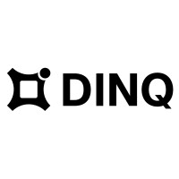</td>
        <td><a href="https://dinq.io/" target="_blank">DINQ</a></td>
        <td>AI人才发现与分析平台，精准识别AI精英</td>
        <td><a href="https://dinq.io/" target="_blank">🔗</a></td>
    </tr>
    <tr>
        <td>155</td>
        <td></td>
        <td><a href="https://ai-bot.cn/mercor" target="_blank">Mercor</a></td>
        <td>AI招聘求职平台</td>
        <td><a href="https://ai-bot.cn/mercor" target="_blank">🔗</a></td>
    </tr>
    <tr>
        <td>156</td>
        <td></td>
        <td><a href="https://ai-bot.cn/offerin-ai" target="_blank">Offerin</a></td>
        <td>AI面试笔试助手，精准识别面试问题秒级生成答案</td>
        <td><a href="https://ai-bot.cn/offerin-ai" target="_blank">🔗</a></td>
    </tr>
    <tr>
        <td>157</td>
        <td></td>
        <td><a href="https://ai-bot.cn/aiqtools" target="_blank">智面星</a></td>
        <td>AI面试辅助工具，提供全流程的面试辅助</td>
        <td><a href="https://ai-bot.cn/aiqtools" target="_blank">🔗</a></td>
    </tr>
    <tr>
        <td>158</td>
        <td></td>
        <td><a href="https://ai-bot.cn/offergoose" target="_blank">多面鹅</a></td>
        <td>免费大厂面试模拟器，线上面试答案提词器</td>
        <td><a href="https://ai-bot.cn/offergoose" target="_blank">🔗</a></td>
    </tr>
    <tr>
        <td>159</td>
        <td></td>
        <td><a href="https://www.gankinterview.cn/" target="_blank">Gank Interview</a></td>
        <td>专为笔试和面试设计的AI面试助手</td>
        <td><a href="https://www.gankinterview.cn/" target="_blank">🔗</a></td>
    </tr>
    <tr>
        <td>160</td>
        <td></td>
        <td><a href="https://ai-bot.cn/offermore" target="_blank">面试猫</a></td>
        <td>AI面试辅助工具，实时语音识别面试官问题</td>
        <td><a href="https://ai-bot.cn/offermore" target="_blank">🔗</a></td>
    </tr>
    <tr>
        <td>161</td>
        <td></td>
        <td><a href="https://ai-bot.cn/m-baigua" target="_blank">白瓜面试</a></td>
        <td>在线AI面试助手，快速生成面试问题的答案</td>
        <td><a href="https://ai-bot.cn/m-baigua" target="_blank">🔗</a></td>
    </tr>
    <tr>
        <td>162</td>
        <td></td>
        <td><a href="https://www.52cv.com/" target="_blank">职徒简历</a></td>
        <td>智能简历制作软件，基于GPT的简历优化和简历代写</td>
        <td><a href="https://www.52cv.com/" target="_blank">🔗</a></td>
    </tr>
    <tr>
        <td>163</td>
        <td></td>
        <td><a href="https://www.zdjianli.cn/" target="_blank">职得简历</a></td>
        <td>在线AI简历生成工具</td>
        <td><a href="https://www.zdjianli.cn/" target="_blank">🔗</a></td>
    </tr>
    <tr>
        <td>164</td>
        <td></td>
        <td><a href="https://www.lanzidian.com/" target="_blank">蓝字典AI求职</a></td>
        <td>AI求职工具，提供AI简历生成、AI模拟面试服务</td>
        <td><a href="https://www.lanzidian.com/" target="_blank">🔗</a></td>
    </tr>
    <tr>
        <td>165</td>
        <td></td>
        <td><a href="https://jianli.jiuyeqiao.cn/#/index/index" target="_blank">神笔简历</a></td>
        <td>AI简历云平台，专为求职者提供一站式求职服务</td>
        <td><a href="https://jianli.jiuyeqiao.cn/#/index/index" target="_blank">🔗</a></td>
    </tr>
    <tr>
        <td>166</td>
        <td></td>
        <td><a href="https://www.yoojober.com/" target="_blank">YOO简历</a></td>
        <td>必优科技推出的AI简历生成工具</td>
        <td><a href="https://www.yoojober.com/" target="_blank">🔗</a></td>
    </tr>
    <tr>
        <td>167</td>
        <td></td>
        <td><a href="https://itingnao.com/home&unit=3516" target="_blank">听脑AI</a></td>
        <td>AI语音录音记录助手</td>
        <td><a href="https://itingnao.com/home&unit=3516" target="_blank">🔗</a></td>
    </tr>
    <tr>
        <td>168</td>
        <td></td>
        <td><a href="https://pan.baidu.com/embed/listennote" target="_blank">简单听记</a></td>
        <td>百度网盘推出的AI语音转文字工具</td>
        <td><a href="https://pan.baidu.com/embed/listennote" target="_blank">🔗</a></td>
    </tr>
    <tr>
        <td>169</td>
        <td></td>
        <td><a href="https://tingwu.aliyun.com/" target="_blank">通义听悟</a></td>
        <td>阿里推出的AI会议转录工具，万语千言，心领神悟</td>
        <td><a href="https://tingwu.aliyun.com/" target="_blank">🔗</a></td>
    </tr>
    <tr>
        <td>170</td>
        <td></td>
        <td><a href="https://meeting.iflyrec.com/" target="_blank">讯飞会议</a></td>
        <td>AI智能会议系统，实时字幕、实时翻译、自动生成会议记录</td>
        <td><a href="https://meeting.iflyrec.com/" target="_blank">🔗</a></td>
    </tr>
    <tr>
        <td>171</td>
        <td></td>
        <td><a href="https://www.feishu.cn/product/minutes" target="_blank">飞书妙记</a></td>
        <td>飞书智能会议纪要和快捷语音识别转文字</td>
        <td><a href="https://www.feishu.cn/product/minutes" target="_blank">🔗</a></td>
    </tr>
    <tr>
        <td>172</td>
        <td></td>
        <td><a href="https://otter.ai/" target="_blank">Otter.ai</a></td>
        <td>AI会议内容生成和实时转录</td>
        <td><a href="https://otter.ai/" target="_blank">🔗</a></td>
    </tr>
    <tr>
        <td>173</td>
        <td></td>
        <td><a href="https://aihaoji.com/" target="_blank">Ai好记</a></td>
        <td>AI音视频转录与总结</td>
        <td><a href="https://aihaoji.com/" target="_blank">🔗</a></td>
    </tr>
    <tr>
        <td>174</td>
        <td></td>
        <td><a href="https://meeting.tencent.com/ai/" target="_blank">腾讯会议AI小助手</a></td>
        <td>腾讯会议推出的AI会议内容助理</td>
        <td><a href="https://meeting.tencent.com/ai/" target="_blank">🔗</a></td>
    </tr>
    <tr>
        <td>175</td>
        <td></td>
        <td><a href="https://www.zoom.com/zh-cn/products/collaboration-tools" target="_blank">Zoom Workplace</a></td>
        <td>Zoom推出的AI办公协作和交流沟通平台</td>
        <td><a href="https://www.zoom.com/zh-cn/products/collaboration-tools" target="_blank">🔗</a></td>
    </tr>
    <tr>
        <td>176</td>
        <td></td>
        <td><a href="https://work.duiopen.com/" target="_blank">麦耳会记</a></td>
        <td>思必驰推出的AI会议助手，语音转文字、字幕同传、AI摘要</td>
        <td><a href="https://work.duiopen.com/" target="_blank">🔗</a></td>
    </tr>
    <tr>
        <td>177</td>
        <td></td>
        <td><a href="https://fireflies.ai/" target="_blank">Fireflies.ai</a></td>
        <td>AI会议转录和会议纪要生成工具</td>
        <td><a href="https://fireflies.ai/" target="_blank">🔗</a></td>
    </tr>
    <tr>
        <td>178</td>
        <td></td>
        <td><a href="https://noty.ai/" target="_blank">Noty.ai</a></td>
        <td>AI会议助手，自动转录会议内容</td>
        <td><a href="https://noty.ai/" target="_blank">🔗</a></td>
    </tr>
    <tr>
        <td>179</td>
        <td></td>
        <td><a href="https://www.airgram.io/" target="_blank">Airgram</a></td>
        <td>自动会议笔记和总结的AI助手</td>
        <td><a href="https://www.airgram.io/" target="_blank">🔗</a></td>
    </tr>
    <tr>
        <td>180</td>
        <td></td>
        <td><a href="https://base.feishu.cn/?utm_from=dlz_aibot" target="_blank">飞书多维表格</a></td>
        <td>表格形态的 AI 工作流搭建工具</td>
        <td><a href="https://base.feishu.cn/?utm_from=dlz_aibot" target="_blank">🔗</a></td>
    </tr>
    <tr>
        <td>181</td>
        <td></td>
        <td><a href="https://ima-app.image.myqcloud.com/win_channel/ima.copilot_win_x64_10000450_2.3.1_3835.exe" target="_blank">ima.copilot</a></td>
        <td>腾讯推出的AI知识库工具</td>
        <td><a href="https://ima-app.image.myqcloud.com/win_channel/ima.copilot_win_x64_10000450_2.3.1_3835.exe" target="_blank">🔗</a></td>
    </tr>
    <tr>
        <td>182</td>
        <td></td>
        <td><a href="https://tinywow.com/" target="_blank">TinyWow</a></td>
        <td>免费在线AI工具箱</td>
        <td><a href="https://tinywow.com/" target="_blank">🔗</a></td>
    </tr>
    <tr>
        <td>183</td>
        <td></td>
        <td><a href="https://ai-bot.cn/ask-feishu" target="_blank">飞书知识问答</a></td>
        <td>飞书智能办公推出的AI知识库工具</td>
        <td><a href="https://ai-bot.cn/ask-feishu" target="_blank">🔗</a></td>
    </tr>
    <tr>
        <td>184</td>
        <td></td>
        <td><a href="https://ponder.ing/" target="_blank">Ponder AI</a></td>
        <td>AI知识管理和思维导图工具</td>
        <td><a href="https://ponder.ing/" target="_blank">🔗</a></td>
    </tr>
    <tr>
        <td>185</td>
        <td></td>
        <td><a href="https://www.wolai.com/" target="_blank">我来wolai</a></td>
        <td>AI云端协作平台与个人笔记工具</td>
        <td><a href="https://www.wolai.com/" target="_blank">🔗</a></td>
    </tr>
    <tr>
        <td>186</td>
        <td></td>
        <td><a href="https://www.typeless.com/" target="_blank">Typeless</a></td>
        <td>AI语音输入工具，智能上下文润色</td>
        <td><a href="https://www.typeless.com/" target="_blank">🔗</a></td>
    </tr>
    <tr>
        <td>187</td>
        <td></td>
        <td><a href="https://chattoc.aichris.cc/" target="_blank">ChatTOC</a></td>
        <td>将 AI 对话内容转成导航目录的浏览器插件</td>
        <td><a href="https://chattoc.aichris.cc/" target="_blank">🔗</a></td>
    </tr>
    <tr>
        <td>188</td>
        <td></td>
        <td><a href="https://www.loom.com/" target="_blank">Loom</a></td>
        <td>AI 屏幕录制与视频分享工具</td>
        <td><a href="https://www.loom.com/" target="_blank">🔗</a></td>
    </tr>
    <tr>
        <td>189</td>
        <td></td>
        <td><a href="https://app.kuse.ai/" target="_blank">Kuse</a></td>
        <td>“ChatGPT + 白板 + Notion”的结合体</td>
        <td><a href="https://app.kuse.ai/" target="_blank">🔗</a></td>
    </tr>
    <tr>
        <td>190</td>
        <td></td>
        <td><a href="https://histella.cn/" target="_blank">你好星识</a></td>
        <td>新一代AI智能文本工作空间</td>
        <td><a href="https://histella.cn/" target="_blank">🔗</a></td>
    </tr>
    <tr>
        <td>191</td>
        <td></td>
        <td><a href="https://briefly.video/" target="_blank">Briefly</a></td>
        <td>长视频精华提炼，自动追踪频道中文推送</td>
        <td><a href="https://briefly.video/" target="_blank">🔗</a></td>
    </tr>
    <tr>
        <td>192</td>
        <td></td>
        <td><a href="https://www.easyclaw.app/" target="_blank">EasyClaw</a></td>
        <td>开源的 OpenClaw 一键安装工具</td>
        <td><a href="https://www.easyclaw.app/" target="_blank">🔗</a></td>
    </tr>
    <tr>
        <td>193</td>
        <td></td>
        <td><a href="https://mtywatch.com?c=lksadjknxzc812ad/" target="_blank">猫头鹰AI网页订阅</a></td>
        <td>一句话搞定任意网页的内容监控</td>
        <td><a href="https://mtywatch.com?c=lksadjknxzc812ad/" target="_blank">🔗</a></td>
    </tr>
    <tr>
        <td>194</td>
        <td></td>
        <td><a href="https://miaoyan.cn/" target="_blank">秒言AI语音输入法</a></td>
        <td>AI语音输入工具，极速响应、精准识别</td>
        <td><a href="https://miaoyan.cn/" target="_blank">🔗</a></td>
    </tr>
    <tr>
        <td>195</td>
        <td></td>
        <td><a href="http://www.findme.net.cn/" target="_blank">找我呀</a></td>
        <td>本地AI知识助手，可完全离线运行的文件语义搜索和智能问答工具</td>
        <td><a href="http://www.findme.net.cn/" target="_blank">🔗</a></td>
    </tr>
    <tr>
        <td>196</td>
        <td></td>
        <td><a href="https://monica.cn/" target="_blank">Monica</a></td>
        <td>全能AI助手，提供聊天、搜索、写作、翻译等多功能服务</td>
        <td><a href="https://monica.cn/" target="_blank">🔗</a></td>
    </tr>
    <tr>
        <td>197</td>
        <td></td>
        <td><a href="https://lingxi.wps.cn/" target="_blank">WPS灵犀</a></td>
        <td>金山办公WPS推出的原生Office办公智能体</td>
        <td><a href="https://lingxi.wps.cn/" target="_blank">🔗</a></td>
    </tr>
    <tr>
        <td>198</td>
        <td></td>
        <td><a href="https://glif.app/" target="_blank">Glif</a></td>
        <td>无代码的AI小工具构建平台</td>
        <td><a href="https://glif.app/" target="_blank">🔗</a></td>
    </tr>
    <tr>
        <td>199</td>
        <td></td>
        <td><a href="https://qimi.com/" target="_blank">奇觅</a></td>
        <td>美图推出的游戏广告AI制作与投放平台</td>
        <td><a href="https://qimi.com/" target="_blank">🔗</a></td>
    </tr>
    <tr>
        <td>200</td>
        <td></td>
        <td><a href="https://pan.baidu.com/aipan/welcome" target="_blank">云一朵</a></td>
        <td>百度网盘最新推出的智能助理</td>
        <td><a href="https://pan.baidu.com/aipan/welcome" target="_blank">🔗</a></td>
    </tr>
    <tr>
        <td>201</td>
        <td></td>
        <td><a href="https://bangong.360.cn/" target="_blank">苏打办公</a></td>
        <td>360公司推出的一站式AI办公工具</td>
        <td><a href="https://bangong.360.cn/" target="_blank">🔗</a></td>
    </tr>
    <tr>
        <td>202</td>
        <td></td>
        <td><a href="https://tome.app/" target="_blank">Lightfield</a></td>
        <td>AI销售助手</td>
        <td><a href="https://tome.app/" target="_blank">🔗</a></td>
    </tr>
    <tr>
        <td>203</td>
        <td></td>
        <td><a href="https://hoarder.app/" target="_blank">Hoarder</a></td>
        <td>开源的基于AI的书签和个人知识库管理工具</td>
        <td><a href="https://hoarder.app/" target="_blank">🔗</a></td>
    </tr>
    <tr>
        <td>204</td>
        <td></td>
        <td><a href="https://tongyi.aliyun.com/xiaomi" target="_blank">通义晓蜜</a></td>
        <td>阿里推出的企业智能服务解决方案</td>
        <td><a href="https://tongyi.aliyun.com/xiaomi" target="_blank">🔗</a></td>
    </tr>
    <tr>
        <td>205</td>
        <td></td>
        <td><a href="https://aiask365.com/" target="_blank">奇妙问</a></td>
        <td>企业AI数字员工生成平台</td>
        <td><a href="https://aiask365.com/" target="_blank">🔗</a></td>
    </tr>
    <tr>
        <td>206</td>
        <td></td>
        <td><a href="https://www.yingdao.com/ai-power/" target="_blank">影刀AI Power</a></td>
        <td>面向企业的无代码AI开发和集成平台</td>
        <td><a href="https://www.yingdao.com/ai-power/" target="_blank">🔗</a></td>
    </tr>
    <tr>
        <td>207</td>
        <td></td>
        <td><a href="https://www.tongdaai.com/" target="_blank">通答AI</a></td>
        <td>企业AI数字员工生成平台</td>
        <td><a href="https://www.tongdaai.com/" target="_blank">🔗</a></td>
    </tr>
    <tr>
        <td>208</td>
        <td></td>
        <td><a href="https://smartchoose.cn/" target="_blank">司马诸葛</a></td>
        <td>企业级AI数字员工平台</td>
        <td><a href="https://smartchoose.cn/" target="_blank">🔗</a></td>
    </tr>
    <tr>
        <td>209</td>
        <td></td>
        <td><a href="https://www.kaopuai.com/" target="_blank">靠谱AI</a></td>
        <td>无代码AI机器人创建平台</td>
        <td><a href="https://www.kaopuai.com/" target="_blank">🔗</a></td>
    </tr>
</table>

## AI智能体

<table>
    <tr>
        <td>1</td>
        <td></td>
        <td><a href="https://www.trae.cn/" target="_blank">TRAE Work</a></td>
        <td>字节跳动推出的 AI 原生工作台</td>
        <td><a href="https://www.trae.cn/" target="_blank">🔗</a></td>
    </tr>
    <tr>
        <td>2</td>
        <td></td>
        <td><a href="https://aipyaipy.cgref.cn/aibot" target="_blank">爱派AiPy</a></td>
        <td>本地Manus、国内能用、内网能用，开源免费</td>
        <td><a href="https://aipyaipy.cgref.cn/aibot" target="_blank">🔗</a></td>
    </tr>
    <tr>
        <td>3</td>
        <td></td>
        <td><a href="https://xyq.jianying.com/" target="_blank">小云雀</a></td>
        <td>字节跳动旗下剪映推出的AI内容创作Agent</td>
        <td><a href="https://xyq.jianying.com/" target="_blank">🔗</a></td>
    </tr>
    <tr>
        <td>4</td>
        <td></td>
        <td><a href="https://seko.cgref.cn/" target="_blank">Seko</a></td>
        <td>首个创编一体的AI视频创作Agent</td>
        <td><a href="https://seko.cgref.cn/" target="_blank">🔗</a></td>
    </tr>
    <tr>
        <td>5</td>
        <td></td>
        <td><a href="https://atoms.cgref.cn/aibot" target="_blank">Atoms</a></td>
        <td>第一支自动构建真实业务的 AI 团队</td>
        <td><a href="https://atoms.cgref.cn/aibot" target="_blank">🔗</a></td>
    </tr>
    <tr>
        <td>6</td>
        <td></td>
        <td><a href="https://ai-bot.cn/sites/60995.html" target="_blank">码上飞</a></td>
        <td>一句话生成微信小程序、APP、H5网页</td>
        <td><a href="https://ai-bot.cn/sites/60995.html" target="_blank">🔗</a></td>
    </tr>
    <tr>
        <td>7</td>
        <td></td>
        <td><a href="https://d.design/agent" target="_blank">堆友Agent</a></td>
        <td>集成大厂专家设计 Skill 的AI设计智能体</td>
        <td><a href="https://d.design/agent" target="_blank">🔗</a></td>
    </tr>
    <tr>
        <td>8</td>
        <td></td>
        <td><a href="https://volcengine.cgref.cn/aibottt" target="_blank">ArkClaw</a></td>
        <td>火山引擎推出的云端托管版OpenClaw服务</td>
        <td><a href="https://volcengine.cgref.cn/aibottt" target="_blank">🔗</a></td>
    </tr>
    <tr>
        <td>9</td>
        <td></td>
        <td><a href="https://astron-claw.cgref.cn/aibot" target="_blank">AstronClaw</a></td>
        <td>科大讯飞推出的云端部署OpenClaw</td>
        <td><a href="https://astron-claw.cgref.cn/aibot" target="_blank">🔗</a></td>
    </tr>
    <tr>
        <td>10</td>
        <td></td>
        <td><a href="https://agent.xfyun.cn/home?ch=xcagent-aitool1" target="_blank">讯飞星辰Agent</a></td>
        <td>科大讯飞推出的AI智能体开发平台</td>
        <td><a href="https://agent.xfyun.cn/home?ch=xcagent-aitool1" target="_blank">🔗</a></td>
    </tr>
    <tr>
        <td>11</td>
        <td></td>
        <td><a href="https://flowith.io/" target="_blank">Flowith</a></td>
        <td>一站式用GPT-5.5、Claude-4.7</td>
        <td><a href="https://flowith.io/" target="_blank">🔗</a></td>
    </tr>
    <tr>
        <td>12</td>
        <td></td>
        <td><a href="https://www.codebuddy.cn/events/invite?inviteCode=hact0v56vm" target="_blank">WorkBuddy</a></td>
        <td>腾讯云推出的AI原生桌面智能体工作台</td>
        <td><a href="https://www.codebuddy.cn/events/invite?inviteCode=hact0v56vm" target="_blank">🔗</a></td>
    </tr>
    <tr>
        <td>13</td>
        <td></td>
        <td><a href="http://autoglm.zhipuai.cn/autoclaw/?utm=cg&cgv=ogewxw4kp2" target="_blank">AutoClaw</a></td>
        <td>智谱推出的国内首个一键安装本地版OpenClaw</td>
        <td><a href="http://autoglm.zhipuai.cn/autoclaw/?utm=cg&cgv=ogewxw4kp2" target="_blank">🔗</a></td>
    </tr>
    <tr>
        <td>14</td>
        <td></td>
        <td><a href="https://clawd.bot/" target="_blank">OpenClaw</a></td>
        <td>开源免费的个人 AI 助手</td>
        <td><a href="https://clawd.bot/" target="_blank">🔗</a></td>
    </tr>
    <tr>
        <td>15</td>
        <td></td>
        <td><a href="https://web.tabbit-ai.com/" target="_blank">Tabbit</a></td>
        <td>美团光年之外推出的AI原生浏览器</td>
        <td><a href="https://web.tabbit-ai.com/" target="_blank">🔗</a></td>
    </tr>
    <tr>
        <td>16</td>
        <td></td>
        <td><a href="https://www.coze.cn/" target="_blank">扣子</a></td>
        <td>免费全能的AI办公智能体</td>
        <td><a href="https://www.coze.cn/" target="_blank">🔗</a></td>
    </tr>
    <tr>
        <td>17</td>
        <td></td>
        <td><a href="https://www.meyo123.com/" target="_blank">觅游</a></td>
        <td>美团推出的 AI 原生 Agent 社区</td>
        <td><a href="https://www.meyo123.com/" target="_blank">🔗</a></td>
    </tr>
    <tr>
        <td>18</td>
        <td></td>
        <td><a href="https://www.xia345.com/" target="_blank">虾345</a></td>
        <td>面向AI Agent生态的综合型导航与信息聚合平台</td>
        <td><a href="https://www.xia345.com/" target="_blank">🔗</a></td>
    </tr>
    <tr>
        <td>19</td>
        <td></td>
        <td><a href="https://qoder.com.cn/qoderwork" target="_blank">QoderWork</a></td>
        <td>阿里Qoder团队推出的桌面端AI智能体</td>
        <td><a href="https://qoder.com.cn/qoderwork" target="_blank">🔗</a></td>
    </tr>
    <tr>
        <td>20</td>
        <td></td>
        <td><a href="https://lobsterai.youdao.com/#/index?keyfrom=aigjj" target="_blank">LobsterAI</a></td>
        <td>网易推出的全场景办公助手 Agent</td>
        <td><a href="https://lobsterai.youdao.com/#/index?keyfrom=aigjj" target="_blank">🔗</a></td>
    </tr>
    <tr>
        <td>21</td>
        <td></td>
        <td><a href="https://www.kevvee.com/" target="_blank">Kevvee</a></td>
        <td>全球首个 AI 出海内容 GTM 策略 Agent</td>
        <td><a href="https://www.kevvee.com/" target="_blank">🔗</a></td>
    </tr>
    <tr>
        <td>22</td>
        <td></td>
        <td><a href="https://matrix.build/" target="_blank">Matrix</a></td>
        <td>超长时间自动化运行的主动式多 Agent 协作平台</td>
        <td><a href="https://matrix.build/" target="_blank">🔗</a></td>
    </tr>
    <tr>
        <td>23</td>
        <td></td>
        <td><a href="https://manus.im/" target="_blank">Manus</a></td>
        <td>蝴蝶效应公司推出的首款自主通用AI Agent</td>
        <td><a href="https://manus.im/" target="_blank">🔗</a></td>
    </tr>
    <tr>
        <td>24</td>
        <td></td>
        <td><a href="https://marvis.qq.com/" target="_blank">腾讯Marvis</a></td>
        <td>腾讯应用宝团队推出的操作系统级 AI 助手</td>
        <td><a href="https://marvis.qq.com/" target="_blank">🔗</a></td>
    </tr>
    <tr>
        <td>25</td>
        <td></td>
        <td><a href="https://hermes-ai.net/" target="_blank">Hermes Agent</a></td>
        <td>Nous Research 开源的自主 AI Agent 框架</td>
        <td><a href="https://hermes-ai.net/" target="_blank">🔗</a></td>
    </tr>
    <tr>
        <td>26</td>
        <td></td>
        <td><a href="https://happycapy.ai/signup?invite_ref=QTcWrsch" target="_blank">happycapy</a></td>
        <td>Trickle 团队推出的云端 AI Agent 计算机</td>
        <td><a href="https://happycapy.ai/signup?invite_ref=QTcWrsch" target="_blank">🔗</a></td>
    </tr>
    <tr>
        <td>27</td>
        <td></td>
        <td><a href="https://www.genspark.ai/" target="_blank">Genspark</a></td>
        <td>通用AI智能体，您的一站式AI工作空间</td>
        <td><a href="https://www.genspark.ai/" target="_blank">🔗</a></td>
    </tr>
    <tr>
        <td>28</td>
        <td></td>
        <td><a href="https://www.oiioii.ai/" target="_blank">OiiOii</a></td>
        <td>全球首个专业动画创作Agent</td>
        <td><a href="https://www.oiioii.ai/" target="_blank">🔗</a></td>
    </tr>
    <tr>
        <td>29</td>
        <td></td>
        <td><a href="https://www.lovart.ai/" target="_blank">Lovart</a></td>
        <td>LiblibAI推出的全球首个设计智能体</td>
        <td><a href="https://www.lovart.ai/" target="_blank">🔗</a></td>
    </tr>
    <tr>
        <td>30</td>
        <td></td>
        <td><a href="https://www.dumate.cn/" target="_blank">DuMate</a></td>
        <td>百度推出的桌面端 AI 智能体</td>
        <td><a href="https://www.dumate.cn/" target="_blank">🔗</a></td>
    </tr>
    <tr>
        <td>31</td>
        <td></td>
        <td><a href="https://haisnap.ai/zh" target="_blank">响指HaiSnap</a></td>
        <td>面向工作与学习场景的通用 AI Agent 平台</td>
        <td><a href="https://haisnap.ai/zh" target="_blank">🔗</a></td>
    </tr>
    <tr>
        <td>32</td>
        <td></td>
        <td><a href="https://mojian.cn/" target="_blank">墨见</a></td>
        <td>墨刀推出的 AI 伴生协作平台</td>
        <td><a href="https://mojian.cn/" target="_blank">🔗</a></td>
    </tr>
    <tr>
        <td>33</td>
        <td></td>
        <td><a href="https://www.dingtalk.com/wukong" target="_blank">悟空</a></td>
        <td>阿里推出的全球首个企业级AI原生工作平台</td>
        <td><a href="https://www.dingtalk.com/wukong" target="_blank">🔗</a></td>
    </tr>
    <tr>
        <td>34</td>
        <td></td>
        <td><a href="https://hub.minimax.io/" target="_blank">MiniMax Hub</a></td>
        <td>MiniMax 推出的桌面端 AI 创意工作站</td>
        <td><a href="https://hub.minimax.io/" target="_blank">🔗</a></td>
    </tr>
    <tr>
        <td>35</td>
        <td></td>
        <td><a href="https://claw.guanjia.qq.com/" target="_blank">QClaw</a></td>
        <td>腾讯电脑管家团队基于 OpenClaw 打造的本地 AI 助手</td>
        <td><a href="https://claw.guanjia.qq.com/" target="_blank">🔗</a></td>
    </tr>
    <tr>
        <td>36</td>
        <td></td>
        <td><a href="https://loomy.xunfei.cn/" target="_blank">Loomy</a></td>
        <td>科大讯飞推出的桌面级 AI 个人助理</td>
        <td><a href="https://loomy.xunfei.cn/" target="_blank">🔗</a></td>
    </tr>
    <tr>
        <td>37</td>
        <td></td>
        <td><a href="https://www.todesk.com/" target="_blank">ToDesk AI</a></td>
        <td>桌面端 AI 智能助手，支持微信远程操控</td>
        <td><a href="https://www.todesk.com/" target="_blank">🔗</a></td>
    </tr>
    <tr>
        <td>38</td>
        <td></td>
        <td><a href="https://bloome.im/" target="_blank">Bloome</a></td>
        <td>YouWare团队推出的 Agentic IM 平台</td>
        <td><a href="https://bloome.im/" target="_blank">🔗</a></td>
    </tr>
    <tr>
        <td>39</td>
        <td></td>
        <td><a href="https://moxt.ai/" target="_blank">Moxt</a></td>
        <td>AI 原生工作空间</td>
        <td><a href="https://moxt.ai/" target="_blank">🔗</a></td>
    </tr>
    <tr>
        <td>40</td>
        <td></td>
        <td><a href="https://agent.minimaxi.com/" target="_blank">Mavis</a></td>
        <td>MiniMax Agent 推出的多 Agent 协作模式</td>
        <td><a href="https://agent.minimaxi.com/" target="_blank">🔗</a></td>
    </tr>
    <tr>
        <td>41</td>
        <td></td>
        <td><a href="https://agent-polis.com/" target="_blank">AgentPolis</a></td>
        <td>专为AI Agent打造的交易、社交、协作平台</td>
        <td><a href="https://agent-polis.com/" target="_blank">🔗</a></td>
    </tr>
    <tr>
        <td>42</td>
        <td></td>
        <td><a href="https://agent.minimaxi.com/max-hermes" target="_blank">MaxHermes</a></td>
        <td>MiniMax推出的全球首个云端沙箱Hermes</td>
        <td><a href="https://agent.minimaxi.com/max-hermes" target="_blank">🔗</a></td>
    </tr>
    <tr>
        <td>43</td>
        <td></td>
        <td><a href="https://loopit.com.cn/" target="_blank">Loopit</a></td>
        <td>AI互动内容社区，被称为"可以玩的抖音"</td>
        <td><a href="https://loopit.com.cn/" target="_blank">🔗</a></td>
    </tr>
    <tr>
        <td>44</td>
        <td></td>
        <td><a href="https://turix.ai/" target="_blank">TuriX</a></td>
        <td>融合CUA（Computer Use Agent）的工业级通用 Agent 智能助手</td>
        <td><a href="https://turix.ai/" target="_blank">🔗</a></td>
    </tr>
    <tr>
        <td>45</td>
        <td></td>
        <td><a href="https://www.singclaw.ai/" target="_blank">SingClaw</a></td>
        <td>一款会记忆的 AI 数据桌面助手</td>
        <td><a href="https://www.singclaw.ai/" target="_blank">🔗</a></td>
    </tr>
    <tr>
        <td>46</td>
        <td></td>
        <td><a href="https://www.accio.com/work" target="_blank">Accio Work</a></td>
        <td>阿里推出的跨境电商自动化 AI Agent</td>
        <td><a href="https://www.accio.com/work" target="_blank">🔗</a></td>
    </tr>
    <tr>
        <td>47</td>
        <td></td>
        <td><a href="https://panofy.ai/" target="_blank">Panofy</a></td>
        <td>全球首个可训练 AI 智能体平台</td>
        <td><a href="https://panofy.ai/" target="_blank">🔗</a></td>
    </tr>
    <tr>
        <td>48</td>
        <td></td>
        <td><a href="https://nexu.io/" target="_blank">nexu</a></td>
        <td>免费开源的 OpenClaw 桌面客户端</td>
        <td><a href="https://nexu.io/" target="_blank">🔗</a></td>
    </tr>
    <tr>
        <td>49</td>
        <td></td>
        <td><a href="https://www.724claw.cn/" target="_blank">724Claw永动虾</a></td>
        <td>开箱即用的桌面端 AI 助手，基于 OpenClaw</td>
        <td><a href="https://www.724claw.cn/" target="_blank">🔗</a></td>
    </tr>
    <tr>
        <td>50</td>
        <td></td>
        <td><a href="https://evomap.ai/" target="_blank">EvoMap</a></td>
        <td>全球首个面向 AI 智能体的进化协作平台</td>
        <td><a href="https://evomap.ai/" target="_blank">🔗</a></td>
    </tr>
    <tr>
        <td>51</td>
        <td></td>
        <td><a href="https://agent.minimaxi.com/" target="_blank">MiniMax Agent</a></td>
        <td>MiniMax推出的通用型AI智能体</td>
        <td><a href="https://agent.minimaxi.com/" target="_blank">🔗</a></td>
    </tr>
    <tr>
        <td>52</td>
        <td></td>
        <td><a href="https://colaos.ai/" target="_blank">ColaOS</a></td>
        <td>首个有灵魂的 AI Agent 操作系统</td>
        <td><a href="https://colaos.ai/" target="_blank">🔗</a></td>
    </tr>
    <tr>
        <td>53</td>
        <td></td>
        <td><a href="https://ai-bot.cn/operator" target="_blank">Operator</a></td>
        <td>OpenAI推出的AI智能体，能推理、联网自主执行任务</td>
        <td><a href="https://ai-bot.cn/operator" target="_blank">🔗</a></td>
    </tr>
    <tr>
        <td>54</td>
        <td></td>
        <td><a href="https://wenku.baidu.com/ndcore/browse/aiunion?tabType=genflow" target="_blank">GenFlow</a></td>
        <td>全球首个全模态、全端通用AI智能体</td>
        <td><a href="https://wenku.baidu.com/ndcore/browse/aiunion?tabType=genflow" target="_blank">🔗</a></td>
    </tr>
    <tr>
        <td>55</td>
        <td></td>
        <td><a href="https://ai-bot.cn/skywork" target="_blank">Skywork</a></td>
        <td>昆仑万维面向全球推出的天工超级智能体</td>
        <td><a href="https://ai-bot.cn/skywork" target="_blank">🔗</a></td>
    </tr>
    <tr>
        <td>56</td>
        <td></td>
        <td><a href="https://instreet.coze.site/" target="_blank">InStreet</a></td>
        <td>字节扣子推出的 AI Agent 专属中文社交网络</td>
        <td><a href="https://instreet.coze.site/" target="_blank">🔗</a></td>
    </tr>
    <tr>
        <td>57</td>
        <td></td>
        <td><a href="https://operator.gc.com.cn/" target="_blank">RedClaw</a></td>
        <td>百度推出的全球首款手机端 OpenClaw 应用</td>
        <td><a href="https://operator.gc.com.cn/" target="_blank">🔗</a></td>
    </tr>
    <tr>
        <td>58</td>
        <td></td>
        <td><a href="https://01agent.cgref.cn/aibot" target="_blank">01Agent</a></td>
        <td>AI图文创作智能体，支持生成、排版、编辑、发布</td>
        <td><a href="https://01agent.cgref.cn/aibot" target="_blank">🔗</a></td>
    </tr>
    <tr>
        <td>59</td>
        <td></td>
        <td><a href="http://winclaw.winicssec.com/" target="_blank">WinClaw</a></td>
        <td>威努特推出的桌面AI智能体平台</td>
        <td><a href="http://winclaw.winicssec.com/" target="_blank">🔗</a></td>
    </tr>
    <tr>
        <td>60</td>
        <td></td>
        <td><a href="https://skillhub.tencent.com/" target="_blank">SkillHub</a></td>
        <td>腾讯云专为中国用户推出的 Skill 极速安装工具</td>
        <td><a href="https://skillhub.tencent.com/" target="_blank">🔗</a></td>
    </tr>
    <tr>
        <td>61</td>
        <td></td>
        <td><a href="https://qiewenpaper.com/zh" target="_blank">切问学术</a></td>
        <td>FudanNLP团队推出的AI学术智能体</td>
        <td><a href="https://qiewenpaper.com/zh" target="_blank">🔗</a></td>
    </tr>
    <tr>
        <td>62</td>
        <td></td>
        <td><a href="https://www.leewow.com/" target="_blank">Leewow</a></td>
        <td>首个造物 AI Agent，图片或文本生成实物商品</td>
        <td><a href="https://www.leewow.com/" target="_blank">🔗</a></td>
    </tr>
    <tr>
        <td>63</td>
        <td></td>
        <td><a href="https://mixboard.google.com/" target="_blank">Mixboard</a></td>
        <td>Google Labs 推出的 AI 无限画布工具</td>
        <td><a href="https://mixboard.google.com/" target="_blank">🔗</a></td>
    </tr>
    <tr>
        <td>64</td>
        <td></td>
        <td><a href="https://memu.bot/" target="_blank">memU Bot</a></td>
        <td>7*24小时全天候运行的AI个人助手</td>
        <td><a href="https://memu.bot/" target="_blank">🔗</a></td>
    </tr>
    <tr>
        <td>65</td>
        <td></td>
        <td><a href="https://yuanqiai.net/" target="_blank">元气AI Bot</a></td>
        <td>猎豹推出的电脑全能AI伙伴，国产OpenClaw</td>
        <td><a href="https://yuanqiai.net/" target="_blank">🔗</a></td>
    </tr>
    <tr>
        <td>66</td>
        <td></td>
        <td><a href="https://workany.ai/" target="_blank">WorkAny</a></td>
        <td>本地运行的开源AI桌面智能体</td>
        <td><a href="https://workany.ai/" target="_blank">🔗</a></td>
    </tr>
    <tr>
        <td>67</td>
        <td></td>
        <td><a href="https://agnes-ai.com/" target="_blank">Agnes AI</a></td>
        <td>专为办公场景设计的团队协作型AI Agent</td>
        <td><a href="https://agnes-ai.com/" target="_blank">🔗</a></td>
    </tr>
    <tr>
        <td>68</td>
        <td></td>
        <td><a href="https://seelesai.go.link/kw8uW" target="_blank">Seele AI</a></td>
        <td>全球首个端到端AI 3D游戏生成工具</td>
        <td><a href="https://seelesai.go.link/kw8uW" target="_blank">🔗</a></td>
    </tr>
    <tr>
        <td>69</td>
        <td></td>
        <td><a href="https://www.anygen.io/home?invitation_code=HQUCT0VDOZLXK17" target="_blank">AnyGen</a></td>
        <td>字节跳动推出的AI办公智能体</td>
        <td><a href="https://www.anygen.io/home?invitation_code=HQUCT0VDOZLXK17" target="_blank">🔗</a></td>
    </tr>
    <tr>
        <td>70</td>
        <td></td>
        <td><a href="https://www.tbox.cn/" target="_blank">Tbox</a></td>
        <td>蚂蚁集团旗下多智能体协同的通用 AI Agent</td>
        <td><a href="https://www.tbox.cn/" target="_blank">🔗</a></td>
    </tr>
    <tr>
        <td>71</td>
        <td></td>
        <td><a href="https://www.gaoding.art/" target="_blank">稿定AI社区</a></td>
        <td>稿定推出的设计Agent和AI创意社区</td>
        <td><a href="https://www.gaoding.art/" target="_blank">🔗</a></td>
    </tr>
    <tr>
        <td>72</td>
        <td></td>
        <td><a href="https://www.jiaotuai.cn/" target="_blank">椒图AI</a></td>
        <td>深度适配中文场景的AI修图智能体</td>
        <td><a href="https://www.jiaotuai.cn/" target="_blank">🔗</a></td>
    </tr>
    <tr>
        <td>73</td>
        <td></td>
        <td><a href="https://www.alphashop.cn/" target="_blank">遨虾</a></td>
        <td>1688推出的跨境电商生意Agent</td>
        <td><a href="https://www.alphashop.cn/" target="_blank">🔗</a></td>
    </tr>
    <tr>
        <td>74</td>
        <td></td>
        <td><a href="https://yh.bdbdigital.com/platform" target="_blank">亿话</a></td>
        <td>数字人对话智能体创作平台</td>
        <td><a href="https://yh.bdbdigital.com/platform" target="_blank">🔗</a></td>
    </tr>
    <tr>
        <td>75</td>
        <td></td>
        <td><a href="https://agent.bitaihub.com/" target="_blank">Tago</a></td>
        <td>专注电商领域的全能AI运营智能体</td>
        <td><a href="https://agent.bitaihub.com/" target="_blank">🔗</a></td>
    </tr>
    <tr>
        <td>76</td>
        <td></td>
        <td><a href="https://flowmuse.ai/" target="_blank">FlowMuse AI</a></td>
        <td>专注于 AI 图像视频的无限画布</td>
        <td><a href="https://flowmuse.ai/" target="_blank">🔗</a></td>
    </tr>
    <tr>
        <td>77</td>
        <td></td>
        <td><a href="https://story.neodomain.cn/" target="_blank">NeoDomain</a></td>
        <td>AI创意内容生成智能体</td>
        <td><a href="https://story.neodomain.cn/" target="_blank">🔗</a></td>
    </tr>
    <tr>
        <td>78</td>
        <td></td>
        <td><a href="https://ai-bot.cn/mulerun" target="_blank">MuleRun</a></td>
        <td>全球首个 AI Agent 市场，类似eBay</td>
        <td><a href="https://ai-bot.cn/mulerun" target="_blank">🔗</a></td>
    </tr>
    <tr>
        <td>79</td>
        <td></td>
        <td><a href="https://www.operaneon.com/" target="_blank">Opera Neon</a></td>
        <td>Opera推出的全新AI Agent浏览器</td>
        <td><a href="https://www.operaneon.com/" target="_blank">🔗</a></td>
    </tr>
    <tr>
        <td>80</td>
        <td></td>
        <td><a href="https://ai-bot.cn/fellou" target="_blank">Fellou</a></td>
        <td>Fellou AI 推出的首个Agentic浏览器</td>
        <td><a href="https://ai-bot.cn/fellou" target="_blank">🔗</a></td>
    </tr>
    <tr>
        <td>81</td>
        <td></td>
        <td><a href="https://ai-bot.cn/dia" target="_blank">Dia</a></td>
        <td>Arc 团队推出的 AI 原生浏览器</td>
        <td><a href="https://ai-bot.cn/dia" target="_blank">🔗</a></td>
    </tr>
    <tr>
        <td>82</td>
        <td></td>
        <td><a href="https://tabtabai.com/" target="_blank">TabTab</a></td>
        <td>首个全链路 Data Agent</td>
        <td><a href="https://tabtabai.com/" target="_blank">🔗</a></td>
    </tr>
    <tr>
        <td>83</td>
        <td></td>
        <td><a href="https://kuxuanai.com/" target="_blank">酷宣AI</a></td>
        <td>超级智能体，一站式AI内容创作</td>
        <td><a href="https://kuxuanai.com/" target="_blank">🔗</a></td>
    </tr>
    <tr>
        <td>84</td>
        <td></td>
        <td><a href="https://www.moonstatistics.com/home?share_code=7c6f04" target="_blank">月亮树AI选品</a></td>
        <td>亚马逊AI选品智能体，亿级实时商品大数据</td>
        <td><a href="https://www.moonstatistics.com/home?share_code=7c6f04" target="_blank">🔗</a></td>
    </tr>
    <tr>
        <td>85</td>
        <td></td>
        <td><a href="https://www.ruciapp.com/" target="_blank">如此AI员工</a></td>
        <td>国内首个全链路营销获客AI Agent</td>
        <td><a href="https://www.ruciapp.com/" target="_blank">🔗</a></td>
    </tr>
    <tr>
        <td>86</td>
        <td></td>
        <td><a href="https://ai-bot.cn/masteragent" target="_blank">MasterAgent</a></td>
        <td>全球首个L4级多智能体生成与协作平台</td>
        <td><a href="https://ai-bot.cn/masteragent" target="_blank">🔗</a></td>
    </tr>
    <tr>
        <td>87</td>
        <td></td>
        <td><a href="https://teamoteam.com/" target="_blank">Teamo</a></td>
        <td>夕小瑶团队推出的多Agent协作AI智能体</td>
        <td><a href="https://teamoteam.com/" target="_blank">🔗</a></td>
    </tr>
    <tr>
        <td>88</td>
        <td></td>
        <td><a href="https://scimaster.bohrium.com/" target="_blank">SciMaster</a></td>
        <td>上交大联合深势科技推出的通用科研Agent</td>
        <td><a href="https://scimaster.bohrium.com/" target="_blank">🔗</a></td>
    </tr>
    <tr>
        <td>89</td>
        <td></td>
        <td><a href="https://zeabur.com/" target="_blank">Zeabur</a></td>
        <td>专为氛围编程设计的云部署AI 智能体</td>
        <td><a href="https://zeabur.com/" target="_blank">🔗</a></td>
    </tr>
    <tr>
        <td>90</td>
        <td></td>
        <td><a href="https://myshell.ai/" target="_blank">MyShell</a></td>
        <td>构建、共享和拥有AI Agents的开发平台</td>
        <td><a href="https://myshell.ai/" target="_blank">🔗</a></td>
    </tr>
    <tr>
        <td>91</td>
        <td></td>
        <td><a href="http://fingenius.cn/" target="_blank">FinGenius</a></td>
        <td>全球首个A股AI金融博弈智能体应用</td>
        <td><a href="http://fingenius.cn/" target="_blank">🔗</a></td>
    </tr>
    <tr>
        <td>92</td>
        <td></td>
        <td><a href="https://ai-bot.cn/roboneo" target="_blank">RoboNeo</a></td>
        <td>美图推出的专注影像与设计的AI智能体</td>
        <td><a href="https://ai-bot.cn/roboneo" target="_blank">🔗</a></td>
    </tr>
    <tr>
        <td>93</td>
        <td></td>
        <td><a href="https://x.hundun.cn/" target="_blank">混沌Deep Innovation</a></td>
        <td>混沌学园推出的战略咨询AI智能体</td>
        <td><a href="https://x.hundun.cn/" target="_blank">🔗</a></td>
    </tr>
    <tr>
        <td>94</td>
        <td></td>
        <td><a href="https://www.browseros.com/" target="_blank">BrowserOS</a></td>
        <td>免费开源的 AI Agent 浏览器</td>
        <td><a href="https://www.browseros.com/" target="_blank">🔗</a></td>
    </tr>
    <tr>
        <td>95</td>
        <td></td>
        <td><a href="https://crepal.ai/" target="_blank">CrePal</a></td>
        <td>AI 视频创作智能体</td>
        <td><a href="https://crepal.ai/" target="_blank">🔗</a></td>
    </tr>
    <tr>
        <td>96</td>
        <td></td>
        <td><a href="https://ai-bot.cn/jaaz" target="_blank">Jaaz</a></td>
        <td>开源的AI设计Agent，本地免费Lovart平替项目</td>
        <td><a href="https://ai-bot.cn/jaaz" target="_blank">🔗</a></td>
    </tr>
    <tr>
        <td>97</td>
        <td></td>
        <td><a href="https://ai-bot.cn/aiworker-coco" target="_blank">CoCo</a></td>
        <td>智谱推出的首个企业级超级助手Agent</td>
        <td><a href="https://ai-bot.cn/aiworker-coco" target="_blank">🔗</a></td>
    </tr>
    <tr>
        <td>98</td>
        <td></td>
        <td><a href="https://bloom.powerdrill.ai/" target="_blank">Bloom</a></td>
        <td>Powerdrill推出的首款AI决策智能体</td>
        <td><a href="https://bloom.powerdrill.ai/" target="_blank">🔗</a></td>
    </tr>
    <tr>
        <td>99</td>
        <td></td>
        <td><a href="https://ai-bot.cn/bobby" target="_blank">Bobby</a></td>
        <td>RockFlow 推出的金融投资AI Agent</td>
        <td><a href="https://ai-bot.cn/bobby" target="_blank">🔗</a></td>
    </tr>
    <tr>
        <td>100</td>
        <td></td>
        <td><a href="https://ai-bot.cn/suna" target="_blank">Suna</a></td>
        <td>全球首款通用型 AI Agent 开源项目</td>
        <td><a href="https://ai-bot.cn/suna" target="_blank">🔗</a></td>
    </tr>
</table>

## AI聊天助手

<table>
    <tr>
        <td>1</td>
        <td></td>
        <td><a href="https://www.doubao.com/chat/" target="_blank">豆包</a></td>
        <td>智能对话助手，办公创作全能！</td>
        <td><a href="https://www.doubao.com/chat/" target="_blank">🔗</a></td>
    </tr>
    <tr>
        <td>2</td>
        <td></td>
        <td><a href="https://dis.chatdesks.cn/chatdesk/tyaibot.html" target="_blank">千问</a></td>
        <td>全能AI助手，基于Qwen模型</td>
        <td><a href="https://dis.chatdesks.cn/chatdesk/tyaibot.html" target="_blank">🔗</a></td>
    </tr>
    <tr>
        <td>3</td>
        <td></td>
        <td><a href="https://xinghuo.xfyun.cn/desk/?ch=xfxh-aigjtf01" target="_blank">讯飞星火</a></td>
        <td>AI智能助手，PPT生成、深度研究</td>
        <td><a href="https://xinghuo.xfyun.cn/desk/?ch=xfxh-aigjtf01" target="_blank">🔗</a></td>
    </tr>
    <tr>
        <td>4</td>
        <td></td>
        <td><a href="https://chatgpt.com/" target="_blank">ChatGPT</a></td>
        <td>OpenAI 推出的AI聊天机器人</td>
        <td><a href="https://chatgpt.com/" target="_blank">🔗</a></td>
    </tr>
    <tr>
        <td>5</td>
        <td></td>
        <td><a href="https://claude.ai/" target="_blank">Claude</a></td>
        <td>Anthropic公司推出的对话式AI智能助手</td>
        <td><a href="https://claude.ai/" target="_blank">🔗</a></td>
    </tr>
    <tr>
        <td>6</td>
        <td>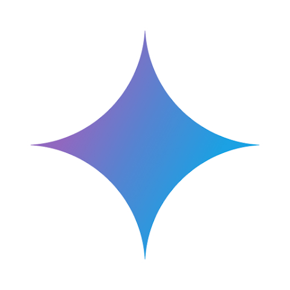</td>
        <td><a href="https://deepmind.google/technologies/gemini" target="_blank">Gemini</a></td>
        <td>Google推出的AI聊天对话机器人Gemini</td>
        <td><a href="https://deepmind.google/technologies/gemini" target="_blank">🔗</a></td>
    </tr>
    <tr>
        <td>7</td>
        <td></td>
        <td><a href="https://deepseek.com/" target="_blank">DeepSeek</a></td>
        <td>幻方量化推出的AI智能助手和开源大模型</td>
        <td><a href="https://deepseek.com/" target="_blank">🔗</a></td>
    </tr>
    <tr>
        <td>8</td>
        <td></td>
        <td><a href="https://www.kimi.com/" target="_blank">Kimi智能助手</a></td>
        <td>月之暗面推出的AI智能助手</td>
        <td><a href="https://www.kimi.com/" target="_blank">🔗</a></td>
    </tr>
    <tr>
        <td>9</td>
        <td></td>
        <td><a href="https://z.ai/" target="_blank">Z.ai</a></td>
        <td>智谱面向全球推出的AI模型体验平台</td>
        <td><a href="https://z.ai/" target="_blank">🔗</a></td>
    </tr>
    <tr>
        <td>10</td>
        <td></td>
        <td><a href="https://yuanbao.paluai.com/aibot" target="_blank">腾讯元宝</a></td>
        <td>腾讯推出的免费AI智能助手</td>
        <td><a href="https://yuanbao.paluai.com/aibot" target="_blank">🔗</a></td>
    </tr>
    <tr>
        <td>11</td>
        <td></td>
        <td><a href="https://grok.com/" target="_blank">Grok</a></td>
        <td>马斯克旗下xAI推出的人工智能助手</td>
        <td><a href="https://grok.com/" target="_blank">🔗</a></td>
    </tr>
    <tr>
        <td>12</td>
        <td></td>
        <td><a href="https://ai-bot.cn/qwen-chat" target="_blank">Qwen Chat</a></td>
        <td>阿里通义推出的 Qwen 最新模型体验平台</td>
        <td><a href="https://ai-bot.cn/qwen-chat" target="_blank">🔗</a></td>
    </tr>
    <tr>
        <td>13</td>
        <td>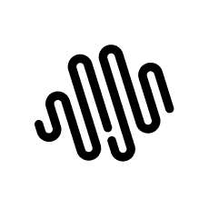</td>
        <td><a href="https://chat.minimaxi.com/" target="_blank">MiniMax</a></td>
        <td>MiniMax推出的AI智能问答助手</td>
        <td><a href="https://chat.minimaxi.com/" target="_blank">🔗</a></td>
    </tr>
    <tr>
        <td>14</td>
        <td></td>
        <td><a href="https://longcat.chat/" target="_blank">LongCat</a></td>
        <td>美团推出的自研大模型AI对话平台</td>
        <td><a href="https://longcat.chat/" target="_blank">🔗</a></td>
    </tr>
    <tr>
        <td>15</td>
        <td></td>
        <td><a href="https://yiyan.baidu.com/" target="_blank">文心一言</a></td>
        <td>百度推出的基于文心大模型的AI智能助手</td>
        <td><a href="https://yiyan.baidu.com/" target="_blank">🔗</a></td>
    </tr>
    <tr>
        <td>16</td>
        <td></td>
        <td><a href="https://chatglm.cn/" target="_blank">智谱清言</a></td>
        <td>智谱推出的全能AI助手</td>
        <td><a href="https://chatglm.cn/" target="_blank">🔗</a></td>
    </tr>
    <tr>
        <td>17</td>
        <td></td>
        <td><a href="https://doudou.paluai.com/web_aitool" target="_blank">逗逗AI</a></td>
        <td>AI游戏陪玩，支持原神、黑神话、LOL！</td>
        <td><a href="https://doudou.paluai.com/web_aitool" target="_blank">🔗</a></td>
    </tr>
    <tr>
        <td>18</td>
        <td></td>
        <td><a href="https://www.zida.school/" target="_blank">知达AI</a></td>
        <td>专为教育全场景打造的AI智能助教</td>
        <td><a href="https://www.zida.school/" target="_blank">🔗</a></td>
    </tr>
    <tr>
        <td>19</td>
        <td></td>
        <td><a href="https://ai-bot.cn/huawei-xiaoyi" target="_blank">华为小艺</a></td>
        <td>华为旗下小艺AI助手网页端，已接入DeepSeek-R1</td>
        <td><a href="https://ai-bot.cn/huawei-xiaoyi" target="_blank">🔗</a></td>
    </tr>
    <tr>
        <td>20</td>
        <td></td>
        <td><a href="https://www.lorka.ai/" target="_blank">Lorka AI</a></td>
        <td>多模型 AI 聚合对话平台</td>
        <td><a href="https://www.lorka.ai/" target="_blank">🔗</a></td>
    </tr>
    <tr>
        <td>21</td>
        <td></td>
        <td><a href="https://www.wenxiaobai.com/" target="_blank">问小白</a></td>
        <td>AI智能助手，支持DeepSeek满血版</td>
        <td><a href="https://www.wenxiaobai.com/" target="_blank">🔗</a></td>
    </tr>
    <tr>
        <td>22</td>
        <td></td>
        <td><a href="https://ling.tbox.cn/chat" target="_blank">百灵大模型</a></td>
        <td>蚂蚁集团推出的 Ling-1T 大模型对话体验平台</td>
        <td><a href="https://ling.tbox.cn/chat" target="_blank">🔗</a></td>
    </tr>
    <tr>
        <td>23</td>
        <td></td>
        <td><a href="https://ai-bot.cn/sites/53308.html" target="_blank">书生大模型</a></td>
        <td>上海人工智能实验室推出的系列AI模型</td>
        <td><a href="https://ai-bot.cn/sites/53308.html" target="_blank">🔗</a></td>
    </tr>
    <tr>
        <td>24</td>
        <td></td>
        <td><a href="https://www.stepfun.com/chats/new" target="_blank">阶跃AI</a></td>
        <td>阶跃星辰推出的支持多模态的AI聊天机器人</td>
        <td><a href="https://www.stepfun.com/chats/new" target="_blank">🔗</a></td>
    </tr>
    <tr>
        <td>25</td>
        <td></td>
        <td><a href="https://ying.baichuan-ai.com/chat" target="_blank">百小应</a></td>
        <td>百川智能推出的免费AI助手</td>
        <td><a href="https://ying.baichuan-ai.com/chat" target="_blank">🔗</a></td>
    </tr>
    <tr>
        <td>26</td>
        <td></td>
        <td><a href="https://www.tiangong.cn/" target="_blank">天工AI</a></td>
        <td>昆仑万维推出的AI智能助手</td>
        <td><a href="https://www.tiangong.cn/" target="_blank">🔗</a></td>
    </tr>
    <tr>
        <td>27</td>
        <td></td>
        <td><a href="https://chat.sensetime.com/wb/home" target="_blank">商量SenseChat</a></td>
        <td>商汤科技推出的免费AI聊天助手</td>
        <td><a href="https://chat.sensetime.com/wb/home" target="_blank">🔗</a></td>
    </tr>
    <tr>
        <td>28</td>
        <td></td>
        <td><a href="https://www.me.bot/" target="_blank">Me.bot</a></td>
        <td>心识宇宙推出的个性化AI伴侣产品</td>
        <td><a href="https://www.me.bot/" target="_blank">🔗</a></td>
    </tr>
    <tr>
        <td>29</td>
        <td></td>
        <td><a href="https://www.sayloai.com/" target="_blank">Saylo</a></td>
        <td>AI驱动的故事角色扮演游戏应用，沉浸式的剧本互动体验</td>
        <td><a href="https://www.sayloai.com/" target="_blank">🔗</a></td>
    </tr>
    <tr>
        <td>30</td>
        <td></td>
        <td><a href="https://poe.com/" target="_blank">Poe</a></td>
        <td>问答社区Quora推出的问答机器人工具</td>
        <td><a href="https://poe.com/" target="_blank">🔗</a></td>
    </tr>
    <tr>
        <td>31</td>
        <td></td>
        <td><a href="https://copilot.microsoft.com/" target="_blank">Copilot</a></td>
        <td>微软推出的网页版Copilot助手</td>
        <td><a href="https://copilot.microsoft.com/" target="_blank">🔗</a></td>
    </tr>
    <tr>
        <td>32</td>
        <td></td>
        <td><a href="https://www.meta.ai/" target="_blank">Meta AI助手</a></td>
        <td>Meta推出的免费AI聊天助手</td>
        <td><a href="https://www.meta.ai/" target="_blank">🔗</a></td>
    </tr>
    <tr>
        <td>33</td>
        <td></td>
        <td><a href="https://www.seeles.ai/" target="_blank">Koko AI</a></td>
        <td>Seele公司推出的「AI+3D」情感陪伴产品</td>
        <td><a href="https://www.seeles.ai/" target="_blank">🔗</a></td>
    </tr>
    <tr>
        <td>34</td>
        <td></td>
        <td><a href="https://tongyi.aliyun.com/xingchen/" target="_blank">通义星尘</a></td>
        <td>用AI定制属于你自己的IP角色</td>
        <td><a href="https://tongyi.aliyun.com/xingchen/" target="_blank">🔗</a></td>
    </tr>
    <tr>
        <td>35</td>
        <td></td>
        <td><a href="https://cueme.cn/" target="_blank">CueMe</a></td>
        <td>夸克推出的AI智能对话助手，支持2万字长文写作</td>
        <td><a href="https://cueme.cn/" target="_blank">🔗</a></td>
    </tr>
    <tr>
        <td>36</td>
        <td></td>
        <td><a href="https://ciyuan.ideaflow.pro/" target="_blank">造梦次元</a></td>
        <td>AI互动内容平台，虚拟角色逗你开心</td>
        <td><a href="https://ciyuan.ideaflow.pro/" target="_blank">🔗</a></td>
    </tr>
    <tr>
        <td>37</td>
        <td></td>
        <td><a href="https://www.museland.ai/" target="_blank">Museland</a></td>
        <td>沉浸式AI角色扮演产品</td>
        <td><a href="https://www.museland.ai/" target="_blank">🔗</a></td>
    </tr>
    <tr>
        <td>38</td>
        <td></td>
        <td><a href="https://chat.baidu.com/" target="_blank">百度AI助手</a></td>
        <td>百度推出的多场景AI智能体助手</td>
        <td><a href="https://chat.baidu.com/" target="_blank">🔗</a></td>
    </tr>
    <tr>
        <td>39</td>
        <td></td>
        <td><a href="https://wukong.com/tool" target="_blank">小悟空</a></td>
        <td>字节跳动推出的免费AI对话助手和个人助理</td>
        <td><a href="https://wukong.com/tool" target="_blank">🔗</a></td>
    </tr>
    <tr>
        <td>40</td>
        <td></td>
        <td><a href="https://taichu-web.ia.ac.cn/#/welcome" target="_blank">紫东太初</a></td>
        <td>中科院与武智院推出的千亿参数全模态大模型和助手</td>
        <td><a href="https://taichu-web.ia.ac.cn/#/welcome" target="_blank">🔗</a></td>
    </tr>
    <tr>
        <td>41</td>
        <td></td>
        <td><a href="https://chatwiz.cn/h5/feely" target="_blank">小黄蕉</a></td>
        <td>字节跳动旗下推出的AI虚拟交友聊天平台</td>
        <td><a href="https://chatwiz.cn/h5/feely" target="_blank">🔗</a></td>
    </tr>
    <tr>
        <td>42</td>
        <td></td>
        <td><a href="https://maopaoya.com/" target="_blank">冒泡鸭</a></td>
        <td>阶跃星辰推出的AI聊天机器人和智能体平台</td>
        <td><a href="https://maopaoya.com/" target="_blank">🔗</a></td>
    </tr>
    <tr>
        <td>43</td>
        <td></td>
        <td><a href="https://ai-bot.cn/j1-assistant" target="_blank">J1 Assistant</a></td>
        <td>罗永浩旗下 Jarvis 项目推出的 AI 智能助手</td>
        <td><a href="https://ai-bot.cn/j1-assistant" target="_blank">🔗</a></td>
    </tr>
    <tr>
        <td>44</td>
        <td></td>
        <td><a href="https://www.ciciai.com/browser-extension/landing/zh/" target="_blank">Cici</a></td>
        <td>豆包国际版，字节跳动面向海外市场推出的AI助手</td>
        <td><a href="https://www.ciciai.com/browser-extension/landing/zh/" target="_blank">🔗</a></td>
    </tr>
    <tr>
        <td>45</td>
        <td></td>
        <td><a href="https://chat.baichuan-ai.com/home" target="_blank">百川大模型</a></td>
        <td>百川智能推出的大模型助手，融合了意图理解、信息检索以及强化学习技术</td>
        <td><a href="https://chat.baichuan-ai.com/home" target="_blank">🔗</a></td>
    </tr>
    <tr>
        <td>46</td>
        <td></td>
        <td><a href="https://chat.mistral.ai/" target="_blank">Le Chat</a></td>
        <td>Mistral推出的AI对话聊天助手</td>
        <td><a href="https://chat.mistral.ai/" target="_blank">🔗</a></td>
    </tr>
    <tr>
        <td>47</td>
        <td></td>
        <td><a href="https://chat.baidu.com/" target="_blank">百度AI伙伴</a></td>
        <td>百度最新上线的AI搜索对话工具</td>
        <td><a href="https://chat.baidu.com/" target="_blank">🔗</a></td>
    </tr>
    <tr>
        <td>48</td>
        <td></td>
        <td><a href="https://cloud.baidu.com/product/infoflow.html" target="_blank">超级助理</a></td>
        <td>百度智能云发布的基于文心一言的AI原生应用和Copilot“超级助理”</td>
        <td><a href="https://cloud.baidu.com/product/infoflow.html" target="_blank">🔗</a></td>
    </tr>
    <tr>
        <td>49</td>
        <td></td>
        <td><a href="https://workspace.dingtalk.com/welcome" target="_blank">钉钉·个人版</a></td>
        <td>钉钉推出的个人版办公应用程序，内置AI智能助手，可进行AI创作、AI对话、AI绘画</td>
        <td><a href="https://workspace.dingtalk.com/welcome" target="_blank">🔗</a></td>
    </tr>
    <tr>
        <td>50</td>
        <td></td>
        <td><a href="https://wanderboat.ai/" target="_blank">Wanderboat</a></td>
        <td>硅谷初创公司UTA AI推出的AI旅行助手</td>
        <td><a href="https://wanderboat.ai/" target="_blank">🔗</a></td>
    </tr>
    <tr>
        <td>51</td>
        <td></td>
        <td><a href="https://www.langboat.com/portal/mengzi-gpt" target="_blank">MChat</a></td>
        <td>基于孟子GPT大模型的AI对话机器人</td>
        <td><a href="https://www.langboat.com/portal/mengzi-gpt" target="_blank">🔗</a></td>
    </tr>
    <tr>
        <td>52</td>
        <td></td>
        <td><a href="https://luca-beta.modelbest.cn/" target="_blank">Luca面壁露卡</a></td>
        <td>面壁智能推出的千亿多模态大模型免费智能对话助手</td>
        <td><a href="https://luca-beta.modelbest.cn/" target="_blank">🔗</a></td>
    </tr>
    <tr>
        <td>53</td>
        <td></td>
        <td><a href="https://chat.xverse.cn/home/index.html" target="_blank">元象XChat</a></td>
        <td>元象XVERSE大模型驱动的AI聊天助手</td>
        <td><a href="https://chat.xverse.cn/home/index.html" target="_blank">🔗</a></td>
    </tr>
    <tr>
        <td>54</td>
        <td></td>
        <td><a href="https://www.chitchop.com/" target="_blank">ChitChop</a></td>
        <td>字节旗下面向海外用户推出的免费大模型产品和AI助手工具箱</td>
        <td><a href="https://www.chitchop.com/" target="_blank">🔗</a></td>
    </tr>
    <tr>
        <td>55</td>
        <td></td>
        <td><a href="https://www.modelscope.cn/studios/damo/ModelScopeGPT" target="_blank">魔搭GPT（ModelScopeGPT）</a></td>
        <td>阿里达摩院推出的大小模型协同的智能助手，具备作诗、绘画、视频生成、语音播放等多模态能力</td>
        <td><a href="https://www.modelscope.cn/studios/damo/ModelScopeGPT" target="_blank">🔗</a></td>
    </tr>
    <tr>
        <td>56</td>
        <td></td>
        <td><a href="https://tigerbot.com/" target="_blank">TigerBot</a></td>
        <td>虎博科技推出的AI对话聊天机器人，基于TigerBot开源大模型</td>
        <td><a href="https://tigerbot.com/" target="_blank">🔗</a></td>
    </tr>
    <tr>
        <td>57</td>
        <td></td>
        <td><a href="https://research.stability.ai/chat" target="_blank">Stable Chat</a></td>
        <td>Stability AI 最新推出的免费聊天对话网站</td>
        <td><a href="https://research.stability.ai/chat" target="_blank">🔗</a></td>
    </tr>
    <tr>
        <td>58</td>
        <td></td>
        <td><a href="https://ai.360.com/?src=ai-bot.cn" target="_blank">360智脑</a></td>
        <td>360搜索最新推出的AI对话聊天机器人</td>
        <td><a href="https://ai.360.com/?src=ai-bot.cn" target="_blank">🔗</a></td>
    </tr>
    <tr>
        <td>59</td>
        <td></td>
        <td><a href="https://ai-bot.cn/sites/1890.html" target="_blank">Neeva</a></td>
        <td>集成了AI问答的AI搜索引擎</td>
        <td><a href="https://ai-bot.cn/sites/1890.html" target="_blank">🔗</a></td>
    </tr>
    <tr>
        <td>60</td>
        <td></td>
        <td><a href="https://ai-bot.cn/sites/13.html" target="_blank">对话写作猫</a></td>
        <td>秘塔写作猫推出的AI对话聊天工具</td>
        <td><a href="https://ai-bot.cn/sites/13.html" target="_blank">🔗</a></td>
    </tr>
    <tr>
        <td>61</td>
        <td></td>
        <td><a href="https://hailuoai.com/" target="_blank">应事AI</a></td>
        <td>MiniMax推出的AI对话助理，已免费开放</td>
        <td><a href="https://hailuoai.com/" target="_blank">🔗</a></td>
    </tr>
</table>

## AI编程工具

<table>
    <tr>
        <td>1</td>
        <td></td>
        <td><a href="https://www.trae.cn/" target="_blank">TRAE</a></td>
        <td>字节跳动推出的 AI IDE 编程工具</td>
        <td><a href="https://www.trae.cn/" target="_blank">🔗</a></td>
    </tr>
    <tr>
        <td>2</td>
        <td></td>
        <td><a href="https://ai-bot.cn/sites/65909.html" target="_blank">秒哒</a></td>
        <td>无代码AI应用开发平台，一句话做应用</td>
        <td><a href="https://ai-bot.cn/sites/65909.html" target="_blank">🔗</a></td>
    </tr>
    <tr>
        <td>3</td>
        <td></td>
        <td><a href="https://ai-bot.cn/sites/60995.html" target="_blank">码上飞</a></td>
        <td>免费生成小程序/APP/网页，一句话生成任意应用</td>
        <td><a href="https://ai-bot.cn/sites/60995.html" target="_blank">🔗</a></td>
    </tr>
    <tr>
        <td>4</td>
        <td></td>
        <td><a href="https://www.xiaohuanxiong.com/login" target="_blank">代码小浣熊</a></td>
        <td>商汤科技推出的免费AI编程助手</td>
        <td><a href="https://www.xiaohuanxiong.com/login" target="_blank">🔗</a></td>
    </tr>
    <tr>
        <td>5</td>
        <td></td>
        <td><a href="https://openai.com/codex/" target="_blank">Codex</a></td>
        <td>OpenAI 推出的 AI 编程智能体</td>
        <td><a href="https://openai.com/codex/" target="_blank">🔗</a></td>
    </tr>
    <tr>
        <td>6</td>
        <td></td>
        <td><a href="https://www.anthropic.com/claude-code" target="_blank">Claude Code</a></td>
        <td>Anthropic 推出的AI编程工具</td>
        <td><a href="https://www.anthropic.com/claude-code" target="_blank">🔗</a></td>
    </tr>
    <tr>
        <td>7</td>
        <td></td>
        <td><a href="https://qoder.com/qoderwork" target="_blank">Qoder</a></td>
        <td>阿里巴巴推出的 AI Agentic 编程工具</td>
        <td><a href="https://qoder.com/qoderwork" target="_blank">🔗</a></td>
    </tr>
    <tr>
        <td>8</td>
        <td></td>
        <td><a href="https://opencode.ai/" target="_blank">OpenCode</a></td>
        <td>开源 AI 编程工具 ， Claude Code 最佳平替</td>
        <td><a href="https://opencode.ai/" target="_blank">🔗</a></td>
    </tr>
    <tr>
        <td>9</td>
        <td></td>
        <td><a href="https://kilo.ai/" target="_blank">Kilo Code</a></td>
        <td>开源的 AI 编程扩展插件</td>
        <td><a href="https://kilo.ai/" target="_blank">🔗</a></td>
    </tr>
    <tr>
        <td>10</td>
        <td></td>
        <td><a href="https://antigravity.google/" target="_blank">Google Antigravity</a></td>
        <td>谷歌推出的 AI IDE 编程智能体</td>
        <td><a href="https://antigravity.google/" target="_blank">🔗</a></td>
    </tr>
    <tr>
        <td>11</td>
        <td></td>
        <td><a href="https://kiro.dev/" target="_blank">Kiro</a></td>
        <td>亚马逊公司推出的 AI IDE</td>
        <td><a href="https://kiro.dev/" target="_blank">🔗</a></td>
    </tr>
    <tr>
        <td>12</td>
        <td></td>
        <td><a href="https://www.cursor.com/" target="_blank">Cursor</a></td>
        <td>AI代码编辑器，快速进行编程和软件开发</td>
        <td><a href="https://www.cursor.com/" target="_blank">🔗</a></td>
    </tr>
    <tr>
        <td>13</td>
        <td></td>
        <td><a href="https://mimo.xiaomi.com/mimocode" target="_blank">MiMo Code</a></td>
        <td>小米大模型团队开源的新一代 AI 编程助手</td>
        <td><a href="https://mimo.xiaomi.com/mimocode" target="_blank">🔗</a></td>
    </tr>
    <tr>
        <td>14</td>
        <td></td>
        <td><a href="https://www.youware.com/" target="_blank">YouWare</a></td>
        <td>一站式 AI 编程社区与开发平台</td>
        <td><a href="https://www.youware.com/" target="_blank">🔗</a></td>
    </tr>
    <tr>
        <td>15</td>
        <td></td>
        <td><a href="https://zcode-ai.com/" target="_blank">Zcode</a></td>
        <td>智谱推出的轻量级AI IDE编程工具</td>
        <td><a href="https://zcode-ai.com/" target="_blank">🔗</a></td>
    </tr>
    <tr>
        <td>16</td>
        <td></td>
        <td><a href="https://www.codebuddy.ai/" target="_blank">CodeBuddy IDE</a></td>
        <td>腾讯推出的全栈开发AI IDE</td>
        <td><a href="https://www.codebuddy.ai/" target="_blank">🔗</a></td>
    </tr>
    <tr>
        <td>17</td>
        <td></td>
        <td><a href="https://lovable.dev/" target="_blank">Lovable</a></td>
        <td>全栈AI编程工具，一句话构建网站应用</td>
        <td><a href="https://lovable.dev/" target="_blank">🔗</a></td>
    </tr>
    <tr>
        <td>18</td>
        <td></td>
        <td><a href="https://catpaw.meituan.com/" target="_blank">CatPaw</a></td>
        <td>美团推出的 AI IDE 编程工具</td>
        <td><a href="https://catpaw.meituan.com/" target="_blank">🔗</a></td>
    </tr>
    <tr>
        <td>19</td>
        <td></td>
        <td><a href="https://www.augmentcode.com/" target="_blank">Augment Code</a></td>
        <td>AI编程辅助工具，专为大型代码库设计</td>
        <td><a href="https://www.augmentcode.com/" target="_blank">🔗</a></td>
    </tr>
    <tr>
        <td>20</td>
        <td></td>
        <td><a href="https://monkeycode-ai.com/" target="_blank">MonkeyCode</a></td>
        <td>长亭科技开源的 AI 编程助手与企业级开发平台</td>
        <td><a href="https://monkeycode-ai.com/" target="_blank">🔗</a></td>
    </tr>
    <tr>
        <td>21</td>
        <td></td>
        <td><a href="https://cli.iflow.cn/" target="_blank">iFlow CLI</a></td>
        <td>心流AI推出的免费终端 AI 智能体</td>
        <td><a href="https://cli.iflow.cn/" target="_blank">🔗</a></td>
    </tr>
    <tr>
        <td>22</td>
        <td></td>
        <td><a href="https://lingma.aliyun.com/lingma" target="_blank">通义灵码</a></td>
        <td>阿里推出的免费AI编程工具，基于通义大模型</td>
        <td><a href="https://lingma.aliyun.com/lingma" target="_blank">🔗</a></td>
    </tr>
    <tr>
        <td>23</td>
        <td></td>
        <td><a href="https://github.com/features/copilot" target="_blank">GitHub Copilot</a></td>
        <td>GitHub推出的AI编程工具</td>
        <td><a href="https://github.com/features/copilot" target="_blank">🔗</a></td>
    </tr>
    <tr>
        <td>24</td>
        <td></td>
        <td><a href="https://ai-bot.cn/firebase-studio" target="_blank">Firebase Studio</a></td>
        <td>谷歌推出的AI编程工具，一站式开发全栈应用</td>
        <td><a href="https://ai-bot.cn/firebase-studio" target="_blank">🔗</a></td>
    </tr>
    <tr>
        <td>25</td>
        <td></td>
        <td><a href="https://ai-bot.cn/windsurf" target="_blank">Windsurf</a></td>
        <td>Codeium公司推出的AI编程工具</td>
        <td><a href="https://ai-bot.cn/windsurf" target="_blank">🔗</a></td>
    </tr>
    <tr>
        <td>26</td>
        <td></td>
        <td><a href="https://ai-bot.cn/bolt%E2%80%A4new" target="_blank">Bolt.new</a></td>
        <td>StackBlitz 推出的全栈AI代码工具，可以看作 Artfacts、V0 和 Replit...</td>
        <td><a href="https://ai-bot.cn/bolt%E2%80%A4new" target="_blank">🔗</a></td>
    </tr>
    <tr>
        <td>27</td>
        <td></td>
        <td><a href="https://www.tokfinity.com/infcode" target="_blank">InfCode</a></td>
        <td>词元无限推出的企业级AI编程工具</td>
        <td><a href="https://www.tokfinity.com/infcode" target="_blank">🔗</a></td>
    </tr>
    <tr>
        <td>28</td>
        <td></td>
        <td><a href="https://www.codeflicker.ai/" target="_blank">CodeFlicker</a></td>
        <td>快手推出的AI原生IDE编程工具</td>
        <td><a href="https://www.codeflicker.ai/" target="_blank">🔗</a></td>
    </tr>
    <tr>
        <td>29</td>
        <td></td>
        <td><a href="https://ai-bot.cn/clacky-ai" target="_blank">Clacky AI</a></td>
        <td>AI编程工具，打造L3级的Coding Studio</td>
        <td><a href="https://ai-bot.cn/clacky-ai" target="_blank">🔗</a></td>
    </tr>
    <tr>
        <td>30</td>
        <td></td>
        <td><a href="https://ai-bot.cn/replit-agent" target="_blank">Replit Agent</a></td>
        <td>AI初创公司Replit推出的AI编程工具</td>
        <td><a href="https://ai-bot.cn/replit-agent" target="_blank">🔗</a></td>
    </tr>
    <tr>
        <td>31</td>
        <td></td>
        <td><a href="https://www.warp.dev/code" target="_blank">Warp Code</a></td>
        <td>Warp推出的AI编程工具</td>
        <td><a href="https://www.warp.dev/code" target="_blank">🔗</a></td>
    </tr>
    <tr>
        <td>32</td>
        <td></td>
        <td><a href="https://aws.amazon.com/codewhisperer" target="_blank">CodeWhisperer</a></td>
        <td>亚马逊推出的免费AI编程助手</td>
        <td><a href="https://aws.amazon.com/codewhisperer" target="_blank">🔗</a></td>
    </tr>
    <tr>
        <td>33</td>
        <td></td>
        <td><a href="https://zread.ai/" target="_blank">Zread</a></td>
        <td>专为开发者设计的AI源码解读产品</td>
        <td><a href="https://zread.ai/" target="_blank">🔗</a></td>
    </tr>
    <tr>
        <td>34</td>
        <td></td>
        <td><a href="https://ai-bot.cn/junie" target="_blank">Junie</a></td>
        <td>JetBrains 推出的 AI 编程助手</td>
        <td><a href="https://ai-bot.cn/junie" target="_blank">🔗</a></td>
    </tr>
    <tr>
        <td>35</td>
        <td></td>
        <td><a href="https://ai-bot.cn/codebuddy" target="_blank">CodeBuddy</a></td>
        <td>腾讯推出的AI编程助手</td>
        <td><a href="https://ai-bot.cn/codebuddy" target="_blank">🔗</a></td>
    </tr>
    <tr>
        <td>36</td>
        <td></td>
        <td><a href="https://www.codium.ai/" target="_blank">Qodo</a></td>
        <td>（原CodiumAI）AI开发平台</td>
        <td><a href="https://www.codium.ai/" target="_blank">🔗</a></td>
    </tr>
    <tr>
        <td>37</td>
        <td></td>
        <td><a href="https://codegeex.cn/" target="_blank">CodeGeeX</a></td>
        <td>智谱AI推出的免费AI编程助手</td>
        <td><a href="https://codegeex.cn/" target="_blank">🔗</a></td>
    </tr>
    <tr>
        <td>38</td>
        <td></td>
        <td><a href="https://sourcegraph.com/amp" target="_blank">Amp</a></td>
        <td>Sourcegraph推出的免费AI编程工具</td>
        <td><a href="https://sourcegraph.com/amp" target="_blank">🔗</a></td>
    </tr>
    <tr>
        <td>39</td>
        <td></td>
        <td><a href="https://www.devchat.ai/zh" target="_blank">DevChat</a></td>
        <td>开源的支持多款大模型的AI编程助手</td>
        <td><a href="https://www.devchat.ai/zh" target="_blank">🔗</a></td>
    </tr>
    <tr>
        <td>40</td>
        <td></td>
        <td><a href="https://joycode.jd.com/" target="_blank">JoyCode</a></td>
        <td>京东云推出的新一代智能编程 AI IDE</td>
        <td><a href="https://joycode.jd.com/" target="_blank">🔗</a></td>
    </tr>
    <tr>
        <td>41</td>
        <td></td>
        <td><a href="https://ai-bot.cn/genie" target="_blank">Genie</a></td>
        <td>Cosine AI推出的AI编程助手</td>
        <td><a href="https://ai-bot.cn/genie" target="_blank">🔗</a></td>
    </tr>
    <tr>
        <td>42</td>
        <td></td>
        <td><a href="https://comate.baidu.com/?inviteCode=8f8or9cz" target="_blank">文心快码</a></td>
        <td>百度推出的AI编程助手，基于文心大模型</td>
        <td><a href="https://comate.baidu.com/?inviteCode=8f8or9cz" target="_blank">🔗</a></td>
    </tr>
    <tr>
        <td>43</td>
        <td></td>
        <td><a href="https://iflycode.xfyun.cn/" target="_blank">iFlyCode</a></td>
        <td>科大讯飞推出的智能编程助手</td>
        <td><a href="https://iflycode.xfyun.cn/" target="_blank">🔗</a></td>
    </tr>
    <tr>
        <td>44</td>
        <td></td>
        <td><a href="https://twinny.dev/" target="_blank">Twinny</a></td>
        <td>专为 VS Code 设计的AI代码补全插件</td>
        <td><a href="https://twinny.dev/" target="_blank">🔗</a></td>
    </tr>
    <tr>
        <td>45</td>
        <td></td>
        <td><a href="https://idx.dev/" target="_blank">Project IDX</a></td>
        <td>谷歌推出的AI云端开发和代码编辑器</td>
        <td><a href="https://idx.dev/" target="_blank">🔗</a></td>
    </tr>
    <tr>
        <td>46</td>
        <td></td>
        <td><a href="https://www.huaweicloud.com/product/codeartside/snap.html" target="_blank">华为云码道</a></td>
        <td>华为推出的一站式AI编程助手</td>
        <td><a href="https://www.huaweicloud.com/product/codeartside/snap.html" target="_blank">🔗</a></td>
    </tr>
    <tr>
        <td>47</td>
        <td></td>
        <td><a href="https://sketch2code.azurewebsites.net/" target="_blank">Sketch2Code</a></td>
        <td>微软AI Lab推出的将手绘草图转换成HTML代码工具</td>
        <td><a href="https://sketch2code.azurewebsites.net/" target="_blank">🔗</a></td>
    </tr>
    <tr>
        <td>48</td>
        <td></td>
        <td><a href="https://codefuse.alipay.com/" target="_blank">CodeFuse</a></td>
        <td>蚂蚁集团推出的AI代码编程助手</td>
        <td><a href="https://codefuse.alipay.com/" target="_blank">🔗</a></td>
    </tr>
    <tr>
        <td>49</td>
        <td>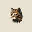</td>
        <td><a href="https://tabby.tabbyml.com/" target="_blank">Tabby</a></td>
        <td>免费开源的自托管AI编程助手</td>
        <td><a href="https://tabby.tabbyml.com/" target="_blank">🔗</a></td>
    </tr>
    <tr>
        <td>50</td>
        <td></td>
        <td><a href="https://so.csdn.net/chat" target="_blank">C知道</a></td>
        <td>CSDN推出的AI技术问答工具</td>
        <td><a href="https://so.csdn.net/chat" target="_blank">🔗</a></td>
    </tr>
    <tr>
        <td>51</td>
        <td></td>
        <td><a href="https://coderider.gitlab.cn/" target="_blank">驭码CodeRider</a></td>
        <td>极狐GitLab推出的AI编程与软件智能研发助手</td>
        <td><a href="https://coderider.gitlab.cn/" target="_blank">🔗</a></td>
    </tr>
    <tr>
        <td>52</td>
        <td></td>
        <td><a href="https://about.gitlab.com/gitlab-duo/" target="_blank">Duo Chat</a></td>
        <td>GitLab推出的AI编程助手</td>
        <td><a href="https://about.gitlab.com/gitlab-duo/" target="_blank">🔗</a></td>
    </tr>
    <tr>
        <td>53</td>
        <td></td>
        <td><a href="https://coderabbit.ai/" target="_blank">CodeRabbit</a></td>
        <td>AI驱动的代码审查平台</td>
        <td><a href="https://coderabbit.ai/" target="_blank">🔗</a></td>
    </tr>
    <tr>
        <td>54</td>
        <td></td>
        <td><a href="https://preview.devin.ai/" target="_blank">Devin</a></td>
        <td>首个全自主的AI软件工程师智能体</td>
        <td><a href="https://preview.devin.ai/" target="_blank">🔗</a></td>
    </tr>
    <tr>
        <td>55</td>
        <td></td>
        <td><a href="https://plandex.ai/" target="_blank">Plandex</a></td>
        <td>免费开源的基于终端的AI编程引擎</td>
        <td><a href="https://plandex.ai/" target="_blank">🔗</a></td>
    </tr>
    <tr>
        <td>56</td>
        <td></td>
        <td><a href="https://code.fittentech.com/" target="_blank">Fitten Code</a></td>
        <td>非十科技推出的免费AI代码助手</td>
        <td><a href="https://code.fittentech.com/" target="_blank">🔗</a></td>
    </tr>
    <tr>
        <td>57</td>
        <td></td>
        <td><a href="https://www.useblackbox.io/" target="_blank">BLACKBOX AI</a></td>
        <td>黑箱AI编程助理，快速代码生成</td>
        <td><a href="https://www.useblackbox.io/" target="_blank">🔗</a></td>
    </tr>
    <tr>
        <td>58</td>
        <td></td>
        <td><a href="https://soloist.ai/" target="_blank">Solo</a></td>
        <td>Mozilla推出的零编程无代码AI网站建设工具</td>
        <td><a href="https://soloist.ai/" target="_blank">🔗</a></td>
    </tr>
    <tr>
        <td>59</td>
        <td></td>
        <td><a href="https://www.jetbrains.com/ai/" target="_blank">JetBrains AI</a></td>
        <td>JetBrains推出的AI编程开发助手</td>
        <td><a href="https://www.jetbrains.com/ai/" target="_blank">🔗</a></td>
    </tr>
    <tr>
        <td>60</td>
        <td></td>
        <td><a href="https://www.askcodi.com/" target="_blank">AskCodi</a></td>
        <td>你的个人AI编程助手</td>
        <td><a href="https://www.askcodi.com/" target="_blank">🔗</a></td>
    </tr>
    <tr>
        <td>61</td>
        <td></td>
        <td><a href="https://v0.app/" target="_blank">v0.app</a></td>
        <td>Vercel推出的AI全栈应用构建工具</td>
        <td><a href="https://v0.app/" target="_blank">🔗</a></td>
    </tr>
    <tr>
        <td>62</td>
        <td></td>
        <td><a href="https://codesandbox.io/blog/meet-boxy-ai-coding-assistant" target="_blank">Boxy</a></td>
        <td>CodeSandbox推出的AI编程助手</td>
        <td><a href="https://codesandbox.io/blog/meet-boxy-ai-coding-assistant" target="_blank">🔗</a></td>
    </tr>
    <tr>
        <td>63</td>
        <td></td>
        <td><a href="https://www.quest.ai/" target="_blank">Quest AI</a></td>
        <td>AI将设计稿生成React代码，支持JavaScript和TypeScript</td>
        <td><a href="https://www.quest.ai/" target="_blank">🔗</a></td>
    </tr>
    <tr>
        <td>64</td>
        <td></td>
        <td><a href="https://sky-code.singularity-ai.com/index.html#" target="_blank">天工智码Skycode</a></td>
        <td>AI智能编程助手，轻松生成各种代码</td>
        <td><a href="https://sky-code.singularity-ai.com/index.html#" target="_blank">🔗</a></td>
    </tr>
    <tr>
        <td>65</td>
        <td></td>
        <td><a href="https://jam.dev/jamgpt" target="_blank">JamGPT</a></td>
        <td>AI Debug调试助手</td>
        <td><a href="https://jam.dev/jamgpt" target="_blank">🔗</a></td>
    </tr>
    <tr>
        <td>66</td>
        <td></td>
        <td><a href="https://www.aixcoder.com/" target="_blank">aiXcoder</a></td>
        <td>自然语言到代码的方法级代码生成，以及多行智能代码补全</td>
        <td><a href="https://www.aixcoder.com/" target="_blank">🔗</a></td>
    </tr>
    <tr>
        <td>67</td>
        <td></td>
        <td><a href="https://www.airops.com/" target="_blank">AirOps</a></td>
        <td>AI SQL语句生成和修改</td>
        <td><a href="https://www.airops.com/" target="_blank">🔗</a></td>
    </tr>
    <tr>
        <td>68</td>
        <td></td>
        <td><a href="https://www.imgcook.com/" target="_blank">Imgcook</a></td>
        <td>阿里推出的免费设计稿智能生成前端代码</td>
        <td><a href="https://www.imgcook.com/" target="_blank">🔗</a></td>
    </tr>
    <tr>
        <td>69</td>
        <td></td>
        <td><a href="https://ling-deco.jd.com/" target="_blank">Deco</a></td>
        <td>京东推出的设计稿一键生成多端代码工具</td>
        <td><a href="https://ling-deco.jd.com/" target="_blank">🔗</a></td>
    </tr>
    <tr>
        <td>70</td>
        <td></td>
        <td><a href="https://replit.com/site/ghostwriter" target="_blank">Ghostwriter</a></td>
        <td>知名在线编程IDE Replit推出的AI编程助手</td>
        <td><a href="https://replit.com/site/ghostwriter" target="_blank">🔗</a></td>
    </tr>
    <tr>
        <td>71</td>
        <td></td>
        <td><a href="https://www.codiga.io/" target="_blank">Codiga</a></td>
        <td>AI代码实时分析</td>
        <td><a href="https://www.codiga.io/" target="_blank">🔗</a></td>
    </tr>
    <tr>
        <td>72</td>
        <td></td>
        <td><a href="https://www.locofy.ai/" target="_blank">Locofy</a></td>
        <td>AI无代码工具将Figma、Adobe XD和Sketch设计转换成前端代码</td>
        <td><a href="https://www.locofy.ai/" target="_blank">🔗</a></td>
    </tr>
    <tr>
        <td>73</td>
        <td></td>
        <td><a href="https://fronty.com/" target="_blank">Fronty</a></td>
        <td>AI智能将图片转换成HTML和CSS代码</td>
        <td><a href="https://fronty.com/" target="_blank">🔗</a></td>
    </tr>
    <tr>
        <td>74</td>
        <td></td>
        <td><a href="https://www.marsx.dev/" target="_blank">MarsX</a></td>
        <td>AI无代码软件开发</td>
        <td><a href="https://www.marsx.dev/" target="_blank">🔗</a></td>
    </tr>
    <tr>
        <td>75</td>
        <td></td>
        <td><a href="https://www.tabnine.com/" target="_blank">Tabnine</a></td>
        <td>AI代码自动补全编程助手</td>
        <td><a href="https://www.tabnine.com/" target="_blank">🔗</a></td>
    </tr>
    <tr>
        <td>76</td>
        <td></td>
        <td><a href="https://debuild.app/" target="_blank">Debuild</a></td>
        <td>低代码快速开发网页应用</td>
        <td><a href="https://debuild.app/" target="_blank">🔗</a></td>
    </tr>
    <tr>
        <td>77</td>
        <td></td>
        <td><a href="https://www.warp.dev/" target="_blank">Warp</a></td>
        <td>21世纪的终端工具（内置AI命令搜索）</td>
        <td><a href="https://www.warp.dev/" target="_blank">🔗</a></td>
    </tr>
    <tr>
        <td>78</td>
        <td></td>
        <td><a href="https://fig.io/" target="_blank">Fig</a></td>
        <td>下一代命令行工具（内置AI终端命令自动补全）</td>
        <td><a href="https://fig.io/" target="_blank">🔗</a></td>
    </tr>
    <tr>
        <td>79</td>
        <td></td>
        <td><a href="https://codesnippets.ai/" target="_blank">CodeSnippets</a></td>
        <td>AI代码生成、补全、分析、重构和调试</td>
        <td><a href="https://codesnippets.ai/" target="_blank">🔗</a></td>
    </tr>
    <tr>
        <td>80</td>
        <td></td>
        <td><a href="https://hocoos.com/" target="_blank">Hocoos</a></td>
        <td>无代码AI智能在线快速创建网站</td>
        <td><a href="https://hocoos.com/" target="_blank">🔗</a></td>
    </tr>
    <tr>
        <td>81</td>
        <td></td>
        <td><a href="https://httpie.io/ai" target="_blank">HTTPie AI</a></td>
        <td>AI API开发工具</td>
        <td><a href="https://httpie.io/ai" target="_blank">🔗</a></td>
    </tr>
    <tr>
        <td>82</td>
        <td></td>
        <td><a href="https://ai-code-reviewer.com/" target="_blank">AI Code Reviewer</a></td>
        <td>AI代码检查</td>
        <td><a href="https://ai-code-reviewer.com/" target="_blank">🔗</a></td>
    </tr>
    <tr>
        <td>83</td>
        <td></td>
        <td><a href="https://visualstudio.microsoft.com/zh-hans/services/intellicode" target="_blank">Visual Studio IntelliCode</a></td>
        <td>Visual Studio AI辅助开发</td>
        <td><a href="https://visualstudio.microsoft.com/zh-hans/services/intellicode" target="_blank">🔗</a></td>
    </tr>
    <tr>
        <td>84</td>
        <td></td>
        <td><a href="https://www.heycli.com/" target="_blank">HeyCLI</a></td>
        <td>自然语言转义为CLI命令</td>
        <td><a href="https://www.heycli.com/" target="_blank">🔗</a></td>
    </tr>
    <tr>
        <td>85</td>
        <td></td>
        <td><a href="https://www.codeium.com/" target="_blank">Codeium</a></td>
        <td>免费的AI编程工具，智能生成和补全代码</td>
        <td><a href="https://www.codeium.com/" target="_blank">🔗</a></td>
    </tr>
</table>

## AI设计工具

<table>
    <tr>
        <td>1</td>
        <td></td>
        <td><a href="https://d.design/" target="_blank">堆友AI</a></td>
        <td>专为设计师打造的AI设计服务平台</td>
        <td><a href="https://d.design/" target="_blank">🔗</a></td>
    </tr>
    <tr>
        <td>2</td>
        <td></td>
        <td><a href="https://xingliu.cgref.cn/" target="_blank">星流AI</a></td>
        <td>一站式 AI 设计与创作工具</td>
        <td><a href="https://xingliu.cgref.cn/" target="_blank">🔗</a></td>
    </tr>
    <tr>
        <td>3</td>
        <td></td>
        <td><a href="https://ihuiwa.paluai.com/aibot" target="_blank">绘蛙AI</a></td>
        <td>AI 电商营销工具，免费生成商品图</td>
        <td><a href="https://ihuiwa.paluai.com/aibot" target="_blank">🔗</a></td>
    </tr>
    <tr>
        <td>4</td>
        <td></td>
        <td><a href="https://www.gaoding.art/" target="_blank">稿定AI</a></td>
        <td>一站式AI创作和设计平台</td>
        <td><a href="https://www.gaoding.art/" target="_blank">🔗</a></td>
    </tr>
    <tr>
        <td>5</td>
        <td></td>
        <td><a href="https://modao.cgref.cn/aibot" target="_blank">墨刀AI</a></td>
        <td>AI秒生原型稿</td>
        <td><a href="https://modao.cgref.cn/aibot" target="_blank">🔗</a></td>
    </tr>
    <tr>
        <td>6</td>
        <td></td>
        <td><a href="https://holopix.cn/?inviteCode=741737" target="_blank">Holopix AI</a></td>
        <td>专为游戏、动漫、插画设计打造的AI设计平台</td>
        <td><a href="https://holopix.cn/?inviteCode=741737" target="_blank">🔗</a></td>
    </tr>
    <tr>
        <td>7</td>
        <td></td>
        <td><a href="https://www.designkit.cn/" target="_blank">美图设计室</a></td>
        <td>AI图像创作和设计平台</td>
        <td><a href="https://www.designkit.cn/" target="_blank">🔗</a></td>
    </tr>
    <tr>
        <td>8</td>
        <td></td>
        <td><a href="https://www.135editor.com/ai_editor/?track_id=34&hmmd=ai-bot.cn" target="_blank">135 AI排版</a></td>
        <td>公众号AI图文排版和智能文案生成工具</td>
        <td><a href="https://www.135editor.com/ai_editor/?track_id=34&hmmd=ai-bot.cn" target="_blank">🔗</a></td>
    </tr>
    <tr>
        <td>9</td>
        <td></td>
        <td><a href="https://www.figma.com/ai/" target="_blank">Figma AI</a></td>
        <td>Figma推出的原生AI设计工具</td>
        <td><a href="https://www.figma.com/ai/" target="_blank">🔗</a></td>
    </tr>
    <tr>
        <td>10</td>
        <td></td>
        <td><a href="https://seede.ai/" target="_blank">Seede AI</a></td>
        <td>面向普通人的 AI 原生设计工具</td>
        <td><a href="https://seede.ai/" target="_blank">🔗</a></td>
    </tr>
    <tr>
        <td>11</td>
        <td></td>
        <td><a href="https://try.wegic.ai/sf415pbzl8ub" target="_blank">Wegic</a></td>
        <td>AI网页设计和建站开发工具</td>
        <td><a href="https://try.wegic.ai/sf415pbzl8ub" target="_blank">🔗</a></td>
    </tr>
    <tr>
        <td>12</td>
        <td></td>
        <td><a href="https://paico.cn/&_channel_track_key=e20XAlbs" target="_blank">Pixso AI</a></td>
        <td>Pixso推出的AI设计工具</td>
        <td><a href="https://paico.cn/&_channel_track_key=e20XAlbs" target="_blank">🔗</a></td>
    </tr>
    <tr>
        <td>13</td>
        <td></td>
        <td><a href="https://www.recraft.ai/" target="_blank">Recraft AI</a></td>
        <td>免费无限AI画板，生成高质量矢量艺术画、图标、3D图片和插画</td>
        <td><a href="https://www.recraft.ai/" target="_blank">🔗</a></td>
    </tr>
    <tr>
        <td>14</td>
        <td></td>
        <td><a href="https://stitch.withgoogle.com/" target="_blank">Stitch</a></td>
        <td>Google Labs 推出的 AI 原生设计工具</td>
        <td><a href="https://stitch.withgoogle.com/" target="_blank">🔗</a></td>
    </tr>
    <tr>
        <td>15</td>
        <td></td>
        <td><a href="https://miora.design/" target="_blank">Miora</a></td>
        <td>腾讯推出的 AI 原生设计协作工具</td>
        <td><a href="https://miora.design/" target="_blank">🔗</a></td>
    </tr>
    <tr>
        <td>16</td>
        <td></td>
        <td><a href="https://d.qq.com/" target="_blank">Ardot</a></td>
        <td>腾讯推出的 AI 智能设计工具</td>
        <td><a href="https://d.qq.com/" target="_blank">🔗</a></td>
    </tr>
    <tr>
        <td>17</td>
        <td></td>
        <td><a href="https://aiart.chuangkit.com/matrix" target="_blank">创客贴AI</a></td>
        <td>AI辅助的智能在线设计工具</td>
        <td><a href="https://aiart.chuangkit.com/matrix" target="_blank">🔗</a></td>
    </tr>
    <tr>
        <td>18</td>
        <td></td>
        <td><a href="https://open-design.ai/" target="_blank">Open Design</a></td>
        <td>开源本地优先的 AI 设计工作空间</td>
        <td><a href="https://open-design.ai/" target="_blank">🔗</a></td>
    </tr>
    <tr>
        <td>19</td>
        <td></td>
        <td><a href="https://ai-bot.cn/onlook" target="_blank">Onlook</a></td>
        <td>开源AI视觉编辑工具，设计修改自动同步代码</td>
        <td><a href="https://ai-bot.cn/onlook" target="_blank">🔗</a></td>
    </tr>
    <tr>
        <td>20</td>
        <td></td>
        <td><a href="https://ribbi.ai/" target="_blank">Ribbi</a></td>
        <td>专为设计师打造的自进化创意 AI Agent</td>
        <td><a href="https://ribbi.ai/" target="_blank">🔗</a></td>
    </tr>
    <tr>
        <td>21</td>
        <td></td>
        <td><a href="http://www.tavafa.com/" target="_blank">Tavafa塔维法</a></td>
        <td>PS+AI图片处理平台</td>
        <td><a href="http://www.tavafa.com/" target="_blank">🔗</a></td>
    </tr>
    <tr>
        <td>22</td>
        <td></td>
        <td><a href="https://interiorize.ai/" target="_blank">Interiorize</a></td>
        <td>专注于空间改造的 AI 室内设计工具</td>
        <td><a href="https://interiorize.ai/" target="_blank">🔗</a></td>
    </tr>
    <tr>
        <td>23</td>
        <td></td>
        <td><a href="https://quiver.ai/" target="_blank">QuiverAI</a></td>
        <td>AI矢量图形生成工具，输出可编辑的 SVG 代码</td>
        <td><a href="https://quiver.ai/" target="_blank">🔗</a></td>
    </tr>
    <tr>
        <td>24</td>
        <td></td>
        <td><a href="https://design.gemcoder.com/?ci=bot" target="_blank">GemDesign</a></td>
        <td>AI原生高保真原型设计工具</td>
        <td><a href="https://design.gemcoder.com/?ci=bot" target="_blank">🔗</a></td>
    </tr>
    <tr>
        <td>25</td>
        <td></td>
        <td><a href="https://www.piccopilot.com/create/" target="_blank">Pic Copilot</a></td>
        <td>阿里国际推出的AI电商设计工具</td>
        <td><a href="https://www.piccopilot.com/create/" target="_blank">🔗</a></td>
    </tr>
    <tr>
        <td>26</td>
        <td></td>
        <td><a href="https://www.canva.cn/magic/" target="_blank">魔力工作室</a></td>
        <td>Canva可画推出的一站式AI创作套件</td>
        <td><a href="https://www.canva.cn/magic/" target="_blank">🔗</a></td>
    </tr>
    <tr>
        <td>27</td>
        <td></td>
        <td><a href="https://idesign.alipay.com/" target="_blank">蚂上有创意</a></td>
        <td>支付宝推出的AI设计工具，面向商家提供电商设计服务</td>
        <td><a href="https://idesign.alipay.com/" target="_blank">🔗</a></td>
    </tr>
    <tr>
        <td>28</td>
        <td></td>
        <td><a href="https://ai.qisemiyun.com/" target="_blank">七色米AI</a></td>
        <td>AI 智能营销内容创作平台</td>
        <td><a href="https://ai.qisemiyun.com/" target="_blank">🔗</a></td>
    </tr>
    <tr>
        <td>29</td>
        <td></td>
        <td><a href="https://www.isheji.com/" target="_blank">爱设计</a></td>
        <td>AI在线设计平台，提供多端在线拖拽设计工具</td>
        <td><a href="https://www.isheji.com/" target="_blank">🔗</a></td>
    </tr>
    <tr>
        <td>30</td>
        <td></td>
        <td><a href="https://www.pagepop.cn/" target="_blank">PagePop</a></td>
        <td>一站式全能AI内容创作和设计平台</td>
        <td><a href="https://www.pagepop.cn/" target="_blank">🔗</a></td>
    </tr>
    <tr>
        <td>31</td>
        <td></td>
        <td><a href="https://www.xmyeditor.com/" target="_blank">小墨鹰编辑器</a></td>
        <td>行业首创的AI公众号排版工具，30s搞定推文排版！</td>
        <td><a href="https://www.xmyeditor.com/" target="_blank">🔗</a></td>
    </tr>
    <tr>
        <td>32</td>
        <td></td>
        <td><a href="https://www.meijian.com/ai" target="_blank">美间AI</a></td>
        <td>新一代AI画布式创意设计平台</td>
        <td><a href="https://www.meijian.com/ai" target="_blank">🔗</a></td>
    </tr>
    <tr>
        <td>33</td>
        <td></td>
        <td><a href="https://www.calicat.cn/" target="_blank">Calicat</a></td>
        <td>ProcessOn团队推出的一站式产设研协作平台</td>
        <td><a href="https://www.calicat.cn/" target="_blank">🔗</a></td>
    </tr>
    <tr>
        <td>34</td>
        <td></td>
        <td><a href="https://designer.microsoft.com/" target="_blank">Microsoft Designer</a></td>
        <td>微软推出的在线设计海报和宣传图工具</td>
        <td><a href="https://designer.microsoft.com/" target="_blank">🔗</a></td>
    </tr>
    <tr>
        <td>35</td>
        <td></td>
        <td><a href="https://www.uxbot.cn/" target="_blank">UXbot</a></td>
        <td>AI产品设计工具，一键生成UI与交互式原型</td>
        <td><a href="https://www.uxbot.cn/" target="_blank">🔗</a></td>
    </tr>
    <tr>
        <td>36</td>
        <td></td>
        <td><a href="https://www.yanqueai.com/" target="_blank">燕雀光年</a></td>
        <td>AI LOGO设计工具</td>
        <td><a href="https://www.yanqueai.com/" target="_blank">🔗</a></td>
    </tr>
    <tr>
        <td>37</td>
        <td></td>
        <td><a href="https://www.logosc.cn/" target="_blank">标小智LOGO生成器</a></td>
        <td>AI Logo设计平台，一键生成企业Logo</td>
        <td><a href="https://www.logosc.cn/" target="_blank">🔗</a></td>
    </tr>
    <tr>
        <td>38</td>
        <td></td>
        <td><a href="https://looka.com/" target="_blank">Looka</a></td>
        <td>AI在线设计和生成logo</td>
        <td><a href="https://looka.com/" target="_blank">🔗</a></td>
    </tr>
    <tr>
        <td>39</td>
        <td></td>
        <td><a href="https://taishan.qq.com/brand/" target="_blank">智绘设计</a></td>
        <td>腾讯推出的智能设计平台，让内容更精彩</td>
        <td><a href="https://taishan.qq.com/brand/" target="_blank">🔗</a></td>
    </tr>
    <tr>
        <td>40</td>
        <td></td>
        <td><a href="https://mastergo.com/ai" target="_blank">MasterGo AI</a></td>
        <td>国产产品设计工具MasterGo推出的智能UI设计助手</td>
        <td><a href="https://mastergo.com/ai" target="_blank">🔗</a></td>
    </tr>
    <tr>
        <td>41</td>
        <td></td>
        <td><a href="https://ai-bot.cn/design-shejijia" target="_blank">居然设计家</a></td>
        <td>居然之家联合阿里推出的AI家装设计平台</td>
        <td><a href="https://ai-bot.cn/design-shejijia" target="_blank">🔗</a></td>
    </tr>
    <tr>
        <td>42</td>
        <td></td>
        <td><a href="https://www.figma.com/figjam/ai" target="_blank">FigJam AI</a></td>
        <td>Figma推出的AI白板协作设计工具</td>
        <td><a href="https://www.figma.com/figjam/ai" target="_blank">🔗</a></td>
    </tr>
    <tr>
        <td>43</td>
        <td></td>
        <td><a href="https://d.design/toolbox/luban-pic" target="_blank">鹿班</a></td>
        <td>阿里推出的智能设计商品图和海报的平台</td>
        <td><a href="https://d.design/toolbox/luban-pic" target="_blank">🔗</a></td>
    </tr>
    <tr>
        <td>44</td>
        <td></td>
        <td><a href="https://www.canva.com/magic-design" target="_blank">Magic Design</a></td>
        <td>在线设计工具Canva推出的AI设计工具</td>
        <td><a href="https://www.canva.com/magic-design" target="_blank">🔗</a></td>
    </tr>
    <tr>
        <td>45</td>
        <td></td>
        <td><a href="https://www.jiandan.link/?rel=DB2V2320" target="_blank">简单设计</a></td>
        <td>免费的在线设计、图片处理工具</td>
        <td><a href="https://www.jiandan.link/?rel=DB2V2320" target="_blank">🔗</a></td>
    </tr>
    <tr>
        <td>46</td>
        <td></td>
        <td><a href="https://bigesj.com/" target="_blank">笔格设计</a></td>
        <td>AI设计工具合集，包括文生图、智能消除等</td>
        <td><a href="https://bigesj.com/" target="_blank">🔗</a></td>
    </tr>
    <tr>
        <td>47</td>
        <td></td>
        <td><a href="https://www.logosc.cn/design/" target="_blank">AI设计神器</a></td>
        <td>一站式创意图片设计编辑平台</td>
        <td><a href="https://www.logosc.cn/design/" target="_blank">🔗</a></td>
    </tr>
    <tr>
        <td>48</td>
        <td></td>
        <td><a href="https://www.logoai.com/" target="_blank">Logoai</a></td>
        <td>AI LOGO创建设计平台，一站式品牌打造</td>
        <td><a href="https://www.logoai.com/" target="_blank">🔗</a></td>
    </tr>
    <tr>
        <td>49</td>
        <td></td>
        <td><a href="https://www.douhuiai.com/" target="_blank">豆绘AI</a></td>
        <td>AI绘图设计平台，一键生成720°VR全景图</td>
        <td><a href="https://www.douhuiai.com/" target="_blank">🔗</a></td>
    </tr>
    <tr>
        <td>50</td>
        <td></td>
        <td><a href="https://www.58pic.com/" target="_blank">千图网</a></td>
        <td>在线设计图片素材平台</td>
        <td><a href="https://www.58pic.com/" target="_blank">🔗</a></td>
    </tr>
    <tr>
        <td>51</td>
        <td></td>
        <td><a href="https://pictographic.io/" target="_blank">Pictographic</a></td>
        <td>AI插图资源库和生成平台</td>
        <td><a href="https://pictographic.io/" target="_blank">🔗</a></td>
    </tr>
    <tr>
        <td>52</td>
        <td></td>
        <td><a href="https://www.fable.app/prism" target="_blank">Fable Prism</a></td>
        <td>AI动效设计和动画效果制作工具</td>
        <td><a href="https://www.fable.app/prism" target="_blank">🔗</a></td>
    </tr>
    <tr>
        <td>53</td>
        <td></td>
        <td><a href="https://jiangziai.com/" target="_blank">匠紫</a></td>
        <td>一站式AI设计工具</td>
        <td><a href="https://jiangziai.com/" target="_blank">🔗</a></td>
    </tr>
    <tr>
        <td>54</td>
        <td></td>
        <td><a href="https://collov.cn/" target="_blank">Collov AI</a></td>
        <td>AI室内家居设计生成平台</td>
        <td><a href="https://collov.cn/" target="_blank">🔗</a></td>
    </tr>
    <tr>
        <td>55</td>
        <td></td>
        <td><a href="https://ibaotu.com/tupian/shuziyishu.html" target="_blank">包图网AI素材库</a></td>
        <td>包图网提供的特色图库服务</td>
        <td><a href="https://ibaotu.com/tupian/shuziyishu.html" target="_blank">🔗</a></td>
    </tr>
    <tr>
        <td>56</td>
        <td></td>
        <td><a href="https://www.yiketu.com/" target="_blank">易可图</a></td>
        <td>免费的AI图片编辑和海报设计平台</td>
        <td><a href="https://www.yiketu.com/" target="_blank">🔗</a></td>
    </tr>
    <tr>
        <td>57</td>
        <td></td>
        <td><a href="https://ibihun.com/" target="_blank">笔魂AI</a></td>
        <td>AI设计工具，支持AI抠图、消除、无损放大</td>
        <td><a href="https://ibihun.com/" target="_blank">🔗</a></td>
    </tr>
    <tr>
        <td>58</td>
        <td></td>
        <td><a href="https://creatie.ai/" target="_blank">Creatie</a></td>
        <td>AI驱动的UI和UX设计工具</td>
        <td><a href="https://creatie.ai/" target="_blank">🔗</a></td>
    </tr>
    <tr>
        <td>59</td>
        <td></td>
        <td><a href="https://www.kittl.com/" target="_blank">Kittl</a></td>
        <td>AI驱动的平面图形设计工具</td>
        <td><a href="https://www.kittl.com/" target="_blank">🔗</a></td>
    </tr>
    <tr>
        <td>60</td>
        <td></td>
        <td><a href="https://www.dzine.ai/?via=ai-bot" target="_blank">Dzine</a></td>
        <td>一站式AI图像编辑和设计工具</td>
        <td><a href="https://www.dzine.ai/?via=ai-bot" target="_blank">🔗</a></td>
    </tr>
    <tr>
        <td>61</td>
        <td></td>
        <td><a href="https://ilus.ai/" target="_blank">Ilus AI</a></td>
        <td>AI插画插图生成工具</td>
        <td><a href="https://ilus.ai/" target="_blank">🔗</a></td>
    </tr>
    <tr>
        <td>62</td>
        <td></td>
        <td><a href="https://www.kujiale.cn/activities/AI-kujiale" target="_blank">酷家乐AI</a></td>
        <td>功能强大的AI家居设计软件</td>
        <td><a href="https://www.kujiale.cn/activities/AI-kujiale" target="_blank">🔗</a></td>
    </tr>
    <tr>
        <td>63</td>
        <td></td>
        <td><a href="https://www.framer.com/ai" target="_blank">Framer AI</a></td>
        <td>Framer推出的AI网站自动设计、生成和上线</td>
        <td><a href="https://www.framer.com/ai" target="_blank">🔗</a></td>
    </tr>
    <tr>
        <td>64</td>
        <td></td>
        <td><a href="https://logolivery.ai/" target="_blank">LogoliveryAI</a></td>
        <td>免费的AI Logo生成器，提供SVG矢量格式</td>
        <td><a href="https://logolivery.ai/" target="_blank">🔗</a></td>
    </tr>
    <tr>
        <td>65</td>
        <td></td>
        <td><a href="https://motiff.com/" target="_blank">Motiff 妙多</a></td>
        <td>猿辅导旗下推出的AI界面设计工具</td>
        <td><a href="https://motiff.com/" target="_blank">🔗</a></td>
    </tr>
    <tr>
        <td>66</td>
        <td></td>
        <td><a href="https://www.pimento.design/?ref_id=TU7BJC0X4" target="_blank">Pimento</a></td>
        <td>人工智能驱动的设计创意和视觉参考平台</td>
        <td><a href="https://www.pimento.design/?ref_id=TU7BJC0X4" target="_blank">🔗</a></td>
    </tr>
    <tr>
        <td>67</td>
        <td></td>
        <td><a href="https://logodiffusion.com/" target="_blank">Logo Diffusion</a></td>
        <td>AI驱动的Logo和标志生成工具</td>
        <td><a href="https://logodiffusion.com/" target="_blank">🔗</a></td>
    </tr>
    <tr>
        <td>68</td>
        <td></td>
        <td><a href="https://www.realibox.com/product/ai" target="_blank">Realibox AI</a></td>
        <td>AI免费将草图/模型生成3D渲染图</td>
        <td><a href="https://www.realibox.com/product/ai" target="_blank">🔗</a></td>
    </tr>
    <tr>
        <td>69</td>
        <td></td>
        <td><a href="https://vectorizer.ai/" target="_blank">Vectorizer.AI</a></td>
        <td>AI一键将位图转换为矢量图片</td>
        <td><a href="https://vectorizer.ai/" target="_blank">🔗</a></td>
    </tr>
    <tr>
        <td>70</td>
        <td></td>
        <td><a href="https://www.modaiyun.com/mdy/ai" target="_blank">模袋云AI</a></td>
        <td>建筑AI创作平台，专注于大型建筑、小型住宅、室内设计、景观的出图和AI模型训练</td>
        <td><a href="https://www.modaiyun.com/mdy/ai" target="_blank">🔗</a></td>
    </tr>
    <tr>
        <td>71</td>
        <td></td>
        <td><a href="https://www.vizcom.ai/" target="_blank">Vizcom</a></td>
        <td>AI渲染转化手绘图为产品设计图</td>
        <td><a href="https://www.vizcom.ai/" target="_blank">🔗</a></td>
    </tr>
    <tr>
        <td>72</td>
        <td></td>
        <td><a href="https://www.dora.run/ai" target="_blank">Dora AI</a></td>
        <td>AI在线生成精美3D动画的网站</td>
        <td><a href="https://www.dora.run/ai" target="_blank">🔗</a></td>
    </tr>
    <tr>
        <td>73</td>
        <td></td>
        <td><a href="https://designs.ai/" target="_blank">Designs.ai</a></td>
        <td>AI设计工具</td>
        <td><a href="https://designs.ai/" target="_blank">🔗</a></td>
    </tr>
    <tr>
        <td>74</td>
        <td></td>
        <td><a href="https://www.usegalileo.ai/" target="_blank">Galileo AI</a></td>
        <td>AI高保真原型设计</td>
        <td><a href="https://www.usegalileo.ai/" target="_blank">🔗</a></td>
    </tr>
    <tr>
        <td>75</td>
        <td></td>
        <td><a href="https://spline.design/ai" target="_blank">Spline AI</a></td>
        <td>Spline推出的AI生成3D物体、动画、材质</td>
        <td><a href="https://spline.design/ai" target="_blank">🔗</a></td>
    </tr>
    <tr>
        <td>76</td>
        <td></td>
        <td><a href="https://hihaibao.com/" target="_blank">千图设计室AI海报</a></td>
        <td>免费批量生成在线可编辑的AI海报工具</td>
        <td><a href="https://hihaibao.com/" target="_blank">🔗</a></td>
    </tr>
    <tr>
        <td>77</td>
        <td></td>
        <td><a href="https://www.illostration.com/" target="_blank">illostrationAI</a></td>
        <td>AI插画生成，low poly、3D、矢量、logo、像素风、皮克斯等风格</td>
        <td><a href="https://www.illostration.com/" target="_blank">🔗</a></td>
    </tr>
    <tr>
        <td>78</td>
        <td></td>
        <td><a href="https://uizard.io/ai-design" target="_blank">Uizard</a></td>
        <td>AI网页、App和UI设计，快速生成应用和网站原型</td>
        <td><a href="https://uizard.io/ai-design" target="_blank">🔗</a></td>
    </tr>
    <tr>
        <td>79</td>
        <td></td>
        <td><a href="https://lumalabs.ai/" target="_blank">Luma AI</a></td>
        <td>AI 3D捕捉、建模和渲染</td>
        <td><a href="https://lumalabs.ai/" target="_blank">🔗</a></td>
    </tr>
    <tr>
        <td>80</td>
        <td></td>
        <td><a href="https://www.nolibox.com/introduction" target="_blank">图宇宙</a></td>
        <td>高品质AI智能设计平台</td>
        <td><a href="https://www.nolibox.com/introduction" target="_blank">🔗</a></td>
    </tr>
    <tr>
        <td>81</td>
        <td></td>
        <td><a href="https://ai-bot.cn/sites/1989.html" target="_blank">阿里云智能logo设计</a></td>
        <td>阿里云推出的智能Logo设计</td>
        <td><a href="https://ai-bot.cn/sites/1989.html" target="_blank">🔗</a></td>
    </tr>
    <tr>
        <td>82</td>
        <td></td>
        <td><a href="https://ai-bot.cn/sites/1957.html" target="_blank">AIDesign</a></td>
        <td>腾讯推出的免费AI Logo在线设计工具</td>
        <td><a href="https://ai-bot.cn/sites/1957.html" target="_blank">🔗</a></td>
    </tr>
    <tr>
        <td>83</td>
        <td></td>
        <td><a href="https://kebuxi.datasink.sensorsdata.cn/r/dF" target="_blank">Fabrie AI</a></td>
        <td>在线白板协作平台Fabrie推出的AI设计助手，支持多种渲染模式</td>
        <td><a href="https://kebuxi.datasink.sensorsdata.cn/r/dF" target="_blank">🔗</a></td>
    </tr>
    <tr>
        <td>84</td>
        <td></td>
        <td><a href="https://withpoly.com/browse/textures" target="_blank">Poly</a></td>
        <td>AI生成3D材质</td>
        <td><a href="https://withpoly.com/browse/textures" target="_blank">🔗</a></td>
    </tr>
    <tr>
        <td>85</td>
        <td></td>
        <td><a href="https://illustroke.com/" target="_blank">Illustroke</a></td>
        <td>AI SVG矢量插画生成工具</td>
        <td><a href="https://illustroke.com/" target="_blank">🔗</a></td>
    </tr>
    <tr>
        <td>86</td>
        <td></td>
        <td><a href="https://colors.eva.design/" target="_blank">Eva Design System</a></td>
        <td>基于深度学习的色彩生成工具</td>
        <td><a href="https://colors.eva.design/" target="_blank">🔗</a></td>
    </tr>
    <tr>
        <td>87</td>
        <td></td>
        <td><a href="https://brandmark.io/color-wheel/" target="_blank">Color Wheel</a></td>
        <td>AI灰度logo或插画上色工具</td>
        <td><a href="https://brandmark.io/color-wheel/" target="_blank">🔗</a></td>
    </tr>
    <tr>
        <td>88</td>
        <td></td>
        <td><a href="https://huemint.com/" target="_blank">Huemint</a></td>
        <td>AI调色生成工具</td>
        <td><a href="https://huemint.com/" target="_blank">🔗</a></td>
    </tr>
    <tr>
        <td>89</td>
        <td></td>
        <td><a href="https://www.obviously.ai/" target="_blank">ColorMagic</a></td>
        <td>AI调色板生成工具</td>
        <td><a href="https://www.obviously.ai/" target="_blank">🔗</a></td>
    </tr>
    <tr>
        <td>90</td>
        <td></td>
        <td><a href="https://logomaster.ai/" target="_blank">Logomaster.ai</a></td>
        <td>AI Logo生成工具</td>
        <td><a href="https://logomaster.ai/" target="_blank">🔗</a></td>
    </tr>
    <tr>
        <td>91</td>
        <td></td>
        <td><a href="https://magician.design/" target="_blank">Magician</a></td>
        <td>Figma插件，AI生成图标、图片和UX文案</td>
        <td><a href="https://magician.design/" target="_blank">🔗</a></td>
    </tr>
    <tr>
        <td>92</td>
        <td></td>
        <td><a href="https://appicons.ai/" target="_blank">Appicons AI</a></td>
        <td>AI生成精美App图标</td>
        <td><a href="https://appicons.ai/" target="_blank">🔗</a></td>
    </tr>
    <tr>
        <td>93</td>
        <td></td>
        <td><a href="https://www.iconifyai.com/" target="_blank">IconifyAI</a></td>
        <td>AI App图标生成器</td>
        <td><a href="https://www.iconifyai.com/" target="_blank">🔗</a></td>
    </tr>
    <tr>
        <td>94</td>
        <td></td>
        <td><a href="https://www.khroma.co/" target="_blank">Khroma</a></td>
        <td>AI调色盘生成工具</td>
        <td><a href="https://www.khroma.co/" target="_blank">🔗</a></td>
    </tr>
    <tr>
        <td>95</td>
        <td></td>
        <td><a href="https://ling.jd.com/" target="_blank">羚珑</a></td>
        <td>京东推出的商品图智能设计小工具</td>
        <td><a href="https://ling.jd.com/" target="_blank">🔗</a></td>
    </tr>
    <tr>
        <td>96</td>
        <td></td>
        <td><a href="https://www.redoon.cn/" target="_blank">灵动AI</a></td>
        <td>专业的AI商品图生成工具</td>
        <td><a href="https://www.redoon.cn/" target="_blank">🔗</a></td>
    </tr>
    <tr>
        <td>97</td>
        <td></td>
        <td><a href="https://jsai.cc/ai/create" target="_blank">即时AI</a></td>
        <td>即时设计推出的由文本描述生成可编辑的原型设计稿</td>
        <td><a href="https://jsai.cc/ai/create" target="_blank">🔗</a></td>
    </tr>
    <tr>
        <td>98</td>
        <td></td>
        <td><a href="https://www.getalpaca.io/" target="_blank">Alpaca</a></td>
        <td>将生成式AI集成到Photoshop图像设计中</td>
        <td><a href="https://www.getalpaca.io/" target="_blank">🔗</a></td>
    </tr>
</table>

## AI音频工具

<table>
    <tr>
        <td>1</td>
        <td></td>
        <td><a href="https://www.moyin.com/" target="_blank">魔音工坊</a></td>
        <td>AI配音工具，轻松配出媲美真人的声音</td>
        <td><a href="https://www.moyin.com/" target="_blank">🔗</a></td>
    </tr>
    <tr>
        <td>2</td>
        <td></td>
        <td><a href="https://xfzhizuo.cgref.cn/aibot" target="_blank">讯飞智作</a></td>
        <td>AI文本配音工具，数字人课程、营销视频制作</td>
        <td><a href="https://xfzhizuo.cgref.cn/aibot" target="_blank">🔗</a></td>
    </tr>
    <tr>
        <td>3</td>
        <td></td>
        <td><a href="https://www.douge.com/companyProfile" target="_blank">逗哥配音</a></td>
        <td>一站式AI配音工具，抖音爆款配音始发地</td>
        <td><a href="https://www.douge.com/companyProfile" target="_blank">🔗</a></td>
    </tr>
    <tr>
        <td>4</td>
        <td></td>
        <td><a href="https://yizhi.iflyrec.com/?regFrom=XFTJ932&id=XFTJ932" target="_blank">讯飞译制</a></td>
        <td>科大讯飞推出的AI音视频本地化平台</td>
        <td><a href="https://yizhi.iflyrec.com/?regFrom=XFTJ932&id=XFTJ932" target="_blank">🔗</a></td>
    </tr>
    <tr>
        <td>5</td>
        <td></td>
        <td><a href="https://www.suno.ai/" target="_blank">Suno</a></td>
        <td>高质量的AI音乐创作平台</td>
        <td><a href="https://www.suno.ai/" target="_blank">🔗</a></td>
    </tr>
    <tr>
        <td>6</td>
        <td></td>
        <td><a href="https://yinshu.cgref.cn/aibot" target="_blank">音述AI</a></td>
        <td>全球首个AI音乐社区</td>
        <td><a href="https://yinshu.cgref.cn/aibot" target="_blank">🔗</a></td>
    </tr>
    <tr>
        <td>7</td>
        <td></td>
        <td><a href="https://try.elevenlabs.io/mqbahm8egbk8" target="_blank">ElevenLabs</a></td>
        <td>AI文本转语音，支持包含中文在内的29种语言</td>
        <td><a href="https://try.elevenlabs.io/mqbahm8egbk8" target="_blank">🔗</a></td>
    </tr>
    <tr>
        <td>8</td>
        <td></td>
        <td><a href="https://lang123.top/?rmd=64546" target="_blank">琅琅配音</a></td>
        <td>智能文本转语音工具</td>
        <td><a href="https://lang123.top/?rmd=64546" target="_blank">🔗</a></td>
    </tr>
    <tr>
        <td>9</td>
        <td></td>
        <td><a href="https://ai-bot.cn/qianyin" target="_blank">千音漫语</a></td>
        <td>AI声音创作助手，支持声音克隆</td>
        <td><a href="https://ai-bot.cn/qianyin" target="_blank">🔗</a></td>
    </tr>
    <tr>
        <td>10</td>
        <td></td>
        <td><a href="https://ai-bot.cn/minimax-audio" target="_blank">MiniMax Audio</a></td>
        <td>MiniMax推出的AI语音合成工具，支持声音克隆</td>
        <td><a href="https://ai-bot.cn/minimax-audio" target="_blank">🔗</a></td>
    </tr>
    <tr>
        <td>11</td>
        <td></td>
        <td><a href="https://ai-bot.cn/noiz-ai" target="_blank">Noiz AI</a></td>
        <td>AI配音工具，支持文本转语音和声音克隆</td>
        <td><a href="https://ai-bot.cn/noiz-ai" target="_blank">🔗</a></td>
    </tr>
    <tr>
        <td>12</td>
        <td></td>
        <td><a href="https://www.tunee.ai/" target="_blank">Tunee</a></td>
        <td>首个对话式音乐创作AI智能体</td>
        <td><a href="https://www.tunee.ai/" target="_blank">🔗</a></td>
    </tr>
    <tr>
        <td>13</td>
        <td></td>
        <td><a href="https://www.iflyrec.com/zhuanwenzi.html" target="_blank">讯飞听见</a></td>
        <td>科大讯飞推出的在线AI语音转文字工具</td>
        <td><a href="https://www.iflyrec.com/zhuanwenzi.html" target="_blank">🔗</a></td>
    </tr>
    <tr>
        <td>14</td>
        <td></td>
        <td><a href="https://notebooklm.google/" target="_blank">NotebookLM</a></td>
        <td>谷歌推出的AI笔记应用，5分钟生成一段对话播客</td>
        <td><a href="https://notebooklm.google/" target="_blank">🔗</a></td>
    </tr>
    <tr>
        <td>15</td>
        <td></td>
        <td><a href="https://www.flowmusic.app/" target="_blank">Flow Music</a></td>
        <td>Google Labs推出的AI音乐创作平台</td>
        <td><a href="https://www.flowmusic.app/" target="_blank">🔗</a></td>
    </tr>
    <tr>
        <td>16</td>
        <td></td>
        <td><a href="https://y.qq.com/vemus/index.html?adtag=aibot_ai_musictool_homepage" target="_blank">Vemus未音</a></td>
        <td>腾讯音乐旗下首款一站式AI音乐创作工具</td>
        <td><a href="https://y.qq.com/vemus/index.html?adtag=aibot_ai_musictool_homepage" target="_blank">🔗</a></td>
    </tr>
    <tr>
        <td>17</td>
        <td></td>
        <td><a href="https://www.haimian.com/" target="_blank">海绵音乐</a></td>
        <td>字节跳动推出的免费AI音乐创作和发现平台</td>
        <td><a href="https://www.haimian.com/" target="_blank">🔗</a></td>
    </tr>
    <tr>
        <td>18</td>
        <td></td>
        <td><a href="https://www.51melo.com/" target="_blank">MELO音乐</a></td>
        <td>AI 音乐生成平台，支持多模态创作能力</td>
        <td><a href="https://www.51melo.com/" target="_blank">🔗</a></td>
    </tr>
    <tr>
        <td>19</td>
        <td></td>
        <td><a href="https://melolab.ai/" target="_blank">MeloLab</a></td>
        <td>一站式 AI 音乐生成与编辑平台</td>
        <td><a href="https://melolab.ai/" target="_blank">🔗</a></td>
    </tr>
    <tr>
        <td>20</td>
        <td></td>
        <td><a href="https://www.audimind.com/" target="_blank">万象有声</a></td>
        <td>AI 一站式有声内容创作平台</td>
        <td><a href="https://www.audimind.com/" target="_blank">🔗</a></td>
    </tr>
    <tr>
        <td>21</td>
        <td></td>
        <td><a href="https://nafy.ai/" target="_blank">Nafy AI</a></td>
        <td>在线 AI 音乐生成器，支持扩展、替换、翻唱</td>
        <td><a href="https://nafy.ai/" target="_blank">🔗</a></td>
    </tr>
    <tr>
        <td>22</td>
        <td></td>
        <td><a href="https://www.uniscribe.co/" target="_blank">UniScribe</a></td>
        <td>AI 免费在线音视频转文字平台</td>
        <td><a href="https://www.uniscribe.co/" target="_blank">🔗</a></td>
    </tr>
    <tr>
        <td>23</td>
        <td></td>
        <td><a href="https://qx.utiliverse.site/" target="_blank">轻析 LiteSight</a></td>
        <td>AI 视频内容提取工具，自动转文字</td>
        <td><a href="https://qx.utiliverse.site/" target="_blank">🔗</a></td>
    </tr>
    <tr>
        <td>24</td>
        <td></td>
        <td><a href="https://turboscribe.ai/" target="_blank">TurboScribe</a></td>
        <td>专业 AI 音视频转文字工具</td>
        <td><a href="https://turboscribe.ai/" target="_blank">🔗</a></td>
    </tr>
    <tr>
        <td>25</td>
        <td></td>
        <td><a href="https://dwsj.cn/" target="_blank">多维视界</a></td>
        <td>一站式AI音视频智能分析平台</td>
        <td><a href="https://dwsj.cn/" target="_blank">🔗</a></td>
    </tr>
    <tr>
        <td>26</td>
        <td></td>
        <td><a href="https://ai-bot.cn/tianpuyue" target="_blank">天谱乐</a></td>
        <td>唱鸭团队推出的首个多模态音乐生成大模型</td>
        <td><a href="https://ai-bot.cn/tianpuyue" target="_blank">🔗</a></td>
    </tr>
    <tr>
        <td>27</td>
        <td></td>
        <td><a href="https://www.yinfeng.cn/home" target="_blank">音疯</a></td>
        <td>昆仑万维推出的AI音乐创作平台，一键生成原创歌曲</td>
        <td><a href="https://www.yinfeng.cn/home" target="_blank">🔗</a></td>
    </tr>
    <tr>
        <td>28</td>
        <td></td>
        <td><a href="https://ai-bot.cn/mureka" target="_blank">Mureka</a></td>
        <td>昆仑万维推出的 AI 音乐商用创作平台</td>
        <td><a href="https://ai-bot.cn/mureka" target="_blank">🔗</a></td>
    </tr>
    <tr>
        <td>29</td>
        <td></td>
        <td><a href="https://www.yinchaoyongxian.com/" target="_blank">音潮</a></td>
        <td>全栈自研的AI音乐创作平台</td>
        <td><a href="https://www.yinchaoyongxian.com/" target="_blank">🔗</a></td>
    </tr>
    <tr>
        <td>30</td>
        <td></td>
        <td><a href="https://audioeditor.ximalaya.com/" target="_blank">音剪</a></td>
        <td>喜马拉雅推出的一站式AI音频创作平台</td>
        <td><a href="https://audioeditor.ximalaya.com/" target="_blank">🔗</a></td>
    </tr>
    <tr>
        <td>31</td>
        <td></td>
        <td><a href="https://audiomyst.baidu.com/" target="_blank">音秘</a></td>
        <td>百度推出的AI播客创作工具</td>
        <td><a href="https://audiomyst.baidu.com/" target="_blank">🔗</a></td>
    </tr>
    <tr>
        <td>32</td>
        <td></td>
        <td><a href="https://memo.ac/" target="_blank">MemoAI</a></td>
        <td>免费的AI语音转文字工具</td>
        <td><a href="https://memo.ac/" target="_blank">🔗</a></td>
    </tr>
    <tr>
        <td>33</td>
        <td></td>
        <td><a href="https://www.reecho.ai/" target="_blank">Reecho睿声</a></td>
        <td>超拟真的中英文AI语音克隆/生成平台</td>
        <td><a href="https://www.reecho.ai/" target="_blank">🔗</a></td>
    </tr>
    <tr>
        <td>34</td>
        <td></td>
        <td><a href="https://www.udio.com/" target="_blank">Udio</a></td>
        <td>免费的AI音乐创作工具，每月可生成1200首歌曲</td>
        <td><a href="https://www.udio.com/" target="_blank">🔗</a></td>
    </tr>
    <tr>
        <td>35</td>
        <td></td>
        <td><a href="https://tianyin.163.com/" target="_blank">网易天音</a></td>
        <td>网易推出的一站式AI音乐创作工具</td>
        <td><a href="https://tianyin.163.com/" target="_blank">🔗</a></td>
    </tr>
    <tr>
        <td>36</td>
        <td></td>
        <td><a href="https://lyricsintosong.ai/zh" target="_blank">Lyrics Into Song AI</a></td>
        <td>在线AI音乐创作工具，输入歌词创建个性化歌曲</td>
        <td><a href="https://lyricsintosong.ai/zh" target="_blank">🔗</a></td>
    </tr>
    <tr>
        <td>37</td>
        <td></td>
        <td><a href="https://www.stableaudio.com/" target="_blank">Stable Audio</a></td>
        <td>Stability AI最新推出的音乐生成工具</td>
        <td><a href="https://www.stableaudio.com/" target="_blank">🔗</a></td>
    </tr>
    <tr>
        <td>38</td>
        <td></td>
        <td><a href="https://texttospeech.im/zh-CN" target="_blank">TextToSpeech</a></td>
        <td>完全免费的AI文字转语音工具</td>
        <td><a href="https://texttospeech.im/zh-CN" target="_blank">🔗</a></td>
    </tr>
    <tr>
        <td>39</td>
        <td></td>
        <td><a href="https://ttsmaker.cn/" target="_blank">TTSMaker</a></td>
        <td>马克配音（MakVoice）推出的免费AI文字转语音工具</td>
        <td><a href="https://ttsmaker.cn/" target="_blank">🔗</a></td>
    </tr>
    <tr>
        <td>40</td>
        <td></td>
        <td><a href="https://lovo.ai/" target="_blank">LOVO AI</a></td>
        <td>专业的AI文字转语音工具，支持500+声音和100种语言</td>
        <td><a href="https://lovo.ai/" target="_blank">🔗</a></td>
    </tr>
    <tr>
        <td>41</td>
        <td></td>
        <td><a href="https://uberduck.ai/?via=ai-bot" target="_blank">Uberduck</a></td>
        <td>开源的AI语音生成社区，5000多种不同的声音</td>
        <td><a href="https://uberduck.ai/?via=ai-bot" target="_blank">🔗</a></td>
    </tr>
    <tr>
        <td>42</td>
        <td></td>
        <td><a href="https://sonauto.ai/" target="_blank">Sonauto</a></td>
        <td>免费的AI音乐生成和歌曲创作工具</td>
        <td><a href="https://sonauto.ai/" target="_blank">🔗</a></td>
    </tr>
    <tr>
        <td>43</td>
        <td></td>
        <td><a href="https://www.tiangong.cn/music" target="_blank">天工SkyMusic</a></td>
        <td>昆仑万维发布的国内首个AI音乐生成大模型</td>
        <td><a href="https://www.tiangong.cn/music" target="_blank">🔗</a></td>
    </tr>
    <tr>
        <td>44</td>
        <td></td>
        <td><a href="https://dubbing.tech/" target="_blank">大饼AI变声</a></td>
        <td>免费专业的AI变声软件，一键实时语音变声</td>
        <td><a href="https://dubbing.tech/" target="_blank">🔗</a></td>
    </tr>
    <tr>
        <td>45</td>
        <td></td>
        <td><a href="https://product.supertone.ai/shift" target="_blank">Supertone Shift</a></td>
        <td>AI驱动的实时语音变换软件</td>
        <td><a href="https://product.supertone.ai/shift" target="_blank">🔗</a></td>
    </tr>
    <tr>
        <td>46</td>
        <td></td>
        <td><a href="https://www.riffusion.com/" target="_blank">Producer.ai</a></td>
        <td>AI生成不同风格的音乐，免费开源</td>
        <td><a href="https://www.riffusion.com/" target="_blank">🔗</a></td>
    </tr>
    <tr>
        <td>47</td>
        <td></td>
        <td><a href="https://podcast.adobe.com/" target="_blank">Adobe Podcast</a></td>
        <td>Adobe推出的在线AI音频录制和编辑工具</td>
        <td><a href="https://podcast.adobe.com/" target="_blank">🔗</a></td>
    </tr>
    <tr>
        <td>48</td>
        <td></td>
        <td><a href="https://xstudio.music.163.com/" target="_blank">网易云音乐·X Studio</a></td>
        <td>网易云音乐与小冰智能联合推出的免费AI歌手音乐创作软件</td>
        <td><a href="https://xstudio.music.163.com/" target="_blank">🔗</a></td>
    </tr>
    <tr>
        <td>49</td>
        <td></td>
        <td><a href="https://www.icnpy.com/" target="_blank">刺鸟配音</a></td>
        <td>刺鸟科技推出的专业AI配音工具</td>
        <td><a href="https://www.icnpy.com/" target="_blank">🔗</a></td>
    </tr>
    <tr>
        <td>50</td>
        <td></td>
        <td><a href="https://www.wondercraft.ai/?via=ai-bot" target="_blank">Wondercraft</a></td>
        <td>AI音频内容生成工具，可创建播客有声书等</td>
        <td><a href="https://www.wondercraft.ai/?via=ai-bot" target="_blank">🔗</a></td>
    </tr>
    <tr>
        <td>51</td>
        <td></td>
        <td><a href="https://fryderyk.ai/" target="_blank">Fryderyk</a></td>
        <td>AI音乐创作工具，集成了多种乐器声音</td>
        <td><a href="https://fryderyk.ai/" target="_blank">🔗</a></td>
    </tr>
    <tr>
        <td>52</td>
        <td></td>
        <td><a href="https://voicenotes.com/" target="_blank">Voicenotes</a></td>
        <td>AI驱动的语音笔记工具</td>
        <td><a href="https://voicenotes.com/" target="_blank">🔗</a></td>
    </tr>
    <tr>
        <td>53</td>
        <td></td>
        <td><a href="https://www.optimizerai.xyz/" target="_blank">OptimizerAI</a></td>
        <td>AI声音效果生成工具</td>
        <td><a href="https://www.optimizerai.xyz/" target="_blank">🔗</a></td>
    </tr>
    <tr>
        <td>54</td>
        <td></td>
        <td><a href="https://acestudio.cn/" target="_blank">ACE Studio</a></td>
        <td>AI歌声合成工具，输入歌词与旋律即可生成宛如真人的歌声</td>
        <td><a href="https://acestudio.cn/" target="_blank">🔗</a></td>
    </tr>
    <tr>
        <td>55</td>
        <td></td>
        <td><a href="https://aigc.unisound.com/" target="_blank">蓝藻AI</a></td>
        <td>云知声旗下的AI配音和声音克隆平台</td>
        <td><a href="https://aigc.unisound.com/" target="_blank">🔗</a></td>
    </tr>
    <tr>
        <td>56</td>
        <td></td>
        <td><a href="https://deepgram.partnerlinks.io/ai-bot" target="_blank">Deepgram</a></td>
        <td>快速低成本的AI语音文本互转API平台</td>
        <td><a href="https://deepgram.partnerlinks.io/ai-bot" target="_blank">🔗</a></td>
    </tr>
    <tr>
        <td>57</td>
        <td></td>
        <td><a href="https://audiobox.metademolab.com/" target="_blank">Audiobox</a></td>
        <td>Meta推出的免费AI语音和声音生成模型</td>
        <td><a href="https://audiobox.metademolab.com/" target="_blank">🔗</a></td>
    </tr>
    <tr>
        <td>58</td>
        <td></td>
        <td><a href="https://www.resemble.ai/" target="_blank">RESEMBLE.AI</a></td>
        <td>AI人声生成工具</td>
        <td><a href="https://www.resemble.ai/" target="_blank">🔗</a></td>
    </tr>
    <tr>
        <td>59</td>
        <td></td>
        <td><a href="https://www.ibm.com/cloud/watson-text-to-speech" target="_blank">IBM Watson文字转语音</a></td>
        <td>IBM Watson文字转语音</td>
        <td><a href="https://www.ibm.com/cloud/watson-text-to-speech" target="_blank">🔗</a></td>
    </tr>
    <tr>
        <td>60</td>
        <td></td>
        <td><a href="https://fakeyou.com/" target="_blank">FakeYou</a></td>
        <td>Deep Fake文本转语音</td>
        <td><a href="https://fakeyou.com/" target="_blank">🔗</a></td>
    </tr>
    <tr>
        <td>61</td>
        <td></td>
        <td><a href="https://bgmcat.com/home" target="_blank">BGM猫</a></td>
        <td>灵动音科技推出的AI智能生成BGM音乐</td>
        <td><a href="https://bgmcat.com/home" target="_blank">🔗</a></td>
    </tr>
    <tr>
        <td>62</td>
        <td></td>
        <td><a href="https://www.kzzimu.com/" target="_blank">快转字幕</a></td>
        <td>AI语音视频转文字和字幕的工具</td>
        <td><a href="https://www.kzzimu.com/" target="_blank">🔗</a></td>
    </tr>
    <tr>
        <td>63</td>
        <td></td>
        <td><a href="https://yueyin.zhipianbang.com/" target="_blank">悦音配音</a></td>
        <td>AI智能在线配音语音合成工具</td>
        <td><a href="https://yueyin.zhipianbang.com/" target="_blank">🔗</a></td>
    </tr>
    <tr>
        <td>64</td>
        <td></td>
        <td><a href="https://www.soundbug.com/" target="_blank">音虫</a></td>
        <td>内置AI音乐编曲的音乐制作工具</td>
        <td><a href="https://www.soundbug.com/" target="_blank">🔗</a></td>
    </tr>
    <tr>
        <td>65</td>
        <td></td>
        <td><a href="https://mubert.com/" target="_blank">Mubert</a></td>
        <td>AI BGM背景音乐生成工具</td>
        <td><a href="https://mubert.com/" target="_blank">🔗</a></td>
    </tr>
    <tr>
        <td>66</td>
        <td></td>
        <td><a href="https://www.beatoven.ai/" target="_blank">beatoven.ai</a></td>
        <td>免版税AI音乐创建平台</td>
        <td><a href="https://www.beatoven.ai/" target="_blank">🔗</a></td>
    </tr>
    <tr>
        <td>67</td>
        <td></td>
        <td><a href="https://beatbot.fm/" target="_blank">BeatBot</a></td>
        <td>输入文本提示快速生成歌曲和音乐</td>
        <td><a href="https://beatbot.fm/" target="_blank">🔗</a></td>
    </tr>
    <tr>
        <td>68</td>
        <td></td>
        <td><a href="https://audo.ai/" target="_blank">Audo Studio</a></td>
        <td>AI音频清洗工具（噪音消除、声音平衡、音量调节）</td>
        <td><a href="https://audo.ai/" target="_blank">🔗</a></td>
    </tr>
    <tr>
        <td>69</td>
        <td></td>
        <td><a href="https://www.naturalreaders.com/" target="_blank">NaturalReader</a></td>
        <td>AI文本转语音工具</td>
        <td><a href="https://www.naturalreaders.com/" target="_blank">🔗</a></td>
    </tr>
    <tr>
        <td>70</td>
        <td></td>
        <td><a href="https://www.assemblyai.com/" target="_blank">AssemblyAI</a></td>
        <td>转录和理解语音的AI模型</td>
        <td><a href="https://www.assemblyai.com/" target="_blank">🔗</a></td>
    </tr>
    <tr>
        <td>71</td>
        <td></td>
        <td><a href="https://www.lalal.ai/" target="_blank">LALAL.AI</a></td>
        <td>AI人声乐器分离和提取</td>
        <td><a href="https://www.lalal.ai/" target="_blank">🔗</a></td>
    </tr>
    <tr>
        <td>72</td>
        <td></td>
        <td><a href="https://krisp.ai/" target="_blank">Krisp</a></td>
        <td>AI噪音消除工具</td>
        <td><a href="https://krisp.ai/" target="_blank">🔗</a></td>
    </tr>
    <tr>
        <td>73</td>
        <td></td>
        <td><a href="https://play.ht/" target="_blank">Play.ht</a></td>
        <td>超真实在线AI语音生成</td>
        <td><a href="https://play.ht/" target="_blank">🔗</a></td>
    </tr>
    <tr>
        <td>74</td>
        <td></td>
        <td><a href="https://murf.ai/" target="_blank">Murf AI</a></td>
        <td>AI文本转语音生成工具</td>
        <td><a href="https://murf.ai/" target="_blank">🔗</a></td>
    </tr>
    <tr>
        <td>75</td>
        <td></td>
        <td><a href="https://www.lemonaide.ai/" target="_blank">Lemonaid</a></td>
        <td>AI音乐生成工具</td>
        <td><a href="https://www.lemonaide.ai/" target="_blank">🔗</a></td>
    </tr>
    <tr>
        <td>76</td>
        <td></td>
        <td><a href="https://soundraw.io/" target="_blank">Soundraw</a></td>
        <td>AI音乐生成工具</td>
        <td><a href="https://soundraw.io/" target="_blank">🔗</a></td>
    </tr>
    <tr>
        <td>77</td>
        <td></td>
        <td><a href="https://boomy.com/" target="_blank">Boomy</a></td>
        <td>AI快速生成原创音乐的平台</td>
        <td><a href="https://boomy.com/" target="_blank">🔗</a></td>
    </tr>
    <tr>
        <td>78</td>
        <td></td>
        <td><a href="https://lovo.ai/" target="_blank">LOVO AI</a></td>
        <td>AI人声和文本转语音生成工具</td>
        <td><a href="https://lovo.ai/" target="_blank">🔗</a></td>
    </tr>
    <tr>
        <td>79</td>
        <td></td>
        <td><a href="https://typecast.ai/" target="_blank">Typecast</a></td>
        <td>在线AI文字转语音生成工具</td>
        <td><a href="https://typecast.ai/" target="_blank">🔗</a></td>
    </tr>
    <tr>
        <td>80</td>
        <td></td>
        <td><a href="https://www.veed.io/tools/text-to-speech-video/ai-voice-generator" target="_blank">Veed AI Voice Generator</a></td>
        <td>Veed推出的AI语音生成器</td>
        <td><a href="https://www.veed.io/tools/text-to-speech-video/ai-voice-generator" target="_blank">🔗</a></td>
    </tr>
    <tr>
        <td>81</td>
        <td></td>
        <td><a href="https://clipchamp.com/zh-hans/features/ai-voice-over-generator/" target="_blank">Clipchamp AI旁白生成器</a></td>
        <td>Clipchamp的文字转语音生成器</td>
        <td><a href="https://clipchamp.com/zh-hans/features/ai-voice-over-generator/" target="_blank">🔗</a></td>
    </tr>
    <tr>
        <td>82</td>
        <td></td>
        <td><a href="https://themetavoice.xyz/" target="_blank">MetaVoice</a></td>
        <td>AI实时变声工具</td>
        <td><a href="https://themetavoice.xyz/" target="_blank">🔗</a></td>
    </tr>
    <tr>
        <td>83</td>
        <td></td>
        <td><a href="https://speechify.com/zh-hans/" target="_blank">Speechify</a></td>
        <td>超5000万人都在用的文字转语音朗读器</td>
        <td><a href="https://speechify.com/zh-hans/" target="_blank">🔗</a></td>
    </tr>
    <tr>
        <td>84</td>
        <td></td>
        <td><a href="https://voicemaker.in/" target="_blank">Voicemaker</a></td>
        <td>AI文本到语音生成工具</td>
        <td><a href="https://voicemaker.in/" target="_blank">🔗</a></td>
    </tr>
    <tr>
        <td>85</td>
        <td></td>
        <td><a href="https://voice.ai/" target="_blank">Voice.ai</a></td>
        <td>实时AI变声工具</td>
        <td><a href="https://voice.ai/" target="_blank">🔗</a></td>
    </tr>
    <tr>
        <td>86</td>
        <td></td>
        <td><a href="https://www.listnr.tech/" target="_blank">Listnr</a></td>
        <td>AI文本到语音生成器</td>
        <td><a href="https://www.listnr.tech/" target="_blank">🔗</a></td>
    </tr>
    <tr>
        <td>87</td>
        <td></td>
        <td><a href="https://www.voicemod.net/ai-voices/" target="_blank">Voicemod</a></td>
        <td>AI变声工具</td>
        <td><a href="https://www.voicemod.net/ai-voices/" target="_blank">🔗</a></td>
    </tr>
    <tr>
        <td>88</td>
        <td></td>
        <td><a href="https://www.wellsaid.io/" target="_blank">WellSaid</a></td>
        <td>AI文本转语音工具</td>
        <td><a href="https://www.wellsaid.io/" target="_blank">🔗</a></td>
    </tr>
    <tr>
        <td>89</td>
        <td></td>
        <td><a href="https://www.notta.ai/" target="_blank">Notta</a></td>
        <td>AI在线将语音转换成文字</td>
        <td><a href="https://www.notta.ai/" target="_blank">🔗</a></td>
    </tr>
    <tr>
        <td>90</td>
        <td></td>
        <td><a href="https://itingnao.com/home&unit=3516" target="_blank">听脑AI</a></td>
        <td>AI语音录音记录助手</td>
        <td><a href="https://itingnao.com/home&unit=3516" target="_blank">🔗</a></td>
    </tr>
    <tr>
        <td>91</td>
        <td></td>
        <td><a href="https://pan.baidu.com/embed/listennote" target="_blank">简单听记</a></td>
        <td>百度网盘推出的AI语音转文字工具</td>
        <td><a href="https://pan.baidu.com/embed/listennote" target="_blank">🔗</a></td>
    </tr>
    <tr>
        <td>92</td>
        <td></td>
        <td><a href="https://tingwu.aliyun.com/" target="_blank">通义听悟</a></td>
        <td>阿里推出的AI会议转录工具，万语千言，心领神悟</td>
        <td><a href="https://tingwu.aliyun.com/" target="_blank">🔗</a></td>
    </tr>
</table>

## AI搜索引擎

<table>
    <tr>
        <td>1</td>
        <td></td>
        <td><a href="https://b.quark.cn/apps/qkhomepage_twofoufeb/routes/model?entry=other_baoyingpckk_cpa9&ch=other_baoyingpckk_cpa9&image=search&dp=" target="_blank">夸克AI</a></td>
        <td>集AI搜索、网盘、文档、创作等功能于一体的应用</td>
        <td><a href="https://b.quark.cn/apps/qkhomepage_twofoufeb/routes/model?entry=other_baoyingpckk_cpa9&ch=other_baoyingpckk_cpa9&image=search&dp=" target="_blank">🔗</a></td>
    </tr>
    <tr>
        <td>2</td>
        <td></td>
        <td><a href="https://metaso.cn/?s=aibot1" target="_blank">秘塔AI搜索</a></td>
        <td>最好用的AI搜索工具，没有广告，直达结果</td>
        <td><a href="https://metaso.cn/?s=aibot1" target="_blank">🔗</a></td>
    </tr>
    <tr>
        <td>3</td>
        <td></td>
        <td><a href="https://www.perplexity.ai/" target="_blank">Perplexity</a></td>
        <td>AI搜索引擎与深度研究工具</td>
        <td><a href="https://www.perplexity.ai/" target="_blank">🔗</a></td>
    </tr>
    <tr>
        <td>4</td>
        <td></td>
        <td><a href="https://www.bohrium.com/" target="_blank">玻尔</a></td>
        <td>新一代科研知识库与AI学术搜索平台</td>
        <td><a href="https://www.bohrium.com/" target="_blank">🔗</a></td>
    </tr>
    <tr>
        <td>5</td>
        <td></td>
        <td><a href="https://www.aminer.cn/open/research?f=aibot_search_dr_v1" target="_blank">AMiner</a></td>
        <td>智谱AI推出的大模型学术平台</td>
        <td><a href="https://www.aminer.cn/open/research?f=aibot_search_dr_v1" target="_blank">🔗</a></td>
    </tr>
    <tr>
        <td>6</td>
        <td></td>
        <td><a href="https://iflow.cn/" target="_blank">心流</a></td>
        <td>阿里旗下推出的AI搜索助手</td>
        <td><a href="https://iflow.cn/" target="_blank">🔗</a></td>
    </tr>
    <tr>
        <td>7</td>
        <td></td>
        <td><a href="https://ai-bot.cn/diandian" target="_blank">点点</a></td>
        <td>小红书推出的 AI 搜索应用，主打生活场景</td>
        <td><a href="https://ai-bot.cn/diandian" target="_blank">🔗</a></td>
    </tr>
    <tr>
        <td>8</td>
        <td></td>
        <td><a href="https://devv.ai/zh" target="_blank">Devv</a></td>
        <td>面向程序员的新一代AI搜索引擎</td>
        <td><a href="https://devv.ai/zh" target="_blank">🔗</a></td>
    </tr>
    <tr>
        <td>9</td>
        <td></td>
        <td><a href="https://zhida.zhihu.com/" target="_blank">知乎直答</a></td>
        <td>知乎推出的AI搜索引擎，直达问题答案</td>
        <td><a href="https://zhida.zhihu.com/" target="_blank">🔗</a></td>
    </tr>
    <tr>
        <td>10</td>
        <td></td>
        <td><a href="https://s.mizai.cn/" target="_blank">蜜崽检索</a></td>
        <td>AI 学术检索与研究辅助工具</td>
        <td><a href="https://s.mizai.cn/" target="_blank">🔗</a></td>
    </tr>
    <tr>
        <td>11</td>
        <td></td>
        <td><a href="https://www.n.cn/" target="_blank">纳米AI</a></td>
        <td>360推出的新一代超级AI搜索工具</td>
        <td><a href="https://www.n.cn/" target="_blank">🔗</a></td>
    </tr>
    <tr>
        <td>12</td>
        <td></td>
        <td><a href="https://think.baidu.com/" target="_blank">百度AI探索版</a></td>
        <td>百度推出的深度AI搜索引擎</td>
        <td><a href="https://think.baidu.com/" target="_blank">🔗</a></td>
    </tr>
    <tr>
        <td>13</td>
        <td></td>
        <td><a href="https://felo.ai/search" target="_blank">Felo</a></td>
        <td>免费AI智能搜索引擎，支持社交联网搜索和多语种问答结果</td>
        <td><a href="https://felo.ai/search" target="_blank">🔗</a></td>
    </tr>
    <tr>
        <td>14</td>
        <td></td>
        <td><a href="https://tiangong.cn/" target="_blank">天工AI搜索</a></td>
        <td>昆仑万维最新推出的结合大模型的AI搜索引擎</td>
        <td><a href="https://tiangong.cn/" target="_blank">🔗</a></td>
    </tr>
    <tr>
        <td>15</td>
        <td></td>
        <td><a href="https://exa.ai/" target="_blank">Exa AI</a></td>
        <td>专门为AI模型设计的搜索引擎平台</td>
        <td><a href="https://exa.ai/" target="_blank">🔗</a></td>
    </tr>
    <tr>
        <td>16</td>
        <td></td>
        <td><a href="https://bochaai.com/" target="_blank">博查AI搜索</a></td>
        <td>支持多模型的AI搜索引擎</td>
        <td><a href="https://bochaai.com/" target="_blank">🔗</a></td>
    </tr>
    <tr>
        <td>17</td>
        <td></td>
        <td><a href="https://www.wispaper.ai/" target="_blank">WisPaper</a></td>
        <td>复旦团队推出的 AI 学术搜索工具</td>
        <td><a href="https://www.wispaper.ai/" target="_blank">🔗</a></td>
    </tr>
    <tr>
        <td>18</td>
        <td></td>
        <td><a href="https://www.cusp.ai/" target="_blank">CuspAI</a></td>
        <td>剑桥大学推出的材料学专业AI搜索工具</td>
        <td><a href="https://www.cusp.ai/" target="_blank">🔗</a></td>
    </tr>
    <tr>
        <td>19</td>
        <td>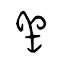</td>
        <td><a href="https://sheepgeo.com/" target="_blank">SheepGeo</a></td>
        <td>国内首个AI GEO（生成式引擎优化）分析平台</td>
        <td><a href="https://sheepgeo.com/" target="_blank">🔗</a></td>
    </tr>
    <tr>
        <td>20</td>
        <td></td>
        <td><a href="https://pagentia.com/" target="_blank">博简智慧专利</a></td>
        <td>AI专利查新检索与撰写平台</td>
        <td><a href="https://pagentia.com/" target="_blank">🔗</a></td>
    </tr>
    <tr>
        <td>21</td>
        <td></td>
        <td><a href="https://www.lianqiai.cn/" target="_blank">链企AI</a></td>
        <td>链企智能推出的AI商业搜索和AI标书写作工具</td>
        <td><a href="https://www.lianqiai.cn/" target="_blank">🔗</a></td>
    </tr>
    <tr>
        <td>22</td>
        <td></td>
        <td><a href="https://so.360.com/" target="_blank">360AI搜索</a></td>
        <td>360推出的新一代AI搜索引擎</td>
        <td><a href="https://so.360.com/" target="_blank">🔗</a></td>
    </tr>
    <tr>
        <td>23</td>
        <td></td>
        <td><a href="https://ask.xiaoyuzhoufm.com/" target="_blank">问问小宇宙</a></td>
        <td>小宇宙推出的AI搜索产品</td>
        <td><a href="https://ask.xiaoyuzhoufm.com/" target="_blank">🔗</a></td>
    </tr>
    <tr>
        <td>24</td>
        <td></td>
        <td><a href="https://dexa.ai/" target="_blank">Dexa AI</a></td>
        <td>AI播客搜索工具</td>
        <td><a href="https://dexa.ai/" target="_blank">🔗</a></td>
    </tr>
    <tr>
        <td>25</td>
        <td></td>
        <td><a href="https://www.xanswer.com/" target="_blank">XAnswer</a></td>
        <td>支持生成思维导图的免费AI搜索工具</td>
        <td><a href="https://www.xanswer.com/" target="_blank">🔗</a></td>
    </tr>
    <tr>
        <td>26</td>
        <td></td>
        <td><a href="https://www.glean.com/" target="_blank">Glean</a></td>
        <td>专为职场人设计的AI搜索引擎</td>
        <td><a href="https://www.glean.com/" target="_blank">🔗</a></td>
    </tr>
    <tr>
        <td>27</td>
        <td></td>
        <td><a href="https://www.alpha-sense.com/" target="_blank">AlphaSense</a></td>
        <td>专为金融专业人士设计的AI搜索工具</td>
        <td><a href="https://www.alpha-sense.com/" target="_blank">🔗</a></td>
    </tr>
    <tr>
        <td>28</td>
        <td></td>
        <td><a href="https://explorer.globe.engineer/" target="_blank">Globe Explorer</a></td>
        <td>结构化AI知识搜索引擎</td>
        <td><a href="https://explorer.globe.engineer/" target="_blank">🔗</a></td>
    </tr>
    <tr>
        <td>29</td>
        <td></td>
        <td><a href="https://reportify.cc/" target="_blank">Reportify</a></td>
        <td>AI投资研究问答搜索引擎</td>
        <td><a href="https://reportify.cc/" target="_blank">🔗</a></td>
    </tr>
    <tr>
        <td>30</td>
        <td></td>
        <td><a href="https://www.phind.com/" target="_blank">Phind</a></td>
        <td>专为开发者设计的AI搜索引擎</td>
        <td><a href="https://www.phind.com/" target="_blank">🔗</a></td>
    </tr>
    <tr>
        <td>31</td>
        <td></td>
        <td><a href="https://iask.ai/" target="_blank">iAsk AI</a></td>
        <td>快速准确的AI搜索引擎</td>
        <td><a href="https://iask.ai/" target="_blank">🔗</a></td>
    </tr>
    <tr>
        <td>32</td>
        <td></td>
        <td><a href="https://consensus.app/" target="_blank">Consensus</a></td>
        <td>AI科研学术搜索引擎</td>
        <td><a href="https://consensus.app/" target="_blank">🔗</a></td>
    </tr>
    <tr>
        <td>33</td>
        <td></td>
        <td><a href="https://komo.ai/" target="_blank">Komo Search</a></td>
        <td>简洁直观的AI搜索引擎</td>
        <td><a href="https://komo.ai/" target="_blank">🔗</a></td>
    </tr>
    <tr>
        <td>34</td>
        <td></td>
        <td><a href="https://searcholic.com/" target="_blank">Searcholic</a></td>
        <td>AI驱动的电子书和文档搜索引擎</td>
        <td><a href="https://searcholic.com/" target="_blank">🔗</a></td>
    </tr>
    <tr>
        <td>35</td>
        <td></td>
        <td><a href="https://andisearch.com/" target="_blank">Andi</a></td>
        <td>对话式人工智能搜索引擎</td>
        <td><a href="https://andisearch.com/" target="_blank">🔗</a></td>
    </tr>
    <tr>
        <td>36</td>
        <td></td>
        <td><a href="https://www.songtell.com/" target="_blank">Songtell</a></td>
        <td>AI驱动的音乐百科搜索引擎</td>
        <td><a href="https://www.songtell.com/" target="_blank">🔗</a></td>
    </tr>
    <tr>
        <td>37</td>
        <td></td>
        <td><a href="https://thinkany.ai/zh" target="_blank">ThinkAny</a></td>
        <td>新时代的AI搜索引擎</td>
        <td><a href="https://thinkany.ai/zh" target="_blank">🔗</a></td>
    </tr>
    <tr>
        <td>38</td>
        <td></td>
        <td><a href="https://www.hellomiku.com/" target="_blank">Miku</a></td>
        <td>快速精准的AI搜索引擎</td>
        <td><a href="https://www.hellomiku.com/" target="_blank">🔗</a></td>
    </tr>
    <tr>
        <td>39</td>
        <td></td>
        <td><a href="https://qdrant.tech/" target="_blank">Qdrant</a></td>
        <td>开源的向量数据库和向量相似性AI搜索引擎</td>
        <td><a href="https://qdrant.tech/" target="_blank">🔗</a></td>
    </tr>
    <tr>
        <td>40</td>
        <td></td>
        <td><a href="https://www.adot.tech/" target="_blank">Adot</a></td>
        <td>一个由AI驱动的 Web3 搜索引擎</td>
        <td><a href="https://www.adot.tech/" target="_blank">🔗</a></td>
    </tr>
    <tr>
        <td>41</td>
        <td></td>
        <td><a href="https://kaisouai.com/" target="_blank">开搜AI</a></td>
        <td>面向大众的免费AI问答搜索引擎</td>
        <td><a href="https://kaisouai.com/" target="_blank">🔗</a></td>
    </tr>
</table>

## AI开发平台

<table>
    <tr>
        <td>1</td>
        <td></td>
        <td><a href="https://www.miaoda.cn/?invitecode=user-1pb0xv8cighs" target="_blank">秒哒</a></td>
        <td>无代码AI应用开发平台，一句话做应用</td>
        <td><a href="https://www.miaoda.cn/?invitecode=user-1pb0xv8cighs" target="_blank">🔗</a></td>
    </tr>
    <tr>
        <td>2</td>
        <td></td>
        <td><a href="https://ai-bot.cn/sites/71659.html" target="_blank">讯飞星辰MaaS</a></td>
        <td>高性价比 Coding Plan 套餐，一站式调用主流模型</td>
        <td><a href="https://ai-bot.cn/sites/71659.html" target="_blank">🔗</a></td>
    </tr>
    <tr>
        <td>3</td>
        <td></td>
        <td><a href="https://codeflying.cgref.cn/aibot" target="_blank">码上飞</a></td>
        <td>一句话生成微信小程序、APP、H5网页</td>
        <td><a href="https://codeflying.cgref.cn/aibot" target="_blank">🔗</a></td>
    </tr>
    <tr>
        <td>4</td>
        <td></td>
        <td><a href="https://www.bigmodel.cn/glm-coding?ic=MVB8Y7QOLF" target="_blank">BigModel</a></td>
        <td>智谱推出的企业级大模型开放平台（MaaS）</td>
        <td><a href="https://www.bigmodel.cn/glm-coding?ic=MVB8Y7QOLF" target="_blank">🔗</a></td>
    </tr>
    <tr>
        <td>5</td>
        <td></td>
        <td><a href="https://bailian.console.aliyun.com/cn-beijing#/home?userCode=ex9ez2fz" target="_blank">阿里云百炼</a></td>
        <td>一站式大模型开发与应用构建平台</td>
        <td><a href="https://bailian.console.aliyun.com/cn-beijing#/home?userCode=ex9ez2fz" target="_blank">🔗</a></td>
    </tr>
    <tr>
        <td>6</td>
        <td></td>
        <td><a href="https://www.coze.cn/&utm=cg&cgv=aibotttt" target="_blank">Coze</a></td>
        <td>海量AI智能体免费用，一键复制同款</td>
        <td><a href="https://www.coze.cn/&utm=cg&cgv=aibotttt" target="_blank">🔗</a></td>
    </tr>
    <tr>
        <td>7</td>
        <td></td>
        <td><a href="https://volcengine.cgref.cn/aibott" target="_blank">方舟 Agent Plan</a></td>
        <td>火山引擎推出的业界首个 Agent 套餐</td>
        <td><a href="https://volcengine.cgref.cn/aibott" target="_blank">🔗</a></td>
    </tr>
    <tr>
        <td>8</td>
        <td></td>
        <td><a href="https://zenmux.ai/" target="_blank">ZenMux</a></td>
        <td>全球首个带保险赔付机制的企业级大模型聚合平台</td>
        <td><a href="https://zenmux.ai/" target="_blank">🔗</a></td>
    </tr>
    <tr>
        <td>9</td>
        <td></td>
        <td><a href="https://aistudio.google.com/" target="_blank">Google AI Studio</a></td>
        <td>免费体验和测试 Google 最新的 AI 模型</td>
        <td><a href="https://aistudio.google.com/" target="_blank">🔗</a></td>
    </tr>
    <tr>
        <td>10</td>
        <td></td>
        <td><a href="https://cloud.fastgpt.cn/dashboard/templateMarket" target="_blank">FastGPT</a></td>
        <td>免费AI工作流搭建工具 自动化提高效率</td>
        <td><a href="https://cloud.fastgpt.cn/dashboard/templateMarket" target="_blank">🔗</a></td>
    </tr>
    <tr>
        <td>11</td>
        <td></td>
        <td><a href="https://ai-bot.cn/zion" target="_blank">Zion</a></td>
        <td>全栈开发AI Agent应用的无代码开发平台</td>
        <td><a href="https://ai-bot.cn/zion" target="_blank">🔗</a></td>
    </tr>
    <tr>
        <td>12</td>
        <td></td>
        <td><a href="https://n8n.io/" target="_blank">n8n</a></td>
        <td>开源的低代码AI工作流自动化工具</td>
        <td><a href="https://n8n.io/" target="_blank">🔗</a></td>
    </tr>
    <tr>
        <td>13</td>
        <td></td>
        <td><a href="https://ai-bot.cn/dify" target="_blank">Dify</a></td>
        <td>开源的生成式AI应用开发平台</td>
        <td><a href="https://ai-bot.cn/dify" target="_blank">🔗</a></td>
    </tr>
    <tr>
        <td>14</td>
        <td></td>
        <td><a href="https://www.qianwenai.com/" target="_blank">千问云</a></td>
        <td>阿里云推出的全新MaaS模型服务平台</td>
        <td><a href="https://www.qianwenai.com/" target="_blank">🔗</a></td>
    </tr>
    <tr>
        <td>15</td>
        <td></td>
        <td><a href="https://streamlake.com/" target="_blank">StreamLake</a></td>
        <td>快手推出的音视频及 AI 开放平台</td>
        <td><a href="https://streamlake.com/" target="_blank">🔗</a></td>
    </tr>
    <tr>
        <td>16</td>
        <td></td>
        <td><a href="https://meoo.com/" target="_blank">秒悟Meoo</a></td>
        <td>阿里推出的首个对话式AI开发工具</td>
        <td><a href="https://meoo.com/" target="_blank">🔗</a></td>
    </tr>
    <tr>
        <td>17</td>
        <td></td>
        <td><a href="https://wanxiaozhi.aliyun.com/" target="_blank">万小智</a></td>
        <td>阿里云推出的企业级 AI 建站平台</td>
        <td><a href="https://wanxiaozhi.aliyun.com/" target="_blank">🔗</a></td>
    </tr>
    <tr>
        <td>18</td>
        <td></td>
        <td><a href="https://www.myaifast.com/company/login?inviteCode=AGENT202605120003&type=register&inviteSource=agent" target="_blank">麦芽AI</a></td>
        <td>多范式兼容，全流程 AI 项目开发</td>
        <td><a href="https://www.myaifast.com/company/login?inviteCode=AGENT202605120003&type=register&inviteSource=agent" target="_blank">🔗</a></td>
    </tr>
    <tr>
        <td>19</td>
        <td></td>
        <td><a href="https://trickle.so/" target="_blank">Trickle AI</a></td>
        <td>一站式无代码 AI 开发平台</td>
        <td><a href="https://trickle.so/" target="_blank">🔗</a></td>
    </tr>
    <tr>
        <td>20</td>
        <td></td>
        <td><a href="https://openrouter.ai/" target="_blank">OpenRouter</a></td>
        <td>AI 模型 API 聚合平台，一个接口调用400多个模型</td>
        <td><a href="https://openrouter.ai/" target="_blank">🔗</a></td>
    </tr>
    <tr>
        <td>21</td>
        <td></td>
        <td><a href="https://cloud.siliconflow.cn/i/SjhsJgfH" target="_blank">SiliconFlow</a></td>
        <td>生成式AI计算基础设施平台</td>
        <td><a href="https://cloud.siliconflow.cn/i/SjhsJgfH" target="_blank">🔗</a></td>
    </tr>
    <tr>
        <td>22</td>
        <td></td>
        <td><a href="https://ofox.io/" target="_blank">OfoxAI</a></td>
        <td>统一大模型 API 聚合网关</td>
        <td><a href="https://ofox.io/" target="_blank">🔗</a></td>
    </tr>
    <tr>
        <td>23</td>
        <td></td>
        <td><a href="https://worldclaw.ai/" target="_blank">WorldClaw</a></td>
        <td>World Liberty Financial 团队推出的 AI 模型聚合平台</td>
        <td><a href="https://worldclaw.ai/" target="_blank">🔗</a></td>
    </tr>
    <tr>
        <td>24</td>
        <td></td>
        <td><a href="https://tokendance.space/" target="_blank">TokenDance</a></td>
        <td>观猹团队推出的一站式大模型 API 调用平台</td>
        <td><a href="https://tokendance.space/" target="_blank">🔗</a></td>
    </tr>
    <tr>
        <td>25</td>
        <td></td>
        <td><a href="https://ecloud.10086.cn/portal/product/MaaS" target="_blank">MoMA</a></td>
        <td>中国移动推出的国内首个开放普惠大模型聚合平台</td>
        <td><a href="https://ecloud.10086.cn/portal/product/MaaS" target="_blank">🔗</a></td>
    </tr>
    <tr>
        <td>26</td>
        <td></td>
        <td><a href="https://open.bochaai.com/" target="_blank">博查万象</a></td>
        <td>博查多模态混合搜索和语义排序API开放平台</td>
        <td><a href="https://open.bochaai.com/" target="_blank">🔗</a></td>
    </tr>
    <tr>
        <td>27</td>
        <td></td>
        <td><a href="https://b.ai/" target="_blank">B.AI</a></td>
        <td>基于区块链构建的大模型API聚合平台</td>
        <td><a href="https://b.ai/" target="_blank">🔗</a></td>
    </tr>
    <tr>
        <td>28</td>
        <td></td>
        <td><a href="https://www.lingguang.com/chat" target="_blank">灵光</a></td>
        <td>蚂蚁推出的AI对话与应用生成平台</td>
        <td><a href="https://www.lingguang.com/chat" target="_blank">🔗</a></td>
    </tr>
    <tr>
        <td>29</td>
        <td></td>
        <td><a href="https://ai-bot.cn/base44" target="_blank">BASE44</a></td>
        <td>零代码AI应用开发平台</td>
        <td><a href="https://ai-bot.cn/base44" target="_blank">🔗</a></td>
    </tr>
    <tr>
        <td>30</td>
        <td></td>
        <td><a href="https://www.ebcloud.com/" target="_blank">英博云AI算力</a></td>
        <td>英博数科推出的GPU智算服务云平台</td>
        <td><a href="https://www.ebcloud.com/" target="_blank">🔗</a></td>
    </tr>
    <tr>
        <td>31</td>
        <td></td>
        <td><a href="https://www.agentsyun.com/marketing?aibot" target="_blank">汇智Token工场</a></td>
        <td>大模型API聚合与极速推理云平台</td>
        <td><a href="https://www.agentsyun.com/marketing?aibot" target="_blank">🔗</a></td>
    </tr>
    <tr>
        <td>32</td>
        <td></td>
        <td><a href="https://aippy.ai/" target="_blank">Aippy</a></td>
        <td>赤子城科技推出的 AI 游戏社区，被誉为”游戏版TikTok”</td>
        <td><a href="https://aippy.ai/" target="_blank">🔗</a></td>
    </tr>
    <tr>
        <td>33</td>
        <td></td>
        <td><a href="https://www.inscode.net/" target="_blank">快马InsCode</a></td>
        <td>通过对话、设计图或文章链接生成工程项目代码</td>
        <td><a href="https://www.inscode.net/" target="_blank">🔗</a></td>
    </tr>
    <tr>
        <td>34</td>
        <td></td>
        <td><a href="https://ai-bot.cn/nocode" target="_blank">NoCode</a></td>
        <td>美团推出的零代码AI应用开发平台</td>
        <td><a href="https://ai-bot.cn/nocode" target="_blank">🔗</a></td>
    </tr>
    <tr>
        <td>35</td>
        <td></td>
        <td><a href="https://whacka.app/" target="_blank">Whacka</a></td>
        <td>移动端 AI 无代码应用开发工具</td>
        <td><a href="https://whacka.app/" target="_blank">🔗</a></td>
    </tr>
    <tr>
        <td>36</td>
        <td></td>
        <td><a href="https://gapp.so/" target="_blank">gapp.so</a></td>
        <td>AI 应用构建发布与托管平台，一键上线完整解决方案</td>
        <td><a href="https://gapp.so/" target="_blank">🔗</a></td>
    </tr>
    <tr>
        <td>37</td>
        <td></td>
        <td><a href="https://shuyanai.com/" target="_blank">数眼智能AI</a></td>
        <td>企业级AI数据与模型服务平台</td>
        <td><a href="https://shuyanai.com/" target="_blank">🔗</a></td>
    </tr>
    <tr>
        <td>38</td>
        <td></td>
        <td><a href="https://www.sophnet.com/#?code=OMQFR0" target="_blank">SophNet</a></td>
        <td>DeepSeek API 推理速度最快的平台，没有之一</td>
        <td><a href="https://www.sophnet.com/#?code=OMQFR0" target="_blank">🔗</a></td>
    </tr>
    <tr>
        <td>39</td>
        <td></td>
        <td><a href="https://www.mornai.cn/" target="_blank">晨涧云</a></td>
        <td>AI算力平台，GPU算力租赁、开箱即用</td>
        <td><a href="https://www.mornai.cn/" target="_blank">🔗</a></td>
    </tr>
    <tr>
        <td>40</td>
        <td></td>
        <td><a href="https://www.llamafactory.online/register" target="_blank">LLaMA-Factory Online</a></td>
        <td>在线AI大模型微调平台，零代码、可视化操作</td>
        <td><a href="https://www.llamafactory.online/register" target="_blank">🔗</a></td>
    </tr>
    <tr>
        <td>41</td>
        <td></td>
        <td><a href="https://www.lab4ai.cn/register" target="_blank">大模型实验室</a></td>
        <td>在线大模型训练微调及AI科研学习平台</td>
        <td><a href="https://www.lab4ai.cn/register" target="_blank">🔗</a></td>
    </tr>
    <tr>
        <td>42</td>
        <td></td>
        <td><a href="https://apimart.ai/" target="_blank">APIMart</a></td>
        <td>一站式 AI API 平台，多主流模型统一访问</td>
        <td><a href="https://apimart.ai/" target="_blank">🔗</a></td>
    </tr>
    <tr>
        <td>43</td>
        <td>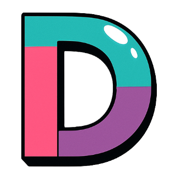</td>
        <td><a href="https://dmxapi.cn/" target="_blank">DMXAPI</a></td>
        <td>一个Key用全球大模型</td>
        <td><a href="https://dmxapi.cn/" target="_blank">🔗</a></td>
    </tr>
    <tr>
        <td>44</td>
        <td></td>
        <td><a href="https://www.tokenpony.cn/5EN1y" target="_blank">小马算力</a></td>
        <td>AI模型API聚合平台，自由调用不同模型</td>
        <td><a href="https://www.tokenpony.cn/5EN1y" target="_blank">🔗</a></td>
    </tr>
    <tr>
        <td>45</td>
        <td></td>
        <td><a href="https://refly.ai/" target="_blank">Refly</a></td>
        <td>全球首个开源 Vibe Workflow 平台</td>
        <td><a href="https://refly.ai/" target="_blank">🔗</a></td>
    </tr>
    <tr>
        <td>46</td>
        <td></td>
        <td><a href="https://dakou.iflow.cn/" target="_blank">搭叩</a></td>
        <td>心流AI旗下异步AI智能体开发平台</td>
        <td><a href="https://dakou.iflow.cn/" target="_blank">🔗</a></td>
    </tr>
    <tr>
        <td>47</td>
        <td></td>
        <td><a href="https://creao.ai/" target="_blank">CREAO</a></td>
        <td>零代码AI应用开发平台，内置AI智能体</td>
        <td><a href="https://creao.ai/" target="_blank">🔗</a></td>
    </tr>
    <tr>
        <td>48</td>
        <td></td>
        <td><a href="https://ai-bot.cn/make" target="_blank">Make</a></td>
        <td>AI零代码自动化工作流搭建平台</td>
        <td><a href="https://ai-bot.cn/make" target="_blank">🔗</a></td>
    </tr>
    <tr>
        <td>49</td>
        <td></td>
        <td><a href="https://ai-bot.cn/wordware" target="_blank">Wordware</a></td>
        <td>零代码构建AI Agent和应用的开发平台</td>
        <td><a href="https://ai-bot.cn/wordware" target="_blank">🔗</a></td>
    </tr>
    <tr>
        <td>50</td>
        <td></td>
        <td><a href="https://www.tianrang.com/" target="_blank">天壤小白</a></td>
        <td>一站式AI应用开发平台</td>
        <td><a href="https://www.tianrang.com/" target="_blank">🔗</a></td>
    </tr>
    <tr>
        <td>51</td>
        <td></td>
        <td><a href="https://ppio.cn/" target="_blank">PPIO派欧云</a></td>
        <td>AI云端一体化解决方案服务平台</td>
        <td><a href="https://ppio.cn/" target="_blank">🔗</a></td>
    </tr>
    <tr>
        <td>52</td>
        <td></td>
        <td><a href="https://tbox.alipay.com/" target="_blank">蚂蚁百宝箱Tbox</a></td>
        <td>让AI应用的创作像呼吸一样简单</td>
        <td><a href="https://tbox.alipay.com/" target="_blank">🔗</a></td>
    </tr>
    <tr>
        <td>53</td>
        <td></td>
        <td><a href="https://wavespeed.ai/" target="_blank">WaveSpeedAI</a></td>
        <td>AI图像和AI视频生成加速服务平台</td>
        <td><a href="https://wavespeed.ai/" target="_blank">🔗</a></td>
    </tr>
    <tr>
        <td>54</td>
        <td></td>
        <td><a href="https://ai.gitee.com/" target="_blank">模力方舟</a></td>
        <td>AI应用共创平台，提供开发到部署一站式服务</td>
        <td><a href="https://ai.gitee.com/" target="_blank">🔗</a></td>
    </tr>
    <tr>
        <td>55</td>
        <td></td>
        <td><a href="https://longcat.chat/platform/" target="_blank">LongCat开放平台</a></td>
        <td>美团推出的大模型API服务平台</td>
        <td><a href="https://longcat.chat/platform/" target="_blank">🔗</a></td>
    </tr>
    <tr>
        <td>56</td>
        <td></td>
        <td><a href="https://www.x-aio.com/" target="_blank">X-All in one</a></td>
        <td>高性能、高性价比的 AI API 平台</td>
        <td><a href="https://www.x-aio.com/" target="_blank">🔗</a></td>
    </tr>
    <tr>
        <td>57</td>
        <td></td>
        <td><a href="https://cloud.infini-ai.com/platform/ai" target="_blank">无问芯穹</a></td>
        <td>AI大模型服务平台，提供从算力、模型到应用一站式服务</td>
        <td><a href="https://cloud.infini-ai.com/platform/ai" target="_blank">🔗</a></td>
    </tr>
    <tr>
        <td>58</td>
        <td></td>
        <td><a href="https://www.shengsuanyun.com/" target="_blank">胜算云</a></td>
        <td>AI模型算力聚合平台，聚合全球100+大模型</td>
        <td><a href="https://www.shengsuanyun.com/" target="_blank">🔗</a></td>
    </tr>
    <tr>
        <td>59</td>
        <td></td>
        <td><a href="https://bigmodel.cn/agent&_channel_track_key=vqYFLTGW" target="_blank">智谱清流</a></td>
        <td>智谱推出的企业级AI智能体开发平台</td>
        <td><a href="https://bigmodel.cn/agent&_channel_track_key=vqYFLTGW" target="_blank">🔗</a></td>
    </tr>
    <tr>
        <td>60</td>
        <td></td>
        <td><a href="https://agents.baidu.com/" target="_blank">文心智能体平台</a></td>
        <td>百度推出的智能体构建平台</td>
        <td><a href="https://agents.baidu.com/" target="_blank">🔗</a></td>
    </tr>
    <tr>
        <td>61</td>
        <td></td>
        <td><a href="https://model-platform-skyagents.tiangong.cn/home/agent" target="_blank">SkyAgents</a></td>
        <td>昆仑万维推出的 AI Agent 开发平台</td>
        <td><a href="https://model-platform-skyagents.tiangong.cn/home/agent" target="_blank">🔗</a></td>
    </tr>
    <tr>
        <td>62</td>
        <td></td>
        <td><a href="https://yanxi.jd.com/" target="_blank">言犀智能体平台</a></td>
        <td>京东推出的一站式AI智能体开发平台</td>
        <td><a href="https://yanxi.jd.com/" target="_blank">🔗</a></td>
    </tr>
    <tr>
        <td>63</td>
        <td></td>
        <td><a href="https://modelers.cn/" target="_blank">魔乐社区</a></td>
        <td>中国电信天翼云推出的人工智能社区</td>
        <td><a href="https://modelers.cn/" target="_blank">🔗</a></td>
    </tr>
    <tr>
        <td>64</td>
        <td></td>
        <td><a href="https://www.betteryeah.com/" target="_blank">BetterYeah AI</a></td>
        <td>企业AI应用和助手构建平台</td>
        <td><a href="https://www.betteryeah.com/" target="_blank">🔗</a></td>
    </tr>
    <tr>
        <td>65</td>
        <td></td>
        <td><a href="https://www.paddlepaddle.org.cn/" target="_blank">飞桨PaddlePaddle</a></td>
        <td>开源深度学习平台</td>
        <td><a href="https://www.paddlepaddle.org.cn/" target="_blank">🔗</a></td>
    </tr>
    <tr>
        <td>66</td>
        <td></td>
        <td><a href="https://www.mindspore.cn/" target="_blank">昇思MindSpore</a></td>
        <td>华为开源的自研AI深度学习框架</td>
        <td><a href="https://www.mindspore.cn/" target="_blank">🔗</a></td>
    </tr>
    <tr>
        <td>67</td>
        <td></td>
        <td><a href="https://pytorch.org/" target="_blank">PyTorch</a></td>
        <td>开源的机器学习库</td>
        <td><a href="https://pytorch.org/" target="_blank">🔗</a></td>
    </tr>
    <tr>
        <td>68</td>
        <td></td>
        <td><a href="https://www.gumloop.com/" target="_blank">Gumloop</a></td>
        <td>AI零代码工作流平台，支持用户自定义工作流程</td>
        <td><a href="https://www.gumloop.com/" target="_blank">🔗</a></td>
    </tr>
    <tr>
        <td>69</td>
        <td></td>
        <td><a href="https://www.tensorflow.org/" target="_blank">TensorFlow</a></td>
        <td>Google推出的机器学习和人工智能开源库</td>
        <td><a href="https://www.tensorflow.org/" target="_blank">🔗</a></td>
    </tr>
    <tr>
        <td>70</td>
        <td></td>
        <td><a href="https://mxnet.apache.org/" target="_blank">Apache MXNet</a></td>
        <td>免费开源的深度学习框架</td>
        <td><a href="https://mxnet.apache.org/" target="_blank">🔗</a></td>
    </tr>
    <tr>
        <td>71</td>
        <td></td>
        <td><a href="https://scikit-learn.org/" target="_blank">Scikit-learn</a></td>
        <td>Python机器学习库</td>
        <td><a href="https://scikit-learn.org/" target="_blank">🔗</a></td>
    </tr>
    <tr>
        <td>72</td>
        <td></td>
        <td><a href="https://ml-explore.github.io/mlx/build/html/index.html" target="_blank">MLX</a></td>
        <td>苹果推出的开源机器学习框架，专为Apple Silicon芯片设计</td>
        <td><a href="https://ml-explore.github.io/mlx/build/html/index.html" target="_blank">🔗</a></td>
    </tr>
    <tr>
        <td>73</td>
        <td></td>
        <td><a href="https://labelstud.io/" target="_blank">Label Studio</a></td>
        <td>免费开源的数据标注工具</td>
        <td><a href="https://labelstud.io/" target="_blank">🔗</a></td>
    </tr>
    <tr>
        <td>74</td>
        <td></td>
        <td><a href="https://lumina.sh/" target="_blank">Chunkr</a></td>
        <td>Lumina AI 推出的开源文档处理API</td>
        <td><a href="https://lumina.sh/" target="_blank">🔗</a></td>
    </tr>
    <tr>
        <td>75</td>
        <td></td>
        <td><a href="https://sdk.vercel.ai/docs" target="_blank">Vercel AI SDK</a></td>
        <td>Vercel开源的搭建AI聊天机器人的开发套件，支持React/Svelte/Vue等框架</td>
        <td><a href="https://sdk.vercel.ai/docs" target="_blank">🔗</a></td>
    </tr>
    <tr>
        <td>76</td>
        <td></td>
        <td><a href="https://keras.io/" target="_blank">Keras</a></td>
        <td>Python版本的TensorFlow深度学习API</td>
        <td><a href="https://keras.io/" target="_blank">🔗</a></td>
    </tr>
    <tr>
        <td>77</td>
        <td>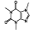</td>
        <td><a href="https://caffe.berkeleyvision.org/" target="_blank">Caffe</a></td>
        <td>UC伯克利研究推出的深度学习框架</td>
        <td><a href="https://caffe.berkeleyvision.org/" target="_blank">🔗</a></td>
    </tr>
    <tr>
        <td>78</td>
        <td></td>
        <td><a href="https://numpy.org/" target="_blank">NumPy</a></td>
        <td>Python科学计算必备的包</td>
        <td><a href="https://numpy.org/" target="_blank">🔗</a></td>
    </tr>
    <tr>
        <td>79</td>
        <td></td>
        <td><a href="https://deeplearning4j.konduit.ai/" target="_blank">DL4J</a></td>
        <td>开源的使用JVM部署和训练深度学习模型的套件</td>
        <td><a href="https://deeplearning4j.konduit.ai/" target="_blank">🔗</a></td>
    </tr>
    <tr>
        <td>80</td>
        <td></td>
        <td><a href="https://jax.readthedocs.io/en/latest" target="_blank">JAX</a></td>
        <td>Google推出的用于变换数值函数的机器学习框架</td>
        <td><a href="https://jax.readthedocs.io/en/latest" target="_blank">🔗</a></td>
    </tr>
    <tr>
        <td>81</td>
        <td></td>
        <td><a href="https://www.nltk.org/" target="_blank">NLTK</a></td>
        <td>Python自然语言处理工具包</td>
        <td><a href="https://www.nltk.org/" target="_blank">🔗</a></td>
    </tr>
    <tr>
        <td>82</td>
        <td></td>
        <td><a href="https://docs.langchain.com/docs/" target="_blank">LangChain</a></td>
        <td>开发由语言模型驱动的应用程序的框架</td>
        <td><a href="https://docs.langchain.com/docs/" target="_blank">🔗</a></td>
    </tr>
    <tr>
        <td>83</td>
        <td></td>
        <td><a href="https://lightning.ai/" target="_blank">Lightning AI</a></td>
        <td>快速训练、部署和开发人工智能产品的深度学习框架，由Pytorch Lightning团队推出</td>
        <td><a href="https://lightning.ai/" target="_blank">🔗</a></td>
    </tr>
    <tr>
        <td>84</td>
        <td></td>
        <td><a href="https://www.tryleap.ai/" target="_blank">Leap</a></td>
        <td>将AI快速集成到你自己的应用中</td>
        <td><a href="https://www.tryleap.ai/" target="_blank">🔗</a></td>
    </tr>
    <tr>
        <td>85</td>
        <td></td>
        <td><a href="https://chatdev.modelbest.cn/" target="_blank">ChatDev</a></td>
        <td>面壁智能推出的AI智能体软件开发平台，使用自然语言即可创建软件</td>
        <td><a href="https://chatdev.modelbest.cn/" target="_blank">🔗</a></td>
    </tr>
    <tr>
        <td>86</td>
        <td></td>
        <td><a href="https://anakin.ai/zh-cn" target="_blank">Anakin.ai</a></td>
        <td>一站式无代码AI应用构建平台</td>
        <td><a href="https://anakin.ai/zh-cn" target="_blank">🔗</a></td>
    </tr>
</table>

## AI学习网站

<table>
    <tr>
        <td>1</td>
        <td></td>
        <td><a href="https://www.aidaxue.com/?ch=daxue_collection_1" target="_blank">AI大学堂</a></td>
        <td>科大讯飞推出的在线AI学习平台</td>
        <td><a href="https://www.aidaxue.com/?ch=daxue_collection_1" target="_blank">🔗</a></td>
    </tr>
    <tr>
        <td>2</td>
        <td></td>
        <td><a href="https://d.design/study" target="_blank">堆友AI学习</a></td>
        <td>堆友AI推出的AI设计知识学习网站</td>
        <td><a href="https://d.design/study" target="_blank">🔗</a></td>
    </tr>
    <tr>
        <td>3</td>
        <td></td>
        <td><a href="https://aisharenet.com/" target="_blank">AI分享圈</a></td>
        <td>最好最全的AI免费资源分享网站</td>
        <td><a href="https://aisharenet.com/" target="_blank">🔗</a></td>
    </tr>
    <tr>
        <td>4</td>
        <td></td>
        <td><a href="https://ai-bot.cn/openai-academy" target="_blank">OpenAI Academy</a></td>
        <td>OpenAI 推出的免费 AI 学习平台</td>
        <td><a href="https://ai-bot.cn/openai-academy" target="_blank">🔗</a></td>
    </tr>
    <tr>
        <td>5</td>
        <td></td>
        <td><a href="https://dayofai.org/" target="_blank">Day of AI</a></td>
        <td>麻省理工学院（MIT）推出的免费AI学习平台</td>
        <td><a href="https://dayofai.org/" target="_blank">🔗</a></td>
    </tr>
    <tr>
        <td>6</td>
        <td></td>
        <td><a href="https://www.fast.ai/" target="_blank">fast.ai</a></td>
        <td>免费开源的深度学习和AI学习网站，让每个人都参与到AI！</td>
        <td><a href="https://www.fast.ai/" target="_blank">🔗</a></td>
    </tr>
    <tr>
        <td>7</td>
        <td></td>
        <td><a href="https://www.xue8nav.com/" target="_blank">学吧导航</a></td>
        <td>学习爱好者首选的学霸导航网站</td>
        <td><a href="https://www.xue8nav.com/" target="_blank">🔗</a></td>
    </tr>
    <tr>
        <td>8</td>
        <td></td>
        <td><a href="https://lynote.ai/zh" target="_blank">Lynote</a></td>
        <td>面向学生、研究者和职场人士的 AI 学习助手</td>
        <td><a href="https://lynote.ai/zh" target="_blank">🔗</a></td>
    </tr>
    <tr>
        <td>9</td>
        <td></td>
        <td><a href="https://www.coursera.org/collections/best-machine-learning-ai" target="_blank">Coursera</a></td>
        <td>知名MOOC平台，提供众多人工智能和机器学习课程</td>
        <td><a href="https://www.coursera.org/collections/best-machine-learning-ai" target="_blank">🔗</a></td>
    </tr>
    <tr>
        <td>10</td>
        <td></td>
        <td><a href="https://www.elementsofai.com/" target="_blank">Elements of AI</a></td>
        <td>免费在线AI通识学习课程</td>
        <td><a href="https://www.elementsofai.com/" target="_blank">🔗</a></td>
    </tr>
    <tr>
        <td>11</td>
        <td></td>
        <td><a href="https://www.deeplearning.ai/" target="_blank">DeepLearning.AI</a></td>
        <td>深度学习和人工智能学习平台</td>
        <td><a href="https://www.deeplearning.ai/" target="_blank">🔗</a></td>
    </tr>
    <tr>
        <td>12</td>
        <td></td>
        <td><a href="https://zh.d2l.ai/" target="_blank">动手学深度学习</a></td>
        <td>结合理论与实践的深度学习教材和课程</td>
        <td><a href="https://zh.d2l.ai/" target="_blank">🔗</a></td>
    </tr>
    <tr>
        <td>13</td>
        <td></td>
        <td><a href="https://machinelearningmastery.com/" target="_blank">MachineLearningMastery</a></td>
        <td>免费在线的机器学习平台，提供从基础到高级全面教程</td>
        <td><a href="https://machinelearningmastery.com/" target="_blank">🔗</a></td>
    </tr>
    <tr>
        <td>14</td>
        <td></td>
        <td><a href="https://microsoft.github.io/generative-ai-for-beginners/" target="_blank">Generative AI for Beginners</a></td>
        <td>微软推出的面向初学者的免费生成式人工智能课程</td>
        <td><a href="https://microsoft.github.io/generative-ai-for-beginners/" target="_blank">🔗</a></td>
    </tr>
    <tr>
        <td>15</td>
        <td></td>
        <td><a href="https://microsoft.github.io/ML-For-Beginners/" target="_blank">ML for Beginners</a></td>
        <td>微软推出的免费开源的机器学习课程，GitHub标星7万+</td>
        <td><a href="https://microsoft.github.io/ML-For-Beginners/" target="_blank">🔗</a></td>
    </tr>
    <tr>
        <td>16</td>
        <td></td>
        <td><a href="https://www.kaggle.com/" target="_blank">Kaggle</a></td>
        <td>机器学习和数据科学社区</td>
        <td><a href="https://www.kaggle.com/" target="_blank">🔗</a></td>
    </tr>
    <tr>
        <td>17</td>
        <td></td>
        <td><a href="https://brilliant.org/courses/intro-neural-networks/" target="_blank">神经网络入门</a></td>
        <td>Brilliant推出的Introduction to Neural Networks课程</td>
        <td><a href="https://brilliant.org/courses/intro-neural-networks/" target="_blank">🔗</a></td>
    </tr>
    <tr>
        <td>18</td>
        <td></td>
        <td><a href="https://trancy.org/zh-cn" target="_blank">Trancy</a></td>
        <td>AI驱动的语言学习工具</td>
        <td><a href="https://trancy.org/zh-cn" target="_blank">🔗</a></td>
    </tr>
    <tr>
        <td>19</td>
        <td></td>
        <td><a href="https://coach.microsoft.com/" target="_blank">Reading Coach</a></td>
        <td>微软推出的免费个性化AI阅读学习教练</td>
        <td><a href="https://coach.microsoft.com/" target="_blank">🔗</a></td>
    </tr>
    <tr>
        <td>20</td>
        <td></td>
        <td><a href="https://aistudio.baidu.com/" target="_blank">飞桨AI Studio</a></td>
        <td>百度推出的AI学习与实训社区</td>
        <td><a href="https://aistudio.baidu.com/" target="_blank">🔗</a></td>
    </tr>
    <tr>
        <td>21</td>
        <td></td>
        <td><a href="https://coding.qq.com/" target="_blank">腾讯扣叮</a></td>
        <td>腾讯推出的青少年编程教育平台</td>
        <td><a href="https://coding.qq.com/" target="_blank">🔗</a></td>
    </tr>
    <tr>
        <td>22</td>
        <td></td>
        <td><a href="https://developer.aliyun.com/learning/roadmap/ai" target="_blank">阿里云AI学习路线</a></td>
        <td>阿里云推出的人工智能学习路线（学+测）</td>
        <td><a href="https://developer.aliyun.com/learning/roadmap/ai" target="_blank">🔗</a></td>
    </tr>
    <tr>
        <td>23</td>
        <td></td>
        <td><a href="https://www.udacity.com/school/artificial-intelligence" target="_blank">Udacity AI学院</a></td>
        <td>Udacity推出的School of AI，从入门到高级</td>
        <td><a href="https://www.udacity.com/school/artificial-intelligence" target="_blank">🔗</a></td>
    </tr>
    <tr>
        <td>24</td>
        <td></td>
        <td><a href="https://ai.google/" target="_blank">Google AI</a></td>
        <td>Google AI学习平台</td>
        <td><a href="https://ai.google/" target="_blank">🔗</a></td>
    </tr>
    <tr>
        <td>25</td>
        <td></td>
        <td><a href="https://www.showmeai.tech/" target="_blank">ShowMeAI知识社区</a></td>
        <td>人工智能领域的资料库和学习社区</td>
        <td><a href="https://www.showmeai.tech/" target="_blank">🔗</a></td>
    </tr>
    <tr>
        <td>26</td>
        <td></td>
        <td><a href="https://www.txyz.ai/" target="_blank">txyz</a></td>
        <td>AI文献阅读和学术研究辅助平台</td>
        <td><a href="https://www.txyz.ai/" target="_blank">🔗</a></td>
    </tr>
</table>

## AI训练模型

<table>
    <tr>
        <td>1</td>
        <td></td>
        <td><a href="https://maas.xfyun.cn/modelSquare?ch=maas-lm-G9n9" target="_blank">讯飞星辰MaaS</a></td>
        <td>一站式AI大模型体验、调用、部署、精调平台</td>
        <td><a href="https://maas.xfyun.cn/modelSquare?ch=maas-lm-G9n9" target="_blank">🔗</a></td>
    </tr>
    <tr>
        <td>2</td>
        <td></td>
        <td><a href="https://volcengine.cgref.cn/aibot" target="_blank">Seedance</a></td>
        <td>字节跳动 Seed 团队推出的多模态 AI 视频生成模型</td>
        <td><a href="https://volcengine.cgref.cn/aibot" target="_blank">🔗</a></td>
    </tr>
    <tr>
        <td>3</td>
        <td></td>
        <td><a href="https://deepmind.google/models/gemini-image/pro" target="_blank">Nano Banana</a></td>
        <td>谷歌推出的图像生成与编辑模型</td>
        <td><a href="https://deepmind.google/models/gemini-image/pro" target="_blank">🔗</a></td>
    </tr>
    <tr>
        <td>4</td>
        <td></td>
        <td><a href="https://www.cherry-ai.com/" target="_blank">Cherry Studio</a></td>
        <td>开源全能 AI 客户端助手</td>
        <td><a href="https://www.cherry-ai.com/" target="_blank">🔗</a></td>
    </tr>
    <tr>
        <td>5</td>
        <td></td>
        <td><a href="https://ollama.ai/" target="_blank">Ollama</a></td>
        <td>本地运行Llama和其他大语言模型</td>
        <td><a href="https://ollama.ai/" target="_blank">🔗</a></td>
    </tr>
    <tr>
        <td>6</td>
        <td></td>
        <td><a href="https://ai-bot.cn/anythingllm" target="_blank">AnythingLLM</a></td>
        <td>开源的全栈 AI 客户端，支持本地部署和API集成</td>
        <td><a href="https://ai-bot.cn/anythingllm" target="_blank">🔗</a></td>
    </tr>
    <tr>
        <td>7</td>
        <td></td>
        <td><a href="https://ai-bot.cn/chatbox-ai" target="_blank">Chatbox AI</a></td>
        <td>开源的AI客户端助手，支持多种主流AI模型</td>
        <td><a href="https://ai-bot.cn/chatbox-ai" target="_blank">🔗</a></td>
    </tr>
    <tr>
        <td>8</td>
        <td></td>
        <td><a href="https://www.modelscope.cn/" target="_blank">魔搭社区</a></td>
        <td>阿里达摩院推出的AI模型社区，超过300+开源AI模型</td>
        <td><a href="https://www.modelscope.cn/" target="_blank">🔗</a></td>
    </tr>
    <tr>
        <td>9</td>
        <td></td>
        <td><a href="https://volcengine.cgref.cn/aibotttt" target="_blank">豆包大模型</a></td>
        <td>字节跳动推出的AI大模型家族，包括视频生成、语音视觉、通用语言模型等</td>
        <td><a href="https://volcengine.cgref.cn/aibotttt" target="_blank">🔗</a></td>
    </tr>
    <tr>
        <td>10</td>
        <td></td>
        <td><a href="https://www.dataify.com/" target="_blank">Dataify</a></td>
        <td>数据采集API、高质量数据集、代理资源服务一体化供应</td>
        <td><a href="https://www.dataify.com/" target="_blank">🔗</a></td>
    </tr>
    <tr>
        <td>11</td>
        <td></td>
        <td><a href="https://www.aivinla.com/register?code=85307444" target="_blank">无阶未来</a></td>
        <td>AI应用与弹性算网平台</td>
        <td><a href="https://www.aivinla.com/register?code=85307444" target="_blank">🔗</a></td>
    </tr>
    <tr>
        <td>12</td>
        <td></td>
        <td><a href="https://agpt.co/" target="_blank">AutoGPT</a></td>
        <td>爆火的实现GPT-4完全自主的实验性开源项目，GitHub超10万星</td>
        <td><a href="https://agpt.co/" target="_blank">🔗</a></td>
    </tr>
    <tr>
        <td>13</td>
        <td></td>
        <td><a href="https://jan.ai/" target="_blank">Jan</a></td>
        <td>本地运行大模型并进行AI对话的工具，免费开源</td>
        <td><a href="https://jan.ai/" target="_blank">🔗</a></td>
    </tr>
    <tr>
        <td>14</td>
        <td></td>
        <td><a href="https://agentgpt.reworkd.ai/" target="_blank">AgentGPT</a></td>
        <td>在浏览器中组装、配置和部署自主人工智能的开源项目</td>
        <td><a href="https://agentgpt.reworkd.ai/" target="_blank">🔗</a></td>
    </tr>
    <tr>
        <td>15</td>
        <td></td>
        <td><a href="https://www.openbmb.org/home" target="_blank">OpenBMB</a></td>
        <td>清华团队支持发起的大规模预训练语言模型库与相关工具</td>
        <td><a href="https://www.openbmb.org/home" target="_blank">🔗</a></td>
    </tr>
    <tr>
        <td>16</td>
        <td></td>
        <td><a href="https://llama.meta.com/llama3/" target="_blank">Llama 3</a></td>
        <td>Meta最新开源推出的新一代大模型</td>
        <td><a href="https://llama.meta.com/llama3/" target="_blank">🔗</a></td>
    </tr>
    <tr>
        <td>17</td>
        <td></td>
        <td><a href="https://ai.google.dev/gemma?hl=zh-cn" target="_blank">Gemma</a></td>
        <td>谷歌推出的新一代轻量级开放模型</td>
        <td><a href="https://ai.google.dev/gemma?hl=zh-cn" target="_blank">🔗</a></td>
    </tr>
    <tr>
        <td>18</td>
        <td></td>
        <td><a href="https://ai-bot.cn/openai-gpt-4o" target="_blank">GPT-4o</a></td>
        <td>OpenAI最新发布的多模态AI大模型，可自然流畅地进行语音对话</td>
        <td><a href="https://ai-bot.cn/openai-gpt-4o" target="_blank">🔗</a></td>
    </tr>
    <tr>
        <td>19</td>
        <td></td>
        <td><a href="https://hunyuan.tencent.com/" target="_blank">腾讯混元大模型</a></td>
        <td>腾讯研发的大语言模型，具备强大的中文创作能力，复杂语境下的逻辑推理能力，以及可靠的任务执行能力</td>
        <td><a href="https://hunyuan.tencent.com/" target="_blank">🔗</a></td>
    </tr>
    <tr>
        <td>20</td>
        <td></td>
        <td><a href="https://intern-ai.org.cn/" target="_blank">书生大模型</a></td>
        <td>上海人工智能实验室推出的系列AI模型</td>
        <td><a href="https://intern-ai.org.cn/" target="_blank">🔗</a></td>
    </tr>
    <tr>
        <td>21</td>
        <td></td>
        <td><a href="https://wenxin.baidu.com/" target="_blank">文心大模型</a></td>
        <td>百度推出的产业级知识增强大模型</td>
        <td><a href="https://wenxin.baidu.com/" target="_blank">🔗</a></td>
    </tr>
    <tr>
        <td>22</td>
        <td></td>
        <td><a href="https://github.com/facebookresearch/llama" target="_blank">LLaMA</a></td>
        <td>Meta（Facebook）推出的AI大语言模型</td>
        <td><a href="https://github.com/facebookresearch/llama" target="_blank">🔗</a></td>
    </tr>
    <tr>
        <td>23</td>
        <td></td>
        <td><a href="https://www.baai.ac.cn/portal/article/index/cid/49/id/518.html" target="_blank">悟道</a></td>
        <td>智源“悟道”大模型，中国首个+世界最大人工智能大模型</td>
        <td><a href="https://www.baai.ac.cn/portal/article/index/cid/49/id/518.html" target="_blank">🔗</a></td>
    </tr>
    <tr>
        <td>24</td>
        <td></td>
        <td><a href="https://www.miraclevision.com/" target="_blank">MiracleVision奇想智能</a></td>
        <td>美图推出的AI视觉大模型，支持AI图像、设计和视频创作</td>
        <td><a href="https://www.miraclevision.com/" target="_blank">🔗</a></td>
    </tr>
    <tr>
        <td>25</td>
        <td></td>
        <td><a href="https://gradio.app/" target="_blank">Gradio</a></td>
        <td>开源的搭建机器学习模型UI界面的Python库</td>
        <td><a href="https://gradio.app/" target="_blank">🔗</a></td>
    </tr>
    <tr>
        <td>26</td>
        <td></td>
        <td><a href="https://deepfloyd.ai/deepfloyd-if" target="_blank">DeepFloyd IF</a></td>
        <td>StabilityAI旗下的DeepFloyd团队推出的图片生成模型</td>
        <td><a href="https://deepfloyd.ai/deepfloyd-if" target="_blank">🔗</a></td>
    </tr>
    <tr>
        <td>27</td>
        <td></td>
        <td><a href="https://cohere.com/" target="_blank">Cohere</a></td>
        <td>构建AI产品的大语言模型平台</td>
        <td><a href="https://cohere.com/" target="_blank">🔗</a></td>
    </tr>
    <tr>
        <td>28</td>
        <td></td>
        <td><a href="https://openapi.mobvoi.com/index" target="_blank">序列猴子</a></td>
        <td>出门问问推出的一款超大规模的语言模型</td>
        <td><a href="https://openapi.mobvoi.com/index" target="_blank">🔗</a></td>
    </tr>
    <tr>
        <td>29</td>
        <td></td>
        <td><a href="https://huggingface.co/docs/transformers/model_doc/bloom" target="_blank">BLOOM</a></td>
        <td>HuggingFace推出的大型语言模型（LLM）</td>
        <td><a href="https://huggingface.co/docs/transformers/model_doc/bloom" target="_blank">🔗</a></td>
    </tr>
    <tr>
        <td>30</td>
        <td></td>
        <td><a href="https://m6.aliyun.com/#" target="_blank">阿里巴巴M6</a></td>
        <td>阿里巴巴达摩院推出的超大规模中文预训练模型(M6)</td>
        <td><a href="https://m6.aliyun.com/#" target="_blank">🔗</a></td>
    </tr>
    <tr>
        <td>31</td>
        <td></td>
        <td><a href="https://lamini.ai/" target="_blank">Lamini</a></td>
        <td>低门槛快速定制大语言模型的引擎</td>
        <td><a href="https://lamini.ai/" target="_blank">🔗</a></td>
    </tr>
    <tr>
        <td>32</td>
        <td></td>
        <td><a href="https://github.com/Stability-AI/StableLM" target="_blank">StableLM</a></td>
        <td>Stability AI推出的开源的类ChatGPT大语言模型</td>
        <td><a href="https://github.com/Stability-AI/StableLM" target="_blank">🔗</a></td>
    </tr>
    <tr>
        <td>33</td>
        <td></td>
        <td><a href="https://research.runwayml.com/gen2" target="_blank">Gen-2</a></td>
        <td>Runway最新推出的AI视频生成模型</td>
        <td><a href="https://research.runwayml.com/gen2" target="_blank">🔗</a></td>
    </tr>
    <tr>
        <td>34</td>
        <td></td>
        <td><a href="https://www.deepspeed.ai/" target="_blank">DeepSpeed</a></td>
        <td>微软开源的低成本实现类似ChatGPT的模型训练</td>
        <td><a href="https://www.deepspeed.ai/" target="_blank">🔗</a></td>
    </tr>
    <tr>
        <td>35</td>
        <td></td>
        <td><a href="https://ai.google/discover/palm2" target="_blank">PaLM 2</a></td>
        <td>Google的下一代大语言模型，超过3400亿参数</td>
        <td><a href="https://ai.google/discover/palm2" target="_blank">🔗</a></td>
    </tr>
    <tr>
        <td>36</td>
        <td></td>
        <td><a href="https://segment-anything.com/" target="_blank">Segment Anything（SAM）</a></td>
        <td>Meta最新推出的AI图像分割模型</td>
        <td><a href="https://segment-anything.com/" target="_blank">🔗</a></td>
    </tr>
    <tr>
        <td>37</td>
        <td></td>
        <td><a href="https://huggingface.co/" target="_blank">HuggingFace</a></td>
        <td>AI模型开发社区</td>
        <td><a href="https://huggingface.co/" target="_blank">🔗</a></td>
    </tr>
    <tr>
        <td>38</td>
        <td></td>
        <td><a href="https://imagen.research.google/" target="_blank">Imagen</a></td>
        <td>Google AI文字到图像生成模型</td>
        <td><a href="https://imagen.research.google/" target="_blank">🔗</a></td>
    </tr>
    <tr>
        <td>39</td>
        <td></td>
        <td><a href="https://chat.lmsys.org/" target="_blank">StableVicuna</a></td>
        <td>第一个通过RLHF训练的大规模开源聊天机器人</td>
        <td><a href="https://chat.lmsys.org/" target="_blank">🔗</a></td>
    </tr>
    <tr>
        <td>40</td>
        <td></td>
        <td><a href="https://www.ibm.com/products/watsonx-ai" target="_blank">Watsonx.ai</a></td>
        <td>IBM推出的企业级生成式人工智能和机器学习平台</td>
        <td><a href="https://www.ibm.com/products/watsonx-ai" target="_blank">🔗</a></td>
    </tr>
    <tr>
        <td>41</td>
        <td></td>
        <td><a href="https://www.lobe.ai/" target="_blank">Lobe</a></td>
        <td>简单免费的机器学习模型训练工具</td>
        <td><a href="https://www.lobe.ai/" target="_blank">🔗</a></td>
    </tr>
    <tr>
        <td>42</td>
        <td></td>
        <td><a href="https://scale.com/" target="_blank">Scale AI</a></td>
        <td>AI机器学习标注训练平台</td>
        <td><a href="https://scale.com/" target="_blank">🔗</a></td>
    </tr>
    <tr>
        <td>43</td>
        <td></td>
        <td><a href="https://replicate.com/" target="_blank">Replicate</a></td>
        <td>在线运行开源机器学习模型</td>
        <td><a href="https://replicate.com/" target="_blank">🔗</a></td>
    </tr>
    <tr>
        <td>44</td>
        <td></td>
        <td><a href="https://www.evidentlyai.com/" target="_blank">Evidently AI</a></td>
        <td>开源的机器学习模型监测和测试工具</td>
        <td><a href="https://www.evidentlyai.com/" target="_blank">🔗</a></td>
    </tr>
    <tr>
        <td>45</td>
        <td></td>
        <td><a href="https://chat.sensetime.com/wb" target="_blank">商量SenseChat</a></td>
        <td>商汤科技推出的类ChatGPT的人工智能大语言模型</td>
        <td><a href="https://chat.sensetime.com/wb" target="_blank">🔗</a></td>
    </tr>
    <tr>
        <td>46</td>
        <td></td>
        <td><a href="https://www.tianrang.com/" target="_blank">天壤小白</a></td>
        <td>一站式AI应用开发平台</td>
        <td><a href="https://www.tianrang.com/" target="_blank">🔗</a></td>
    </tr>
    <tr>
        <td>47</td>
        <td></td>
        <td><a href="https://moss.fastnlp.top/" target="_blank">MOSS</a></td>
        <td>复旦大学团队开发的对话式大型语言模型</td>
        <td><a href="https://moss.fastnlp.top/" target="_blank">🔗</a></td>
    </tr>
</table>

## AI内容检测

<table>
    <tr>
        <td>1</td>
        <td></td>
        <td><a href="https://speedai.cgref.cn/aibot" target="_blank">SpeedAI</a></td>
        <td>AI科研助手，AIGC检测、降重降AI率</td>
        <td><a href="https://speedai.cgref.cn/aibot" target="_blank">🔗</a></td>
    </tr>
    <tr>
        <td>2</td>
        <td></td>
        <td><a href="https://gaoyiai.com/paper_aigc" target="_blank">稿易降AI率</a></td>
        <td>专注学术写作降AI率的工具</td>
        <td><a href="https://gaoyiai.com/paper_aigc" target="_blank">🔗</a></td>
    </tr>
    <tr>
        <td>3</td>
        <td></td>
        <td><a href="https://aigc.66paper.cn/AI_A2E1C09" target="_blank">66降AI率</a></td>
        <td>智能降AI率工具，适配知网最新检测</td>
        <td><a href="https://aigc.66paper.cn/AI_A2E1C09" target="_blank">🔗</a></td>
    </tr>
    <tr>
        <td>4</td>
        <td></td>
        <td><a href="https://ibiling.cn/paper-pass" target="_blank">笔灵降AI率</a></td>
        <td>降低AIGC痕迹工具，实时适配最新规则</td>
        <td><a href="https://ibiling.cn/paper-pass" target="_blank">🔗</a></td>
    </tr>
    <tr>
        <td>5</td>
        <td></td>
        <td><a href="https://www.aibiye.com/goods/jaigcl?code=ZrW9Dy" target="_blank">Aibiye降AI率</a></td>
        <td>专注降低AIGC的AI写作助手，精准定位问题段落</td>
        <td><a href="https://www.aibiye.com/goods/jaigcl?code=ZrW9Dy" target="_blank">🔗</a></td>
    </tr>
    <tr>
        <td>6</td>
        <td></td>
        <td><a href="https://www.qianbiaigc.com/?pic=g5DP" target="_blank">千笔降AI率</a></td>
        <td>文本降AI率工具，适配知网、维普、万方检测系统</td>
        <td><a href="https://www.qianbiaigc.com/?pic=g5DP" target="_blank">🔗</a></td>
    </tr>
    <tr>
        <td>7</td>
        <td></td>
        <td><a href="https://www.mmc.cc/dashboard/aigc-down?fromId=954f8p78" target="_blank">茅茅虫降AI率</a></td>
        <td>论文降AI率工具，支持多格式文档</td>
        <td><a href="https://www.mmc.cc/dashboard/aigc-down?fromId=954f8p78" target="_blank">🔗</a></td>
    </tr>
    <tr>
        <td>8</td>
        <td></td>
        <td><a href="https://paperfake.cn/aigc?q=aibot" target="_blank">PaperFake降重降AI率</a></td>
        <td>专业降重降AI，支持知网、维普、万方等主流平台</td>
        <td><a href="https://paperfake.cn/aigc?q=aibot" target="_blank">🔗</a></td>
    </tr>
    <tr>
        <td>9</td>
        <td></td>
        <td><a href="https://www.yanbiai.com/tools/paper-pass?ly=aibot" target="_blank">言笔降AI率</a></td>
        <td>在线降AIGC痕迹工具，适配知网、万方、维普</td>
        <td><a href="https://www.yanbiai.com/tools/paper-pass?ly=aibot" target="_blank">🔗</a></td>
    </tr>
    <tr>
        <td>10</td>
        <td></td>
        <td><a href="https://xueshucha.youdao.com/" target="_blank">学术猹</a></td>
        <td>网易有道推出的降AI率工具</td>
        <td><a href="https://xueshucha.youdao.com/" target="_blank">🔗</a></td>
    </tr>
    <tr>
        <td>11</td>
        <td></td>
        <td><a href="https://www.xyzscience.com/" target="_blank">XYZ SCIENCE</a></td>
        <td>学术论文AIGC检测与降AI工具</td>
        <td><a href="https://www.xyzscience.com/" target="_blank">🔗</a></td>
    </tr>
    <tr>
        <td>12</td>
        <td></td>
        <td><a href="https://wenshusanyan.com/writing/login" target="_blank">文枢三言</a></td>
        <td>专注学术场景的 AI 论文降重降AI率助手</td>
        <td><a href="https://wenshusanyan.com/writing/login" target="_blank">🔗</a></td>
    </tr>
    <tr>
        <td>13</td>
        <td></td>
        <td><a href="https://matrix.tencent.com/ai-detect/" target="_blank">朱雀AI检测</a></td>
        <td>腾讯推出的AI内容检测助手</td>
        <td><a href="https://matrix.tencent.com/ai-detect/" target="_blank">🔗</a></td>
    </tr>
    <tr>
        <td>14</td>
        <td></td>
        <td><a href="https://gptzero.me/" target="_blank">GPTZero</a></td>
        <td>超过百万人都在用的免费AI内容检测工具</td>
        <td><a href="https://gptzero.me/" target="_blank">🔗</a></td>
    </tr>
    <tr>
        <td>15</td>
        <td></td>
        <td><a href="https://studycorgi.com/free-writing-tools/chat-gpt-detector" target="_blank">StudyCorgi ChatGPT Detector</a></td>
        <td>免费的检测论文是否由ChatGPT生成的工具</td>
        <td><a href="https://studycorgi.com/free-writing-tools/chat-gpt-detector" target="_blank">🔗</a></td>
    </tr>
    <tr>
        <td>16</td>
        <td></td>
        <td><a href="https://aiseo.ai/tools/ai-content-detector.html" target="_blank">AISEO AI Content Detector</a></td>
        <td>AISEO推出的AI内容检测器</td>
        <td><a href="https://aiseo.ai/tools/ai-content-detector.html" target="_blank">🔗</a></td>
    </tr>
    <tr>
        <td>17</td>
        <td></td>
        <td><a href="https://www.proofig.com/" target="_blank">Proofig</a></td>
        <td>AI检测科研图像是否造假抄袭</td>
        <td><a href="https://www.proofig.com/" target="_blank">🔗</a></td>
    </tr>
    <tr>
        <td>18</td>
        <td></td>
        <td><a href="https://www.writecream.com/ai-content-detector" target="_blank">Writecream AI Content Detector</a></td>
        <td>Writecream推出的AI内容检测工具</td>
        <td><a href="https://www.writecream.com/ai-content-detector" target="_blank">🔗</a></td>
    </tr>
    <tr>
        <td>19</td>
        <td></td>
        <td><a href="https://smodin.io/ai-content-detector" target="_blank">Smodin AI Content Detector</a></td>
        <td>多语种AI内容检测工具</td>
        <td><a href="https://smodin.io/ai-content-detector" target="_blank">🔗</a></td>
    </tr>
    <tr>
        <td>20</td>
        <td></td>
        <td><a href="https://sapling.ai/utilities/ai-content-detector" target="_blank">Sapling AI Content Detector</a></td>
        <td>Sapling.ai推出的免费在线AI内容检测工具</td>
        <td><a href="https://sapling.ai/utilities/ai-content-detector" target="_blank">🔗</a></td>
    </tr>
    <tr>
        <td>21</td>
        <td></td>
        <td><a href="https://rx.ruijianai.com/login?inviteCode=C6br36ylOBph" target="_blank">睿信论文检测</a></td>
        <td>中科睿鉴推出的一站式学术诚信检测系统</td>
        <td><a href="https://rx.ruijianai.com/login?inviteCode=C6br36ylOBph" target="_blank">🔗</a></td>
    </tr>
    <tr>
        <td>22</td>
        <td></td>
        <td><a href="https://wacuowang.com/" target="_blank">挖错网</a></td>
        <td>AI内容审核校对平台，一键检测内容自动纠错</td>
        <td><a href="https://wacuowang.com/" target="_blank">🔗</a></td>
    </tr>
    <tr>
        <td>23</td>
        <td></td>
        <td><a href="https://xueshu.tuanxiang.com/" target="_blank">团象</a></td>
        <td>AI内容检测与优化平台</td>
        <td><a href="https://xueshu.tuanxiang.com/" target="_blank">🔗</a></td>
    </tr>
    <tr>
        <td>24</td>
        <td></td>
        <td><a href="https://writer.com/ai-content-detector" target="_blank">AI Content Detector</a></td>
        <td>Writer推出的AI内容检测工具</td>
        <td><a href="https://writer.com/ai-content-detector" target="_blank">🔗</a></td>
    </tr>
    <tr>
        <td>25</td>
        <td></td>
        <td><a href="https://originality.ai/" target="_blank">Originality.AI</a></td>
        <td>原创度和AI内容检测</td>
        <td><a href="https://originality.ai/" target="_blank">🔗</a></td>
    </tr>
    <tr>
        <td>26</td>
        <td></td>
        <td><a href="https://copyleaks.com/" target="_blank">CopyLeaks</a></td>
        <td>AI内容检测和分级</td>
        <td><a href="https://copyleaks.com/" target="_blank">🔗</a></td>
    </tr>
    <tr>
        <td>27</td>
        <td></td>
        <td><a href="https://gowinston.ai/" target="_blank">Winston AI</a></td>
        <td>强大的AI内容检测解决方案</td>
        <td><a href="https://gowinston.ai/" target="_blank">🔗</a></td>
    </tr>
</table>

## AI提示指令

<table>
    <tr>
        <td>1</td>
        <td></td>
        <td><a href="https://promptpilot.volcengine.com/" target="_blank">PromptPilot</a></td>
        <td>火山方舟推出的AI提示词解决方案平台</td>
        <td><a href="https://promptpilot.volcengine.com/" target="_blank">🔗</a></td>
    </tr>
    <tr>
        <td>2</td>
        <td></td>
        <td><a href="https://prompts.explinks.com/" target="_blank">幂简AI提示词商城</a></td>
        <td>AI提示词交易与管理平台，支持定制</td>
        <td><a href="https://prompts.explinks.com/" target="_blank">🔗</a></td>
    </tr>
    <tr>
        <td>3</td>
        <td></td>
        <td><a href="https://www.promptingguide.ai/zh" target="_blank">提示工程指南</a></td>
        <td>提示工程指南（Prompt Engine...</td>
        <td><a href="https://www.promptingguide.ai/zh" target="_blank">🔗</a></td>
    </tr>
    <tr>
        <td>4</td>
        <td></td>
        <td><a href="https://cloud.google.com/vertex-ai/generative-ai/docs/prompt-gallery" target="_blank">Google AI提示词库</a></td>
        <td>谷歌推出的AI提示词库</td>
        <td><a href="https://cloud.google.com/vertex-ai/generative-ai/docs/prompt-gallery" target="_blank">🔗</a></td>
    </tr>
    <tr>
        <td>5</td>
        <td></td>
        <td><a href="https://www.meigen.ai/" target="_blank">MeiGen</a></td>
        <td>免费 AI Prompt 社区与一键生成平台</td>
        <td><a href="https://www.meigen.ai/" target="_blank">🔗</a></td>
    </tr>
    <tr>
        <td>6</td>
        <td></td>
        <td><a href="https://promptperfect.jinaai.cn/" target="_blank">PromptPerfect</a></td>
        <td>PromptPerfect 是一款专业好...</td>
        <td><a href="https://promptperfect.jinaai.cn/" target="_blank">🔗</a></td>
    </tr>
    <tr>
        <td>7</td>
        <td></td>
        <td><a href="https://openart.ai/promptbook" target="_blank">Stable Diffusion Prompt Book</a></td>
        <td>OpenArt平台推出的免费提示词指南手册</td>
        <td><a href="https://openart.ai/promptbook" target="_blank">🔗</a></td>
    </tr>
    <tr>
        <td>8</td>
        <td></td>
        <td><a href="https://www.localbanana.io/" target="_blank">LocalBanana</a></td>
        <td>专注于AI图像Prompt收集与结构化的平台</td>
        <td><a href="https://www.localbanana.io/" target="_blank">🔗</a></td>
    </tr>
    <tr>
        <td>9</td>
        <td></td>
        <td><a href="https://prompthero.com/" target="_blank">PromptHero</a></td>
        <td>AI提示词优化与搜索平台</td>
        <td><a href="https://prompthero.com/" target="_blank">🔗</a></td>
    </tr>
    <tr>
        <td>10</td>
        <td></td>
        <td><a href="https://prompt.phodal.com/" target="_blank">ClickPrompt</a></td>
        <td>在线AI提示词设计工具</td>
        <td><a href="https://prompt.phodal.com/" target="_blank">🔗</a></td>
    </tr>
    <tr>
        <td>11</td>
        <td></td>
        <td><a href="https://www.aipromptgenerator.net/zh" target="_blank">AI Prompt Generator</a></td>
        <td>AI Prompt Generator是什么 A...</td>
        <td><a href="https://www.aipromptgenerator.net/zh" target="_blank">🔗</a></td>
    </tr>
    <tr>
        <td>12</td>
        <td></td>
        <td><a href="https://www.aishort.top/" target="_blank">AI Short</a></td>
        <td>AI提示词管理和共享平台，多种场景的快捷指令</td>
        <td><a href="https://www.aishort.top/" target="_blank">🔗</a></td>
    </tr>
    <tr>
        <td>13</td>
        <td></td>
        <td><a href="https://github.com/langgptai/LangGPT" target="_blank">LangGPT</a></td>
        <td>LangGPT是什么 LangGPT是一种...</td>
        <td><a href="https://github.com/langgptai/LangGPT" target="_blank">🔗</a></td>
    </tr>
    <tr>
        <td>14</td>
        <td></td>
        <td><a href="https://generrated.com/" target="_blank">Generrated</a></td>
        <td>AI提示词参考平台</td>
        <td><a href="https://generrated.com/" target="_blank">🔗</a></td>
    </tr>
    <tr>
        <td>15</td>
        <td></td>
        <td><a href="https://publicprompts.art/" target="_blank">PublicPrompts</a></td>
        <td>PublicPrompts是什么 PublicP...</td>
        <td><a href="https://publicprompts.art/" target="_blank">🔗</a></td>
    </tr>
    <tr>
        <td>16</td>
        <td></td>
        <td><a href="https://snackprompt.com/" target="_blank">Snack Prompt</a></td>
        <td>输入正确的提示词，可以让Cha...</td>
        <td><a href="https://snackprompt.com/" target="_blank">🔗</a></td>
    </tr>
    <tr>
        <td>17</td>
        <td></td>
        <td><a href="https://www.aiprm.com/" target="_blank">AIPRM</a></td>
        <td>AI 提示词库和提示词管理工具</td>
        <td><a href="https://www.aiprm.com/" target="_blank">🔗</a></td>
    </tr>
    <tr>
        <td>18</td>
        <td></td>
        <td><a href="https://prompt.noonshot.com/" target="_blank">PromptFolder</a></td>
        <td>AI提示词生成和管理工具</td>
        <td><a href="https://prompt.noonshot.com/" target="_blank">🔗</a></td>
    </tr>
    <tr>
        <td>19</td>
        <td></td>
        <td><a href="https://www.aipromptgenius.app/" target="_blank">AI Prompt Genius</a></td>
        <td>AI提示词库创建和管理工具</td>
        <td><a href="https://www.aipromptgenius.app/" target="_blank">🔗</a></td>
    </tr>
    <tr>
        <td>20</td>
        <td></td>
        <td><a href="https://ai-bot.cn/promptbase" target="_blank">PromptBase</a></td>
        <td>AI Prompt交易平台</td>
        <td><a href="https://ai-bot.cn/promptbase" target="_blank">🔗</a></td>
    </tr>
    <tr>
        <td>21</td>
        <td></td>
        <td><a href="https://moxby.com/ai-prompt-library" target="_blank">AI Prompt Library</a></td>
        <td>免费的AI 提示词资源平台</td>
        <td><a href="https://moxby.com/ai-prompt-library" target="_blank">🔗</a></td>
    </tr>
    <tr>
        <td>22</td>
        <td></td>
        <td><a href="https://prompts.chat/" target="_blank">Awesome ChatGPT Prompts</a></td>
        <td>AI提示词收集和整理工具</td>
        <td><a href="https://prompts.chat/" target="_blank">🔗</a></td>
    </tr>
    <tr>
        <td>23</td>
        <td></td>
        <td><a href="https://learningprompt.wiki/" target="_blank">Learning Prompt</a></td>
        <td>免费的AI提示词学习平台</td>
        <td><a href="https://learningprompt.wiki/" target="_blank">🔗</a></td>
    </tr>
</table>

## 常用AI图像工具

<table>
    <tr>
        <td>1</td>
        <td></td>
        <td><a href="https://ihuiwa.paluai.com/aibot" target="_blank">绘蛙</a></td>
        <td>AI 电商营销工具，免费生成商品图</td>
        <td><a href="https://ihuiwa.paluai.com/aibot" target="_blank">🔗</a></td>
    </tr>
    <tr>
        <td>2</td>
        <td></td>
        <td><a href="https://jimeng.jianying.com/ai-tool/home/" target="_blank">即梦</a></td>
        <td>抖音旗下免费AI图片创作工具</td>
        <td><a href="https://jimeng.jianying.com/ai-tool/home/" target="_blank">🔗</a></td>
    </tr>
    <tr>
        <td>3</td>
        <td></td>
        <td><a href="https://d.design/ai/generate" target="_blank">堆友AI反应堆</a></td>
        <td>全能AI绘画生成器</td>
        <td><a href="https://d.design/ai/generate" target="_blank">🔗</a></td>
    </tr>
    <tr>
        <td>4</td>
        <td></td>
        <td><a href="https://liblib.cgref.cn/" target="_blank">LiblibAI·哩布哩布AI</a></td>
        <td>国内领先的AI图像创作平台和模型分享社区</td>
        <td><a href="https://liblib.cgref.cn/" target="_blank">🔗</a></td>
    </tr>
    <tr>
        <td>5</td>
        <td></td>
        <td><a href="https://www.gaoding.art/" target="_blank">稿定AI</a></td>
        <td>一站式AI设计工具集，免费AI绘图、图片转AI绘画、AI抠图消除</td>
        <td><a href="https://www.gaoding.art/" target="_blank">🔗</a></td>
    </tr>
    <tr>
        <td>6</td>
        <td></td>
        <td><a href="https://abeiai.com/?r=133" target="_blank">阿贝智能</a></td>
        <td>一站式AI绘本创作平台，副业变现必备</td>
        <td><a href="https://abeiai.com/?r=133" target="_blank">🔗</a></td>
    </tr>
    <tr>
        <td>7</td>
        <td></td>
        <td><a href="https://www.designkit.cn/" target="_blank">美图设计室</a></td>
        <td>AI图像创作和设计平台</td>
        <td><a href="https://www.designkit.cn/" target="_blank">🔗</a></td>
    </tr>
    <tr>
        <td>8</td>
        <td></td>
        <td><a href="https://www.midjourney.com/home" target="_blank">Midjourney</a></td>
        <td>AI图像和插画生成工具</td>
        <td><a href="https://www.midjourney.com/home" target="_blank">🔗</a></td>
    </tr>
    <tr>
        <td>9</td>
        <td></td>
        <td><a href="https://civitai.com/" target="_blank">Civitai</a></td>
        <td>免费的AI图像绘画作品和模型分享平台和社区</td>
        <td><a href="https://civitai.com/" target="_blank">🔗</a></td>
    </tr>
    <tr>
        <td>10</td>
        <td></td>
        <td><a href="https://ai-bot.cn/tusiart" target="_blank">吐司AI</a></td>
        <td>AI绘画模型社区和在线生图平台</td>
        <td><a href="https://ai-bot.cn/tusiart" target="_blank">🔗</a></td>
    </tr>
    <tr>
        <td>11</td>
        <td></td>
        <td><a href="https://www.zaodian.com/" target="_blank">造点AI</a></td>
        <td>夸克团队推出的AI图像与视频创作平台</td>
        <td><a href="https://www.zaodian.com/" target="_blank">🔗</a></td>
    </tr>
    <tr>
        <td>12</td>
        <td></td>
        <td><a href="https://www.runninghub.cn/?inviteCode=bemsxzdr" target="_blank">RunningHub</a></td>
        <td>基于云端ComfyUI的AI图像与视频创作平台</td>
        <td><a href="https://www.runninghub.cn/?inviteCode=bemsxzdr" target="_blank">🔗</a></td>
    </tr>
    <tr>
        <td>13</td>
        <td></td>
        <td><a href="https://tongyi.aliyun.com/wan/" target="_blank">通义万相</a></td>
        <td>阿里推出的AI创意内容生成平台</td>
        <td><a href="https://tongyi.aliyun.com/wan/" target="_blank">🔗</a></td>
    </tr>
    <tr>
        <td>14</td>
        <td></td>
        <td><a href="https://app.klingai.com/cn/" target="_blank">可灵AI</a></td>
        <td>快手推出的AI图像和视频创作平台</td>
        <td><a href="https://app.klingai.com/cn/" target="_blank">🔗</a></td>
    </tr>
    <tr>
        <td>15</td>
        <td></td>
        <td><a href="https://miaohua.sensetime.com/inspiration" target="_blank">秒画</a></td>
        <td>商汤科技推出的免费AI作画和图片生成平台</td>
        <td><a href="https://miaohua.sensetime.com/inspiration" target="_blank">🔗</a></td>
    </tr>
    <tr>
        <td>16</td>
        <td></td>
        <td><a href="https://www.whee.com/" target="_blank">WHEE</a></td>
        <td>美图推出的AI图片和绘画创作生成平台</td>
        <td><a href="https://www.whee.com/" target="_blank">🔗</a></td>
    </tr>
    <tr>
        <td>17</td>
        <td></td>
        <td><a href="https://wuli.art/" target="_blank">呜哩</a></td>
        <td>阿里推出的AIGC创意生产力平台</td>
        <td><a href="https://wuli.art/" target="_blank">🔗</a></td>
    </tr>
    <tr>
        <td>18</td>
        <td></td>
        <td><a href="https://www.insmind.com/" target="_blank">insMind</a></td>
        <td>稿定面向全球市场推出的AI图片编辑工具</td>
        <td><a href="https://www.insmind.com/" target="_blank">🔗</a></td>
    </tr>
    <tr>
        <td>19</td>
        <td></td>
        <td><a href="https://www.koukoutu.com/?f=aigjj" target="_blank">抠抠图</a></td>
        <td>免费在线AI抠图工具，一键批量抠图</td>
        <td><a href="https://www.koukoutu.com/?f=aigjj" target="_blank">🔗</a></td>
    </tr>
    <tr>
        <td>20</td>
        <td></td>
        <td><a href="https://www.krene.com/" target="_blank">Krene</a></td>
        <td>深耕游戏/影视美术创作领域的 AIGC 创作平台</td>
        <td><a href="https://www.krene.com/" target="_blank">🔗</a></td>
    </tr>
    <tr>
        <td>21</td>
        <td></td>
        <td><a href="https://img.logosc.cn/" target="_blank">AI改图神器</a></td>
        <td>AI在线图像编辑工具</td>
        <td><a href="https://img.logosc.cn/" target="_blank">🔗</a></td>
    </tr>
    <tr>
        <td>22</td>
        <td></td>
        <td><a href="https://miguo.ai/" target="_blank">米粿AI</a></td>
        <td>懂画师的渐进式分层绘画助手，主攻日系二次元绘画</td>
        <td><a href="https://miguo.ai/" target="_blank">🔗</a></td>
    </tr>
    <tr>
        <td>23</td>
        <td></td>
        <td><a href="https://www.katuai.cn/" target="_blank">咖图AI</a></td>
        <td>AI图像设计平台，搭载NanoBanana Pro模型</td>
        <td><a href="https://www.katuai.cn/" target="_blank">🔗</a></td>
    </tr>
    <tr>
        <td>24</td>
        <td></td>
        <td><a href="https://d.aijuh.com/" target="_blank">视觉工厂</a></td>
        <td>AI创作工具，支持AI生图和视频生成服务</td>
        <td><a href="https://d.aijuh.com/" target="_blank">🔗</a></td>
    </tr>
    <tr>
        <td>25</td>
        <td></td>
        <td><a href="https://miaohui.jixueai.com/" target="_blank">秒绘AI</a></td>
        <td>一键生成爆款图文，免费发布小红书</td>
        <td><a href="https://miaohui.jixueai.com/" target="_blank">🔗</a></td>
    </tr>
    <tr>
        <td>26</td>
        <td></td>
        <td><a href="https://imiaohua.com/?utm=r2254801" target="_blank">妙话AI</a></td>
        <td>专为内容创作者设计的创意图片生成工具</td>
        <td><a href="https://imiaohua.com/?utm=r2254801" target="_blank">🔗</a></td>
    </tr>
    <tr>
        <td>27</td>
        <td></td>
        <td><a href="https://ai-bot.cn/lumi" target="_blank">炉米Lumi</a></td>
        <td>字节跳动推出的AIGC图像创作平台</td>
        <td><a href="https://ai-bot.cn/lumi" target="_blank">🔗</a></td>
    </tr>
    <tr>
        <td>28</td>
        <td></td>
        <td><a href="https://www.krea.ai/" target="_blank">Krea AI</a></td>
        <td>实时AI图像、视频生成和编辑平台</td>
        <td><a href="https://www.krea.ai/" target="_blank">🔗</a></td>
    </tr>
    <tr>
        <td>29</td>
        <td></td>
        <td><a href="https://kira.art/" target="_blank">Kira</a></td>
        <td>AI 图像生成与编辑工具</td>
        <td><a href="https://kira.art/" target="_blank">🔗</a></td>
    </tr>
    <tr>
        <td>30</td>
        <td></td>
        <td><a href="https://www.photoroom.com/zh" target="_blank">Photoroom</a></td>
        <td>在线AI图片编辑工具</td>
        <td><a href="https://www.photoroom.com/zh" target="_blank">🔗</a></td>
    </tr>
    <tr>
        <td>31</td>
        <td></td>
        <td><a href="https://ribbet.ai/" target="_blank">Ribbet.ai</a></td>
        <td>免费的多功能AI图片处理工具箱</td>
        <td><a href="https://ribbet.ai/" target="_blank">🔗</a></td>
    </tr>
    <tr>
        <td>32</td>
        <td></td>
        <td><a href="https://agi.taobao.com/" target="_blank">万相营造</a></td>
        <td>阿里旗下推出的多模态AI创意生成平台</td>
        <td><a href="https://agi.taobao.com/" target="_blank">🔗</a></td>
    </tr>
    <tr>
        <td>33</td>
        <td></td>
        <td><a href="https://www.photosir.com/" target="_blank">悟空图像PhotoSir</a></td>
        <td>新一代专业图像处理软件，更智能、更高效、更好用</td>
        <td><a href="https://www.photosir.com/" target="_blank">🔗</a></td>
    </tr>
    <tr>
        <td>34</td>
        <td></td>
        <td><a href="https://chacha.so.com/home" target="_blank">360智图</a></td>
        <td>360推出的AI作图平台，支持智能抠图、智能消除、智能放大、智能配图</td>
        <td><a href="https://chacha.so.com/home" target="_blank">🔗</a></td>
    </tr>
    <tr>
        <td>35</td>
        <td></td>
        <td><a href="https://www.pixcakeai.com/" target="_blank">像素蛋糕</a></td>
        <td>像甜科技推出的AI图像后期软件</td>
        <td><a href="https://www.pixcakeai.com/" target="_blank">🔗</a></td>
    </tr>
    <tr>
        <td>36</td>
        <td></td>
        <td><a href="https://ifshot.com/" target="_blank">如果相机</a></td>
        <td>仅需1张照片，快速生成AI写真照片</td>
        <td><a href="https://ifshot.com/" target="_blank">🔗</a></td>
    </tr>
    <tr>
        <td>37</td>
        <td></td>
        <td><a href="https://arc.tencent.com/zh/ai-demos" target="_blank">ARC</a></td>
        <td>腾讯旗下ARC实验室推出的免费AI图片处理工具</td>
        <td><a href="https://arc.tencent.com/zh/ai-demos" target="_blank">🔗</a></td>
    </tr>
    <tr>
        <td>38</td>
        <td></td>
        <td><a href="https://www.cutout.pro/" target="_blank">Cutout.Pro</a></td>
        <td>AI在线处理图片</td>
        <td><a href="https://www.cutout.pro/" target="_blank">🔗</a></td>
    </tr>
    <tr>
        <td>39</td>
        <td></td>
        <td><a href="https://www.remove.bg/zh?aid=kkgjrdhppgtrhbyn" target="_blank">remove.bg</a></td>
        <td>强大的AI图片背景移除工具</td>
        <td><a href="https://www.remove.bg/zh?aid=kkgjrdhppgtrhbyn" target="_blank">🔗</a></td>
    </tr>
    <tr>
        <td>40</td>
        <td></td>
        <td><a href="https://magicstudio.com/zh" target="_blank">MagicStudio</a></td>
        <td>高颜值AI图像处理工具</td>
        <td><a href="https://magicstudio.com/zh" target="_blank">🔗</a></td>
    </tr>
    <tr>
        <td>41</td>
        <td></td>
        <td><a href="https://booltool.boolv.tech/home" target="_blank">Booltool</a></td>
        <td>在线AI图像工具箱</td>
        <td><a href="https://booltool.boolv.tech/home" target="_blank">🔗</a></td>
    </tr>
    <tr>
        <td>42</td>
        <td></td>
        <td><a href="https://faceswapper.ai/" target="_blank">Faceswapper</a></td>
        <td>AI在线换脸工具</td>
        <td><a href="https://faceswapper.ai/" target="_blank">🔗</a></td>
    </tr>
    <tr>
        <td>43</td>
        <td></td>
        <td><a href="https://clipdrop.co/" target="_blank">ClipDrop</a></td>
        <td>Stability.ai推出的AI图片处理系列工具</td>
        <td><a href="https://clipdrop.co/" target="_blank">🔗</a></td>
    </tr>
    <tr>
        <td>44</td>
        <td></td>
        <td><a href="https://vmake.ai/" target="_blank">Vmake AI</a></td>
        <td>AI在线图像和视频编辑平台，专为电商、设计提供服务</td>
        <td><a href="https://vmake.ai/" target="_blank">🔗</a></td>
    </tr>
    <tr>
        <td>45</td>
        <td></td>
        <td><a href="https://leonardo.ai/" target="_blank">Leonardo.ai</a></td>
        <td>免费的AI绘画和图像生成工具和社区</td>
        <td><a href="https://leonardo.ai/" target="_blank">🔗</a></td>
    </tr>
    <tr>
        <td>46</td>
        <td></td>
        <td><a href="https://www.deepswapper.com/" target="_blank">DeepSwapper</a></td>
        <td>免费的在线AI换脸工具，支持图片、视频多种格式</td>
        <td><a href="https://www.deepswapper.com/" target="_blank">🔗</a></td>
    </tr>
    <tr>
        <td>47</td>
        <td></td>
        <td><a href="https://www.kacha.ai/zh" target="_blank">Kacha AI</a></td>
        <td>专业的AI写真工具，媲美专业摄影</td>
        <td><a href="https://www.kacha.ai/zh" target="_blank">🔗</a></td>
    </tr>
    <tr>
        <td>48</td>
        <td></td>
        <td><a href="https://www.pictech.cc/" target="_blank">PicTech AI</a></td>
        <td>免费的在线图片翻译工具，支持一键抠图</td>
        <td><a href="https://www.pictech.cc/" target="_blank">🔗</a></td>
    </tr>
    <tr>
        <td>49</td>
        <td></td>
        <td><a href="https://www.icongen.io/" target="_blank">IconGen</a></td>
        <td>免费的icon图标AI生成器</td>
        <td><a href="https://www.icongen.io/" target="_blank">🔗</a></td>
    </tr>
    <tr>
        <td>50</td>
        <td></td>
        <td><a href="https://paint.mobvoi.com/" target="_blank">言之画</a></td>
        <td>AI图像内容创作平台，由出门问问推出</td>
        <td><a href="https://paint.mobvoi.com/" target="_blank">🔗</a></td>
    </tr>
    <tr>
        <td>51</td>
        <td></td>
        <td><a href="https://yinian.cloud.baidu.com/creativity/main/workbench" target="_blank">百度智能云一念</a></td>
        <td>基于百度文心大模型的多模态内容创作平台</td>
        <td><a href="https://yinian.cloud.baidu.com/creativity/main/workbench" target="_blank">🔗</a></td>
    </tr>
    <tr>
        <td>52</td>
        <td></td>
        <td><a href="https://www.aiyou.art/" target="_blank">艾绘</a></td>
        <td>一键创作故事、绘画、配音，轻松创建高质量的绘本故事</td>
        <td><a href="https://www.aiyou.art/" target="_blank">🔗</a></td>
    </tr>
    <tr>
        <td>53</td>
        <td></td>
        <td><a href="https://www.diffus.graviti.com/" target="_blank">Graviti Diffus</a></td>
        <td>开箱即用的 Stable Diffusion WebUI 在线图像生成服务</td>
        <td><a href="https://www.diffus.graviti.com/" target="_blank">🔗</a></td>
    </tr>
    <tr>
        <td>54</td>
        <td></td>
        <td><a href="https://ai-bot.cn/sites/1607.html" target="_blank">秘塔捉捉猫</a></td>
        <td>秘塔写作猫推出的AI文字到图像生成工具</td>
        <td><a href="https://ai-bot.cn/sites/1607.html" target="_blank">🔗</a></td>
    </tr>
    <tr>
        <td>55</td>
        <td></td>
        <td><a href="https://www.zs9.com/" target="_blank">志设</a></td>
        <td>AI图片生成平台</td>
        <td><a href="https://www.zs9.com/" target="_blank">🔗</a></td>
    </tr>
    <tr>
        <td>56</td>
        <td></td>
        <td><a href="https://www.qiyuai.net/" target="_blank">奇域AI</a></td>
        <td>中式审美国风AI绘画创作平台</td>
        <td><a href="https://www.qiyuai.net/" target="_blank">🔗</a></td>
    </tr>
    <tr>
        <td>57</td>
        <td></td>
        <td><a href="https://acgnai.art/" target="_blank">触手AI绘画</a></td>
        <td>免费专业的AI绘画/模型/分享平台</td>
        <td><a href="https://acgnai.art/" target="_blank">🔗</a></td>
    </tr>
    <tr>
        <td>58</td>
        <td></td>
        <td><a href="https://zmrj.art/" target="_blank">造梦日记</a></td>
        <td>AI一下，妙笔生画</td>
        <td><a href="https://zmrj.art/" target="_blank">🔗</a></td>
    </tr>
    <tr>
        <td>59</td>
        <td></td>
        <td><a href="https://photo.baidu.com/photasy/home" target="_blank">超能画布</a></td>
        <td>百度网盘推出的AI创意图像写真创作平台</td>
        <td><a href="https://photo.baidu.com/photasy/home" target="_blank">🔗</a></td>
    </tr>
    <tr>
        <td>60</td>
        <td></td>
        <td><a href="https://www.bing.com/images/create" target="_blank">Bing Image Creator</a></td>
        <td>微软必应推出的基于DALL·E的AI图像生成工具</td>
        <td><a href="https://www.bing.com/images/create" target="_blank">🔗</a></td>
    </tr>
    <tr>
        <td>61</td>
        <td></td>
        <td><a href="https://ai.sohu.com/" target="_blank">简单AI</a></td>
        <td>搜狐推出的AI图片生成平台</td>
        <td><a href="https://ai.sohu.com/" target="_blank">🔗</a></td>
    </tr>
    <tr>
        <td>62</td>
        <td></td>
        <td><a href="https://maliang.mthreads.com/" target="_blank">摩笔马良</a></td>
        <td>摩尔线程推出的AI图像绘画创作平台</td>
        <td><a href="https://maliang.mthreads.com/" target="_blank">🔗</a></td>
    </tr>
    <tr>
        <td>63</td>
        <td></td>
        <td><a href="https://exactly.ai/" target="_blank">Exactly.ai</a></td>
        <td>专业的AI绘画和艺术创作平台</td>
        <td><a href="https://exactly.ai/" target="_blank">🔗</a></td>
    </tr>
    <tr>
        <td>64</td>
        <td></td>
        <td><a href="https://creator.nolibox.com/" target="_blank">画宇宙</a></td>
        <td>人工智能AI作画网站</td>
        <td><a href="https://creator.nolibox.com/" target="_blank">🔗</a></td>
    </tr>
    <tr>
        <td>65</td>
        <td></td>
        <td><a href="https://6pen.art/" target="_blank">6pen Art</a></td>
        <td>面包多团队推出的从文本描述生成绘画艺术作品</td>
        <td><a href="https://6pen.art/" target="_blank">🔗</a></td>
    </tr>
    <tr>
        <td>66</td>
        <td></td>
        <td><a href="https://aiart.chuangkit.com/landingpage" target="_blank">创客贴AI画匠</a></td>
        <td>创客贴推出的AI艺术画生成工具</td>
        <td><a href="https://aiart.chuangkit.com/landingpage" target="_blank">🔗</a></td>
    </tr>
    <tr>
        <td>67</td>
        <td></td>
        <td><a href="https://aigc.360.com/" target="_blank">360智绘</a></td>
        <td>360推出的AI图片和绘画生成工具</td>
        <td><a href="https://aigc.360.com/" target="_blank">🔗</a></td>
    </tr>
    <tr>
        <td>68</td>
        <td></td>
        <td><a href="https://ke.study.163.com/artWorks/painting" target="_blank">网易AI创意工坊</a></td>
        <td>网易云课堂推出的AI作画平台，在线使用Stable Diffusion出图</td>
        <td><a href="https://ke.study.163.com/artWorks/painting" target="_blank">🔗</a></td>
    </tr>
    <tr>
        <td>69</td>
        <td></td>
        <td><a href="https://www.freepik.com/ai/image-generator" target="_blank">Freepik AI Image Generator</a></td>
        <td>Freepik最新推出的AI图片生成工具</td>
        <td><a href="https://www.freepik.com/ai/image-generator" target="_blank">🔗</a></td>
    </tr>
    <tr>
        <td>70</td>
        <td></td>
        <td><a href="https://clipdrop.co/stable-doodle" target="_blank">Stable Doodle</a></td>
        <td>StabilityAI最新推出的将手绘草图转换成精美图像的工具</td>
        <td><a href="https://clipdrop.co/stable-doodle" target="_blank">🔗</a></td>
    </tr>
    <tr>
        <td>71</td>
        <td></td>
        <td><a href="https://175.fun/?refer=ai-bot.cn" target="_blank">175FUN</a></td>
        <td>免费AI绘画社区，国货之光</td>
        <td><a href="https://175.fun/?refer=ai-bot.cn" target="_blank">🔗</a></td>
    </tr>
    <tr>
        <td>72</td>
        <td></td>
        <td><a href="https://xingzheai.cn/#create" target="_blank">行者AI美术</a></td>
        <td>AI图片生成和美术创作工具箱</td>
        <td><a href="https://xingzheai.cn/#create" target="_blank">🔗</a></td>
    </tr>
    <tr>
        <td>73</td>
        <td></td>
        <td><a href="https://skybox.blockadelabs.com/" target="_blank">Skybox AI</a></td>
        <td>AI生成和合成360°全景图像插画</td>
        <td><a href="https://skybox.blockadelabs.com/" target="_blank">🔗</a></td>
    </tr>
    <tr>
        <td>74</td>
        <td></td>
        <td><a href="https://facet.ai/" target="_blank">Facet</a></td>
        <td>AI图片修图和优化工具</td>
        <td><a href="https://facet.ai/" target="_blank">🔗</a></td>
    </tr>
    <tr>
        <td>75</td>
        <td></td>
        <td><a href="https://clipdrop.co/relight" target="_blank">Relight</a></td>
        <td>ClipDrop推出的AI图像打光工具</td>
        <td><a href="https://clipdrop.co/relight" target="_blank">🔗</a></td>
    </tr>
    <tr>
        <td>76</td>
        <td></td>
        <td><a href="https://image.tinchak0207.xyz" target="_blank">Emu</a></td>
        <td>在线生成 GPT Image 2 / Nano Banana Pro 图片，登录即用，不用中转站、不用申请 API Key</td>
        <td><a href="https://image.tinchak0207.xyz" target="_blank">🔗</a></td>
    </tr>
</table>

## AI PPT工具

<table>
    <tr>
        <td>1</td>
        <td></td>
        <td><a href="https://www.aippt.cn/&utm_page=aippt&utm_unit=AIPPT&utm_keyword=50608" target="_blank">AiPPT</a></td>
        <td>AI快速生成高质量PPT</td>
        <td><a href="https://www.aippt.cn/&utm_page=aippt&utm_unit=AIPPT&utm_keyword=50608" target="_blank">🔗</a></td>
    </tr>
    <tr>
        <td>2</td>
        <td></td>
        <td><a href="https://cappt.cgref.cn/" target="_blank">咔片PPT</a></td>
        <td>AI PPT制作工具，设计美化全流程自动化</td>
        <td><a href="https://cappt.cgref.cn/" target="_blank">🔗</a></td>
    </tr>
    <tr>
        <td>3</td>
        <td></td>
        <td><a href="https://pptgo.cn/&_channel_track_key=LkU8aJjk" target="_blank">博思AIPPT</a></td>
        <td>PPT效率神器，AI一键生成PPT</td>
        <td><a href="https://pptgo.cn/&_channel_track_key=LkU8aJjk" target="_blank">🔗</a></td>
    </tr>
    <tr>
        <td>4</td>
        <td></td>
        <td><a href="https://docmee.cn/" target="_blank">文多多AiPPT</a></td>
        <td>AI一键生成PPT，支持AI配图和智能资料整合</td>
        <td><a href="https://docmee.cn/" target="_blank">🔗</a></td>
    </tr>
    <tr>
        <td>5</td>
        <td></td>
        <td><a href="https://islide.cgref.cn/aibot" target="_blank">iSlide AIPPT</a></td>
        <td>AI一键设计精美PPT，只需一句标题</td>
        <td><a href="https://islide.cgref.cn/aibot" target="_blank">🔗</a></td>
    </tr>
    <tr>
        <td>6</td>
        <td></td>
        <td><a href="https://zhiwen.xfyun.cn/home" target="_blank">讯飞智文</a></td>
        <td>一键生成PPT和Word</td>
        <td><a href="https://zhiwen.xfyun.cn/home" target="_blank">🔗</a></td>
    </tr>
    <tr>
        <td>7</td>
        <td></td>
        <td><a href="https://pi.deepvinci.tech/idea?share_token=CUFCN44CB6WIA" target="_blank">Pi智能PPT</a></td>
        <td>一键生成PPT，复制精美模板</td>
        <td><a href="https://pi.deepvinci.tech/idea?share_token=CUFCN44CB6WIA" target="_blank">🔗</a></td>
    </tr>
    <tr>
        <td>8</td>
        <td></td>
        <td><a href="https://www.gaoding.com/" target="_blank">稿定PPT</a></td>
        <td>稿定推出的PPT模板资源库</td>
        <td><a href="https://www.gaoding.com/" target="_blank">🔗</a></td>
    </tr>
    <tr>
        <td>9</td>
        <td></td>
        <td><a href="https://www.bigppt.cn/?hmmd=aibot" target="_blank">笔格AIPPT</a></td>
        <td>高效的AI PPT生成工具</td>
        <td><a href="https://www.bigppt.cn/?hmmd=aibot" target="_blank">🔗</a></td>
    </tr>
    <tr>
        <td>10</td>
        <td></td>
        <td><a href="https://ibiling.cn/ppt-zone" target="_blank">笔灵AIPPT</a></td>
        <td>一键生成PPT和千字演讲稿</td>
        <td><a href="https://ibiling.cn/ppt-zone" target="_blank">🔗</a></td>
    </tr>
    <tr>
        <td>11</td>
        <td></td>
        <td><a href="https://wenku.baidu.com/ndlaunch/browse/chat?fr=dist_wk_aiasis&dist_source=kfpt-WD&utm_account=dist&keyword=PPT&searchFr=1&third_id=wkds_98a21f011a37f111f0855b83_400000159" target="_blank">百度文库AI助手</a></td>
        <td>基于文心一言的一站式智能文档助手</td>
        <td><a href="https://wenku.baidu.com/ndlaunch/browse/chat?fr=dist_wk_aiasis&dist_source=kfpt-WD&utm_account=dist&keyword=PPT&searchFr=1&third_id=wkds_98a21f011a37f111f0855b83_400000159" target="_blank">🔗</a></td>
    </tr>
    <tr>
        <td>12</td>
        <td></td>
        <td><a href="https://aippt-plugin.cgref.cn/aibot" target="_blank">AiPPT插件</a></td>
        <td>AiPPT推出的AI PPT制作工具（插件版）</td>
        <td><a href="https://aippt-plugin.cgref.cn/aibot" target="_blank">🔗</a></td>
    </tr>
    <tr>
        <td>13</td>
        <td></td>
        <td><a href="https://try.gamma.app/dlp8wf0pq5r8" target="_blank">Gamma</a></td>
        <td>AI幻灯片演示生成工具</td>
        <td><a href="https://try.gamma.app/dlp8wf0pq5r8" target="_blank">🔗</a></td>
    </tr>
    <tr>
        <td>14</td>
        <td></td>
        <td><a href="https://www.2dogppt.com/login" target="_blank">二狗PPT</a></td>
        <td>去 AI 味中式职场 PPT 生成工具</td>
        <td><a href="https://www.2dogppt.com/login" target="_blank">🔗</a></td>
    </tr>
    <tr>
        <td>15</td>
        <td></td>
        <td><a href="https://www.napkin.ai/" target="_blank">Napkin</a></td>
        <td>将文本内容快速转换成演示图像的AI办公工具</td>
        <td><a href="https://www.napkin.ai/" target="_blank">🔗</a></td>
    </tr>
    <tr>
        <td>16</td>
        <td></td>
        <td><a href="https://www.swishy.ai/" target="_blank">Swishy</a></td>
        <td>AI 动态设计与动画生成平台</td>
        <td><a href="https://www.swishy.ai/" target="_blank">🔗</a></td>
    </tr>
    <tr>
        <td>17</td>
        <td></td>
        <td><a href="https://chartgen.ai/zh-CN" target="_blank">ChartGen</a></td>
        <td>AI图表生成工具，快速生成专业图表</td>
        <td><a href="https://chartgen.ai/zh-CN" target="_blank">🔗</a></td>
    </tr>
    <tr>
        <td>18</td>
        <td></td>
        <td><a href="https://www.tenorshare.ai/zh-tw/diagrimo.html" target="_blank">Diagrimo</a></td>
        <td>Tenorshare AI推出的AI图表生成工具</td>
        <td><a href="https://www.tenorshare.ai/zh-tw/diagrimo.html" target="_blank">🔗</a></td>
    </tr>
    <tr>
        <td>19</td>
        <td></td>
        <td><a href="https://www.picdoc.cn/" target="_blank">PicDoc</a></td>
        <td>AI文本转图表工具，一键生成多种视觉图表</td>
        <td><a href="https://www.picdoc.cn/" target="_blank">🔗</a></td>
    </tr>
    <tr>
        <td>20</td>
        <td></td>
        <td><a href="https://www.kimi.com/kimiplus/cvvm7bkheutnihqi2100" target="_blank">Kimi PPT助手</a></td>
        <td>Kimi全新自研的PPT助手，一键生成PPT</td>
        <td><a href="https://www.kimi.com/kimiplus/cvvm7bkheutnihqi2100" target="_blank">🔗</a></td>
    </tr>
    <tr>
        <td>21</td>
        <td></td>
        <td><a href="https://ppt.quark.cn/" target="_blank">夸克PPT</a></td>
        <td>夸克团队推出的AI PPT生成工具</td>
        <td><a href="https://ppt.quark.cn/" target="_blank">🔗</a></td>
    </tr>
    <tr>
        <td>22</td>
        <td></td>
        <td><a href="https://www.designkit.com/ppt/" target="_blank">美图AI PPT</a></td>
        <td>美图秀秀推出的免费在线AI生成PPT设计工具</td>
        <td><a href="https://www.designkit.com/ppt/" target="_blank">🔗</a></td>
    </tr>
    <tr>
        <td>23</td>
        <td></td>
        <td><a href="https://www.feixianglaoshi.com/" target="_blank">飞象老师</a></td>
        <td>猿辅导推出的国内首个AI教学和备课工具</td>
        <td><a href="https://www.feixianglaoshi.com/" target="_blank">🔗</a></td>
    </tr>
    <tr>
        <td>24</td>
        <td></td>
        <td><a href="https://www.1dppt.com/" target="_blank">一点PPT</a></td>
        <td>一句话生成专业PPT，AI自动排版配图</td>
        <td><a href="https://www.1dppt.com/" target="_blank">🔗</a></td>
    </tr>
    <tr>
        <td>25</td>
        <td></td>
        <td><a href="https://www.narraland.com/" target="_blank">NarraLand</a></td>
        <td>AI智能演示内容创作平台</td>
        <td><a href="https://www.narraland.com/" target="_blank">🔗</a></td>
    </tr>
    <tr>
        <td>26</td>
        <td></td>
        <td><a href="https://www.classppt.cn/" target="_blank">课灵 PPT</a></td>
        <td>AI免费生成PPT课件</td>
        <td><a href="https://www.classppt.cn/" target="_blank">🔗</a></td>
    </tr>
    <tr>
        <td>27</td>
        <td></td>
        <td><a href="https://ai-bot.cn/qingyan-ppt" target="_blank">清言PPT</a></td>
        <td>智谱清言联合AiPPT推出的PPT生成智能体</td>
        <td><a href="https://ai-bot.cn/qingyan-ppt" target="_blank">🔗</a></td>
    </tr>
    <tr>
        <td>28</td>
        <td></td>
        <td><a href="https://zhiyan.wondershare.cn/" target="_blank">万兴智演</a></td>
        <td>万兴科技推出的AI PPT和演示制作软件</td>
        <td><a href="https://zhiyan.wondershare.cn/" target="_blank">🔗</a></td>
    </tr>
    <tr>
        <td>29</td>
        <td></td>
        <td><a href="https://www.mindshow.vip/workstation/" target="_blank">麦当秀MindShow</a></td>
        <td>AI在线PPT生成工具</td>
        <td><a href="https://www.mindshow.vip/workstation/" target="_blank">🔗</a></td>
    </tr>
    <tr>
        <td>30</td>
        <td></td>
        <td><a href="https://www.voxdeck.ai/" target="_blank">VoxDeck</a></td>
        <td>创新的AI演示文稿生成工具</td>
        <td><a href="https://www.voxdeck.ai/" target="_blank">🔗</a></td>
    </tr>
    <tr>
        <td>31</td>
        <td></td>
        <td><a href="https://www.aibiao.com/" target="_blank">AiBiao</a></td>
        <td>AI文生图表工具，支持生成柱状图、折线图、饼图等</td>
        <td><a href="https://www.aibiao.com/" target="_blank">🔗</a></td>
    </tr>
    <tr>
        <td>32</td>
        <td></td>
        <td><a href="https://www.chatba.com/" target="_blank">ChatBA</a></td>
        <td>AI幻灯片生成工具</td>
        <td><a href="https://www.chatba.com/" target="_blank">🔗</a></td>
    </tr>
    <tr>
        <td>33</td>
        <td></td>
        <td><a href="https://www.decktopus.com/" target="_blank">Decktopus AI</a></td>
        <td>AI驱动的在线演示文稿生成器</td>
        <td><a href="https://www.decktopus.com/" target="_blank">🔗</a></td>
    </tr>
    <tr>
        <td>34</td>
        <td></td>
        <td><a href="https://powerpresent.ai/" target="_blank">Powerpresent AI</a></td>
        <td>AI演示文稿生成工具</td>
        <td><a href="https://powerpresent.ai/" target="_blank">🔗</a></td>
    </tr>
    <tr>
        <td>35</td>
        <td></td>
        <td><a href="https://easinote.seewo.com/" target="_blank">希沃白板</a></td>
        <td>专为互动教学设计的AI课件生成器</td>
        <td><a href="https://easinote.seewo.com/" target="_blank">🔗</a></td>
    </tr>
    <tr>
        <td>36</td>
        <td></td>
        <td><a href="https://10sppt.com/pptx/" target="_blank">秒出PPT</a></td>
        <td>一键生成PPT，智能辅助编辑</td>
        <td><a href="https://10sppt.com/pptx/" target="_blank">🔗</a></td>
    </tr>
    <tr>
        <td>37</td>
        <td></td>
        <td><a href="https://www.gaippt.com/" target="_blank">GAIPPT</a></td>
        <td>AI智能美化PPT工具，上传PPT一键美化</td>
        <td><a href="https://www.gaippt.com/" target="_blank">🔗</a></td>
    </tr>
    <tr>
        <td>38</td>
        <td></td>
        <td><a href="https://www.wanzhi01.com/" target="_blank">万知</a></td>
        <td>零一万物推出的一站式AI文档阅读和PPT创作工作台</td>
        <td><a href="https://www.wanzhi01.com/" target="_blank">🔗</a></td>
    </tr>
    <tr>
        <td>39</td>
        <td></td>
        <td><a href="https://www.beautiful.ai/" target="_blank">beautiful.ai</a></td>
        <td>AI创建展示幻灯片</td>
        <td><a href="https://www.beautiful.ai/" target="_blank">🔗</a></td>
    </tr>
    <tr>
        <td>40</td>
        <td></td>
        <td><a href="https://chatppt.cn/" target="_blank">ChatPPT</a></td>
        <td>AI对话一键生成PPT，智能排版美化</td>
        <td><a href="https://chatppt.cn/" target="_blank">🔗</a></td>
    </tr>
    <tr>
        <td>41</td>
        <td></td>
        <td><a href="https://qzoffice.com/" target="_blank">轻竹办公</a></td>
        <td>在线智能生成和设计PPT的AI工具</td>
        <td><a href="https://qzoffice.com/" target="_blank">🔗</a></td>
    </tr>
    <tr>
        <td>42</td>
        <td></td>
        <td><a href="https://chroniclehq.com/" target="_blank">Chronicle</a></td>
        <td>AI高颜值演示文稿创建</td>
        <td><a href="https://chroniclehq.com/" target="_blank">🔗</a></td>
    </tr>
    <tr>
        <td>43</td>
        <td></td>
        <td><a href="https://www.presentations.ai/" target="_blank">Presentations.AI</a></td>
        <td>演示文档版的ChatGPT</td>
        <td><a href="https://www.presentations.ai/" target="_blank">🔗</a></td>
    </tr>
    <tr>
        <td>44</td>
        <td></td>
        <td><a href="https://www.slidesai.io/" target="_blank">SlidesAI</a></td>
        <td>AI快速创建演示幻灯片</td>
        <td><a href="https://www.slidesai.io/" target="_blank">🔗</a></td>
    </tr>
    <tr>
        <td>45</td>
        <td></td>
        <td><a href="https://www.auxi.ai/" target="_blank">auxi</a></td>
        <td>功能强大的PowerPoint AI插件</td>
        <td><a href="https://www.auxi.ai/" target="_blank">🔗</a></td>
    </tr>
    <tr>
        <td>46</td>
        <td></td>
        <td><a href="https://www.lgppt.cn/" target="_blank">AI灵感PPT</a></td>
        <td>免费高效的AIPPT生成工具</td>
        <td><a href="https://www.lgppt.cn/" target="_blank">🔗</a></td>
    </tr>
    <tr>
        <td>47</td>
        <td></td>
        <td><a href="https://www.mindshow.fun/" target="_blank">MindShow</a></td>
        <td>国内独立开发者开发的输入内容自动生成演示工具</td>
        <td><a href="https://www.mindshow.fun/" target="_blank">🔗</a></td>
    </tr>
</table>
